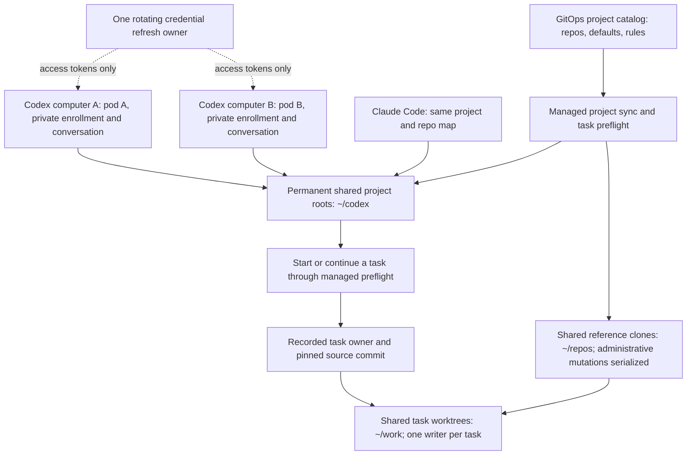
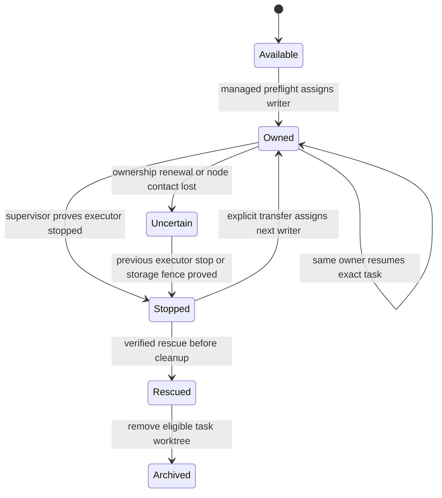

# ADR-002: Shared projects across agent pods, with private agent state

- **Status:** Accepted; target architecture, not deployed-workflow acceptance
- **Date:** 2026-10-09, America/New_York
- **Decider:** Tom Haynes
- **Ratified:** Tom, 2026-10-09, through the structured Q-21 prompt:
  "Accept ADR-002 and the bounded CephFS trial (Recommended)"
- **Supersedes:** ADR-001's Storage decision and C-09's fresh
  clone per session; DESIGN-001 D-15/D-22 for repository/task storage and D-12's
  single Codex remote host as the sole topology. ADR-001 remains unchanged.
- **Requirements:** [owner R1–R7](../requirements/2026-10-09-project-roots.md)
- **Delivery:** [plan 11](../backlog/11-project-workspaces.md), with
  [plan 04](../backlog/04-rolling-updates-codex.md) for remote hosts and refresh
- **User guide:** [workflow and quick start](../../../../docs/workflow-guide.md)

## The target user experience

Open **sigo-alumni** in Claude Code or Codex. Both see the same permanent project
folder, its three repositories and the same project rules. Start a task: the
platform fetches its source, records the exact commit, creates a separate task
worktree and assigns its writer. Open a second Codex computer link, backed by
another pod: the project and task files are the same, while that computer has
its own enrollment, daemon and conversations.

To continue an existing task, open its owning session or explicitly transfer it
after the previous writer stops. A second computer link gives another way into
the workspace; it does not silently transfer a conversation or create a second
writer. Finishing or cleaning up a task never removes the permanent project.

The operator remains an API/controller. A coordinator agent understands the
request and uses that API; `agent-run`, automations and a future management
client can do the same. This decision does not choose the owner's management
app or create a separate requester-agent service. The console remains planned.



The new elements in this diagram are the accepted target. Today's v2 still uses private
session clones; Codex v2 creation and these multiple remote hosts are unbuilt.

## Why a new decision is needed

Accepted ADR-001 separates session homes onto gasha01 block storage and gives
each session a fresh clone. Its small shared CephFS volume holds memory, logs
and rescue bundles. That architecture protects private runtime state but does
not share live project/task files across pods.

R7 requires actual shared workspace files. Synchronizing independent clones,
moving one Codex hub between pods, or sharing only the project anchor does not
meet it. Git worktrees also depend on their common Git directory: checkouts,
reference metadata and absolute paths must agree across participating pods.

The v1 anchors under `~/codex` are manual worktrees on one RWO home. They prove
the folder concept, not GitOps sync, both-agent rule loading or multi-pod use.
The v2 2.9.1 fresh-source fix is useful groundwork, not this implementation.

## Decision

Use one dedicated RWX workspace volume for shared reference clones, permanent
project anchors and task worktrees. Keep each remote host's and task executor's
agent state on its own persistent home. Keep the existing rescue shelf separate
from the live workspace volume. Every managed launch, reference mutation,
transfer and cleanup consults platform ownership, rather than only local PIDs.

**Accepted trial starting point:** a dedicated PVC on the existing Rook
`ceph-filesystem` StorageClass, subject to a bounded acceptance trial before
normal use. Tom authorized this bounded trial first; normal rollout still needs
the gates below. A new PVC separates
workspace data logically; it does not isolate MDS or disk load from household
volumes. If the trial fails the household-impact gate, stop and choose an
external RWX backend; do not switch storage silently.

Keep CPU limits, worker placement, no busy-session restarts, GitOps deployments,
rescue before deletion and one rotating refresh owner from ADR-001. This change
does not authorize v1 migration, credential copying, active-session rolls,
Headlamp retirement or new privileged approval routes.

### Storage alternatives and verified constraints

Audit date: 2026-10-09. These are availability facts, not performance acceptance.

| Choice | Meets literal shared workspace? | Practical consequence |
|---|---|---|
| Dedicated PVC on current Rook `ceph-filesystem` | Yes, with cross-node path/locking acceptance | Expandable RWX is already offered. It shares the filesystem services and OSDs used by household apps, including zigbee2mqtt and zwave. Accepted for a bounded trial before normal use. |
| External RWX storage using gasha01 NFS or a separately configured CephFS driver | Potentially; unverified for this workload | Keeps workspace IO off the in-cluster OSDs. Current Kubernetes storage exposes gasha01 as RBD; no external CephFS or NFS StorageClass exists. Provisioning, mount recovery and lock semantics need design and trials. Existing direct NFS model/output mounts, some writable, do not prove Git locking or recovery. |
| Existing per-session `gasha01-rbd` homes plus replicated clones | No | Preserves today's IO placement but produces independent files. Useful for private homes/caches, not a substitute for R7. |
| Share the complete agent home across pods | Files are shared, but fails runtime/auth requirements | Couples enrollment, sockets, conversation registries and rotating credentials. Reject this topology. |

The existing `dev-agents/dev-env-shared` is a 20Gi RWX volume used for the shelf
and other shared state. Do not repurpose it as the live workspace. A separate
PVC on the same filesystem still shares a storage failure domain; retaining a
rescue bundle there is not independent disaster recovery for CephFS loss.

Participating v2 hosts/executors mount the workspace claim in `dev-agents`.
PVCs are namespace-scoped; v1 in `dev` cannot simply mount that claim. V1
coexistence/migration needs an explicit later plan. Workspace retention belongs
to the platform/project, not any individual AgentSession. Current storage
classes reclaim with `Delete`; provision the permanent workspace with explicit
`Retain` behavior and GitOps prune protection, without changing household
classes. Task archival must never delete the shared workspace claim.

Keep package caches and heavy disposable outputs on private gasha01 homes where
tooling supports it. Test actual representative workflows: not every build can
relocate all output. One quiet storage/load snapshot cannot settle this choice.

### Paths and contents

Use the same real absolute paths in every participating pod. Retain the owner's
`~/codex`, `~/repos` and task-only `~/work` contract, with `/home/dev` as home.
Mount shared subdirectories below otherwise private homes:

```text
/home/dev/                         private persistent home per executor/host
  .codex/                         private enrollment, conversations and daemon state
  .claude/                        private provider runtime and session state
  .cache/                         private disposable build/package caches
  repos/                          shared reference clones and common Git directories
  codex/                          shared permanent project anchors and rule files
  work/                           shared task worktrees; the only sweep boundary
  .shared/                        existing shared memory/log/rescue shelf
```

The earlier `/work/codex` name can be a compatibility entry point only after
alias handling is tested. It must not create a second project identity or change
the physical task path used by ownership checks. Do not symlink `~/work` to a
new task path and assume the existing literal `/proc` cwd check still works.

Agentd verifies the shared mount and its managed identity before preparing Git
or starting work. Missing mounts fail closed; an empty directory in a private
home must not become a replacement workspace. Do not rewrite linked Git paths
or prune anchors when another pod has a missing mount.

Private persistent host homes survive pod replacement. Each logical Codex host
has a stable name and its own enrollment, daemon/socket/PID state and saved
conversations. That state belongs to the logical host, not the changing pod
hostname. Two simultaneous logical hosts must be demonstrated on the pinned
Linux CLI. Existing S-3 auth startup evidence does not prove enrollment, renewal
or drain for two hosts. S-4 forwarding remains a mechanism to evaluate.

Codex daemons can host multiple threads. Before choosing their execution route,
prove where each thread runs and which pod's resource limit contains it. Do not
claim one pod per thread unless the tested dispatch/forwarding path provides it.
Coordinator hosts and task executor pods must stay separately identifiable.

## Catalog, rules and source freshness

One GitOps catalog declares each project's name, repository identities,
optional default branch and project rules. Sync clones missing references,
materializes missing anchors and reports undeclared roots without deleting
them. A project removal is an observation, not a garbage-collection instruction.

`project add` is one user operation that stages the declaration through the
normal branch/PR/checks/merge/Flux path and materializes the accepted revision.
If review or deployment is pending, report that state; do not create an
apparently authoritative root from an unmerged local declaration. Catalog
reload reconciles in place without restarting busy hosts.

Use a stable, directory-mounted catalog with a tracked revision; avoid env-only
or `subPath` copies that cannot receive updates. The existing v2 session-config
already avoids Reloader/template-triggered rolls. Prove hot reconciliation
instead of adding a restart annotation for project changes.

Render the one project-rule source for both providers, with the same rule
revision. Generate declared Codex trust and Claude multi-repository scope.
Task worktrees stay flat under `~/work`; a verified task pointer/composition or
launch-injection mechanism carries project rules alongside repo instructions.
Do not overwrite a repository's tracked `AGENTS.md`/`CLAUDE.md`. Prove actual
instruction loading in both running providers at root and task paths; file
presence and directory ancestry alone are insufficient.

For a new task, successfully fetch the selected repository, resolve the declared
base to an immutable commit, create the worktree from that commit, and record
the fetch time, commit, project-rule/catalog revision and task owner. Failure to
fetch starts no new remote-based implementation. Maintenance updates are not a
substitute for this per-task check.

For resume, preserve the exact existing worktree, index, branch, Git operation
and conversation. Warn about unavailable refresh rather than resetting work.
Historical rescue remains an explicit restore route with provenance; it must
not masquerade as fresh remote source.

R6 repair remains conservative: lock and verify identity/ownership, fetch a
fresh target, check no in-progress operations or conflicts, require no untracked
files at all (including ignored files), and prove the index matches a commit in
fetched remote history and files match the index. Preserve local-only commits
and other worktrees' branches. Recheck under the lock and keep a repair receipt.
Unsafe states are reported and preserved. No broad `reset --hard`/`clean` remedy.

## Ownership, transfer and maintenance

Serialize administrative operations by common Git directory across pods:
clone/init, fetch/ref resolution, anchor refresh, worktree add/remove and prune.
Git's own locks remain necessary, but do not replace this platform protocol.
Lock acquisition/release and storage reconnect behavior need cross-node tests.

Each task has a durable record of its executor identity, pod UID, ownership
generation, project/repo, worktree and conversation reference. The exact resource
schema is implementation work, not a new CRD accepted by this decision.



**A Kubernetes Lease alone cannot fence a filesystem writer.** Expiry, a missing
heartbeat or `NodeNotReady` is not proof that the previous process stopped. A
partitioned process may still write to mounted storage. On uncertain ownership,
deny a second writer and deny reap/transfer. Resume only after proving the prior
executor stopped or applying a separately designed storage/node fence. Never
force-delete a pod and treat the deleted API object as proof of physical stop.

Managed supervisors must stop accepting work on ownership loss and bound how
they stop their own executor. A Lease is coordination input, not a claim of
strong storage fencing. Direct unmanaged writers bypass this protocol; every
app/remote/CLI/delegation path must either pass preflight or remain a coordinator
that requests a managed task. Establish this on the actual clients before
advertising direct multi-pod task editing.

Do not share live conversation directories. Initial transfer may resume files
with a new conversation plus durable handoff context. Continuing the exact
conversation on a different logical host needs a tested, stopped-writer export
and import path; it is not implied by mounting the files.

Boot/daily sync refreshes only clean, unowned anchors, reports dirty anchors
and canonical health, and rescues eligible abandoned tasks before removal.
Cleanliness does not prove an anchor has no cwd users. An anchor used by a
coordinator is left unchanged until that reader releases it. Sweep only
`~/work`, consulting peer ownership; protect permanent worktree registrations
during `git worktree prune`. Do not let a local PID scan declare a peer dead.

Release an anchor reader at a verified idle boundary, so a quiet long-lived
coordinator does not pin an old checkout forever. Busy or uncertain readers
still block mutation. Prove the thirty-day-idle/current-root acceptance with
this reader-release behavior, not just with an unused directory fixture.

## Delivery gates and consequences

Tom accepted this ADR before workspace implementation and authorized the bounded
storage trial first. Deliver in reviewable stages; none is permission to restart
v1 or a busy session:

1. Run one bounded, CPU-limited worker storage trial, using representative Git
   and build operations at low concurrency. Assess household latency/alerts,
   cross-node locks and mount reconnects; define pass thresholds before running.
   No burners, stress loops or wide tests. A failed gate returns to a backend
   decision, not an automatic rollout.
2. Prove two distinct logical Codex hosts, access-token refresh ownership,
   enrollment persistence, question delivery and the execution/preflight route.
3. Build the catalog and both-provider root/task rule loading; prove empty-PVC
   boot, live catalog reload and retained undeclared roots.
4. Prove pinned fresh starts, offline resume, simultaneous administrative calls,
   uncertainty without takeover, explicit transfer, and peer-safe rescue/sweep.
5. Reconcile the guide with actual acceptance and migrate selected callers.
   V1 cutover still requires all twenty parity closures and owner approval.

The benefit is a stable, shared project experience across providers and pods.
The cost is shared Git/storage availability and an ownership protocol that did
not exist in the private-clone architecture. A shared workspace outage blocks
work for every participating pod; private-home storage still affects only its
host/session. Recovery must preserve both data and ownership, not just remount.

Ordinary design questions still require one native prompt at a time. On
2026-10-09 the Codex prompt had a desktop reply; phone push is unverified. Plan
11's phone round-trip remains open. Privileged approval authentication is the
separate Q-16 requirement; a text answer from an agent is not a broker decision.

## Evidence and scope

- [ADR-001](001-distributed-dev-env.md), immutable Accepted baseline.
- [DESIGN-001 D-74 and current fresh-source behavior](../designs/001-dev-env-v2.md#66-repos-worktrees-and-storage).
- [Plan 11 acceptance](../backlog/11-project-workspaces.md#acceptance).
- Live storage audit at ratification: `ceph-filesystem` supports expandable RWX;
  `dev-agents/dev-env-shared` is Bound; current gasha01 class is RBD. No new PVC,
  enrollment, credentials, launcher route or project catalog was created.
- `client-go` v0.37.1 `tools/leaderelection/leaderelection.go` explicitly states
  leader election does not guarantee fencing; `internal/keeper/run.go` already
  treats its Lease as insufficient fencing.

Q-21 ratifies this target and the bounded trial; it does not claim two-host,
rules, storage-performance or cutover acceptance. Record subsequent deployed
evidence in plan 11 and HANDOFF. This Accepted ADR stays immutable; later
architecture changes require a superseding ADR.
