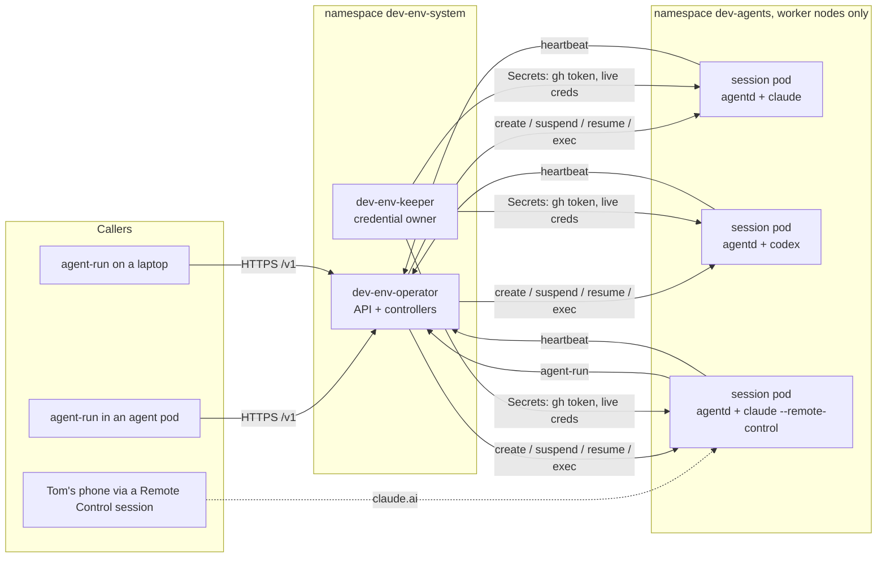
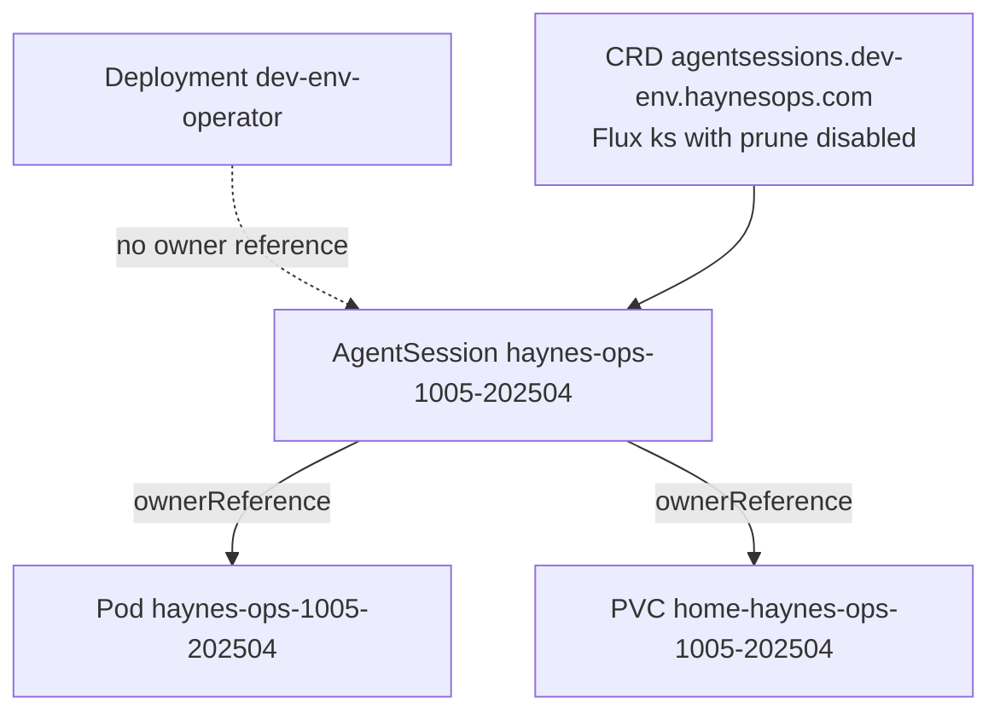
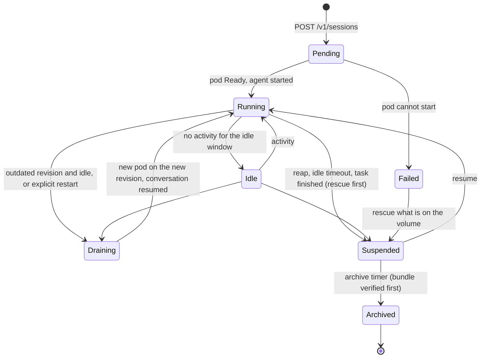

# DESIGN-001: dev-env v2, one pod per agent session

- **Status:** Proposed (nothing ratified; Tom owns the open questions in section 15)
- **Last updated:** 2026-10-05
- **Governed by:** [ADR-001](../adrs/001-distributed-dev-env.md) (Proposed)
- **Saga:** [README](../README.md)

Decisions settled in this design carry a `D-NN` id. Questions only Tom can answer
carry a `Q-NN` id and are listed in full in [section 15](#15-open-questions). The
recommended option is always listed first.

## 1. Summary

v1 is one pod (`dev/dev-env`) that hosts every agent session in tmux on one 256Gi
volume. It has no CPU limit, so one runaway test run can starve its node. It runs
on the control-plane nodes, so that node is also where EMQX, traefik and the CNPG
operator live. Every image roll kills every session.

v2 runs **one pod per agent session**. An **operator** (control plane only) creates,
upgrades and prunes those pods and serves an HTTP API. **`agent-run`** becomes a
client of that API and runs anywhere: in an agent pod, on a laptop, or from a
phone-driven session. A small **keeper** owns every rotating credential, so no two
pods ever refresh the same token. Each agent pod has CPU and memory limits, runs on
the worker nodes only, and keeps its work on its own volume, so a pod can be stopped
and resumed with its conversation intact.



## 2. Facts this design rests on

All measured or read on 2026-10-05 unless a date says otherwise.

| Fact | Source |
|---|---|
| v1 pod: 1 replica, `Recreate`, control-plane nodes only (since 2026-09-23), requests 1 CPU / 4Gi, **no CPU limit**, memory limit 64Gi | haynes-ops `kubernetes/main/apps/dev/dev-env/app/helmrelease.yaml` |
| v1 CPU over 7 days (whole app container): median 0.09 cores, p99 14.2, max 18.6 (the 2026-10-05 incident); outside the incident, peaks of 1 to 6 cores | Prometheus, `container_cpu_usage_seconds_total` |
| v1 memory over 7 days (whole app container): p50 7.4 GiB, p95 10.8 GiB, max 35.4 GiB | Prometheus, `container_memory_working_set_bytes` |
| 13 to 14 claude processes at about 400 MiB RSS each; 16 tmux sessions; 137 worktree dirs; 41G of 252G used | `ps`, `tmux`, `df` in the pod |
| Earlier OOMs: an 8Gi limit killed haynesnetwork's `pnpm test`; a 24Gi limit was hit at 21.9 GiB with concurrent sessions (2026-08-16) | helmrelease comments |
| Nodes: talosm01-05 (20 cores, 96 GiB, zone `m`, control plane, untainted); talosw01 (40 cores, 3090 GPU host), talosw02 (16 cores, 123 GiB), talosw03 (16 cores, 39 GiB) in zone `w`; talosw04 tainted `haynesops.com/gpu-test` | `kubectl get nodes` |
| talosm02 hosts dev-env, `emqx-core-0`, the CNPG operator, a traefik-internal and a traefik-external replica, and authentik pods | `kubectl get pods -o wide` |
| Storage classes: `ceph-block` (RBD, RWO, default, expandable), `ceph-filesystem` (CephFS, RWX, one active MDS, also used by zigbee2mqtt, zwave, outline, immich ML), `gasha01-rbd`, `openebs-hostpath` | `kubectl get sc`, `get pvc -A` |
| Repo sizes (`.git`): haynes-ops 30M, haynesnetwork 124M, hass-sandbox 47M, cigar-journal 17M, haynes-quest 934M | `du` in the pod |
| v1 RBAC: ClusterRole `dev-env-operator` (the "OPERATOR tier"): read everything except Secrets, plus pod delete, pod exec, service/pod proxy, rollout restart, Flux reconcile/suspend, ExternalSecret refresh, Job create/delete, CronJob suspend; PVC delete in `database` only | `rbac.yaml`, `cloudnative-pg/app/dev-env-rbac.yaml` |
| v1 egress: default-deny CiliumNetworkPolicy with about 115 enumerated DNS names plus in-cluster services, selected by `app.kubernetes.io/name: dev-env` | `networkpolicy.yaml` |
| GHCR image `ghcr.io/thaynes43/dev-env` is about 1.07 GB; a cold pull took 6m15s | helmrelease comment |
| Kyverno `verify-thaynes43-images` trusts `dev-env*` images signed by `thaynes43/haynes-ops` workflows only (Audit mode) | `verify-thaynes43-images.yaml` |

Facts about the agent CLIs, read from the pinned binaries (claude-code 2.1.284,
codex 0.160.0), are given where they are used: [6.2](#62-claude-max-login-and-its-monthly-renewal),
[6.3](#63-codex) and [6.8](#68-messaging-between-agents).

## 3. Architecture

### 3.1 Components

| Component | What it is | Runs as |
|---|---|---|
| **dev-env-operator** | Control plane. Serves the `/v1` API, reconciles `AgentSession` resources into pods and volumes, detects idle sessions, runs rescue, drains outdated sessions, expires activities. Owns no running work. | Deployment, 2 replicas with leader election, namespace `dev-env-system` |
| **dev-env-keeper** | The only holder of rotating credentials (Claude Max login, Codex login) and of the GitHub App key. Mints and refreshes; writes short-lived results into Secrets that agent pods mount. Pages Tom when a login nears expiry. | Deployment, 1 replica, `Recreate`, namespace `dev-env-system` |
| **session pod** | One agent session: `tini` as PID 1, `agentd`, tmux, the agent CLI, its MCP children, the build tools. | Pod in namespace `dev-agents`, owned by its `AgentSession` |
| **agentd** | Small supervisor inside each session pod. Renders config at boot, clones the repo, starts or resumes the agent, sends heartbeats, runs rescue and drain hooks on request. Replaces v1's `dev-init.sh` and `post-ready.sh` per pod. | Child of `tini` in the session pod |
| **agent-run** | CLI client of the API. Same verbs as v1. One static binary. | Wherever it is called |
| **workbench** | Tom's browser IDE (code-server) plus `agent-run` and `kubectl`. Runs no agents by default. | Small Deployment, namespace `dev-agents` (phase 5) |
| **codex hub** | The one long-lived session that runs the Codex remote-control daemon and keeps the phone's enrolment. | A session pod of kind `codex-hub` (phase 4) |

**D-01. The operator is control plane only.** It never runs agent work, and its
Deployment owns nothing that runs agent work. Its outage stops new sessions and
lifecycle actions; running sessions do not notice. Rationale: requirement 4 of the
vision, and it keeps the operator's upgrade path trivial.

**D-02. Two namespaces.** `dev-env-system` holds the operator and keeper.
`dev-agents` holds session pods, their volumes, the workbench and the Secrets agents
mount. The operator's write access is limited to `dev-agents`. Rationale: least
privilege, and a ResourceQuota and LimitRange that apply to agent pods only. The
v1 namespace `dev` is left alone until cutover.

### 3.2 Ownership, so an operator upgrade cannot cascade



**D-03. Session pods and volumes are owned by their `AgentSession`, never by the
operator Deployment.** The CRDs ship in their own Flux Kustomization with
`prune: disabled`, and the operator adds no finalizer that deletes pods. Deleting or
rolling the operator therefore cannot delete a session. Only an explicit reap, or a
human deleting the `AgentSession`, removes a pod. See [5.1](#51-operator-and-keeper-upgrades-never-touch-sessions).

### 3.3 The AgentSession resource

Group `dev-env.haynesops.com`, version `v1alpha1`. The shape follows
kubernetes-sigs/agent-sandbox's `Sandbox` (`operatingMode`, `shutdownTime`-style
lifecycle) so a later move to that project stays mechanical (see [section 9](#9-build-vs-adopt)).

```yaml
apiVersion: dev-env.haynesops.com/v1alpha1
kind: AgentSession
metadata:
  name: haynes-ops-1005-202504        # = pod name = hostname = Remote Control name
  namespace: dev-agents
spec:
  repo: haynes-ops
  base: origin/main
  agent: claude                       # claude | codex
  mode: remote                        # task | local | remote (v1's task | local | both)
  model: claude-opus-5-5              # full id, never an alias
  effort: xhigh
  prompt: "…"                         # task mode only
  size: M                             # S | M | L (section 7.2)
  profile: full                       # which Secrets and egress policy (D-18)
  parent: haynes-ops-1005-195501      # the session that created it, from the caller's token
  operatingMode: Running              # Running | Suspended
  lifecycle:
    idleSuspendAfter: 72h
    archiveAfter: 168h                # after suspension
status:
  phase: Running                      # Pending | Running | Idle | Draining | Suspended | Archived | Failed
  revision: 2.0.3-7f3a9c              # template revision the pod runs (section 5.2)
  podName: haynes-ops-1005-202504
  nodeName: talosw02
  agent: { status: busy, lastActivity: "2026-10-05T23:41:07Z" }
  remoteControl: { name: haynes-ops-1005-202504, url: "https://claude.ai/code/…" }
  rescue: { lastBundle: "rescue/haynes-ops-1005-202504/20261006-0130.bundle" }
  conditions: []
```

**D-04. Session templates are GitOps data.** Image digest, size classes and
profiles live in a ConfigMap (`dev-env-templates`) in haynes-ops. The template
**revision** is a hash of that content. Renovate bumps the image digest there, the
same way it bumps any HelmRelease. Rationale: every change that reaches agent pods
shows up as a haynes-ops PR diff, like v1's ConfigMaps do today.

### 3.4 The API

HTTPS with a cert-manager certificate, JSON, versioned under `/v1`.

| Method and path | Purpose |
|---|---|
| `POST /v1/sessions` | Create a session: repo, agent, mode, model, effort, prompt, base, size, profile. Returns the id and state. |
| `GET /v1/sessions`, `GET /v1/sessions/{id}` | List (filters: repo, state, mine) and detail: phase, node, revision, idle time, branch, Remote Control URL. |
| `GET /v1/sessions/{id}/log?tail=N` | Task log tail. The log is also kept on the shared volume after the pod is gone. |
| `POST /v1/sessions/{id}/messages` | Relay a message into a session ([6.8](#68-messaging-between-agents)). |
| `POST /v1/sessions/{id}/suspend` | Rescue, then stop the pod and keep the volume. |
| `POST /v1/sessions/{id}/resume` | Start the pod again and resume the conversation. |
| `POST /v1/sessions/{id}/restart` | Move a session onto the current revision now (explicit drain). |
| `DELETE /v1/sessions/{id}` | Reap: rescue, suspend, archive. There is no "skip the rescue" flag. |
| `GET /v1/fleet` | Capacity, quota use, current revision, outdated sessions. |
| `GET/POST/DELETE /v1/activities` | `declare-activity` ([6.9](#69-declare-activity)). |
| `GET /v1/auth` | Status of each credential: present, expires, days left. Never a value. |
| `POST /v1/auth/{claude,codex}/login` and `…/login/code` | Relay the monthly login ceremony ([6.2](#62-claude-max-login-and-its-monthly-renewal)). |
| `GET /v1/rescues`, `POST /v1/rescues/{id}/restore` | List rescue bundles; start a new session from one. |
| `/v1/leases` | Reserved for local-LLM leases ([section 8](#8-local-llm-leases-the-seam)). Not built in v2.0. |

**D-05. Callers authenticate with a Kubernetes ServiceAccount token** for the
audience `dev-env-operator`, checked with a TokenReview.

- Agent pods use their projected token. Its bound-pod claims tell the operator which
  session is calling, so `parent` is recorded without trusting the caller.
- The workbench uses its own ServiceAccount.
- A laptop runs `kubectl create token dev-env-human -n dev-env-system --audience
  dev-env-operator` with Tom's admin kubeconfig and reaches the API through a
  port-forward. `agent-run` does both steps for him.
- An Authentik OIDC login for the laptop is a later step (phase 6).

All authenticated callers get the same API. Destroying unrescued work is not in
the API at all: it needs a human with `kubectl` (agents cannot delete PVCs in
`dev-agents`). Each session may create at most 4 child sessions at a time, two
levels deep, so a confused agent cannot fork-bomb the fleet.

### 3.5 agent-run v2

The verbs stay, so muscle memory and every CLAUDE.md instruction carry over.

| v1 verb | v2 behaviour |
|---|---|
| `agent-run [--repo r] [--agent a] [-p "…"\|--local\|--interactive] [--model] [--effort]` | `POST /v1/sessions`, prints the id. New flags: `--size S\|M\|L`, `--profile`. `--interactive` still means "TUI + Remote Control" for claude. |
| `list` | `GET /v1/sessions` |
| `attach [<id>]` | `kubectl exec -it <pod> -- tmux attach` with the caller's credentials. Agent pods already hold `pods/exec`. |
| `detach` | Exec `tmux detach-client` in the pod. |
| `reap [<id>]` | `DELETE /v1/sessions/{id}` |
| `prune`, `sweep` | Gone as commands. The operator's reaper does this continuously ([4.3](#43-timers)). `agent-run fleet` shows what it will do. |
| `codex-remote [up\|stop]` | Manages the codex hub session ([6.3](#63-codex)). |
| new: `suspend`, `resume`, `restart`, `msg`, `fleet`, `auth status\|login\|code`, `rescue list\|restore` | Map one to one onto the API. |
| `declare-activity …` | Same command and flags, now a thin client of `/v1/activities`. |

**D-06. `agent-run` is one static binary** with no runtime dependency. It needs only
the API URL and a token, which it finds automatically in a pod (projected token,
in-cluster Service DNS) or gets from the kubeconfig on a laptop.

### 3.6 agentd and the session pod

Boot sequence (each step idempotent, none fatal, all after `tini` starts):

1. Render config, as v1's `dev-init.sh` does today: link `CLAUDE.md`, register the
   MCP servers from `mcp.json`, assert the default model, install the subagent
   definitions, render Codex `config.toml` and `AGENTS.md`, set git identity and the
   credential helper, write the hw-ssh key. Codex standalone and `kubectl-cnpg` are
   baked into the image instead of downloaded at boot.
2. First boot: partial clone of the repo and `git worktree add` (D-15). Resume:
   reuse what is on the volume.
3. Start the agent in tmux session `agent`: `claude -p …` (task), `claude` (local),
   `claude --remote-control <id>` (remote), or the Codex equivalents. On a resume,
   add `--resume <session-id>` (Codex: `codex resume <id>`).
4. Every 60 s, report a heartbeat to the operator ([4.2](#42-idle-detection)).
5. Answer `agentd ctl status | rescue | prepare-restart | deliver`, which the
   operator runs with `pods/exec` in `dev-agents`.

**D-07. `tini` is PID 1 in every session pod.** v1's PID 1 is code-server, which
never reaps: on 2026-09-28 the pod held 2,970 zombie processes, and an un-reaped
Codex updater is why its self-updater had to be switched off.

**D-08. Commands go operator to pod by `kubectl exec`; status goes pod to operator
by heartbeat.** No session pod opens a listening port, so no in-pod auth scheme is
needed and agent pods keep zero ingress.

Pod spec, inherited from v1 where the lesson still applies: non-root uid 1000,
read-only root filesystem, all capabilities dropped, `RuntimeDefault` seccomp,
`ndots:1` (the DNS allowlist refuses search-expanded names),
`XDG_RUNTIME_DIR=/dev/shm/run-1000` (Claude refuses a group-writable socket dir),
and the `not-ready`/`unreachable` tolerations at 3600 s (an RWO volume cannot
re-attach until the old node lets go, so early eviction never helps).

## 4. Session lifecycle

### 4.1 States



### 4.2 Idle detection

A session is **idle** when all of these hold for the idle window:

- the agent is not working: Claude writes its own status (`busy`, `idle`, `waiting`)
  into `~/.claude/sessions/<pid>.json`; for Codex, agentd reads process CPU time and
  the rollout file's mtime;
- no tmux client is attached;
- no git activity and no file change in the worktree (v1's `wt_busy` signals, ported:
  `HEAD`, `FETCH_HEAD`, `ORIG_HEAD`, `COMMIT_EDITMSG`, file mtimes outside
  `node_modules`, `.git` and `.claude`).

A busy agent is the busy-lock that v1's Renovate note asked for ("agents hold a
busy-lock, merger waits for release"). The agent sets it simply by working.

### 4.3 Timers

**D-09. Defaults, all overridable per session:**

| Event | Default | Why |
|---|---|---|
| task session finished | suspended after 1 h | its log and branch are what matter |
| interactive or remote session idle | suspended after 3 days | v1's sweep window (Tom, 2026-09-25) |
| suspended session | archived after 7 days | resume window; RBD is thin, so a parked volume costs only its written bytes |
| rescue bundle | kept 30 days | long enough to notice a loss |
| outdated revision | drained at the next idle moment (Q-03) | section 5.2 |
| post-ready standby | the operator keeps one `remote` session on haynes-ops ready, as v1's post-ready does | Tom (2026-09-10): after a roll nothing could start a session |

The standby keeps v1's circuit breaker: if three standbys are created inside 30
minutes, the operator stops creating them and reports `loop suspected`.

### 4.4 Rescue before reap

v1 commits WIP to a local `rescue/<id>-<stamp>` branch in the canonical clone on the
shared PVC. In v2 the volume itself goes away at archive time, so a local branch is
not enough.

**D-10. Rescue keeps v1's rules and adds a bundle off the session volume:**

1. On suspend, agentd runs v1's rescue unchanged: commit tracked edits and new
   untracked files to `rescue/<id>-<stamp>` (`--no-verify`, gitignored files
   excluded, refused for an untracked nested repo or more than 50 MiB), and anchor a
   detached HEAD on a rescue branch.
2. It writes a `git bundle` of every local ref that origin does not contain to the
   shared volume at `rescue/<id>/<stamp>.bundle`, with a small JSON manifest.
3. Suspension keeps the whole volume, gitignored files included, for 7 days.
4. Archive deletes the volume only when a bundle exists, or when agentd proved every
   repo clean and fully pushed. Otherwise archive stops and pages.

**Rescue branches are never pushed to GitHub.** haynes-ops is public, and untracked
files can hold secrets (`.env`, tokens pasted into a scratch file). The bundle stays
inside the cluster, on the shared volume.

### 4.5 Resume and restore

- `agent-run resume <id>`: same volume, new pod, `claude --resume <session-id>`. The
  conversation, worktree and gitignored build output are all still there.
- `agent-run rescue restore <bundle>`: a new session whose clone fetches the bundle.
  Used after archive.

## 5. Rolling updates

### 5.1 Operator and keeper upgrades never touch sessions

Rules, each enforced by a test in the operator's CI:

- No owner reference from any session object to the operator Deployment (D-03).
- The operator never deletes a pod whose `AgentSession` exists and is `Running`,
  except in the `Draining` and `Suspended` transitions.
- Reconcile is level-based. A fresh operator reads `AgentSession` status and pod
  state and resumes. Nothing is kept only in operator memory.
- CRDs live in their own Flux Kustomization, `prune: disabled`. A CRD version change
  ships as a new served version with conversion, never a delete and re-create.
- The keeper writes Secrets on a schedule with a wide margin (gh token: minted every
  40 min, valid 60 min). A keeper outage shorter than 20 minutes is invisible.

Phase 1 proves this: run `kubectl rollout restart deploy/dev-env-operator` while a
task session is mid-turn. The task must finish untouched.

### 5.2 New image or config reaches running sessions

The revision is the hash of the template ConfigMap (D-04). New sessions always start
on the current revision. A running session on an older revision is **outdated**.

Recommended policy, pending **Q-03**: **drain on idle, then resume.**

1. The operator marks the session `Draining` only when it is idle (4.2).
2. agentd `prepare-restart` records the agent session id, mode, model, effort and
   Remote Control name on the volume.
3. The operator deletes the pod and starts a new one on the new revision with the
   same volume. agentd resumes the conversation (`claude --resume`,
   `codex resume`).
4. A session that stays busy for 72 h after going outdated gets a message asking it
   to reach a stopping point; nothing is forced. Tom gets one Pushover line if it is
   still outdated 24 h after that.

A busy turn is never cut. Background processes (a dev server, a watch) do not
survive the restart; they are rare in an idle session and the agent restarts them.

### 5.3 What this changes for Renovate

v1's image bumps are manual-only because a roll kills every session
(`.renovate/autoMerge.json5`, 2026-07-20). With drain-on-idle, the v2 image (tag line
`2.x`) can auto-merge like any other own image once phase 4 ships. The Dockerfile
tool group keeps its single grouped PR.

## 6. Shared state, item by item

| State | v1 | v2 | Trade-off |
|---|---|---|---|
| Claude static token (`CLAUDE_CODE_OAUTH_TOKEN`, about 1 year, no refresh) | env from ExternalSecret `dev-env-claude` | Same Secret, env in every session pod | Safe in many pods: it never rotates. Cannot register Remote Control. |
| Claude Max login (`.credentials.json`, rotating refresh token, lapses about 30 days after each `/login`) | on the PVC, shared by the Remote Control sessions | Keeper owns it; Remote Control pods get an access token only (6.2) | Needs spike S-1. Fallback: one coordinator host pod. |
| Codex login (`auth.json`, rotating refresh token) | on the PVC | Codex hub owns it first; keeper later if S-3 passes (6.3) | Codex work runs in the hub until then. |
| GitHub App token | sidecar per pod, PEM in the sidecar | Keeper mints into one Secret; pods mount it (6.4) | PEM in one place; one mint for the fleet. |
| MCP server registration | dev-init, once per pod boot | agentd, once per session pod boot (6.5) | Same mechanism, same ConfigMap. |
| Repos and worktrees | 256Gi RWO volume, canonical clones + 137 worktrees | Volume per session + small shared CephFS (6.6) | Q-05. |
| Claude memory (`~/.claude/projects/*/memory`) | on the PVC, shared by all sessions | Shared CephFS, linked into each pod (6.6) | Same visibility as today. |
| Remote Control, phone, standby | per session; post-ready keeps one standby | per session pod; operator keeps one standby (6.7) | Unchanged for Tom. |
| ListAgents and SendMessage | Unix sockets in `/dev/shm`, one pod | Native inside a pod, native between Remote Control sessions, relay otherwise (6.8) | No cross-pod inbox for headless tasks. |
| declare-activity | JSON files on the PVC, read by dev-env-ops over `kubectl exec` | `Activity` resource via the API (6.9) | Limits enforced server-side. |
| Egress | one CNP for the pod | one CNP per profile (6.10) | Same list on day one. |

### 6.1 Claude static token

Unchanged in substance. `dev-env-claude-secret` is copied into `dev-agents` by an
ExternalSecret and injected as env into every session pod for `task` and `local`
modes. Many pods may use it at once: it has no refresh token, so there is nothing to
race. It counts against the same Max plan windows as everything else, which is why
the fleet has a cap (section 7.3).

### 6.2 Claude Max login and its monthly renewal

This is the hard part.

**What we know.**

- Remote Control needs the `/login` credential. The static token "cannot register
  `/v1/code/sessions`" (A/B-proven in the v1 pod, 2026-08-29), so v1 strips it for
  `both` mode.
- The `/login` credential holds a rotating refresh token. On 2026-08-29, five or more
  sessions sharing one `.credentials.json` raced the rotation: one rotated, a sibling
  replayed the old token, and the whole token family was revoked mid-task. Copying
  that file into many pods would make this certain, not merely possible.
- Sharing one file over CephFS is no better: the race happened on one kernel with
  one file, and the CLI's own locks refuse to break a lock held in another pid
  namespace ([6.8](#68-messaging-between-agents)).
- claude-code 2.1.284 contains undocumented hooks for host-managed auth:
  `CLAUDE_CODE_HOST_CREDS_FILE`, `CLAUDE_CODE_OAUTH_REFRESH_TOKEN` (requires
  `CLAUDE_CODE_OAUTH_SCOPES`), `CLAUDE_CODE_OAUTH_401_WAIT_MS`,
  `CLAUDE_CODE_SDK_HAS_OAUTH_REFRESH`. They suggest the CLI can run on a credential
  that a host refreshes for it. They are undocumented, so this design only tests them.

**D-11. Target: the keeper is the only owner of the Max login.**

- The keeper holds the refresh token and refreshes well before expiry.
- It writes Secret `dev-env-claude-live` with a credentials file that carries the
  current access token and **no refresh token**. Remote Control pods mount it as a
  directory (so kubelet updates it in place) and point the CLI at it.
- A pod can never rotate the token, because it never holds the refresh token. The
  worst case is a 401 until the kubelet syncs the new file.

**Spike S-1** decides it, in the v1 pod with a scratch `CLAUDE_CONFIG_DIR` that never
contains the refresh token:

1. Does `--remote-control` register with an access-token-only credentials file?
2. Does a running session pick up a newer access token from disk without a restart?
3. Does the CLI stay quiet, or fail harmlessly, when it wants to refresh and has no
   refresh token?

The keeper forces rotations on demand, so the spike takes minutes, not a soak.
**Spike S-2** re-tests whether the static token can register Remote Control on the
current CLI. If it can, the keeper is not needed for Claude at all.

**Fallback if S-1 and S-2 both fail: a coordinator host.** One long-lived session pod
of kind `coordinator-host` (size L, workers only, CPU-limited) owns
`.credentials.json` on its own volume, exactly as v1 does, and runs every Remote
Control session as a tmux window. Coordinators dispatch heavy work to task pods with
`agent-run`, as the coordinator rules already ask. Fewer processes share the rotating
credential than in v1 today.

**Renewal ceremony**, in either mode: `agent-run auth login claude` starts
`claude auth login` where the credential lives (keeper or host) and returns the bare
URL. Tom opens it on his phone and pastes back the code; the coordinator relays it
with `agent-run auth code '<code>'`. The URL and code are secrets for the life of
the flow: the API never logs request bodies on these paths, and nothing writes them
to git. `claude-login-check` becomes `agent-run auth status`, and the daily page at
7 days or fewer moves from v1's auth-watch sidecar into the keeper.

### 6.3 Codex

**What we know** (codex 0.160.0):

- `auth.json` refreshes with a rotating token. The binary carries the error "Your
  access token could not be refreshed because your refresh token was already used",
  so the single-owner rule applies to Codex too.
- Phone control is one per-machine daemon (`codex remote-control`), not per session.
  The phone shows the name stored at first enrolment; the enrolment lives in the
  `~/.codex` state database.
- `codex login --with-access-token` (or `CODEX_ACCESS_TOKEN`) runs on an access token
  alone. `codex queue` puts a message into an existing session. `codex exec-server`
  (experimental) registers a WebSocket exec-server as a remote environment for the
  daemon's threads.
- `/etc/codex/requirements.toml` pins approval `never` and sandbox
  `danger-full-access` for every thread, the phone's included.

**D-12. Codex in v2:**

- **Codex hub.** One long-lived session pod of kind `codex-hub` runs the
  remote-control daemon and keeps the enrolment on its volume, so the phone keeps one
  stable computer entry across upgrades. It is drained like any session: resume
  brings the daemon back on the same enrolment.
- **Auth, step 1:** the hub owns `auth.json`, as v1 does today. Codex work runs in
  the hub (CPU-limited, workers only) until step 2.
- **Auth, step 2 (spike S-3):** the keeper owns the Codex refresh and distributes
  access tokens; Codex task and local sessions then run in their own pods.
- **Isolation, step 3 (spike S-4):** hub threads execute inside a per-session pod
  through `codex exec-server`. This fixes v1's "the phone picks the directory and
  bypasses per-worktree isolation".
- `requirements.toml` is mounted at `/etc/codex/` in every pod that runs Codex.
- agentd renders `[mcp_servers.*]` from `mcp.json` (v1's `mcp-json-to-codex-toml.sh`,
  ported), so both agents keep one MCP list.
- Updates stay pinned to the image's `CODEX_VERSION` (Tom, 2026-09-10). With `tini`
  reaping, the self-updater's zombie problem is gone, but the pin policy stands.

### 6.4 GitHub App token

**D-13.** The keeper mints a haynes-dev-bot installation token every 40 minutes
(valid 60) with the same down-scoped permission set as v1's refresher, and writes it
to Secret `dev-env-gh-token` in `dev-agents`. Session pods mount that Secret as a
directory at `/creds`, so `/creds/gh_token`, the git credential helper and the
per-shell `GH_TOKEN` export all work unchanged. The PEM exists only in the keeper.

Trade-off: one token is shared by the fleet, and a kubelet sync takes up to about two
minutes. The 20-minute margin covers that. A per-pod sidecar would put the PEM in
every pod, which is worse.

### 6.5 MCP servers

**D-14.** Registration stays per pod: agentd runs v1's loop (`claude mcp add-json -s
user` from `mcp.json` with env expanded). The servers themselves are shared in-cluster
services (Home Assistant, Grafana, UniFi, Blender, audio, vexa, the haynesnetwork
hop) or per-session stdio children (playwright, outline). Their Secrets
(`dev-env-mcp`, `dev-env-cigar`) are copied into `dev-agents` by ExternalSecrets. Two
side effects to handle in haynes-ops: the haynesnetwork hop's CiliumNetworkPolicy
admits the v1 pod today and must also admit `dev-agents` pods, and the authoring
services' policies likewise.

### 6.6 Repos, worktrees and storage

**Recommended (Q-05): a volume per session, plus one small shared CephFS volume.**

- **Per session:** a `ceph-block` RWO PVC (default 20Gi, thin-provisioned) mounted
  at `/home/dev`. It holds the clone, the worktree, `~/.claude` (transcripts,
  session registry, settings), `~/.codex`, and package caches.
- **Shared:** one `ceph-filesystem` RWX PVC (`dev-env-shared`, 20Gi) mounted at
  `/home/dev/.shared` with three directories: `memory/` (linked into each pod's
  `~/.claude/projects/<key>/memory`), `rescue/` (bundles), `logs/` (task logs).
  All three are small and written rarely.

Why not one shared CephFS home, as in v1? Three reasons:

1. Claude's session registry and locks are tied to the pid namespace
   ([6.8](#68-messaging-between-agents)). A shared `~/.claude` across pods gives
   foreign records and locks that no pod can prove dead.
2. It shares the Max credential file, which is the 2026-08-29 race.
3. `node_modules` installs are millions of small-file metadata operations. The
   cluster has one active CephFS MDS, and it also serves zigbee2mqtt and zwave. An
   agent's install storm would compete with the house's home automation.

**D-15. A fresh partial clone per session, with v1's paths.** agentd runs `git clone
--filter=blob:none` into `~/repos/<repo>` on the session volume, then
`git worktree add ~/work/<id> -b agent/<id>`. Keeping v1's paths keeps Claude's
memory key (`-home-dev-repos-<repo>`) and every CLAUDE.md instruction valid. Spike
S-7 measures clone time; haynes-quest (934M of history) is the one to watch. If a
repo takes more than two minutes, add a read-only bare mirror on the shared volume
for that repo, refreshed by the operator.

The "canonical clones are fetch-only" rule needs no enforcement any more: each
clone belongs to one session.

### 6.7 Remote Control and phone sessions

- `remote` mode is opt-in per session, as `--interactive` is today. Tom's rule stands
  (2026-08-23): only sessions that want Tom appear in his session list.
- The Remote Control name is the session id, which is also the pod name and hostname.
- The operator keeps one standby `remote` session on haynes-ops, replacing
  post-ready's standby (4.3).
- A session's Remote Control registration survives a drain if spike S-6 shows that
  `claude --resume <id> --remote-control <name>` reattaches. If it registers a new
  entry instead, the old one goes stale; acceptable, and noted for Tom.
- The coordinator role (Tom, 2026-09-28) is unchanged. A coordinator now dispatches
  work as separate pods with `agent-run -p`, in addition to in-process subagents.

### 6.8 Messaging between agents

**What the CLI does** (read from claude-code 2.1.284):

- Each session writes `~/.claude/sessions/<pid>.json` with a `messagingSocketPath`
  (a Unix socket under `$XDG_RUNTIME_DIR/cc-socks`) and a peer key file.
- Each record carries a `pidDomain` built from the hostname and the pid-namespace
  id. ListAgents skips records from another `pidDomain`, and the CLI refuses to break
  a lock held in a foreign pid space.
- SendMessage can also reach "a session on another machine via Remote Control",
  through Anthropic's servers, when both ends are connected to Remote Control.

So native discovery stops at the pod boundary, and sharing `~/.claude` between pods
would not move it.

**D-16. Three tiers:**

| Between | How |
|---|---|
| sessions or subagents in the same pod | native (unchanged) |
| two Remote Control sessions in different pods | native, through Remote Control (spike S-5 confirms between two pods) |
| anything else | `agent-run msg <id> "<text>"` → operator → `agentd ctl deliver` in the target pod. Claude TUI: pasted into the pane, as v1 hands a session its first instruction. Codex: `codex queue`. Headless `-p` tasks are not addressable; they report through their log and PR. |

The reply goes back the same way (`agent-run msg <parent>`). This design does not
re-implement the CLI's internal socket protocol: it is undocumented and changes with
CLI releases.

### 6.9 declare-activity

**D-17.** A declaration becomes an `Activity` resource in `dev-env-system`, created
only through the API. The API enforces what the v1 script enforced client-side:
`--scope` required, 45-minute default TTL, 8-hour cap, 2-hour cap for `cluster`.
The operator deletes expired ones. Each `Activity` records the declaring session, so
the remediation lane can message that session (Tom, 2026-08-23: remediation should
"even interact with agents working there").

dev-env-ops' `dev-activity-check.sh` switches from `kubectl exec` into the v1 pod to
`kubectl get activities`. Until cutover it reads both sources. The OPERATOR tier's
read list gains the `dev-env.haynesops.com` group.

### 6.10 Egress

**D-18. Profiles.** A profile names the Secrets a session pod gets and the egress
policy it falls under (a pod label that a CiliumNetworkPolicy selects). Profile
`full` is v1's set: the same Secrets and the same allowlist, moved verbatim. Nothing
regresses on day one; tightening a profile later (for example, no Proxmox root token
for a haynesnetwork task) is a data change.

- Session pods: egress per profile, plus the operator API. **No ingress**:
  `kubectl exec` and attach go through the kubelet, not the pod network.
- Operator: ingress from `dev-agents` on 8443; egress to the API server.
- Keeper: egress to the API server, `api.github.com`, the Claude and OpenAI token
  endpoints, and `api.pushover.net`. Nothing else.
- Later, leases open egress to an LLM endpoint by pod label (section 8).

### 6.11 RBAC tiers

| Identity | Grants | Note |
|---|---|---|
| `dev-agents/dev-env-agent` (session pods) | the existing ClusterRole `dev-env-operator` (OPERATOR tier) + the `database` PVC-delete binding, exactly as v1; read on `dev-env.haynesops.com` | **At most v1's tier.** No write to its own CRDs: every write goes through the API, where limits are enforced. |
| `dev-env-system/dev-env-operator` | Role in `dev-agents`: pods (create, delete, get, list, watch, patch), `pods/exec` create, `pods/log` get, PVCs (create, delete, get, list, watch), events. ClusterRole: its own CRD group, `tokenreviews` create. Leases in its own namespace. | No cluster-wide pod or PVC rights, no Secrets. |
| `dev-env-system/dev-env-keeper` | Role in `dev-agents`: Secrets get, update and patch on `resourceNames` `dev-env-gh-token`, `dev-env-claude-live`, `dev-env-codex-live` only. | The three Secrets are created empty by GitOps, so no `create` is needed. |
| `dev-env-system/dev-env-human` | none (token audience only) | Exists so Tom's laptop can mint an API token (D-05). |

Naming note: the ClusterRole `dev-env-operator` is v1's **OPERATOR tier** for agents.
The new **operator** component runs as ServiceAccount `dev-env-operator` in another
namespace with its own Roles. Same words, different things; the ClusterRole keeps
its name because a ClusterRoleBinding's `roleRef` cannot change.

## 7. Scheduling and resources

### 7.1 Placement

**D-19. Session pods run on worker nodes only.**

- Required node affinity `topology.kubernetes.io/zone In [w]`. No control-plane node
  ever runs an agent, so EMQX, traefik, the CNPG operator and etcd keep their CPU.
  talosw04 stays out through its `gpu-test` taint.
- Preferred anti-affinity (weight 30) against talosw01: it is the GPU host, and 3090
  bus drops there have needed host reboots (the reason v1 moved off it on
  2026-09-23). With one pod per session, a w01 failure now costs only the sessions on
  it, and they resume.
- Topology spread over `kubernetes.io/hostname`, `maxSkew: 2`, `ScheduleAnyway`.
- PriorityClass `dev-env-agent` with value -10: under pressure, household workloads
  preempt agents, never the reverse. A preempted session resumes from its volume.
- The operator and keeper are tiny and may run anywhere; the operator's two replicas
  spread across zones `m` and `w`.

### 7.2 Size classes

| Class | For | Requests (CPU / memory) | Limits (CPU / memory) |
|---|---|---|---|
| S | coordinators, chat, ops triage | 100m / 1Gi | 2 / 4Gi |
| **M (default)** | a normal dev task | 250m / 2Gi | 4 / 8Gi |
| L | monorepo test suites and builds (haynesnetwork `pnpm test`, playwright) | 1 / 6Gi | 8 / 24Gi |

Why these numbers: a single Claude process is about 400 MiB; v1's whole-pod median
is 0.09 cores and its normal peaks are 1 to 6 cores across all sessions together; the
known memory-heavy job (haynesnetwork's parallel vitest with embedded Postgres)
broke an 8Gi limit that it shared with other sessions, so it gets L. **CPU limits are
mandatory**: a LimitRange in `dev-agents` sets M as the default and L as the maximum,
and a Kyverno policy rejects a session pod without a CPU limit. `/tmp` is an emptyDir
with an 8Gi `sizeLimit`.

Each pod exports its CPU limit as `DEV_ENV_CPU_LIMIT`, and the pod CLAUDE.md tells
agents to size test workers to it. A limit throttles a runaway; it does not stop
`vitest` from starting 20 workers on a 4-CPU pod and timing out its own tests.

### 7.3 Fleet cap (Q-04)

Recommended: a ResourceQuota on `dev-agents` of 24 session pods, `requests.cpu` 8,
`requests.memory` 64Gi and `limits.cpu` 48. The worker nodes have 72 cores together,
and talosw01 also carries the GPU workloads. 48 cores of limits means that even with
every agent pegged at once, the workers keep a third of their CPU. Today's 13 to 16
concurrent sessions fit, mostly as M with a few S coordinators.

### 7.4 Image pull

The image is over 1 GB, and a cold pull took 6m15s. A DaemonSet on the worker nodes
keeps the current agent image pulled (a pause container that references it), so a
new session starts in seconds. It moves to the new digest when the template changes.

## 8. Local LLM leases (the seam)

Not built in v2.0. These names are reserved so the build does not paint over them.

- **Resource:** `LLMLease` in `dev-env.haynesops.com`. Spec: `pool` (for example
  `ollama-prime`, `gpu-3090-1`), `model`, `minutes`, `holder` (the session, taken
  from the caller's token). Status: `granted`, `endpoint`, `expiresAt`,
  `queuePosition`.
- **Pools** are GitOps data next to the session templates: endpoint, how many
  concurrent holders, and whether household use pre-empts the lease.
- **Enforcement without a proxy:** while a lease is granted, the operator labels the
  holder's pod `dev-env.haynesops.com/lease-<pool>: granted`. A CiliumNetworkPolicy
  allows egress to the pool endpoint only for pods with that label. Expiry removes
  the label.
- **Household first:** leases govern agents only. Home Assistant voice, Open WebUI
  and ComfyUI never queue behind an agent lease.
- **API:** `POST /v1/leases` (request), `GET /v1/leases`, `DELETE /v1/leases/{id}`.

## 9. Build vs adopt

| Candidate | What it covers | What it leaves us to build | Verdict |
|---|---|---|---|
| **kubernetes-sigs/agent-sandbox** (Go, v1beta1, release v1.0.2) | `Sandbox`: a singleton pod with stable hostname, volume claim templates, `operatingMode: Suspended` (pod deleted, volumes kept), `shutdownTime`; `SandboxTemplate`, `SandboxClaim`, `SandboxWarmPool`; Go and Python SDKs. Read on `main` (2026-10-05): it does not re-apply a changed pod template to a running pod, and sets owner references to the Sandbox. | The API, idle detection, rescue, drain-and-resume, credentials, messaging, activities, leases: most of this design. | Strong option for the pod-and-volume layer (Q-01, option B). Costs: a third-party controller whose generated RBAC writes pods, PVCs and Services, a beta API, and upgrade behaviour we must re-check on every release. |
| **Coder** (coderd + Postgres, Terraform templates, "Coder Tasks" for agents) | Workspaces on Kubernetes with autostop, a UI, Claude Code modules. | Credentials (it does not solve the Max login), Remote Control, rescue, Codex phone control. Templates in Terraform would be a second config plane beside GitOps. | No. Too large for what it solves here. |
| **DevWorkspace Operator** (Eclipse Che) | Devfile-based IDE workspaces with routing. | Everything agent-specific. | No. IDE-centric and heavy. |
| **Daytona, E2B and similar sandbox platforms** | Short-lived code-execution sandboxes. | Long-lived interactive sessions with cluster credentials, which is the whole job. | No. Different problem. Not evaluated further. |
| **No operator: a StatefulSet per session, made by a script** | Pods and volumes. | Every lifecycle rule, with no reconcile loop to keep them true. | No. It is v1's sweep problem again. |

**Recommendation (Q-01): build a small operator that owns pods and PVCs directly**,
keeping the `AgentSession` shape close to agent-sandbox's `Sandbox`. The pod-and-volume
layer is the easy fifth of this design. Owning it keeps the one guarantee the vision
cares most about ("an operator upgrade never takes down running sessions") in code we
test, and keeps all write access namespaced to `dev-agents`. Adopting agent-sandbox
instead (option B) is a sound second choice: less code and warm pools, at the cost of
re-verifying a third-party controller on every upgrade.

## 10. Repository split: what moves, what stays, migration order

The repo is decided (Tom, 2026-10-05): **thaynes43/dev-env**, private, keeping the
image name `ghcr.io/thaynes43/dev-env`. haynes-ops records it in its dev-env saga
(ADR-001 there).

**Moves to thaynes43/dev-env (code):**

| From haynes-ops | Becomes |
|---|---|
| `scripts/dev-env/Dockerfile` | the agent image source; tag line `2.x` |
| `.github/workflows/dev-env-build.yml` | the agent image build, smoke test and cosign signing |
| `scripts/github-app-token.sh` | copied into the keeper (the shepherd keeps its own copy) |
| `agent-run.sh` | the `agent-run` CLI |
| `dev-init.sh`, `post-ready.sh`, `mcp-json-to-codex-toml.sh`, `bashrc.sh` | agentd boot and config rendering; the standby moves into the operator |
| `declare-activity.sh` | the `declare-activity` client |
| `login-check.sh`, `auth-check.sh`, `gh-token-refresh.sh` | the keeper |
| `pve.sh`, `hw-ssh.sh` | tools baked into the agent image |
| (new) | the operator, its CRDs, its image `ghcr.io/thaynes43/dev-env-operator` |

**Stays in haynes-ops (GitOps):** every manifest. v1 (`apps/dev/dev-env`), maintained
as today until cutover; the new `dev-env-system` and `dev-agents` apps (namespaces, CRDs,
operator and keeper HelmReleases, RBAC, CNPs, ExternalSecrets, ResourceQuota,
LimitRange, PriorityClass, the Kyverno limit policy); the config the pods read
(`CLAUDE.md`, `mcp.json`, Codex `config.toml` and `requirements.toml`, subagent
definitions, `dev-env-templates`), because config is deploy-time data and belongs in
the audited GitOps diff; dev-env-ops; the Kyverno image policy.

**Migration order:**

1. Bootstrap the repo (done: PR #1) and land this saga.
2. Run the spikes (no cluster change; S-1 to S-4 and S-7 run in the v1 pod with
   scratch directories).
3. Move the image build: thaynes43/dev-env builds `2.x` from a copy of the
   Dockerfile. haynes-ops keeps building `0.6.x` for v1 and freezes its Dockerfile
   except for security bumps. A Renovate rule holds the v1 HelmRelease below `2.0.0`.
   Kyverno's attestor for `dev-env*` gains `https://github.com/thaynes43/dev-env/.github/workflows/*`.
4. Build the operator, keeper and agentd here; deploy them from haynes-ops (phases 1
   to 4 in [section 12](#12-phased-migration-from-v1)).
5. At cutover, delete the v1 Dockerfile, build workflow and Renovate carve-outs from
   haynes-ops, and the v1 ConfigMap scripts with the v1 app.

**Versioning:** semver with release-please (conventional commits). The operator and
agent images are tagged with the release version and signed with cosign keyless;
haynes-ops pins tag plus digest, and Renovate bumps it there.

## 11. Repo bootstrap

The day-one setup follows haynes-ops
[`.agents/runbooks/new-repo-setup.md`](https://github.com/thaynes43/haynes-ops/blob/main/.agents/runbooks/new-repo-setup.md);
this design does not repeat it.

| Item | State on 2026-10-05 |
|---|---|
| Claude PR reviewer and `@claude` workflows, repo-specific review prompt, CLAUDE.md and AGENTS.md (runbook steps 1 to 3) | Done in PR #1 |
| `CLAUDE_CODE_OAUTH_TOKEN` repo secret (step 4) | **Tom.** The bot's minted token has no `secrets` permission (HTTP 403). |
| Review verified on a later PR (step 5) | The saga PR is the verification PR |

Added by phase 1, in this repo: build, smoke-test and sign workflows for both images
(publish from `main` only, cosign keyless); Go lint and tests (envtest); one
aggregate `… - Success` check to make required, as haynes-ops does; Renovate config
with the Dockerfile `customManagers` copied from haynes-ops.

**Only Tom can do:**

- set the `CLAUDE_CODE_OAUTH_TOKEN` repo secret;
- add branch protection on `main` with the required checks once CI exists (the bot has
  no Administration permission);
- grant `thaynes43/dev-env` write access to the existing GHCR package
  `ghcr.io/thaynes43/dev-env` (package settings, "Manage Actions access"). The package
  was created by haynes-ops' workflow, so the new repo cannot push to it until then.
  `dev-env-operator` is a new package and needs nothing;
- make sure the Renovate app covers the repo, if its installation is not "all
  repositories".

The haynes-dev-bot installation already sees the repo.

## 12. Phased migration from v1

v1 keeps running, maintained in haynes-ops as today, until Tom approves the cutover.
v2 work never edits
`apps/dev/dev-env/app/resources/**` (that bounces the v1 pod and every session in it).

| Phase | Delivers | Done when |
|---|---|---|
| **0. Design and spikes** | This saga; spikes S-1 to S-7 | Q-01 to Q-05 answered, spike results recorded, ADR-001 Accepted |
| **1. Foundation** | Repo CI; operator with `AgentSession`, pod and volume lifecycle; agentd boot; agent image `2.0` (tini, agentd, baked Codex and kubectl-cnpg); keeper minting the gh token; haynes-ops apps for namespaces, CRDs, operator, keeper, RBAC, CNPs, quota, LimitRange, PriorityClass, Kyverno limit policy. **Task mode only**, static token. | `agent-run -p` from the v1 pod creates a pod on a worker; the task opens a PR; reap leaves a verified bundle. An operator rollout mid-task leaves the task untouched. |
| **2. Interactive and lifecycle** | `local` mode, attach, idle detection, timers, rescue, resume, restore; `/v1/activities` and dev-env-ops reading both sources; messaging tier 3; laptop access | A local session survives suspend and resume with its conversation; a declared activity is visible to dev-env-ops; Tom runs `agent-run` from his laptop. |
| **3. Remote Control** | Keeper-owned Max login (or the coordinator host if S-1 and S-2 fail); `agent-run auth`; the standby; messaging tier 2 | Tom drives a v2 session from his phone; a coordinator dispatches v2 task pods; the monthly renewal works through `agent-run auth login`. |
| **4. Rolling updates and Codex** | Revisions; drain-on-idle and resume (per Q-03); codex hub; keeper-owned Codex auth if S-3 passes; image pre-pull DaemonSet; Renovate auto-merge for `2.x` | An image bump reaches every idle session with its conversation intact and interrupts no busy turn; the phone's Codex entry survives a hub drain. |
| **5. Cutover** | Workbench pod; dev-env-ops reads only `Activity`; v1 scaled to zero, its PVC kept 30 days, then removed with its build and Renovate carve-outs | Tom approves the cutover. |
| **6. Later** | LLM leases; per-profile egress tightening; Authentik OIDC for the laptop; Codex `exec-server` isolation; a web terminal route | Each on its own plan. |

Backlog plans: [`../backlog/`](../backlog/).

## 13. Spikes

| Id | Question | Where | Decides |
|---|---|---|---|
| S-1 | Does Claude Code run Remote Control on an access-token-only credential, pick up a rotated token from disk, and never try to rotate? | v1 pod, scratch `CLAUDE_CONFIG_DIR`, no refresh token copied | D-11 target vs fallback |
| S-2 | Can the static token register Remote Control on the current CLI? | v1 pod, one probe | Whether the keeper is needed for Claude |
| S-3 | Do `codex exec` and `codex remote-control` run on `--with-access-token`, and pick up a new one? | v1 pod, scratch `CODEX_HOME` | D-12 step 2 |
| S-4 | Can a hub thread execute in another pod through `codex exec-server`? | two pods, phase 4 | D-12 step 3 |
| S-5 | Does SendMessage reach a Remote Control session in another pod? | two pods, phase 3 | D-16 tier 2 |
| S-6 | Does `claude --resume <id> --remote-control <name>` reattach the same phone entry? | v1 pod | 6.7 |
| S-7 | How long does `git clone --filter=blob:none` plus checkout take per repo? | v1 pod, one repo at a time | D-15 mirror or not |

Every spike is light: a handful of CLI invocations, one at a time. None runs a test
suite, a busy loop or anything parallel (the 2026-10-05 incident rule).

## 14. Risks

| Risk | Mitigation |
|---|---|
| S-1 relies on undocumented CLI behaviour that a CLI release can change | The fallback (coordinator host) is proven today. Every CLI bump re-runs S-1's three checks in one canary session before the new revision reaches Remote Control sessions. |
| An abrupt node loss leaves RWO volumes attached (multi-attach) | The existing out-of-service taint job covers it; sessions resume once the volume frees. |
| More moving parts: an operator outage stops new sessions | Running sessions are unaffected (D-01). v1 stays until cutover. |
| More parallel sessions burn the Max plan's windows faster | The fleet cap (7.3). Fable is never a default (pod model policy). |
| CephFS MDS shared with home automation | The shared volume holds only small, rarely written files (6.6). |
| More pods hold the same broad Secrets as v1 | Profiles (D-18) allow tightening without code changes. |
| Image pull latency on a cold node | Pre-pull DaemonSet (7.4). |
| A drain resumes a conversation on a new CLI version that reads old state differently | Drain happens on idle only; S-6 covers resume; a failed resume leaves the volume suspended, not deleted. |

## 15. Open questions

Each blocks building. Ask Tom one at a time; fold the answer back in as a dated
ruling.

| Id | Question | Options (recommended first) | Resolution |
|---|---|---|---|
| Q-01 | Do we write the pod-and-volume layer ourselves or adopt agent-sandbox? | **A. Build** a small operator owning pods and PVCs, shaped like agent-sandbox's `Sandbox`: more code we own, and the "upgrades never kill sessions" guarantee lives in code we test. **B. Adopt** kubernetes-sigs/agent-sandbox for pods and volumes, build the rest on top: less code and warm pools, but a third-party controller with pod and PVC write access to re-verify on every upgrade. **C. Adopt Coder**: a large system (coderd, Postgres, Terraform templates, its own UI) that still solves none of the credential, Remote Control or rescue problems. | (open) |
| Q-02 | Which language for the operator and the CLI? | **A. Go**: the standard operator toolkit (controller-runtime, envtest, leader election, CRD generation) and one static `agent-run` binary for laptop, pod and CI; a new language among Tom's repos. **B. TypeScript**: Tom's main app language, but thin operator libraries, and the CLI needs Node wherever it runs. **C. Python (kopf)**: quick to write, less proven for long-lived controllers, and the CLI needs Python. | (open) |
| Q-03 | When the image or config changes, what happens to running sessions? | **A. Drain on idle, then resume**: sessions pick up new versions within hours, conversations continue, a busy turn is never cut. **B. New sessions only**: zero interruptions, but an old session can run stale tools for days until it is reaped. **C. Only on explicit `agent-run restart`**: nothing moves unless someone asks, so the fleet drifts. | (open) |
| Q-04 | How big is a session by default, and how big may the fleet get? | **A. Classes S/M/L, default M (4 CPU / 8Gi limit), fleet cap 24 pods and 48 CPU of limits**: today's load fits, and the workers keep a third of their CPU even if every agent pegs. **B. Default L (8 CPU / 24Gi), cap 40 pods and 96 CPU**: fewer throttled builds, but a fully busy fleet can saturate the workers. **C. Per-pod limits only, no fleet cap**: no quota errors, and no ceiling on total agent load. | (open) |
| Q-05 | Where do repos, worktrees and agent state live? | **A. A ceph-block volume per session plus one small shared CephFS volume** (memory, rescue bundles, logs): fast builds, no shared locks or credentials, little load on the CephFS MDS. **B. One shared CephFS home for every pod** (closest to v1): nothing moves, but pid-bound locks and the Max credential are shared across pods, and installs load the MDS that zigbee2mqtt and zwave use. **C. A volume per session, nothing shared**: simplest, but Claude's memory stops being shared and rescue bundles die with the volume. | (open) |

## 16. Decisions settled in this design

| Id | Decision | Section |
|---|---|---|
| D-01 | The operator is control plane only | 3.1 |
| D-02 | Namespaces `dev-env-system` and `dev-agents` | 3.1 |
| D-03 | Sessions own their pods and volumes; CRDs never pruned | 3.2 |
| D-04 | Session templates are GitOps data; revision = hash | 3.3 |
| D-05 | API auth by ServiceAccount token and TokenReview; laptop by minted token | 3.4 |
| D-06 | `agent-run` is one static binary with v1's verbs | 3.5 |
| D-07 | `tini` is PID 1 | 3.6 |
| D-08 | Operator to pod by exec, pod to operator by heartbeat | 3.6 |
| D-09 | Lifecycle timers | 4.3 |
| D-10 | Rescue before reap; bundles in-cluster; never pushed | 4.4 |
| D-11 | Keeper owns the Max login; coordinator host as fallback | 6.2 |
| D-12 | Codex hub, then keeper-owned auth, then exec-server | 6.3 |
| D-13 | Keeper mints the gh token into a Secret | 6.4 |
| D-14 | MCP registration per pod | 6.5 |
| D-15 | Fresh partial clone per session, v1 paths | 6.6 |
| D-16 | Three messaging tiers | 6.8 |
| D-17 | `Activity` resource via the API | 6.9 |
| D-18 | Profiles for Secrets and egress; `full` = v1 | 6.10 |
| D-19 | Workers only, spread, low priority | 7.1 |
