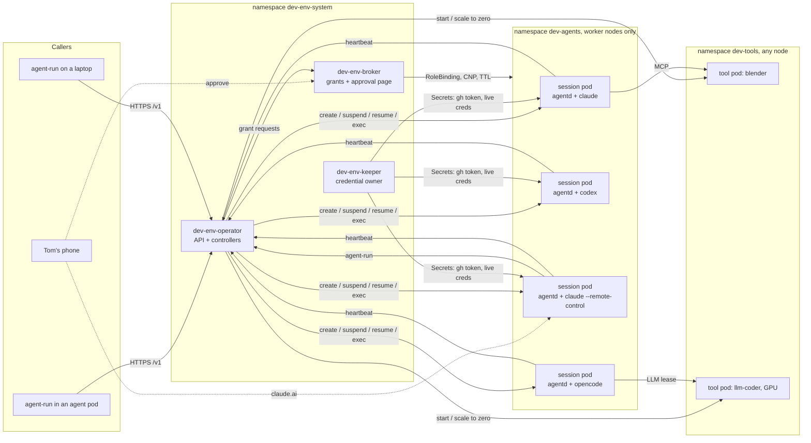
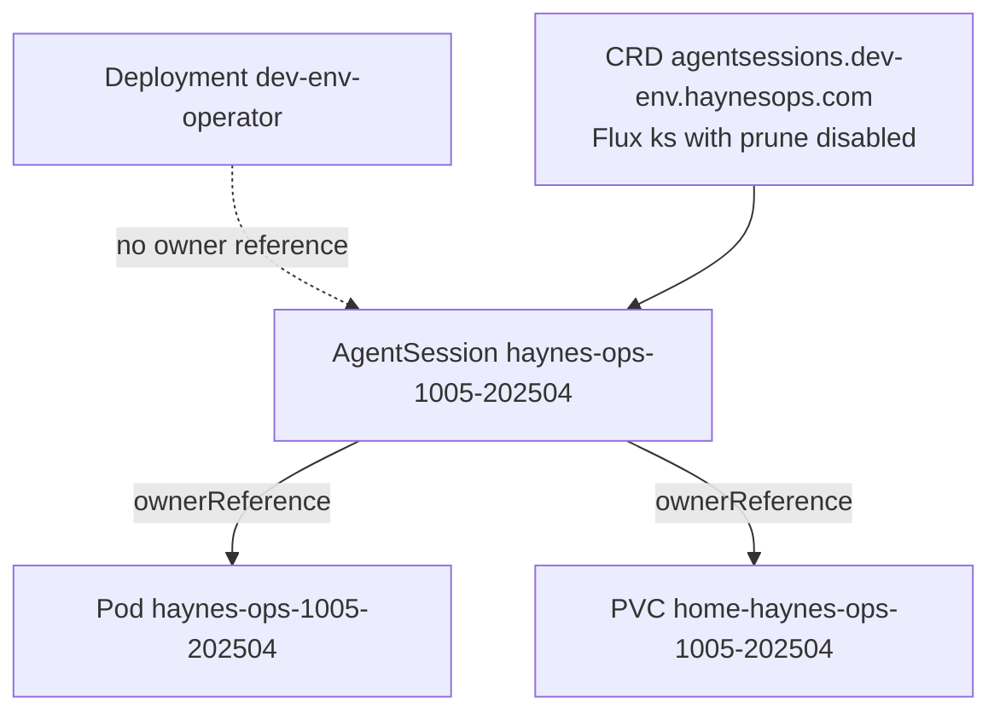
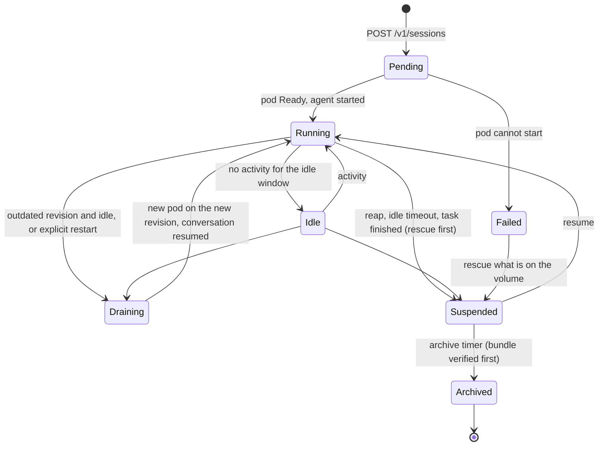
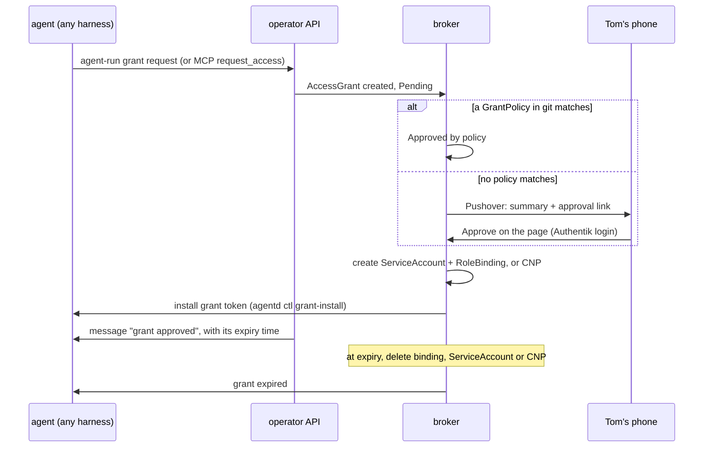
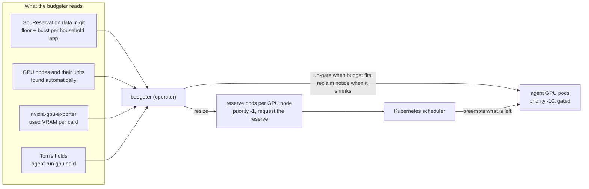

# DESIGN-001: dev-env v2, one pod per agent session

- **Status:** Accepted 2026-10-06 with ADR-001 (summary at the top of
  [ADR-001](../adrs/001-distributed-dev-env.md#ratification-summary)). Tom ruled on
  every open question, Q-01 to Q-11, on 2026-10-06 and widened the scope (tool pods,
  a VRAM budget per card, satellite inference workers, local models, access without
  in-pod prompts, summoned sessions, the console). Q-13 and Q-14 (repo setup) were ruled
  on 2026-10-06. Q-12 is open: to ask Tom once `CI - Success` has reported and he creates
  the ruleset (section 15).
  Research notes [R-01](../research/R-01-summoned-agents-audit.md) and
  [R-02](../research/R-02-remote-control-identity.md) are folded in.
- **Last updated:** 2026-10-06
- **Governed by:** [ADR-001](../adrs/001-distributed-dev-env.md) (Accepted 2026-10-06)
- **Saga:** [README](../README.md)

Decisions settled in this design carry a `D-NN` id. Questions only Tom can answer
carry a `Q-NN` id and are listed in full in [section 15](#15-open-questions). The
recommended option is always listed first.

## 1. Summary

v1 is one pod (`dev/dev-env`) that hosts every agent session in tmux on one 256Gi
volume. It has no CPU limit, so one runaway test run can starve its node. It runs
on the control-plane nodes, so that node is also where EMQX, traefik and the CNPG
operator live. Every image roll kills every session.

v2 runs **one pod per agent session**. An **operator** (control plane only) creates,
upgrades and prunes those pods and serves an HTTP API. **`agent-run`** becomes a
client of that API and runs anywhere: in an agent pod, on a laptop, or from a
phone-driven session. A small **keeper** owns every rotating credential, so no two
pods ever refresh the same token. Each agent pod has CPU and memory requests and
limits, runs on the worker nodes only, and keeps its work on its own volume, so a
pod can be stopped and resumed with its conversation intact.

Tom's rulings and new asks of 2026-10-06 add seven things:

- **The scheduler places pods.** Every pod carries requests and limits; there is no
  fleet cap and no allocation logic in the operator (7.3).
- **Session volumes live on gasha01**, the Proxmox-hosted Ceph, which keeps agent
  disk load off the in-cluster OSDs on the control-plane nodes (6.6).
- **No approval prompts inside a pod.** The agent runs with its vendor's
  skip-permissions mode. The control point is the platform: RBAC, egress tiers, and
  an **access broker** that grants more for a while, approved on Tom's phone or by a
  policy in git (6.10 to 6.12).
- **Tool pods.** Blender, audio, image and video generation, transcription and
  3D-printer tools run as pods that agents start, attach to and release, on any
  node, with a GPU when they need one (8.1).
- **GPUs and local models.** GPUs are counted in VRAM and claimed through the
  scheduler. Household AI keeps its full reservation on every card; agents get only
  what is left, control-plane cards included, and that share grows as Tom adds GPUs.
  Larger models run on satellites: Tom's 128 GB M5 MacBook and his 5090 and 4090
  PCs, used only while they are awake and he is not using them. Local-model agents
  (opencode on a Qwen coder model) join Claude Code and Codex as fleet members (6.13,
  8.2 to 8.4).
- **Summoned sessions are preserved.** The alert responder, the upgrade shepherd and
  the other automated callers keep summoning Max-plan sessions, now through the API,
  authorized per caller, with outcomes, lanes and watchdogs; the v1 executor
  `dev-env-ops` moves into the operator (3.7).
- **One login, one console.** The keeper is the sole owner of the Max login, and Tom
  renews it each month on a console page behind Authentik that also lists every
  session's link with an archive button (6.2, 3.8).



## 2. Facts this design rests on

All measured or read on 2026-10-05 unless a date says otherwise.

| Fact | Source |
|---|---|
| v1 pod: 1 replica, `Recreate`, control-plane nodes only (since 2026-09-23), requests 1 CPU / 4Gi, **no CPU limit**, memory limit 64Gi | haynes-ops `kubernetes/main/apps/dev/dev-env/app/helmrelease.yaml` |
| v1 CPU over 7 days (whole app container): median 0.09 cores, p99 14.2, max 18.6 (the 2026-10-05 incident); outside the incident, peaks of 1 to 6 cores | Prometheus, `container_cpu_usage_seconds_total` |
| The 2026-10-05 outage on talosm02 ran 23:42 to 00:12Z (a separate 3.6-core blip at 23:03Z). The kubelet was not starved: it peaked at 0.18 cores. Liveness probes failed because BestEffort pods, which have no CPU request and so CPU weight 1, got no CPU while the node was saturated | Prometheus, corrected 2026-10-06 |
| v1 memory over 7 days (whole app container): p50 7.4 GiB, p95 10.8 GiB, max 35.4 GiB | Prometheus, `container_memory_working_set_bytes` |
| 13 to 14 claude processes at about 400 MiB RSS each; 16 tmux sessions; 137 worktree dirs; 41G of 252G used | `ps`, `tmux`, `df` in the pod |
| Earlier OOMs: an 8Gi limit killed haynesnetwork's `pnpm test`; a 24Gi limit was hit at 21.9 GiB with concurrent sessions (2026-08-16) | helmrelease comments |
| Nodes: talosm01-05 (20 cores, 96 GiB, zone `m`, control plane, untainted); talosw01 (40 cores, 3090 GPU host), talosw02 (16 cores, 123 GiB), talosw03 (16 cores, 39 GiB) in zone `w`; talosw04 tainted `haynesops.com/gpu-test`. On 2026-10-06 talosm04 was out of service (its A2000 does not enumerate). Kubernetes 1.35.5 | `kubectl get nodes`, `kubectl version` |
| talosm02 hosts dev-env, `emqx-core-0`, the CNPG operator, a traefik-internal and a traefik-external replica, and authentik pods | `kubectl get pods -o wide` |
| Storage classes: `ceph-block` (RBD, RWO, default, expandable), `ceph-filesystem` (CephFS, RWX, one active MDS, also used by zigbee2mqtt, zwave, outline, immich ML), `gasha01-rbd`, `openebs-hostpath` | `kubectl get sc`, `get pvc -A` |
| In-cluster Rook Ceph: 10 NVMe OSDs on talosm01-05. `gasha01-rbd`: ceph-csi-rbd against the Proxmox Ceph (30 HDD OSDs on three hosts, 2 SSD on pve04), RBD only, tenants Prometheus and Loki. Detail in 6.6 | `kubectl get cephcluster`, Proxmox API (2026-10-06) |
| GPUs: one 3090 (talosw01), A2000s (talosm01, talosm05, talosw04), an RTX 2000 Ada (talosm03). Household GPU pods pin cards by UUID without requesting `nvidia.com/gpu`; the device plugin advertises one unit per card with no sharing. Detail in 8.2 | `nvidia-smi` via the GPU exporter, pod specs |
| blender-authoring and audio-authoring: MCP services in `dev`, reachable only from the v1 pod. Detail in 8.1 | haynes-ops `apps/dev/{blender,audio}-authoring`, runbooks |
| v1 runs agents with no approval prompts (`--dangerously-skip-permissions`; Codex approval `never`) | `agent-run.sh` |
| Cilium has Hubble and its relay enabled, and its L7 proxy on | `cilium-config` |
| haynes-ops #3392 (open): v1's OPERATOR tier lets an agent act as another namespace's ServiceAccount (Jobs, template patches, Flux spec patches) | the issue |
| Tom's machines outside the cluster: an M5 MacBook with 128 GB unified memory, a PC with an RTX 5090, a PC with an RTX 4090. They sleep, travel and play games | Tom, 2026-10-06 |
| Repo sizes (`.git`): haynes-ops 30M, haynesnetwork 124M, hass-sandbox 47M, cigar-journal 17M, haynes-quest 934M | `du` in the pod |
| v1 RBAC: ClusterRole `dev-env-operator` (the "OPERATOR tier"): read everything except Secrets, plus pod delete, pod exec, service/pod proxy, rollout restart, Flux reconcile/suspend, ExternalSecret refresh, Job create/delete, CronJob suspend; PVC delete in `database` only | `rbac.yaml`, `cloudnative-pg/app/dev-env-rbac.yaml` |
| v1 egress: default-deny CiliumNetworkPolicy with about 115 enumerated DNS names plus in-cluster services, selected by `app.kubernetes.io/name: dev-env` | `networkpolicy.yaml` |
| GHCR image `ghcr.io/thaynes43/dev-env` is about 1.07 GB; a cold pull took 6m15s | helmrelease comment |
| Kyverno `verify-thaynes43-images` trusts `dev-env*` images signed by `thaynes43/haynes-ops` workflows only (Audit mode) | `verify-thaynes43-images.yaml` |

Facts about the agent CLIs, read from the pinned binaries (claude-code 2.1.284,
codex 0.160.0), are given where they are used: [6.2](#62-claude-max-login-and-its-monthly-renewal),
[6.3](#63-codex) and [6.8](#68-messaging-between-agents).

## 3. Architecture

### 3.1 Components

| Component | What it is | Runs as |
|---|---|---|
| **dev-env-operator** | Control plane. Serves the `/v1` API, reconciles `AgentSession`, `ToolSession` and `LLMLease` resources into pods and volumes, detects idle sessions, runs rescue, drains outdated sessions, expires activities. Owns no running work and holds no grant privileges. | Deployment, 2 replicas with leader election, namespace `dev-env-system` |
| **dev-env-broker** | Access broker (6.12) and Tom's console (3.8). Checks grant requests against the standing policies in git, sends Tom the rest, creates and revokes the time-boxed RoleBindings and network policies, and serves the console: sessions with their links and an archive button, approvals, and the login renewal page. The same binary as the operator, run in a second mode. | Deployment, 2 replicas with leader election, own ServiceAccount, namespace `dev-env-system` |
| **dev-env-keeper** | The only holder of rotating credentials (the one Claude Max login, the Codex login) and of the GitHub App keys (haynes-dev-bot, haynes-ops-bot). Mints and refreshes; writes short-lived results into Secrets that agent pods read. Runs the login ceremony for the console, archives Remote Control entries on reap, tracks the static token's age. Pages Tom when a credential nears expiry. | Deployment, 1 replica, `Recreate`, namespace `dev-env-system`; its own binary in the operator image (D-38) |
| **session pod** | One agent session: `tini` as PID 1, `agentd`, tmux, the agent CLI (Claude Code, Codex or opencode), its MCP children, the build tools. | Pod in namespace `dev-agents`, owned by its `AgentSession` |
| **agentd** | Small supervisor inside each session pod. Renders config at boot, clones the repo, starts or resumes the agent, sends heartbeats, runs rescue and drain hooks on request, and serves the loopback tool gateway (8.1). Replaces v1's `dev-init.sh` and `post-ready.sh` per pod. | Child of `tini` in the session pod |
| **tool pod** | One instance of a specialised tool (Blender, audio, image, transcription, 3D printing, video, a local LLM server), started for agents on demand and stopped when idle (8.1). | Pod in namespace `dev-tools`, any node that fits, owned by its `ToolSession` or pool |
| **agent-run** | CLI client of the API. Same verbs as v1. One static Go binary. | Wherever it is called |
| **dev-env-satellite** | Small agent on Tom's own machines: runs a model server, reports availability, steps aside when Tom uses the machine (8.4). | LaunchAgent on the Mac, Windows service on the PCs |
| **workbench** | Tom's browser IDE (code-server) plus `agent-run` and `kubectl`. Runs no agents by default. | Small Deployment, namespace `dev-agents` (phase 5) |
| **codex hub** | The one long-lived session that runs the Codex remote-control daemon and keeps the phone's enrolment. | A session pod of kind `codex-hub` (phase 4) |

The operator, broker, agentd and `agent-run` are written in Go (Q-02, Tom
2026-10-06). The operator owns pods and volumes itself (Q-01, Tom 2026-10-06).

**D-01. The operator is control plane only.** It never runs agent work, and its
Deployment owns nothing that runs agent work. Its outage stops new sessions and
lifecycle actions; running sessions do not notice. Rationale: requirement 4 of the
vision, and it keeps the operator's upgrade path trivial.

**D-02 (revised 2026-10-06). Three namespaces.** `dev-env-system` holds the operator,
broker and keeper. `dev-agents` holds session pods, their volumes, the workbench and
the Secrets agents mount. `dev-tools` holds tool pods, their volumes and the Secrets
only tools use (for example a video vendor's API key). The operator's write access is
limited to `dev-agents` and `dev-tools`. Rationale: least privilege, and a LimitRange
and network policies that apply to agent and tool pods only. The v1 namespace `dev`
is left alone until cutover.

**D-38 (2026-10-06, KICKOFF B1). The keeper is its own binary, `dev-env-keeper`,
shipped in the operator image.** The broker is a mode of the operator binary because
it shares the operator's shape: a controller-runtime manager, two replicas with
leader election, CRDs to reconcile and HTTP to serve. The keeper's shape differs.
It is one replica by rule (one owner per rotating refresh token), it owns no CRD
(for credential grants it only reads `AccessGrant`, 6.11), and its main work is a
timer loop that mints and refreshes credentials. It is also
the one process that holds the GitHub App keys and the Max login. As a separate
binary it links only what that job needs. The keeper binary has no `/v1` API server
and no controllers, so they can never run in the pod that mounts those keys. The
operator binary has no refresh loop, so its two replicas can never become two
owners of one refresh token, whatever mode they are started in.
It costs one more `main` package and nothing else: both binaries ship in
`ghcr.io/thaynes43/dev-env-operator` with one version, so the build, signing and
haynes-ops pin stay single. B1 created `cmd/dev-env-keeper/` on this basis.

### 3.2 Ownership, so an operator upgrade cannot cascade



**D-03. Session pods and volumes are owned by their `AgentSession`, never by the
operator Deployment.** The CRDs ship in their own Flux Kustomization with
`prune: disabled`, and the operator adds no finalizer that deletes pods. Deleting or
rolling the operator therefore cannot delete a session. Only an explicit reap, or a
human deleting the `AgentSession`, removes a pod. See [5.1](#51-operator-broker-and-keeper-upgrades-never-touch-sessions).

### 3.3 The AgentSession resource

Group `dev-env.haynesops.com`, version `v1alpha1`. The shape follows
kubernetes-sigs/agent-sandbox's `Sandbox` (`operatingMode`, `shutdownTime`-style
lifecycle) so a later move to that project stays mechanical (see [section 9](#9-build-vs-adopt)).

```yaml
apiVersion: dev-env.haynesops.com/v1alpha1
kind: AgentSession
metadata:
  name: haynes-ops-1005-202504        # = pod name = hostname = Remote Control name
  namespace: dev-agents
spec:
  repo: haynes-ops
  base: origin/main
  agent: claude                       # claude | codex | opencode (6.13)
  mode: remote                        # task | local | remote (v1's task | local | both); summoned: task | remote (3.7)
  model: claude-opus-5-5              # full id, never an alias; opencode: the LLM pool's model id
  effort: xhigh
  prompt: "…"                         # task mode only
  size: M                             # S | M | L: presets for requests and limits (section 7.2)
  profile: full                       # which Secrets and standing grants (D-18)
  tools: [blender, audio]             # tool pools registered at boot (8.1); default from the profile
  llm: { pool: llm-coder }            # opencode only: the LLM pool it leases (8.3)
  parent: haynes-ops-1005-195501      # the session or caller that created it, from the caller's token
  caller: ""                          # summoned only: the CallerPolicy, e.g. alert-responder (3.7)
  lane: ""                            # summoned only: remediation | upgrade | curation (single-flight) | escalation (a label, not single-flight)
  idempotencyKey: ""                  # summoned only: e.g. the alert signature
  limits: { timeout: "", maxTurns: 0 } # task kind: wall clock and turn cap from the policy
  operatingMode: Running              # Running | Suspended
  lifecycle:
    idleSuspendAfter: 72h
    archiveAfter: 168h                # after suspension
status:
  phase: Running                      # Pending | Running | Idle | Draining | Suspended | Archived | Failed
  pending: ""                         # while Pending: the scheduler's reason (7.3)
  revision: 2.0.3-7f3a9c              # template revision the pod runs (section 5.2)
  podName: haynes-ops-1005-202504
  nodeName: talosw02
  agent: { status: busy, lastActivity: "2026-10-05T23:41:07Z" }
  remoteControl: { name: haynes-ops-1005-202504, sessionId: "session_…", url: "https://claude.ai/code/…", state: registered }  # 6.7
  outcome: { state: running, note: "", at: "" }   # summoned: pending | running | done | failed | escalated
  usage: { costUSD: "0", inputTokens: 0, outputTokens: 0 }  # 3.7, V-16; cost is a decimal string
  rescue: { lastBundle: "rescue/haynes-ops-1005-202504/20261006-0130.bundle" }
  conditions: []
```

**D-04. Session templates are GitOps data.** Image digest, size classes, storage
classes and profiles live in a ConfigMap (`dev-env-templates`) in haynes-ops.
ToolPools, GrantPolicies and LLM pools are GitOps data in the same way. The template
**revision** is a hash of that content. Renovate bumps the image digest there, the
same way it bumps any HelmRelease. Rationale: every change that reaches agent pods
shows up as a haynes-ops PR diff, like v1's ConfigMaps do today.

The example above lists every field. A real object sets only the fields its mode,
agent and caller allow, as D-39 says.

**D-39 (2026-10-06, plan 01 step 1). The AgentSession schema enforces the rules
about one session, and spec is fixed at create.** The API server refuses a bad
session whoever writes it, so the `/v1` API, a future client and a human with
`kubectl` meet the same rules, and the envtest suite in `api/v1alpha1` proves each
one against a real API server.

- **Cross-field rules, as CEL** (`x-kubernetes-validations`): `prompt` is required
  in task mode and allowed only there; `limits` are task mode only; `llm` is
  required for opencode and allowed only there; a Claude `model` starts with
  `claude-`, because ids are full and never aliases; `caller` and `lane` go together
  and mark a summoned session, `idempotencyKey` needs them, and a summoned session
  runs in task or remote mode and names a profile other than `full` (3.7, D-36);
  `metadata.name` is a DNS label of at most 63 characters, because it is the pod's
  hostname and the Remote Control name.
- **Spec is immutable after create, except `operatingMode` (suspend and resume) and
  `lifecycle` (a session's timers may be lengthened or shortened).** Everything else
  is what the caller asked for and what its policy granted. Changing it under a
  running pod would make spec disagree with the pod, and a summoned session could
  raise its own limits. A different ask is a new session. The operator never writes
  spec either: what it resolves (the default profile and tools, the timers per mode)
  it reads from the templates, and what it decides at run time (for example the
  fallback model a summoned session moved to, V-04) goes into status. A changed
  value is refused at its field; an added or removed field by one rule on spec.
- **Formats:** `repo` is a name, not a path (no `/`, not `.` or `..`); `base` may
  not start with `-`, so git never reads it as an option; `profile`, `tools`,
  `llm.pool` and `caller` are object names; `idempotencyKey` is a label value (at
  most 63 characters), so the API can find a caller's earlier session with a label
  selector, and a caller with a longer signature sends a hash of it; `prompt` is at
  most 256 KiB; durations are positive Go durations (`40m`, `72h`).
- **Rules about a caller stay in CallerPolicy's schema** (plan 10): `urgent`
  priority for the remediation and escalation lanes (7.3), a fallback model that
  differs from the primary (V-04), and no profile `full` in a policy (D-36).
  AgentSession has no priority field; priority is set per session kind in the
  caller's policy.

Rationale: v1alpha1 starts strict because loosening a rule later is a compatible
change and tightening one is not. Every rule here is one the design already states
in prose; the schema only makes it impossible to break.

### 3.4 The API

HTTPS with a cert-manager certificate, JSON, versioned under `/v1`.

| Method and path | Purpose |
|---|---|
| `POST /v1/sessions` | Create a session: repo, agent, mode, model, effort, prompt, base, size, profile. Summoning callers also send `name`, `idempotencyKey`, `lane`, and get `timeout` and `maxTurns` from their policy (3.7). Returns the id and state; a repeated idempotency key returns the existing session. |
| `GET /v1/sessions`, `GET /v1/sessions/{id}` | List (filters: repo, state, mine, caller, lane, outcome) and detail: phase, node, revision, idle time, branch, Remote Control URL and state, outcome and note, usage. |
| `POST /v1/sessions/{id}/outcome` | A session reports on itself: `working`, `done`, `failed` or `escalate`, with a note (3.7). Only the session's own token may call it. |
| `POST /v1/sessions/{id}/heartbeat` | agentd's status every 60 s and on a task's end (D-41). Only the session's own pod token may call it. |
| `GET /v1/sessions/{id}/log?tail=N` | Task log tail. The log is also kept on the shared volume after the pod is gone. |
| `POST /v1/sessions/{id}/messages` | Relay a message into a session ([6.8](#68-messaging-between-agents)). |
| `POST /v1/sessions/{id}/suspend` | Rescue, then stop the pod and keep the volume. |
| `POST /v1/sessions/{id}/resume` | Start the pod again and resume the conversation. |
| `POST /v1/sessions/{id}/restart` | Move a session onto the current revision now (explicit drain). |
| `DELETE /v1/sessions/{id}` | Reap: rescue, suspend, archive. There is no "skip the rescue" flag. |
| `GET /v1/fleet` | Running and Pending sessions with the scheduler's reasons, current revision, outdated sessions, storage health, plan-quota state. It reports; it gates nothing (D-21). |
| `POST /v1/fleet/nodes/{node}/evacuate` | Move a node's sessions and tool instances off it before a drain ([6.12](#612-access-no-prompts-in-the-pod-control-at-the-platform)). |
| `GET/POST/DELETE /v1/activities` | `declare-activity` ([6.9](#69-declare-activity)). |
| `GET /v1/auth` | Status of each credential: present, expires, days left; for the static token, its mint date and days left (V-12). Never a value. |
| `POST /v1/auth/{claude,codex}/login` and `…/login/code` | The login ceremony. The console (3.8) is the normal way in; this is the laptop fallback, Tom only ([6.2](#62-claude-max-login-and-its-monthly-renewal)). |
| `GET /v1/rescues`, `POST /v1/rescues/{id}/restore` | List rescue bundles; start a new session from one. |
| `GET /v1/tools`, `POST /v1/tools/sessions`, `DELETE /v1/tools/sessions/{id}` | List tool pools; attach (create a ToolSession for the caller); release ([8.1](#81-tool-pods)). |
| `POST /v1/grants`, `GET /v1/grants`, `GET/DELETE /v1/grants/{id}` | Request, list, inspect or release an access grant ([6.12](#612-access-no-prompts-in-the-pod-control-at-the-platform)). Approving is not in this API: it happens on the broker's page. |
| `POST /v1/leases`, `GET /v1/leases`, `DELETE /v1/leases/{id}` | LLM leases ([8.3](#83-llm-pools-and-leases)). |
| `GET /v1/gpus`, `POST /v1/gpus/{node}/hold` | Each card's reserve and agent budget; Tom's hold of a card for the house ([8.2](#82-gpus)). |
| `GET /v1/satellites`, `POST /v1/satellites/enroll`, `/v1/satellites/{name}/heartbeat` | Satellite workers: list, enrol (Tom only), heartbeat (satellite client certificate only, through the internal route) ([8.4](#84-satellite-inference-workers)). |

**D-05. Callers authenticate with a Kubernetes ServiceAccount token** for the
audience `dev-env-operator`, checked with a TokenReview.

- Agent pods use their projected token. Its bound-pod claims tell the operator which
  session is calling, so `parent` is recorded without trusting the caller.
- The workbench uses its own ServiceAccount.
- A laptop runs `kubectl create token dev-env-human -n dev-env-system --audience
  dev-env-operator` with Tom's admin kubeconfig and reaches the API through a
  port-forward. `agent-run` does both steps for him.
- An Authentik OIDC login for the laptop is a later step (phase 6).
- Summoning callers (alert-responder, upgrade-shepherd and the rest, 3.7) use their
  own ServiceAccount's projected token. The operator looks up their `CallerPolicy`.

All authenticated callers get the same API, with these exceptions: a summoning
caller gets only what its `CallerPolicy` allows (3.7, V-01); only Tom (on the
console) can approve a grant or renew a login; only Tom or the holder of an active nodes or
break-glass grant can evacuate a node (6.12); only Tom can hold a GPU or enrol a
satellite (8.2, 8.4); and satellite heartbeats accept only satellite client
certificates. Destroying unrescued work is not in the API at all: it needs a human with `kubectl` (agents cannot delete PVCs in
`dev-agents`). Each session may create at most 4 child sessions at a time, two
levels deep, so a confused agent cannot fork-bomb the fleet.

### 3.5 agent-run v2

The verbs stay, so muscle memory and every CLAUDE.md instruction carry over.

| v1 verb | v2 behaviour |
|---|---|
| `agent-run [--repo r] [--agent a] [-p "…"\|--local\|--interactive] [--model] [--effort]` | `POST /v1/sessions`, prints the id. New: `--agent opencode`, `--size S\|M\|L`, `--profile`, `--tools a,b`. `--interactive` still means "TUI + Remote Control" for claude. |
| `list` | `GET /v1/sessions` |
| `attach [<id>]` | For Tom: `kubectl exec -it <pod> -- tmux attach` from the workbench or a laptop. Not offered to agents, which have no exec in `dev-agents` (D-19); they use `msg`. |
| `detach` | For Tom: exec `tmux detach-client` in the pod. |
| `reap [<id>]` | `DELETE /v1/sessions/{id}` |
| `prune`, `sweep` | Gone as commands. The operator's reaper does this continuously ([4.3](#43-timers)). `agent-run fleet` shows what it will do. |
| `codex-remote [up\|stop]` | Manages the codex hub session ([6.3](#63-codex)). |
| new: `suspend`, `resume`, `restart`, `msg`, `fleet`, `fleet evacuate <node>`, `auth status\|login\|code`, `rescue list\|restore` | Map one to one onto the API. |
| new: `report working\|done\|failed\|escalate [--note]`, `wait <name> --registered` | Summoned sessions report their outcome; callers wait for a verified Remote Control link (3.7). `report` replaces v1's `order-status.sh`. |
| new: `tools list\|attach\|release\|get\|put` | Tool pods and their artifacts ([8.1](#81-tool-pods)). |
| new: `grant request\|list\|use\|release`, `breakglass` | Access grants ([6.12](#612-access-no-prompts-in-the-pod-control-at-the-platform)). `grant request` prints the approval link and waits for the answer; `--no-wait` returns the id. |
| new: `lease <pool> [--minutes N]` | LLM leases ([8.3](#83-llm-pools-and-leases)). |
| new: `gpu`, `gpu hold <node> --for <d>`, `satellite list\|enroll` | GPU budgets and satellites ([8.2](#82-gpus), [8.4](#84-satellite-inference-workers)). `gpu hold` and `satellite enroll` are Tom only. |
| `declare-activity …` | Same command and flags, now a thin client of `/v1/activities`. |

**D-06. `agent-run` is one static binary** with no runtime dependency. It needs only
the API URL and a token, which it finds automatically in a pod (projected token,
in-cluster Service DNS) or gets from the kubeconfig on a laptop.

### 3.6 agentd and the session pod

Boot sequence (each step idempotent, none fatal, all after `tini` starts):

1. Render config, as v1's `dev-init.sh` does today: link `CLAUDE.md`, register the
   MCP servers from `mcp.json`, assert the default model, install the subagent
   definitions, render Codex `config.toml` and `AGENTS.md`, set git identity and the
   credential helper, write the hw-ssh key. Codex standalone and `kubectl-cnpg` are
   baked into the image instead of downloaded at boot.
2. First boot: partial clone of the repo and `git worktree add` (D-15). Resume:
   reuse what is on the volume.
3. Start the agent in tmux session `agent`: `claude -p …` (task), `claude` (local),
   `claude --remote-control <id>` (remote), or the Codex equivalents. On a resume,
   add `--resume <session-id>` (Codex: `codex resume <id>`).
4. Every 60 s, report a heartbeat to the operator ([4.2](#42-idle-detection)).
5. Answer `agentd ctl status | rescue | prepare-restart | deliver`, which the
   operator runs with `pods/exec` in `dev-agents`.

**D-07. `tini` is PID 1 in every session pod.** v1's PID 1 is code-server, which
never reaps: on 2026-09-28 the pod held 2,970 zombie processes, and an un-reaped
Codex updater is why its self-updater had to be switched off.

**D-08. Commands go operator to pod by `kubectl exec`; status goes pod to operator
by heartbeat.** No session pod opens a listening port on the pod network, so no
in-pod auth scheme is needed and agent pods keep zero ingress. agentd's tool gateway
(8.1) listens on loopback only.

**D-40 (2026-10-06, plan 01 step 4). agentd reads its session from one environment
variable, and its config port keeps v1's layout.**

- **The session.** The operator sets `AGENTD_SESSION` on the pod's container: one JSON
  document with the session's `name` and the spec fields agentd needs (`repo`, `base`,
  `agent`, `mode`, `model`, `effort`, `prompt`, `limits`), under the spec's own field
  names. `AGENTD_SESSION_FILE`, when set, names a file with the same document instead.
  The types are in `internal/agentd/protocol`, which the operator imports; agentd
  ignores fields it does not know, so a newer operator can add some. Rationale: one
  variable needs no extra object per session and no API read from the pod, and
  `kubectl exec` (D-08) inherits it, so `agentd ctl` sees the same session. An
  environment string holds at most 128 KiB, so the API refuses a prompt over 64 KiB
  (`protocol.MaxPromptBytes`). agentd refuses a Claude model that is not a full id.
- **Pod settings** are environment variables whose defaults are v1's paths: the GitOps
  config at `/opt/dev-env/config` in v1's layout (`claude/CLAUDE.md`, `claude/mcp.json`,
  `claude/agent-*.md`, `codex/config.toml`, `codex/AGENTS.header.md`), so haynes-ops
  mounts the same ConfigMap content (D-14); the image's browsers at
  `/opt/dev-env/ms-playwright`; the shell profile at `/opt/dev-env/scripts/bashrc.sh`;
  the gh token at `/creds/gh_token` (D-13); `dev-env-shared` at `~/.shared` (D-22).
  `agentd.Settings` lists every one.
- **What the port of `dev-init.sh` changes.** The Codex standalone and `kubectl-cnpg`
  downloads and the helper links (`agent-run`, `declare-activity`, `pve`, `hw-ssh`,
  `claude-login-check`) are gone: the image bakes them in. The workspace README is gone
  with code-server. Playwright's browser revisions are linked from the image instead of
  copied, because every session has a new volume and the browsers are about 670 MB;
  the small `.links` registry files are copied. `${VAR}` is expanded inside decoded
  JSON strings, not over the JSON text, so a value cannot break a spec. The MCP loop
  removes a server only when it is registered, and removes a server that has left
  `mcp.json`, from the list agentd keeps in `~/.agentd/mcp-managed.json`. The default
  model in `settings.json` is `DEV_ENV_CLAUDE_MODEL`, else the session's own model, so
  agentd's code names no model. agentd also links the repo's Claude memory to
  `~/.shared/memory/<key>`, keyed by the clone's path as the CLI does. The commit
  email is the bot's with its App user id (`304655321+haynes-dev-bot[bot]@…`), the form
  GitHub links to the account; v1 leaves the id out. `safe.directory` covers `~/work/*`
  as well as `~/repos/*`, because git checks a linked worktree by its own path. Each
  `claude` and `git` call of the config steps has a 30-second limit that kills the
  call's whole process group, so a stalled CLI is a warning, not a stuck boot.
- **Seeding** (6.2): `hasCompletedOnboarding`, and `hasTrustDialogAccepted` and
  `hasCompletedProjectOnboarding` for the worktree and the clone. Checked on
  2026-10-06 with CLI 2.1.292: a cold TUI with those keys opens at its prompt, with no
  theme, security or trust prompt. `oauthAccount` (the account and organization uuids)
  comes from the file `AGENTD_OAUTH_ACCOUNT_FILE` names; plan 03 points that at the
  keeper's Secret. Task mode on the static token needs no `oauthAccount`.

**D-41 (2026-10-06, plan 01 step 4). agentd's heartbeat is
`POST /v1/sessions/{name}/heartbeat`.**

- Every 60 s, once right after boot, and as soon as a task's result appears, agentd
  posts its status as JSON (`protocol.Status`): the boot phase and the steps that
  warned or failed, the worktree's branch and head, the agent's state, the task's
  result and V-16's cost record. It authenticates with the pod's projected
  ServiceAccount token for the audience `dev-env-operator`, read from
  `AGENTD_API_TOKEN_FILE` at every beat because the kubelet rotates it. The operator
  checks that the token's bound pod is the session's, as for `/outcome` (3.4), and
  copies the status into `status.agent` and `status.usage`.
- `agentd ctl status` prints the same document, built by the same code, so the exec
  path (D-08) and the heartbeat never disagree.
- The base URL is `AGENTD_API_URL`; `AGENTD_API_CA_FILE` adds the CA that signed the
  API's certificate. With no URL, heartbeats are off and agentd says so once. A failed
  heartbeat never touches the agent (D-01). agentd logs the first failure, every tenth
  after it, and the recovery.
- Rationale: D-08 asks for a heartbeat, but the API had no route for it. A route per
  session keeps the same TokenReview check as `/outcome`, and agents still need no
  RBAC in `dev-agents` (6.11). Plan 01 step 3 builds the operator's side.

**D-42 (2026-10-06, plan 01 step 4). A task runs once, under `agentd run-agent` in
tmux session `agent`.**

- agentd writes `~/.agentd/launch.json` (mode 0600: the command, the prompt, the
  worktree, the limits and a new conversation id) and starts
  `tmux new-session -d -s agent -c <worktree> agentd run-agent --launch <file>`. The
  pane runs `claude --model <id> [--effort <level>] --dangerously-skip-permissions
  --session-id <uuid> [--max-turns <n>] --append-system-prompt <v1's guard>
  --output-format stream-json --verbose -p`, with the prompt on stdin, so no prompt
  passes through a shell or a command line. Checked on 2026-10-06 with CLI 2.1.292: a
  one-turn Haiku task read its prompt from stdin, used the given session id, and its
  result event carried the cost and token counts.
- run-agent writes a readable log to the pane and to `~/work/<name>.log` (v1's path),
  keeps the raw events in `~/.agentd/task-events.jsonl` (a line over 16 MiB ends the
  parsing, and the rest is kept unparsed, so the CLI never blocks on a full pipe), and
  when the CLI exits writes
  `~/.agentd/task-result.json`: the exit code, whether `limits.timeout` stopped it,
  the result's subtype and turn count, and the cost record. At `limits.timeout` it
  sends SIGTERM, then SIGKILL to the CLI's process group 30 s later.
  `limits.maxTurns` becomes `--max-turns`.
- **A task starts once per volume.** If `launch.json` exists and no result does (a
  container restart mid-task), agentd reports the agent `interrupted` and does not
  start it again: a second run of the same prompt could open a second PR. Resuming
  the conversation (`--resume <conversation id>`) is plan 02's.
- **The pod's SIGTERM reaches the CLI** (6.7, S-6). run-agent records the CLI's pid
  and its start time in `~/.agentd/agent.pid`. On its own SIGTERM, agentd sends
  SIGTERM to that pid and waits up to 30 s for it to exit. The pid comes from agentd's
  own record rather than `sessions/<pid>.json`, because agentd started the CLI; the
  start time keeps a reused pid from being signalled. The pod's termination grace
  period must be longer than 30 s (plan 01 step 2).
- **Plan credentials only** (V-05). agentd refuses to start a task without
  `CLAUDE_CODE_OAUTH_TOKEN`, and removes `ANTHROPIC_API_KEY`, `ANTHROPIC_AUTH_TOKEN`
  and the four variables of 6.2 from the agent's environment.
- **A fresh GitHub token on every call.** A minted token lasts 60 minutes and the
  keeper re-mints it every 40 (D-13), so a `GH_TOKEN` copied when the CLI starts can
  die mid-task and, because gh prefers it, break the task's last `gh pr create`.
  agentd removes `GH_TOKEN` from the agent's environment and writes `~/.local/bin/gh`,
  a wrapper that reads `/creds/gh_token` on every call and runs the image's gh
  (`~/.local/bin` leads the image's PATH). git's credential helper already reads the
  file each time (D-40). v1 exported the token once per shell.
- Not in plan 01: `local` and `remote` modes (plans 02 and 03), Codex task pods
  (plan 04, which S-3 unblocked on 2026-10-06), opencode (plan 09), and V-04's
  one-turn pre-flight with a fallback model (plan 10). For a task, the CLI's own
  `--fallback-model` may do that job; plan 10 decides.

**D-43 (2026-10-06, plan 01 step 4). `agentd ctl rescue` commits through a copy of
the index and prints the refs origin lacks.**

- It keeps v1's rules (D-10 step 1). In every clone under `~/repos`, each worktree's
  tracked edits and untracked files go to `rescue/<worktree>-<stamp>` (UTC
  `YYYYMMDD-HHMM`; a second rescue in the same minute adds `-2`), gitignored files
  excluded. A detached HEAD whose commit is on no ref is anchored on such a branch.
  A worktree with a merge or rebase in progress, an untracked nested repo, or more
  than 50 MiB untracked is refused. So is one with a submodule that holds work of its
  own: drifted from its recorded commit, with uncommitted changes or a stash, or with
  a branch, tag or HEAD commit its origin lacks. That work lives in the submodule's
  own repo, which neither the rescue commit (it records only the gitlink) nor the
  ref list reaches. A clean submodule passes. A refusal keeps the volume and blocks
  archive (D-10), so a human decides.
- One change from v1. v1 switched the worktree onto the rescue branch, because the
  worktree was about to be removed. A v2 session can be resumed after its rescue
  (4.5), so agentd copies the worktree's index, runs `git add -A` against the copy,
  and makes the commit with `commit-tree` and `update-ref`. The worktree, its index
  and its branch stay as they were, and no hook runs (v1's `--no-verify`). `git
  status` runs with `--no-optional-locks`, so a rescue never takes a running agent's
  index lock.
- Then agentd fetches origin (60 s limit) and lists every local branch, tag and stash
  entry whose commits origin's refs lack (`unpushedRefs`). Stash entries are named
  `stash@{n}`: only the newest has a ref, so step 5 gives each a ref of its own before
  it bundles. That is D-10 step 4's
  list: step 5's bundle must cover it, and the operator records it in status.
  `cleanAndPushed` is D-10's proof that no bundle is needed: every repo fetched,
  every worktree clean, no such ref. A failed fetch keeps the list (stale remote refs
  only make it longer) but voids the proof.
- The report is JSON on stdout (`protocol.RescueReport`). The exit code is 0 when
  every worktree is clean or rescued and 1 otherwise; either way the operator can
  mark `rescueFailed` from the report. One rescue runs at a time in a pod.
- Step 5 extends the same command: it writes `rescue/<id>/<stamp>.bundle` and its
  manifest on the shared volume from `unpushedRefs`, with the report's stamp. In a
  partial clone, objects that origin already has stay out of the bundle; step 5
  checks `git bundle create` on a `blob:none` clone.

The agent runs with no approval prompts (D-23). Pod spec, inherited from v1 where
the lesson still applies: non-root uid 1000,
read-only root filesystem, all capabilities dropped, `RuntimeDefault` seccomp,
`ndots:1` (the DNS allowlist refuses search-expanded names),
`XDG_RUNTIME_DIR=/dev/shm/run-1000` (Claude refuses a group-writable socket dir),
and the `not-ready`/`unreachable` tolerations at 3600 s (an RWO volume cannot
re-attach until the old node lets go, so early eviction never helps).

### 3.7 Summoned sessions

Automated callers in haynes-ops hand work to Claude Code sessions that bill the Max
plan instead of the metered API. Research note
[R-01](../research/R-01-summoned-agents-audit.md) audited that path: metered spend on
it has been $0 since July 2026, the headless lanes are reliable, and the interactive
lanes were broken because they never registered Remote Control (F-01). Tom
(2026-10-06): "we need to preserve the functionality". So summoning is a first-class
use of the v2 API, and the v1 executor (`dev-env-ops`) moves into the operator
(plan 10).

| Caller (namespace `upgrade-agent`) | Summons today | v2 kind and lane |
|---|---|---|
| alert-responder | `rem-responder-<sig>` when a critical alert needs a fix; `esc-responder-<sig>` when its own diagnosis died | `task` / remediation; `remote` / escalation |
| upgrade-shepherd | `wo-<PR>` for a consequential bump; `esc-shepherd-<sig>` on a terminal HOLD or failure | `remote` / upgrade; `remote` / escalation |
| shepherd-triage, health-gate | `esc-shepherd-<sig>`, `esc-gate-<sig>` | `remote` / escalation |
| curation CronJob | `wo-cigar-curate-<date>`, daily | `remote` / curation |
| a remediation session | `esc-rem-<sig>` when it cannot fix the fault | `remote` / escalation, under the original caller |

**D-36. Summoning is authorized per caller, by a `CallerPolicy` in git.**

```yaml
apiVersion: dev-env.haynesops.com/v1alpha1
kind: CallerPolicy
metadata:
  name: alert-responder
  namespace: dev-env-system
spec:
  serviceAccount: upgrade-agent/alert-responder
  limits: { concurrent: 2, createsPerHour: 6 }
  sessions:
    - kind: task                       # headless, never on Tom's list
      lane: remediation
      priority: urgent                 # urgent | normal | bulk, per session kind (7.3)
      namePrefix: rem-
      profile: ops
      model: { default: claude-opus-5-5, fallback: claude-opus-5 }
      effort: xhigh
      timeout: 40m
      maxTurns: 120
      onUnreported: escalate
    - kind: remote                     # Tom joins from the phone
      lane: escalation                 # not single-flight (see Lanes)
      priority: urgent
      namePrefix: esc-
      profile: ops
      model: { default: claude-fable-5-1, fallback: claude-opus-5-5 }
      onUnreported: failed
```

- **Authorization, not just authentication** (V-01). A ServiceAccount with a
  `CallerPolicy` may create only the kinds, name prefixes, profiles and models its
  policy lists. CRD validation refuses a policy that names profile `full`, and
  summoning callers never request grants. The caller is recorded as the session's
  `parent`. A ServiceAccount with no policy that is not a session, the workbench or
  Tom gets a 403. Every caller-supplied field (reason, diagnosis, alert text) reaches
  the session as data in a fenced block, never as instructions, as today. That and
  the authenticated caller replace v1's unauthenticated ConfigMap queue (F-11).
- **Two kinds** (V-02). `task`: headless `claude -p` with the policy's wall-clock
  timeout and turn cap, never registered with Remote Control. `remote`: interactive,
  registered under its name (6.7), quiet on success.
- **Names and idempotency** (V-03). The create carries `name` (with the lane prefix,
  so Tom's phone list sorts) and `idempotencyKey` (the alert or regression
  signature). A create whose key matches an unfinished session of the same caller
  returns that session instead of a new one. If the earlier one has finished, the new
  session gets a numeric suffix (`rem-responder-b7baaf6c-2`), so a re-fired
  signature never overwrites a finished record (F-08).
- **Models** (V-04). Full ids only. Before the agent starts, agentd runs a one-turn
  pre-flight on the primary model and uses the fallback if it is refused. CRD
  validation requires the fallback to differ from the primary (F-05). The curation
  order's `opus` alias (Tom's choice, 2026-08-29) becomes the current Opus full id in
  its policy, moved by the standard model-bump procedure, because this repo allows no
  aliases; the intent, "the latest Opus", is kept.
- **Plan credentials only, and fail loudly** (V-05). `task` sessions use the static
  token (6.1); `remote` sessions use the keeper's access token (6.2). No v2 pod holds a
  metered API key, so no session can fall back to metered. If no plan credential
  works, the create fails with `503 plan credential unavailable`, and the caller pages
  as it does today.
- **A verified join handle** (V-06). For a `remote` session the caller waits
  (`agent-run wait <name> --registered`) until `status.remoteControl.state` is
  `registered`, and puts that `url` in its page. If registration fails, the state is
  `failed` and the page says so and links the console's session page instead of a
  dead handle.
- **Outcome** (V-08). The session reports with `agent-run report
  done|failed|escalate --note "…"` (replacing `order-status.sh`) and heartbeats with
  `agent-run report working`. These set `status.outcome.{state, note, at}`; the
  states are `pending`, `running`, `done`, `failed` and `escalated`. Each decision is
  an `ops-event` line in the operator's log, so it reaches Loki. A daily digest of
  silent outcomes goes to Tom on Pushover at priority -1, as today. **Guaranteed
  outcome:** if the agent exits, hits its timeout or turn cap, or trips its watchdog
  without reporting, the operator closes the session as the policy's `onUnreported`
  says (`failed`, or `escalate`, which files an `esc-rem-…` session for remediation).
  This one rule covers every way a session can end unreported, watchdog trips
  included.
- **Lanes** (V-09). At most one running session per lane for the lanes that act on
  their own: remediation, upgrade, curation, each fed by one caller class. One
  remediation actuator touches the cluster at a time. Lanes limit actuators, not
  capacity, so they sit beside D-21, not against it. Queued sessions start in the
  order upgrade, remediation, curation.
- **Escalations are not single-flight.** An escalation waits on Tom rather than acting
  unattended, so its `escalation` lane is a label for listing and priority, not a
  single-flight lane: each starts at once, within its caller's
  `concurrent` and `createsPerHour` limits, and pages on spawn. One unanswered
  escalation can never hold back another (v1 F-04). An escalation that does queue
  behind those limits pages Tom after 15 minutes.
- **Storm limits** (V-10). Per caller, from its policy: concurrent sessions, creates
  per hour, and the idempotency key. The responder keeps its own collapse, cooldown and
  page cap, so there are two layers.
- **Watchdogs** (V-11). A session with no agent activity and no `working` report for
  its lane's limit (180 minutes for upgrades; the timeout for `task`) is closed as
  its policy's `onUnreported` says, its lane is freed, and Tom is paged. A pod that
  vanishes is reported as `session lost` and resumed from its volume where it can be.
  An escalation that is idle because it is waiting on Tom is exempt from the watchdog,
  within a bound: after 24 hours it pages Tom once more, and after 72 hours it is
  closed as `failed` with a note, then kept joinable for 7 days (V-15).
- **Pages**, from the operator on Pushover: an escalation spawned (with its verified
  link), an upgrade or escalation `failed`, a session lost, an escalation queued over
  15 minutes. Everything else goes to the digest. Email stays refused, as in v1.
- **Never ended by a change** (V-13). Operator, broker and keeper upgrades never touch
  a session (5.1). A summoned session is not drained for a new revision: it runs to its
  outcome on the revision it started on (5.2).
- **Retention** (V-15). After its outcome a `done` session stays joinable for 1 day,
  a `failed` or `escalated` one for 7 days; then it is rescued and reaped, and its
  phone entry archived (6.7).
- **Cost record** (V-16). `status.usage` holds the CLI's `total_cost_usd` and token
  counts for `task` sessions (from `--output-format json`) and token counts from the
  transcript for `remote` ones. They are exported as metrics, so the API tax avoided
  stays measurable.
- **Activity first** (V-17). `ops` sessions read `Activity` resources before acting
  (6.9), as the remediation contract requires. Their read RBAC covers the group.

Where each R-01 requirement lands:

| Req | Section | Req | Section |
|---|---|---|---|
| V-01 caller authorization | 3.7 D-36, 3.4 | V-10 storm limits | 3.7 |
| V-02 two kinds | 3.7, 3.3 | V-11 watchdogs | 3.7, 4.3 |
| V-03 names, idempotency | 3.7, 3.4 | V-12 credential lifecycle | 6.1, 3.8 |
| V-04 model pin, fallback | 3.7 | V-13 never ended by a change | 3.7, 5.2 |
| V-05 plan credentials only | 3.7, 6.1, 6.2 | V-14 priority against Tom's work | 7.3 |
| V-06 verified join handle | 6.7, 3.7 | V-15 retention | 4.3, 3.7 |
| V-07 `ops` profile | 6.10 D-18 | V-16 cost record | 3.7, 3.3 |
| V-08 outcome, guaranteed close | 3.7, 3.4 | V-17 read `Activity` | 3.7, 6.9 |
| V-09 lanes | 3.7 | | |

### 3.8 The console

**D-37. One web front end for Tom: the console.** Ruling (Q-11, Tom 2026-10-06): the
monthly login renewal is "baked into the front end", and the same front end lists
every session's link and status with an archive button. The console is the broker's
web UI, extended: the broker already serves Tom's approval page on a port only
traefik reaches, on an external host behind Authentik, and already trusts only Tom's
Authentik identity (D-26). One Tom-facing surface keeps one place that trusts that
identity. Pages:

1. **Sessions.** Every session, interactive and summoned: name, kind, caller, repo,
   phase, outcome and note, and the Remote Control link with its state (registered,
   offline, archived). Buttons: open the link, archive a stale entry (the broker asks
   the keeper to archive, as reap does in 6.7), and how to attach from the workbench
   or a laptop.
2. **Approvals.** Grant requests (D-26).
3. **Logins.** Each credential's state and days left: the Claude Max login, the static
   token (V-12), the Codex login, the GitHub App keys. "Renew" runs the Claude login
   ceremony (6.2) in the page. The sign-in link and the code are never logged or
   stored; if the page is left, the keeper ends the waiting login after 10 minutes.
4. **Codex.** The codex hub's state and its single phone enrolment, read-only. The
   enrolment stays on the hub's volume (6.3).

## 4. Session lifecycle

### 4.1 States



### 4.2 Idle detection

A session is **idle** when all of these hold for the idle window:

- the agent is not working: Claude writes its own status (`busy`, `idle`, `waiting`)
  into `~/.claude/sessions/<pid>.json`; for Codex, agentd reads process CPU time and
  the rollout file's mtime;
- no tmux client is attached;
- no git activity and no file change in the worktree (v1's `wt_busy` signals, ported:
  `HEAD`, `FETCH_HEAD`, `ORIG_HEAD`, `COMMIT_EDITMSG`, file mtimes outside
  `node_modules`, `.git` and `.claude`).

A busy agent is the busy-lock that v1's Renovate note asked for ("agents hold a
busy-lock, merger waits for release"). The agent sets it simply by working.

### 4.3 Timers

**D-09. Defaults, all overridable per session:**

| Event | Default | Why |
|---|---|---|
| task session finished | suspended after 1 h | its log and branch are what matter |
| interactive or remote session idle | suspended after 3 days | v1's sweep window (Tom, 2026-09-25) |
| suspended session | archived after 7 days | resume window; RBD is thin, so a parked volume costs only its written bytes |
| rescue bundle | kept 30 days | long enough to notice a loss |
| outdated revision | drained at the next idle moment (Q-03); summoned sessions are never drained | section 5.2, 3.7 |
| summoned session, outcome `done` | kept joinable 1 day, then rescued and reaped | V-15 (3.7) |
| summoned session, outcome `failed` or `escalated` | kept joinable 7 days, then rescued and reaped | V-15: Tom joins failures after the fact |
| summoned session, no activity and no `working` report | closed as its policy's `onUnreported` after its lane's limit (180 min for upgrades; the timeout for `task`) | V-11 (3.7) |
| escalation idle, waiting on Tom | a reminder page after 24 h; closed as `failed` after 72 h | V-11 (3.7) |
| reaped `remote` session | its Remote Control entry archived after the bundle is verified | 6.7, S-15 |
| tool instance with no claims and not busy | stopped after 30 min, volume kept | 8.1 |
| access grant | expires at its TTL (at most 8 h; break-glass 1 h) | 6.12 |
| unanswered grant request | denied after 30 min | 6.12 |
| post-ready standby | the operator keeps one `remote` session on haynes-ops ready, as v1's post-ready does | Tom (2026-09-10): after a roll nothing could start a session |

The standby keeps v1's circuit breaker: if three standbys are created inside 30
minutes, the operator stops creating them and reports `loop suspected`.

### 4.4 Rescue before reap

v1 commits WIP to a local `rescue/<id>-<stamp>` branch in the canonical clone on the
shared PVC. In v2 the volume itself goes away at archive time, so a local branch is
not enough.

**D-10. Rescue keeps v1's rules and adds a bundle off the session volume:**

1. On suspend, agentd runs v1's rescue unchanged: commit tracked edits and new
   untracked files to `rescue/<id>-<stamp>` (`--no-verify`, gitignored files
   excluded, refused for an untracked nested repo or more than 50 MiB), and anchor a
   detached HEAD on a rescue branch.
2. It writes a `git bundle` of every local ref that origin does not contain to the
   shared volume at `rescue/<id>/<stamp>.bundle`, with a small JSON manifest.
3. Suspension keeps the whole volume, gitignored files included, for 7 days.
4. agentd records, in the session's status, the list of local refs that origin
   lacks at suspend time. Archive deletes the volume only when the newest bundle was
   written after the last pod start **and** its manifest covers every ref on that
   list, or when agentd proved every repo clean and fully pushed at that suspend. A
   failed rescue still suspends (the volume is kept) but marks the session
   `rescueFailed`, which blocks archive and pages. An old bundle from an earlier
   suspend never counts.

**Rescue branches are never pushed to GitHub.** haynes-ops is public, and untracked
files can hold secrets (`.env`, tokens pasted into a scratch file). The bundle stays
inside the cluster, on the shared volume.

### 4.5 Resume and restore

- `agent-run resume <id>`: same volume, new pod, `claude --resume <session-id>`. The
  conversation, worktree and gitignored build output are all still there.
- `agent-run rescue restore <bundle>`: a new session whose clone fetches the bundle.
  Used after archive.

## 5. Rolling updates

### 5.1 Operator, broker and keeper upgrades never touch sessions

Rules, each enforced by a test in the operator's CI:

- No owner reference from any session object to the operator Deployment (D-03).
- The operator never deletes a pod whose `AgentSession` exists and is `Running`,
  except in the `Draining` and `Suspended` transitions.
- Reconcile is level-based. A fresh operator reads `AgentSession` status and pod
  state and resumes. Nothing is kept only in operator memory.
- CRDs live in their own Flux Kustomization, `prune: disabled`. A CRD version change
  ships as a new served version with conversion, never a delete and re-create.
- The keeper writes Secrets on a schedule with a wide margin (gh token: minted every
  40 min, valid 60 min). A keeper outage shorter than 20 minutes is invisible.
- The broker keeps no state outside `AccessGrant` objects. A broker restart or
  outage stops new grants only; active kube grants keep working until their tokens
  expire, and the operator deletes expired egress grants as a backstop.
- The same rules hold for tool pods: they are owned by their `ToolSession` or pool,
  never by the operator Deployment.

Phase 1 proves this: run `kubectl rollout restart deploy/dev-env-operator` while a
task session is mid-turn. The task must finish untouched.

### 5.2 New image or config reaches running sessions

The revision is the hash of the template ConfigMap (D-04). New sessions always start
on the current revision. A running session on an older revision is **outdated**.

Policy (**Q-03**, Tom 2026-10-06): **drain on idle, then resume the conversation on
the new version.** Summoned sessions (3.7) are the exception: they are short, they
belong to an unattended caller, and an escalation that sits idle is waiting on Tom.
They are never drained; each runs to its outcome on the revision it started on
(V-13).

1. The operator marks the session `Draining` only when it is idle (4.2).
2. agentd `prepare-restart` records the agent session id, mode, model, effort and
   Remote Control name on the volume.
3. The operator deletes the pod and starts a new one on the new revision with the
   same volume. agentd resumes the conversation (`claude --resume`,
   `codex resume`, opencode's session resume).
4. A session that stays busy for 72 h after going outdated gets a message asking it
   to reach a stopping point; nothing is forced. Tom gets one Pushover line if it is
   still outdated 24 h after that.

A busy turn is never cut. Background processes (a dev server, a watch) do not
survive the restart; they are rare in an idle session and the agent restarts them.
Active grants and leases survive a drain: they belong to the session, not the pod,
and the operator re-labels the new pod and agentd re-installs grant tokens.

### 5.3 What this changes for Renovate

v1's image bumps are manual-only because a roll kills every session
(`.renovate/autoMerge.json5`, 2026-07-20). With drain-on-idle, the v2 image (tag line
`2.x`) can auto-merge like any other own image once phase 4 ships. The Dockerfile
tool group keeps its single grouped PR.

## 6. Shared state, item by item

| State | v1 | v2 | Trade-off |
|---|---|---|---|
| Claude static token (`CLAUDE_CODE_OAUTH_TOKEN`, about 1 year, no refresh) | env from ExternalSecret `dev-env-claude` | Same Secret, env in every session pod | Safe in many pods: it never rotates. Cannot register Remote Control. |
| Claude Max login (`.credentials.json`, rotating refresh token, lapses about 30 days after each `/login`) | on the PVC, shared by the Remote Control sessions | Keeper owns it; Remote Control pods get an access token only (6.2) | Needs spike S-1. Fallback: one coordinator host pod. |
| Codex login (`auth.json`, rotating refresh token) | on the PVC | Codex hub owns it first; then the keeper, since S-3 passed (6.3) | Codex work runs in the hub until step 2. Pods then get an access-token-only `auth.json`. |
| GitHub App token | sidecar per pod, PEM in the sidecar | Keeper mints into one Secret; pods mount it (6.4) | PEM in one place; one mint for the fleet. |
| MCP server registration | dev-init, once per pod boot | agentd, once per session pod boot (6.5) | Same mechanism, same ConfigMap. |
| Repos and worktrees | 256Gi RWO volume, canonical clones + 137 worktrees | `gasha01-rbd` volume per session + small shared CephFS (6.6) | Q-05, decided 2026-10-06. |
| Claude memory (`~/.claude/projects/*/memory`) | on the PVC, shared by all sessions | Shared CephFS, linked into each pod (6.6) | Same visibility as today. |
| Remote Control, phone, standby | per session; post-ready keeps one standby | per session pod; operator keeps one standby (6.7) | Unchanged for Tom. |
| ListAgents and SendMessage | Unix sockets in `/dev/shm`, one pod | Native inside a pod, native between Remote Control sessions, relay otherwise (6.8) | No cross-pod inbox for headless tasks. |
| declare-activity | JSON files on the PVC, read by dev-env-ops over `kubectl exec` | `Activity` resource via the API (6.9) | Limits enforced server-side. |
| Summoned sessions | `dev-env-ops` executor polling the `upgrade-work-orders` ConfigMap; unauthenticated writers | The operator API, authorized per caller by `CallerPolicy`; lanes, watchdogs and the digest in the operator (3.7) | Callers change their scripts to call the API, one at a time (plan 10). |
| Egress | one CNP for the pod, about 115 names | Web and platform tiers for every pod; the controlled tier by grant (6.10) | Web fetch works; what a tricked agent can leak depends on what the pod holds (Q-07). |
| Access beyond the baseline | ask Tom in chat; a headlamp Job on his live directive | `AccessGrant` through the broker, approved on Tom's phone or by a policy in git (6.12) | Audited and time-boxed. |
| Specialised tools | fixed Deployments in `dev` (Blender, audio) | `ToolPool` and `ToolSession` in `dev-tools` (8.1) | Start on demand, stop when idle. |

### 6.1 Claude static token

Unchanged in substance. `dev-env-claude-secret` is copied into `dev-agents` by an
ExternalSecret and injected as env into every session pod for `task` and `local`
modes, summoned `task` sessions included. Many pods may use it at once: it has no
refresh token, so there is nothing to race. It is inference-only, so it never
registers Remote Control (6.2). It counts against the same Max plan windows as
everything else; the plan's own wall is the limit, and `agent-run fleet` shows it
(section 7.3).

**Its age is tracked** (V-12, R-01 F-07). One setup token carries every automated
path today, it lives about a year (the current one to about 2027-07), and nothing
warns before it dies. Its 1Password item gets a `minted` field, synced with the token.
The keeper reports the mint date and days left in `GET /v1/auth` and on the console,
and pages Tom at 30 and at 7 days. When it dies, no v2 path falls back to metered:
creates fail with `503 plan credential unavailable` (3.7).

### 6.2 Claude Max login and its monthly renewal

This is the hard part. Research note
[R-02](../research/R-02-remote-control-identity.md) has the full evidence; this
section keeps what the design needs.

**What we know.**

- Remote Control needs a full-scope `/login` credential. The CLI checks that the
  stored token's scopes include `user:profile`, and refuses inference-only tokens
  (`token_scope_limited`). **S-2 is answered: the static token cannot register Remote
  Control.** The docs say so ("Remote Control requires a full-scope login token"), the
  2.1.284 binary has the same check (2.1.292 still refused, re-probed 2026-10-06), and
  the v1 executor proved it again: all 45 of its `wo-*` and `esc-*` sessions since
  2026-09-03 ran on a credentials file synthesized from the setup token and were
  rejected (R-01, F-01).
- Remote Control is bound to the claude.ai account and organization of the
  credential, not to an IP, a hostname or a machine (R-02 section 2). Many pods can
  each run Remote Control on one Max account: v1 runs 14 at once from one login.
- The `/login` credential holds a rotating refresh token; the access token lasts
  about 8 hours, and the login lapses about 30 days after each `/login`. On
  2026-08-29, five or more sessions sharing one `.credentials.json` raced the
  rotation: one rotated, a sibling replayed the old token, and the whole token family
  was revoked mid-task. Copying that file into many pods would make this certain.
- Sharing one file over CephFS is no better: the race happened on one kernel with
  one file, and the CLI's own locks refuse to break a lock held in another pid
  namespace ([6.8](#68-messaging-between-agents)).
- **The CLI can run on a credential someone else refreshes** (R-02 5.2). It re-reads
  `.credentials.json` when the file's mtime changes, and an "auth-revive watcher"
  re-enables Remote Control when a fresh same-account credential appears. With
  `CLAUDE_CODE_OAUTH_TOKEN` and `CLAUDE_CODE_OAUTH_SCOPES` set, it builds a
  credential with no refresh token at all (spike S-1b). `CLAUDE_CODE_OAUTH_401_WAIT_MS`
  makes it wait on a 401 for a rotated env or file-descriptor token; S-1 found it does
  nothing for a credentials file. The `CLAUDE_CODE_HOST_CREDS_FILE` hook does not
  help: Remote Control refuses the kind of auth it supplies.

**Ruling (Q-11, Tom 2026-10-06).** The link Tom saw survive pod restarts is the Claude
Code auth, the Max `/login` on the v1 PVC. **The keeper is its sole owner; session
pods get access tokens only. The monthly renewal moves into the console (3.8), behind
Authentik, and replaces the chat relay.**

**D-11 (revised 2026-10-06). The keeper is the only owner of every Max login.**

- The keeper holds the refresh token and refreshes well inside the access token's
  8-hour life. It writes Secret `dev-env-claude-live` with the current access token,
  its expiry, scopes, subscription type and rate-limit tier, the account and
  organization uuids for agentd's seeding (S-6), and **no refresh token**.
  Every refresh revokes the previous access token in every pod at once (S-1), so the
  keeper refreshes once per token life, not on a short cycle, and writes the Secret
  the moment the refresh returns.
- **agentd, not a mount, writes the pod's credentials file.** The CLI writes
  `.credentials.json` itself (connector `mcpOAuth` tokens, atomic temp-file renames),
  so a read-only Secret mount would break it. agentd reads the keeper's Secret and
  merges only `claudeAiOauth.{accessToken, expiresAt, scopes, subscriptionType,
  rateLimitTier}` into the pod's own `~/.claude/.credentials.json`: mode 0600, owned
  by the agent user, by atomic rename, keeping every key the CLI owns. It watches the
  Secret and re-merges the moment it changes: until it does, every request in that pod
  meets a revoked token (S-1), so agentd's merge latency is the 401 window.
- **agentd seeds a cold home** (R-02 P-3): `.claude.json` with the onboarding flags,
  trust for the worktree, and `oauthAccount` with the account and organization uuids
  only. Without the flags a cold TUI stops on the theme, security and trust prompts
  (S-1). **`oauthAccount` is required** (corrected 2026-10-06 by S-6; this bullet said
  it was optional). Once the flags are seeded, the TUI reaches the Remote Control
  eligibility check 0.3 s after start. The check reads only the cached
  `oauthAccount`, so without it Remote Control is refused (`no_organization`, "--rc
  flag ignored"). S-1's unseeded run registered only because its onboarding prompts
  gave the CLI's own profile fetch time to land. The keeper puts both uuids in
  `dev-env-claude-live`; it reads them from its login's profile. agentd never copies
  `machineID`, `replBridgePlaceholders` or `sessions/*.json` between pods.
- **Environment rules.** Remote pods unset `CLAUDE_CODE_OAUTH_TOKEN`, as v1 does. No
  pod sets `CLAUDE_CODE_DISABLE_NONESSENTIAL_TRAFFIC`, `DISABLE_GROWTHBOOK`,
  `DISABLE_TELEMETRY` or `DO_NOT_TRACK`: the first two turn Remote Control off, and the
  last two switch the CLI to a check that wants a refresh token.
- A pod can never rotate the token, because it never holds the refresh token; with
  none, the CLI never tries (S-1). The worst case is one failed turn ("OAuth token
  revoked · Please run /login") when a request lands between a keeper refresh and
  agentd's merge. The session and its Remote Control entry carry on, and the next
  turn works. An unattended session would wait for that next turn, so **agentd
  resumes it** (added 2026-10-06 after S-1): after each merge, if the session's last
  turn ended in that error since the previous token was revoked, agentd sends one
  `continue` turn. Plan 03 picks the signal (the transcript or the session record)
  and tests it.
- **Trusted Devices stays off** on Tom's account (R-02 5.3). With it on, every pod
  would enrol as its own device, email Tom, and need a sign-in from the last 18 hours.
  Turning it on would need its own design pass.
- **Two v1 logins to absorb.** v1 has the dev-env pod's login, and since Tom's ruling
  on haynes-ops #3414 (2026-10-06) `dev-env-ops` has a second monthly login of its own,
  so its `wo-*` and `esc-*` sessions can register Remote Control. In v2 the keeper
  holds **one** login of its own, made fresh with `/login` in phase 3, and serves every
  remote pod, interactive or summoned. A second login bought separation from the
  refresh race, which the keeper removes. Nothing is copied from v1: moving a live
  refresh token would give it two owners for a while. Each v1 login is retired with
  its pod (the dev-env pod at cutover, plan 05; `dev-env-ops` when its callers move,
  plan 10) and simply lapses. Until then Tom renews up to three logins a month; the
  console makes each one a page, not a chat relay.

**Spike S-1** decides whether the target works (backlog 00 has the steps): an
access-token-only credentials file on a cold home; a newer access token picked up
from disk without a restart; quiet, harmless behaviour when the CLI wants to refresh;
the 401 window after a keeper rotation; the env-token variant S-1b; and the request
bodies confirmed with `--debug-file`.

**S-1 result (2026-10-06): the target holds, with one caveat.** CLI 2.1.292, in the v1
pod; backlog 00 has each step.

- An access-token-only credentials file on a cold home registers Remote Control, with
  no `.claude.json` seeding. The CLI fetched the profile (`oauthAccount`) and its
  feature flags (`cachedGrowthBookFeatures`; the debug log names GrowthBook as the
  source) and wrote both into `.claude.json` itself. S-6 found that this needs the
  onboarding prompts' delay: with the onboarding flags seeded, the check comes first
  and refuses, so agentd seeds `oauthAccount` (the seeding bullet above).
- A merged token is used by the next request, with no restart. One presence pulse
  sent in the same instant got a 401; the next one succeeded.
- **The caveat: a refresh revokes the previous access token at once** (revoked on the
  first check, 22 s after a v1 refresh). A request that meets the revoked token fails
  its turn after two tries, in about 2 s. The binary shows that on a 401 the CLI
  re-reads the stored credential once, so a merge that lands before the 401 should
  rescue the request (not measured). `CLAUDE_CODE_OAUTH_401_WAIT_MS=60000` changed
  nothing for a credentials file: per the binary, its wait polls only for a rotated
  `CLAUDE_CODE_OAUTH_TOKEN` or file-descriptor token. agentd's merge
  latency is therefore the window, and the D-11 bullets above keep it short.
- With no refresh token the CLI never tries to refresh, whatever `expiresAt` says (an
  expiry inside its 5-minute margin, or already past, still sends the token). A
  revoked token ends in an error. Nothing wrote a credentials file.
- S-1b registers too, without `CLAUDE_CODE_SUBSCRIPTION_TYPE`. It stays the fallback:
  its 401 wait would poll for a new env token, which a running process cannot get.
- `--debug-file` confirms R-02 2.1's first path by endpoint (`POST /v1/code/sessions`,
  `/bridge`, the worker event stream, `/client/presence`, `/archive` on `/exit`) and
  shows no `/v1/environments/bridge` call. It does not log bodies, so the body keys
  stay as read from the binary.
- Side results. The bridge's worker JWT lasts 46800 s and is re-minted with the OAuth
  token 25 minutes before it lapses; the spike's run did not reach that point, so
  plan 03's acceptance covers a session older than 13 hours. `/exit` archived the
  entry (`archive=200`) on an access token alone, a data point for S-15. Without
  `XDG_RUNTIME_DIR` the CLI puts its messaging socket under `/tmp` and refuses one with
  no sticky bit, which 3.6 already handles.

**Fallback if S-1 fails: a coordinator host.** S-1 passed, so this stays the fallback
for a CLI release that breaks the target (section 14). One long-lived session pod of kind
`coordinator-host` (size L, workers only, CPU-limited) owns `.credentials.json` on its
own volume, exactly as v1 does, and runs every Remote Control session as a tmux
window. Coordinators dispatch heavy work to task pods with `agent-run`, as the
coordinator rules already ask. Summoned `remote` sessions (3.7) then also run as
windows there. Fewer processes share the rotating credential than in v1 today.
Identity does not force this fallback; only the refresh token does.

**Renewal ceremony.** Tom opens the console's **Claude login** page (3.8). It shows
days left. "Renew" asks the keeper to start `claude auth login` where the credential
lives (keeper, or the coordinator host in the fallback); the page shows the sign-in
link; Tom signs in on his phone and pastes the code the page asks for; the keeper
finishes and the page shows the new expiry. The link and code are secrets for the
life of the flow: the console and keeper never log or store them, and nothing writes
them to git. `agent-run auth login` and `auth code` stay as a laptop fallback for
when the console is down. `claude-login-check` becomes `agent-run auth status`, and
the daily page at 7 days or fewer moves from v1's auth-watch sidecar into the keeper,
with a link to the console page.

### 6.3 Codex

**What we know** (codex 0.160.0):

- `auth.json` refreshes with a rotating token. The binary carries the error "Your
  access token could not be refreshed because your refresh token was already used",
  so the single-owner rule applies to Codex too.
- Phone control is one per-machine daemon (`codex remote-control`), not per session.
  The phone shows the name stored at first enrolment; the enrolment lives in the
  `~/.codex` state database.
- An `auth.json` that holds the access token and an empty refresh token runs `codex
  exec` and the remote-control app-server (S-3, codex 0.160.1). `codex login
  --with-access-token` and `CODEX_ACCESS_TOKEN` do not take that token: they take an
  Agent Identity JWT or an `at-` personal access token. (Corrected 2026-10-06 by S-3;
  this bullet said they ran on an access token alone.) The access token lives 10 days.
  Codex refreshes it within 5 minutes of its `exp`, or after a 401, and reloads
  `auth.json` from disk before either.
- `codex queue` puts a message into an existing session. `codex exec-server`
  (experimental) registers a WebSocket exec-server as a remote environment for the
  daemon's threads.
- `/etc/codex/requirements.toml` pins approval `never` and sandbox
  `danger-full-access` for every thread, the phone's included.

**D-12. Codex in v2:**

- **Codex hub.** One long-lived session pod of kind `codex-hub` runs the
  remote-control daemon and keeps its single enrolment on its own volume, so the phone
  keeps one stable computer entry across upgrades (Q-11, Tom 2026-10-06). That is how
  Codex survives restarts, and it differs from Claude: the enrolment is a row in the
  hub's `~/.codex` state database, named after the host at first enrolment, while a
  Claude Remote Control session is bound to the account. The hub has the fixed
  hostname `codex-hub` (R-02 P-12), so a re-enrolment after a lost volume shows a
  readable name, not a pod hash. It is drained like any session: resume brings the
  daemon back on the same enrolment.
- **Auth, step 1:** the hub owns `auth.json`, as v1 does today. Codex work runs in
  the hub (CPU-limited, workers only) until step 2. The hub's login is made fresh
  with the codex login ceremony (`POST /v1/auth/codex/login`, normally from the
  console), never copied from v1. v1's `codex-remote` daemon keeps refreshing its own
  file until cutover, so a copy would give one token family two owners. (Added
  2026-10-06.)
- **Auth, step 2 (spike S-3):** the keeper owns the Codex refresh and distributes
  access tokens; Codex task and local sessions then run in their own pods.
  **S-3 passed on 2026-10-06** (backlog 00), so the build takes step 2. How it works,
  from S-3:
  - The keeper holds the Codex login and is the only process that refreshes it. It
    writes Secret `dev-env-codex-live` with `id_token`, `access_token`, `account_id`
    and the token's `exp`, and **no refresh token**.
  - **The keeper's login is its own**, made with the codex login ceremony and never
    copied from the hub's or v1's `auth.json`. As in 6.2, nothing with a live refresh
    token moves. The switch from step 1 happens on a hub drain: agentd writes the
    access-token-only file before the daemon starts. That overwrite drops the hub's
    step-1 refresh token, and that login lapses. v1's login is retired with the v1 pod
    at cutover (plan 05). (Added 2026-10-06 from the PR #26 review.)
  - **agentd writes the pod's `~/.codex/auth.json`** from that Secret: `auth_mode:
    chatgpt`, those three fields, `refresh_token: ""` (a required field), mode 0600, by
    atomic rename. It does not use `codex login --with-access-token`, which refuses
    this token. The codex hub runs on the same kind of file: S-3's unpaired
    remote-control app-server enrolled and connected on it in 1.4 s.
  - A running codex keeps its cached token until 5 minutes before that token's `exp`,
    or until a 401. Then it reloads `auth.json` and uses a changed file, with no
    restart: in S-3, remote control reconnected 4 s after the rename.
  - **The keeper refreshes early, not at codex's 5-minute mark:** about a day before
    `exp`, and it writes the Secret at once. Its lead time must exceed agentd's worst
    merge latency plus those 5 minutes. A pod whose file still holds the old token
    inside that window, or past `exp`, calls the refresh endpoint about three times a
    second with its empty refresh token (85 calls in 26 s in S-3) until the file
    changes. That cannot harm the login, but it is noise, and past `exp` every turn
    fails.
  - S-3 did not test whether a refresh revokes the previous access token. Either way,
    a 401 makes codex reload the file, so agentd's merge latency is the window, as for
    Claude (6.2).
  - Remote control enrols one server per `installation_id`, named by the hostname with
    no override. The CLI cannot remove an enrolment. Both facts are reasons for the
    hub's fixed hostname and its own volume.
  - `account/login/start` with `chatgptAuthTokens` (the client supplies tokens and
    answers refresh requests) exists in 0.160.1, but the source marks it OpenAI
    internal only, so the design does not use it.
- **Isolation, step 3 (spike S-4):** hub threads execute inside a per-session pod
  through `codex exec-server`. This fixes v1's "the phone picks the directory and
  bypasses per-worktree isolation".
- `requirements.toml` is mounted at `/etc/codex/` in every pod that runs Codex.
- agentd renders `[mcp_servers.*]` from `mcp.json` (v1's `mcp-json-to-codex-toml.sh`,
  ported), so both agents keep one MCP list.
- Updates stay pinned to the image's `CODEX_VERSION` (Tom, 2026-09-10). With `tini`
  reaping, the self-updater's zombie problem is gone, but the pin policy stands.

### 6.4 GitHub App token

**D-13.** The keeper mints a haynes-dev-bot installation token every 40 minutes
(valid 60) with the same down-scoped permission set as v1's refresher, and writes it
to Secret `dev-env-gh-token` in `dev-agents`. Session pods mount that Secret as a
directory at `/creds`, so `/creds/gh_token`, the git credential helper and the
per-shell `GH_TOKEN` export all work unchanged. The PEM exists only in the keeper.

Trade-off: one token is shared by the fleet, and a kubelet sync takes up to about two
minutes. The 20-minute margin covers that. A per-pod sidecar would put the PEM in
every pod, which is worse.

**The ops bot.** Summoned sessions keep v1's narrower GitHub identity. The keeper also
holds the `haynes-ops-bot` App key and mints its token (haynes-ops only; contents,
pull requests, issues; no workflows) into `dev-env-ops-gh-token`, which only
`ops`-profile pods mount (D-18). They never get the 23-repo dev bot.

### 6.5 MCP servers

**D-14.** Registration stays per pod: agentd runs v1's loop (`claude mcp add-json -s
user` from `mcp.json` with env expanded). The servers themselves are shared in-cluster
services (Home Assistant, Grafana, UniFi, Blender, audio, vexa, the haynesnetwork
hop) or per-session stdio children (playwright, outline). Their Secrets
(`dev-env-mcp`, `dev-env-cigar`) are copied into `dev-agents` by ExternalSecrets. Two
side effects to handle in haynes-ops: the haynesnetwork hop's CiliumNetworkPolicy
admits the v1 pod today and must also admit `dev-agents` pods, and the authoring
services' policies likewise. Tool pools (8.1) are registered differently: agentd
points each at its loopback gateway, so a tool pod can move or sleep without
re-registration.

### 6.6 Repos, worktrees and storage

**Ruling (Q-05, Tom 2026-10-06): a block volume per session plus one small shared
CephFS volume, and agents may also use gasha01.** "gasha01" names two things: the
Proxmox-hosted Ceph cluster, which Kubernetes uses through ceph-csi-rbd as
StorageClass `gasha01-rbd`, and the NFS server VM of the same name (VM 104 on
twin-bottom), which exports that cluster's large CephFS `hdd-nfs-repl`.

The two Ceph clusters, read on 2026-10-06:

| | In-cluster Rook Ceph | gasha01 (Proxmox Ceph) |
|---|---|---|
| OSDs | 10 NVMe, two on each control-plane node talosm01-05 | 30 HDD (10 each on HaynesIntelligence, twin-top, twin-bottom) and 2 SSD on pve04 |
| Raw size, used | 17.2 TiB, 3.2 TiB used | about 155 TiB raw (2026-08-21); pool `k8s-rbd` 0.14 % used |
| Offered to Kubernetes | `ceph-block` (RBD, default), `ceph-filesystem` (CephFS, one active MDS), `ceph-bucket` | `gasha01-rbd` only: RBD, pool `k8s-rbd`, size 3, `min_size` 2, ext4, expandable, ceph-csi-rbd 3.18.0 in namespace `ceph-csi`. The cluster also has CephFS filesystems (`k8s-cephfs`, `hdd-nfs-repl`), but no CephFS CSI driver for it runs in Kubernetes; `hdd-nfs-repl` reaches pods only as NFS from the gasha01 VM. |
| Tenants today | every household app's volumes, EMQX, CNPG and Home Assistant included | Prometheus (2Ti), Loki (128Gi); model files for Ollama, llama-server and ComfyUI over NFS |

**D-22. Where each volume lives.**

| Volume | Where | Why |
|---|---|---|
| Session home: one RWO PVC per session, default 20Gi, mounted at `/home/dev`. It holds the clone, the worktree, `~/.claude`, `~/.codex`, opencode's state and package caches. | `gasha01-rbd` | Keeps agent disk load off the in-cluster OSDs. Those OSDs run on the control-plane nodes that v2 exists to protect, and they carry every household volume: an install storm on `ceph-block` costs OSD CPU on the masters and IO for EMQX and Home Assistant. The workers are VMs on the same Proxmox hosts as gasha01's OSDs, and its capacity is effectively unlimited. ext4 on RBD caches in the node's page cache, so most small-file work does not wait on HDD seeks; spike S-8 measures how much it does. |
| `dev-env-shared`: one RWX PVC, 20Gi, mounted at `/home/dev/.shared` with `memory/` (linked into each pod's `~/.claude/projects/<key>/memory`), `rescue/` (bundles), `logs/` (task logs) and `mirrors/` (D-15) | `ceph-filesystem` (Rook) | It needs RWX, and gasha01 offers only RBD to Kubernetes. It is small and written rarely, so the one MDS barely notices. It sits in a different storage cluster from the session volumes, so a rescue bundle survives a gasha01 failure. |
| Tool workspaces (8.1) | `gasha01-rbd` | Large, written once, read back by the agent: the same reasoning as session volumes. |
| Model files for tool and LLM pools | gasha01 NFS (`hdd-nfs-repl`), mounted read-only | Where Ollama, llama-server and ComfyUI keep models today; one copy serves every pod. |
| Codex hub and coordinator-host volumes | `gasha01-rbd` | They are session volumes. |
| `/tmp` | emptyDir on the node, `sizeLimit` 8Gi | Scratch. |
| Operator, broker, keeper | none | Their state lives in CRDs and Secrets. |

Storage class names are template data (D-04), so moving any of these later is a
haynes-ops data change, not code. One rule is set now: if S-8 shows a session's
clone, install and one test file more than twice as slow on `gasha01-rbd` as on
`ceph-block`, size L (heavy builds) defaults to `ceph-block` and S and M stay on
gasha01.

**Failure modes.**

| Failure | What sessions see | What the operator does |
|---|---|---|
| gasha01 Ceph unavailable: lost monitor quorum (3 of its 4 monitors are needed) or a placement group below `min_size` | New session volumes cannot be created or attached, so sessions cannot start or resume. Running sessions' file IO blocks, then continues when Ceph returns; nothing is lost. Prometheus and Loki stall at the same moment, so the outage is loud. | `POST /v1/sessions` fails within 2 minutes with "session storage unavailable", never a silent queue. Drains, suspends and archives wait. `GET /v1/fleet` shows storage `Degraded`. If the outage is long, a one-line template PR points new sessions at `ceph-block`. There is no automatic fallback: it would move agent IO onto the masters' OSDs exactly when the house is already degraded. |
| One Proxmox host down | It also takes one worker VM. The pool (size 3, `min_size` 2, host failure domain, OSDs on four hosts) stays writable after a short peering pause. Sessions on the lost worker resume elsewhere once their volume is released. | The out-of-service taint job releases the volume (section 14). |
| ceph-csi for gasha01 down (its provisioner or node plugin) | New volumes stay Pending and a resume cannot attach; mounted volumes keep working. | Same error path as the first row. |
| In-cluster CephFS down | Memory links and new bundles fail; sessions keep working on their own volumes. | Archive is blocked, because no verified bundle exists. That is the safe direction. |
| HDD latency under a heavy build | Slower installs and tests. | The S-8 rule above; L moves to `ceph-block` by template. |

Why not one shared CephFS home, as in v1? Three reasons:

1. Claude's session registry and locks are tied to the pid namespace
   ([6.8](#68-messaging-between-agents)). A shared `~/.claude` across pods gives
   foreign records and locks that no pod can prove dead.
2. It shares the Max credential file, which is the 2026-08-29 race.
3. `node_modules` installs are millions of small-file metadata operations. The
   cluster has one active CephFS MDS, and it also serves zigbee2mqtt and zwave. An
   agent's install storm would compete with the house's home automation.

**D-15. A fresh partial clone per session, with v1's paths.** agentd runs `git clone
--filter=blob:none` into `~/repos/<repo>` on the session volume, then
`git worktree add ~/work/<id> -b agent/<id>`. Keeping v1's paths keeps Claude's
memory key (`-home-dev-repos-<repo>`) and every CLAUDE.md instruction valid. Spike
S-7 measures clone time; haynes-quest (934M of history) is the one to watch. If a
repo takes more than two minutes, add a read-only bare mirror on the shared volume
for that repo, refreshed by the operator.

*S-7 result, 2026-10-06:* every repo cloned in under 25 seconds, one at a time with
`nice -n 19` and `pack.threads=2` from the v1 pod. haynes-quest was the slowest at
22.9 s plus 3.2 s for `git worktree add`, and is the largest on disk (1.9G with its
checkout, because the checkout fetches the large blobs it needs). No repo comes near
the two-minute limit, so the build adds no mirror now. The `mirrors/` directory on
`dev-env-shared` stays reserved for a repo that later crosses the limit. Run the
clone from a session pod on gasha01 once (S-8) before treating this as final for
that storage class: S-7 measured the v1 pod's disk.

The "canonical clones are fetch-only" rule needs no enforcement any more: each
clone belongs to one session.

### 6.7 Remote Control and phone sessions

- `remote` mode is opt-in per session, as `--interactive` is today. Tom's rule stands
  (2026-08-23): only sessions that want Tom appear in his session list.
- **Per session pod** (R-02 P-1). Each `remote` session pod runs
  `claude --remote-control <name>`, as v1's `both` mode does. The identity is the
  account, so pod IPs and hostnames need not be stable. Session pods never run server
  mode (`claude remote-control`), which would leave one environment per pod on the
  account (P-10).
- **Names** (P-4). The Remote Control name is the session's name: the session id, or a
  summoning caller's lane name such as `esc-responder-1a2b3c4d` (3.7). Every pod sets
  `CLAUDE_REMOTE_CONTROL_SESSION_NAME_PREFIX=dev-env`, so a session that turns on
  `/remote-control` without a name never shows a pod hostname. Tom can rename from the
  phone; the CLI syncs the title back.
- **The link comes from the CLI's registry, not the pane** (P-5). agentd reads
  `~/.claude/sessions/<pid>.json` (`bridgeSessionId`, `name`, `status`) and reports
  `status.remoteControl.{sessionId, url, state}`, with
  `url = https://claude.ai/code/<bridgeSessionId>` and `state` one of `registering`,
  `registered`, `offline`, `failed`, `archived`. The URL is set only after
  registration succeeds. This replaces post-ready's pane scraping, and it is the
  verified join handle summoned sessions need (V-06). The link opens only for Tom's
  account, but it still stays out of public git. The record's `name` is a local name
  derived from the cwd, not the Remote Control title (S-6), so agentd reports the name
  it passed, from the session's spec.
- **Drain keeps the entry** (P-6). On resume, agentd runs `claude --resume
  <conversation-id> --remote-control <name>` on the moved volume. The transcript's
  `bridge-session` pointer and the same account bring back the same phone entry, with
  its history. This is documented behaviour (the owner check is the account and
  organization, not the machine), and S-6 confirmed it.
  **S-6 result (2026-10-06): passed, and a drain archives.** The resumed process
  showed the same `bridgeSessionId`, and the server's event list held both turns. But
  a SIGTERM to the CLI makes it tear down and archive its entry, as `/exit` does,
  and the resume then unarchives it (`Unarchive … 200`) before it reattaches. So the
  entry leaves Tom's active list while the session is drained and comes back on
  resume. The design accepts that: drains take idle sessions only, and the CLI's own
  shutdown flushes its transcript and bridge events. The binary has no setting to
  skip the archive. (This bullet said "a drain never archives" until S-6.)
  **agentd forwards the pod's SIGTERM to the CLI.** `tini` (PID 1, D-07) signals only
  its own child, and the CLI runs under tmux, so the kubelet's SIGTERM never reaches
  it by itself. On SIGTERM, agentd sends SIGTERM to the CLI's pid (from its own
  record, D-42) and waits for it to exit inside the grace period. S-6 sent
  that signal to the CLI's pid directly. Without the forward, the CLI is SIGKILLed
  when the grace period ends, and its entry goes offline without an archive (S-15
  step 1). Ending the tmux session sends SIGHUP instead, which S-6 did not test.
- **Reap archives the entry** (P-7). After the rescue bundle is verified, the operator
  asks the keeper, which holds the access token, to archive
  `status.remoteControl.sessionId` with the CLI's archive call. It is best effort and
  recorded in status. Spike S-15 decides it: the archive call is undocumented. If S-15
  fails, reaped sessions stay offline in the list, Tom archives them from the console
  or the app, and `agent-run fleet` counts them. Without archiving, offline entries
  pile up (one per reaped session), and ListAgents, which pages through a bounded
  listing, can stop showing newer sessions.
  S-6 (2026-10-06) narrows the call's job: a reap deletes the pod, and the SIGTERM
  agentd forwards (P-6 above) already makes the CLI archive its own entry. The
  operator's call covers a CLI that could not: SIGKILL after the grace period, an OOM
  kill, node loss, or a teardown that met a revoked token.
  **S-15 result (2026-10-06): passed.** On an offline entry (the CLI SIGKILLed), `POST
  /v1/code/sessions/{id}/archive` with the access token returned 200, and the server
  showed it archived. A repeat call also returned 200, not 409, so the keeper treats
  either as done. Tom checked his Claude app's Code list, offline entries included,
  and the entry was gone. The way back works without `/remote-control`: `claude
  --resume <conversation-id>` alone reattached the same `bridgeSessionId` and
  unarchived it, and a new message landed in the same entry. So any later resume of
  an archived conversation reopens its entry. The fallback above stays for a CLI
  release that breaks the undocumented call.
- **Standby** (P-8). The operator keeps one standby `remote` session on haynes-ops,
  replacing post-ready's standby (4.3), with the circuit breaker.
- **The console** lists every session's link and state, with an archive button (Q-11;
  3.8).
- The coordinator role (Tom, 2026-09-28) is unchanged. A coordinator now dispatches
  work as separate pods with `agent-run -p`, in addition to in-process subagents.

### 6.8 Messaging between agents

**What the CLI does** (read from claude-code 2.1.284):

- Each session writes `~/.claude/sessions/<pid>.json` with a `messagingSocketPath`
  (a Unix socket under `$XDG_RUNTIME_DIR/cc-socks`) and a peer key file.
- Each record carries a `pidDomain` built from the hostname and the pid-namespace
  id. ListAgents skips records from another `pidDomain`, and the CLI refuses to break
  a lock held in a foreign pid space.
- SendMessage can also reach "a session on another machine via Remote Control",
  through Anthropic's servers, when both ends are connected to Remote Control.

So native discovery stops at the pod boundary, and sharing `~/.claude` between pods
would not move it.

**D-16. Three tiers:**

| Between | How |
|---|---|
| sessions or subagents in the same pod | native (unchanged) |
| two Remote Control sessions in different pods | native, through Remote Control (spike S-5 confirms between two pods) |
| anything else | `agent-run msg <id> "<text>"` → operator → `agentd ctl deliver` in the target pod. Claude TUI: pasted into the pane, as v1 hands a session its first instruction. Codex: `codex queue`. Headless `-p` tasks are not addressable; they report through their log and PR. |

The reply goes back the same way (`agent-run msg <parent>`). This design does not
re-implement the CLI's internal socket protocol: it is undocumented and changes with
CLI releases.

### 6.9 declare-activity

**D-17.** A declaration becomes an `Activity` resource in `dev-env-system`, created
only through the API. The API enforces what the v1 script enforced client-side:
`--scope` required, 45-minute default TTL, 8-hour cap, 2-hour cap for `cluster`.
The operator deletes expired ones. Each `Activity` records the declaring session, so
the remediation lane can message that session (Tom, 2026-08-23: remediation should
"even interact with agents working there").

dev-env-ops' `dev-activity-check.sh` switches from `kubectl exec` into the v1 pod to
`kubectl get activities`. Until cutover it reads both sources. The OPERATOR tier's
read list gains the `dev-env.haynesops.com` group.

### 6.10 Egress

Tom (2026-10-06): agents often cannot get out to the web, and today's limits feel
overly restrictive. v1's policy is a default-deny list of about 115 DNS names.
Fetching a page from the pod (Claude Code's WebFetch, `curl`, a docs site, a
package's homepage) fails unless its host is on that list.

**D-24. Three egress tiers, enforced by Cilium, audited by Hubble.**

| Tier | Who gets it | What it allows |
|---|---|---|
| **Web** (baseline) | every session pod except profile `ops` | DNS through CoreDNS, and TCP 80 and 443 to any public address: a `toCIDRSet` of `0.0.0.0/0` and `::/0` that excepts the private, CGNAT, link-local and loopback ranges, the cluster's pod and service ranges, and the LAN (`192.168.0.0/16`). Cilium's `world` entity is not used, because it includes the LAN. |
| **Platform** (baseline) | every session pod | The operator API, the Kubernetes API server, the shared in-cluster MCP services (Home Assistant, Grafana, UniFi, vexa, the haynesnetwork hop), and the tool pods the session has attached (8.1). This is v1's in-cluster list, moved as it is. |
| **Controlled** | by grant (6.12) or a standing policy | LAN hosts, every other in-cluster service, any other port, SSH anywhere. The broker adds a per-session CiliumNetworkPolicy (`toFQDNs`, `toCIDR` or `toEndpoints`) for the grant's lifetime. |
| **Ops** (instead of web) | profile `ops` only (summoned sessions, 3.7) | v1's shepherd-class list, enumerated by DNS name: GitHub, the Anthropic and Claude endpoints Remote Control needs (`bridge.claudeusercontent.com` included), Pushover, cigar-journal, and in-cluster Prometheus, Alertmanager and Loki. No open web. |

**The baseline tiers are `CiliumClusterwideNetworkPolicy` objects**, shipped from
haynes-ops and selecting pods by namespace label. No v2 identity can write them: the
operator and broker hold write on namespaced CiliumNetworkPolicies only, and RBAC
cannot narrow that write to "only the ones labelled as grants". So the namespaced
policies in `dev-agents` hold only grants and leases, and the ones in `dev-tools`
only tool ingress and declared tool egress. Deleting all of them, by bug or
compromise, removes extra allows and nothing else: every session and tool pod is
still selected by a clusterwide policy, so it stays default-deny outside its tiers
instead of falling back to Cilium's allow-all.

**D-18 (revised 2026-10-06). Profiles.** A profile names the Secrets a session pod
gets, its egress tier, and its standing controlled-tier grants (a pod label that the
broker's standing policies match). The platform tier is the same for every profile.

| Profile | For | Secrets | Egress |
|---|---|---|---|
| `full` | Tom's interactive sessions | v1's set, except the Proxmox operator token and the hw-ssh key, which come only as grants (Q-07, Tom 2026-10-06) | web + platform |
| `dev` | local-model agents (6.13), narrow tasks | the dev-bot gh token and the MCP tokens | web + platform |
| `ops` | summoned sessions (3.7, V-07) | the `haynes-ops-bot` token (one repo, no workflows; 6.4), the cigar-journal MCP token for curation, the Proxmox read token | **ops tier, no open web** + platform |

`ops` keeps the containment boundary the v1 executor has (saga-07): its sessions read
attacker-influenced text (release notes, alert annotations) and act unattended with
operator verbs, so the open web tier, an exfiltration path for a tricked session, is
not theirs. Its RBAC is the baseline agent identity under the guards (6.11), the
same verbs the executor has today. No GrantPolicy matches profile `ops`, so any grant
an `ops` session asks for goes to Tom. Tightening a profile later is a data change.

**Why Cilium and no forward proxy.** A proxy sees each request's host name, and the
full URL only if it intercepts TLS. It would be a new single point of failure for
every web call. Many tools ignore or mishandle `HTTPS_PROXY` (git, Node's built-in
`fetch`, gRPC, websockets), and TLS interception needs a CA in every pod and breaks
certificate pinning. Cilium enforces by pod label with no client configuration, and
it is already how v1 is fenced. Hubble (enabled, with its relay) records each pod's
DNS lookups and flows; agent pods' DNS names are shipped to Loki. That is the audit
trail a proxy would give, without interception. "Request to allow" still exists, for
the controlled tier, as an egress grant.

**Exfiltration, plainly.** With the web tier, an agent that a page tricks can send
anything it can read to any host. The v1 list never closed that: github.com (gists,
public repos) and both model vendors were always on it, and an agent can write to
them. What limits the damage is what a pod can read. So the web tier comes with a
smaller default credential set: the gh token (the down-scoped App token, as v1),
the agent's own vendor token and the MCP tokens. Ruling (Q-07, Tom 2026-10-06): the
root-equivalent credentials, the Proxmox operator token and the hw-ssh key, are not
mounted in any session pod. They come as short-lived credential grants (6.12). The
Proxmox read token stays in the default set.

Component policies:

- Session pods: the tiers above. **No ingress**: `kubectl exec` and attach go through
  the kubelet, not the pod network.
- Operator: ingress on 8443 from `dev-agents`, and from the summoning callers'
  pods in `upgrade-agent` (3.7); egress to the API server, the keeper on 8443, tool
  pods' health ports, and `api.pushover.net` (summoned-session pages and the digest).
- Broker: ingress only from traefik, on its console port (3.8, 6.12). It needs no
  other ingress: it acts on `AccessGrant` objects through the API server. Egress to
  the API server, the keeper on 8443 (login ceremony, archive) and `api.pushover.net`.
- Keeper: ingress only from operator and broker pods on 8443 (the login ceremony,
  status, archive); egress to the API server, `api.github.com`, the Claude and OpenAI
  token endpoints, `api.anthropic.com` (the profile fetch for seeding homes, and the
  Remote Control archive call), and `api.pushover.net`. Nothing else. Credential
  grants reach it as `AccessGrant` objects, not calls.
- Tool pods: a clusterwide policy selects every `dev-tools` pod and allows only DNS
  and the operator's health checks, so each tool pod is default-deny before any
  namespaced policy exists; the rest is section 8.1.
- LLM leases open egress to a model server by pod label, through a clusterwide
  policy per pool, and per satellite for Tom's machines on the LAN (8.3, 8.4).

### 6.11 RBAC tiers

v1's OPERATOR tier (ClusterRole `dev-env-operator`) is bound cluster-wide. Its write
verbs reach every namespace: `pods/exec`, pod delete, Job create, `patch` on
Deployments, StatefulSets and DaemonSets, and the API-server proxy. In v1 that was an
accepted trade-off (Tom, 2026-08-06, for exec). haynes-ops issue #3392 (open, Tom's
decision) showed it is closer to cluster-admin than intended: RBAC verbs are not
field-scoped, so a Job can run under any ServiceAccount in its namespace, a pod
template patch can change the whole template, and a Flux spec patch makes Flux apply
the change with its own rights. Agents have used exactly that, on Tom's live
directive, to run a Job as `frontend/headlamp` (cluster-admin) or to exec into the
headlamp pod. v2 adds targets that v1 never had: the keeper holds the Max and Codex
refresh tokens and the GitHub App key, the broker can bind roles, the codex hub and
the coordinator-host fallback hold login files, tool pods hold vendor API keys, and
every sibling session pod holds someone's work.

**D-19 (revised 2026-10-06). The baseline keeps v1's verbs with a field-level guard;
anything more is a grant; nothing in the three dev-env namespaces.**

- **Reads stay cluster-wide**, exactly as v1 (everything except Secrets), plus the
  `dev-env.haynesops.com` group.
- **The baseline write and proxy verbs are v1's**, bound cluster-wide again, so no
  namespace list has to grow with the cluster. A ValidatingAdmissionPolicy
  (`dev-env-agent-guard`), matched to the agent ServiceAccount, lets through only
  what the runbooks use:
  - Job create: the pod runs as its namespace's `default` ServiceAccount or one on a
    short list (policy parameters in haynes-ops); it mounts no Secret outside that
    list; it is not privileged and uses no hostPath, host network or host PID;
  - Deployment, StatefulSet and DaemonSet patch: only the
    `kubectl.kubernetes.io/restartedAt` template annotation;
  - CronJob patch: only `spec.suspend`;
  - Flux object patch: only the reconcile annotations and `spec.suspend`;
  - ExternalSecret patch: only the `force-sync` annotation.

  Exec stays in the baseline, as v1, with one exception: a Kyverno rule on the
  `CONNECT` operation looks up the target pod and refuses exec into a pod whose
  ServiceAccount is on a privileged list in haynes-ops (headlamp, the Flux
  controllers, external-secrets, the CSI provisioners). That list is the one place a
  new privileged ServiceAccount must be added.

  This is #3392's option 1. It closes the escalation class without taking away
  anything the runbooks do. The first draft of this design used per-namespace
  RoleBindings (#3392's option 2) instead; that left the escalation open inside
  every listed namespace and needed the list to grow with the cluster.
- **Identity rules that bind grants too.** A second policy, `dev-env-identity-guard`,
  matches every identity in `dev-agents` except the workbench: the agent
  ServiceAccount and every `grant-<id>` ServiceAccount, break-glass included. It
  denies:
  - any write, delete, eviction or exec in `dev-env-system`, `dev-agents` or
    `dev-tools`;
  - for grant identities, any write or exec in the namespaces that enforce these
    rules: `flux-system`, `kyverno`, `external-secrets` and `kube-system` (Cilium).
    Evictions there are allowed, so a node drain still works. The baseline agent
    ServiceAccount keeps v1's guarded actions there (Flux reconcile and suspend,
    rollout restart, pod delete, as in the multus fix), so the runbooks still work;
  - any pod, Job, CronJob or workload whose pod runs as a ServiceAccount other than
    its namespace's `default` or one on the short list, or that is privileged or
    uses hostPath, host network or host PID;
  - any create or update that adds a Secret reference (volume, projected volume,
    `envFrom`, `valueFrom`) the object did not already have, unless the Secret is on
    the short list. Updating a workload that already mounts its Secret still works,
    because the controller, not the grant, creates its pods;
  - any PersistentVolume with a hostPath or local source;
  - writes to RBAC objects, admission policies and webhooks, Kyverno policies,
    CustomResourceDefinitions, APIServices, `CiliumClusterwideNetworkPolicy`
    objects, Flux objects (beyond the baseline's reconcile and suspend fields),
    `external-secrets.io` objects (beyond the baseline's force-sync annotation) and
    the `dev-env.haynesops.com` CRDs.

  These rules close the controller paths they name: no grant can have Flux apply
  something with Flux's rights, pull a 1Password item through an ExternalSecret,
  add a Secret to a pod spec, or remove a CRD or policy engine that enforces the
  rules. They do not close every controller path. An operator that mounts a Secret
  named in its own resource is another route: for example, patching a CNPG
  `Cluster`'s `projectedVolumeTemplate`, or a volsync source's repository Secret,
  makes the operator start pods with that Secret mounted, and exec then reads it.
  Only break-glass can write those resources, and D-27 states this as residual
  risk.

  The Kyverno exec rule (privileged-ServiceAccount pods) matches the same
  identities. Spike S-12 checks that the admission policy sees `CONNECT` for exec;
  if it does not, the Kyverno rule carries the exec part of both policies.
- **Inside `dev-agents`, agents act only through the API.** They cannot exec into,
  attach to or delete another session's pod. `agent-run attach` from an agent pod is
  not offered; agents use `agent-run msg`. Tom attaches from the workbench or his
  laptop (the workbench ServiceAccount has `pods/exec` in `dev-agents`).
- **Anything beyond the baseline is a grant** (6.12): a separate identity per grant,
  holding exactly the granted role for the grant's lifetime. The field-level patch
  rules of `dev-env-agent-guard` do not apply to it; the identity rules above do.
- **The keeper serves only the operator; the broker serves only Tom's browser.** The
  keeper's endpoint is HTTPS with TokenReview that accepts only the operator's
  ServiceAccount. The broker's approval page trusts Authentik's identity headers and
  is reachable only from traefik. Their CiliumNetworkPolicies admit only those
  callers, so API-server proxy traffic is dropped too.
- **Accepted, as in v1:** sessions inside the coordinator host or the codex hub can
  read that pod's login file, because they run where it lives.

| Identity | Grants | Note |
|---|---|---|
| `dev-agents/dev-env-agent` (session pods) | Cluster-wide read (v1's read rules, no Secrets) + `dev-env.haynesops.com` read. v1's write and proxy verbs cluster-wide, under `dev-env-agent-guard`. The `database` PVC-delete binding, as v1. | **At most v1's tier, minus the #3392 escalations, and nothing in the three dev-env namespaces.** No write to its own CRDs: every v2 write goes through the API. |
| `dev-agents/grant-<id>` (one per kube grant) | Exactly the granted role, in the granted namespaces, until the grant expires, under `dev-env-identity-guard`. | Created and deleted by the broker. Its token lives in the session pod's tmpfs. Never valid in the three dev-env namespaces. |
| `dev-env-system/dev-env-operator` | Roles in `dev-agents` and `dev-tools`: pods (create, delete, get, list, watch, patch), `pods/exec` create, `pods/log` get, `pods/eviction` create, PVCs and Services (create, delete, get, list, watch), namespaced CiliumNetworkPolicies in `dev-tools` (tool ingress and declared egress) and delete on namespaced CiliumNetworkPolicies in `dev-agents` (the expiry backstop; only grants live there), events. No write on `CiliumClusterwideNetworkPolicy`. ClusterRole: its own CRD group, `tokenreviews` create. Leases in its own namespace. | No cluster-wide pod or PVC rights, no Secrets, no `bind`. |
| `dev-env-system/dev-env-broker` | RoleBindings and ClusterRoleBindings (create, delete); `bind` only on the grant role catalog by `resourceNames`; ServiceAccounts and `serviceaccounts/token` in `dev-agents`; CiliumNetworkPolicies in `dev-agents`; `pods/exec` in `dev-agents` (installs grant tokens); status of `AccessGrant`; read on the `dev-env.haynesops.com` group for the console's session list. No write on `CiliumClusterwideNetworkPolicy`, admission policies or Secrets. | The most privileged v2 identity: it can hand out the break-glass role. It accepts approvals only from Tom's Authentik identity and runs where agents cannot write or exec. |
| `dev-env-system/dev-env-keeper` | Role in `dev-agents`: Secrets get, update and patch on `resourceNames` `dev-env-gh-token`, `dev-env-ops-gh-token`, `dev-env-claude-live`, `dev-env-codex-live` only; for credential grants (Q-07), also `pods/exec` in `dev-agents` and read on `AccessGrant`. ClusterRole: `tokenreviews` create. Leases in its own namespace. | The four Secrets are created empty by GitOps, so no `create` is needed. |
| `dev-env-system/dev-env-gpu-guard` (DaemonSet on GPU nodes) | Role in `dev-tools`: pods get, list; `pods/eviction` create. Read on the budgeter's Lease in `dev-env-system`. | Evicts agent GPU pods only; works when the operator is down (8.2). |
| `upgrade-agent/<caller>` (alert-responder, upgrade-shepherd, triage, health-gate, the curation CronJob) | No new Kubernetes rights. Their projected token for the `dev-env-operator` audience lets them call the API, within their `CallerPolicy` (3.7). | They no longer need write on the `upgrade-work-orders` ConfigMap once plan 10 moves them. |
| `dev-agents/dev-env-workbench` | Role in `dev-agents`: pods get, list; `pods/exec` create. | Tom's IDE; runs no agents by default. |
| `dev-env-system/dev-env-human` | none (token audience only) | Exists so Tom's laptop can mint an API token (D-05). |
| tool pods (`dev-tools`) | none: no ServiceAccount token is mounted | As blender-authoring and audio-authoring today. |

The v1 pod keeps its cluster-wide binding until cutover; it runs no v2 session and
holds no v2 credential, but it can still reach the v2 namespaces. Phase 1 checks
`kubectl auth can-i` and the guard from a session pod for each denied path.

Naming note: the ClusterRole `dev-env-operator` is v1's **OPERATOR tier** for agents.
The new **operator** component runs as ServiceAccount `dev-env-operator` in another
namespace with its own Roles. Same words, different things; the ClusterRole keeps
its name because a ClusterRoleBinding's `roleRef` cannot change.

### 6.12 Access: no prompts in the pod, control at the platform

Tom (2026-10-06): agents should skip permission prompts for their own vendor's tools,
as `--dangerously-skip-permissions` does now, while he keeps control over cluster
and external access, which an agent would have to request. Today agents hit
limits, ask him in chat, and sometimes go through the headlamp pod.

**D-23. No approval prompts inside a session pod.** Claude Code runs with
`--dangerously-skip-permissions`, Codex with approval `never` and sandbox
`danger-full-access` (`requirements.toml`), and opencode with every permission set to
`allow`. v1 already does this for Claude and Codex (`agent-run.sh` defaults to it).
A prompt inside the pod protects nothing the platform cannot, and it stalls headless
work. The boundary is the platform: what the pod's identity may do (6.11), where it
may connect (6.10), what it holds (D-18; Q-07 decided), and grants that widen those for a
while.

**D-25. An access broker grants more, for a while, on request.**



```yaml
apiVersion: dev-env.haynesops.com/v1alpha1
kind: AccessGrant
metadata:
  name: g-1006-1342-91
  namespace: dev-env-system
spec:
  requester: haynes-ops-1006-1310        # from the caller's token, never from the body
  type: kube                             # kube | egress | credential | breakglass | lease
  kube:
    role: dev-env-grant-workloads        # from the grant role catalog
    namespaces: [home-automation]
  ttl: 1h
  reason: "Patch zigbee2mqtt Deployment image to test 2.12.1 before the PR"   # agent-written
status:
  phase: Active                          # Pending | Active | Denied | Expired | Released
  approvedBy: tom (authentik)            # or policy/<name>
  approvedAt: "2026-10-06T13:43:10Z"
  expiresAt: "2026-10-06T14:43:10Z"
```

Grant types:

| Type | Made of | Revoked by | Longest TTL |
|---|---|---|---|
| `kube` | ServiceAccount `grant-<id>` in `dev-agents`, RoleBindings (or a ClusterRoleBinding) to a role from the catalog, and a token from TokenRequest with the grant's TTL. agentd writes it to tmpfs as kube context `grant-<id>`; `agent-run grant use <id>` switches to it. | The token's own expiry; then the broker deletes the ServiceAccount and bindings, which invalidates its tokens at once. | 8 h |
| `egress` | A CiliumNetworkPolicy selecting `dev-env.haynesops.com/session: <id>`, with `toFQDNs`, `toCIDR` or `toEndpoints` and ports. | Deleting the policy. | 8 h |
| `credential` (Q-07, Tom 2026-10-06) | The keeper writes the file into the pod's tmpfs. The credential itself is short-lived: an SSH certificate from the keeper's CA for hw-ssh, valid for the grant's TTL; a Proxmox API token for `dev-env@pve` with `expire` set to the grant's end, minted by the keeper from the operator token it alone holds. If Proxmox refuses that mint, the grant fails closed: it is refused and Tom is told. The long-lived operator token never enters a session pod. | Removal, and the credential's own expiry. A value an agent has read cannot be un-read; that is why short-lived credentials come first. | 4 h |
| `breakglass` | A `kube` grant bound to ClusterRole `dev-env-grant-breakglass` cluster-wide (D-27). | As `kube`, then the keeper forces a refresh of both logins. | 1 h |
| `lease` | The LLM lease of 8.3, approved through the same policies. | Label removal. | per pool |

The **grant role catalog** is a set of ClusterRoles in haynes-ops, and the broker
holds `bind` on those names only, so it cannot hand out anything else. The built-in
`edit`, `admin` and `cluster-admin` are not in it: `edit` and `admin` include Secret
read and write and pods under any ServiceAccount, which would reopen #3392 inside
every granted namespace. What each role allows, plainly:

| Role | Allows (in the granted namespaces) | Note |
|---|---|---|
| `dev-env-grant-workloads` | create, update, patch, delete Deployments, StatefulSets, DaemonSets, Jobs, CronJobs, Services, ConfigMaps, pods | Pods still run as `default` or a listed ServiceAccount, and no new Secret reference may be added (identity guard). It still **reads every Secret its namespace's workloads already mount**: changing such a workload's image or command is enough. The approval page says so, and a GrantPolicy may auto-approve it only for namespaces it names one by one. |
| `dev-env-grant-storage` | create, delete PVCs and VolumeSnapshots; delete StatefulSets | The observability and CNPG cases v1 solved with one-off Roles. |
| `dev-env-grant-secrets-read` | get, list Secrets | Always shown with its namespaces in red on the page. |
| `dev-env-grant-nodes` (cluster-wide) | cordon, uncordon, drain (evictions), node labels and taints | The talosw01 drain of 2026-09-25 was a headlamp job. Its evictions in the dev-env namespaces stay refused: before a drain, `agent-run fleet evacuate <node>` has the operator move that node's sessions and tool instances (below). |
| `dev-env-grant-breakglass` (cluster-wide) | every verb on every resource except Secrets, `serviceaccounts/token`, `nodes/proxy` (the kubelet API bypasses admission), `pods/ephemeralcontainers`, the verbs `bind`, `escalate` and `impersonate`, RBAC objects, CSR approval, admission policies and webhooks, Kyverno policies, CustomResourceDefinitions, APIServices, Flux objects, `external-secrets.io` objects, `CiliumClusterwideNetworkPolicy` and the `dev-env.haynesops.com` CRDs | Built from API discovery minus that list; a CI check regenerates it when the cluster gains an API group. The identity guard applies on top. |

**Draining a node with sessions on it.** `agent-run fleet evacuate <node>` (API `POST
/v1/fleet/nodes/{node}/evacuate`) asks the operator to move that node's sessions:
each one drains at its next idle moment, as Q-03 does for revisions, or within a
deadline (default 30 minutes) is suspended after rescue, and its tool instances stop.
Because it suspends sibling sessions, only Tom (his laptop or the workbench) or a
caller holding an active `dev-env-grant-nodes` or break-glass grant may call it, and
the operator refuses it unless the node is already cordoned, so the resumed sessions
land elsewhere. A drain
by another identity, such as a Talos upgrade through Omni, evicts session pods
directly: that cuts a busy turn, but the volume stays and the operator resumes the
session on another node.

**No grant reaches the dev-env namespaces.** The `AccessGrant` and `GrantPolicy` CRD
validation, and the broker, refuse `dev-env-system`, `dev-agents` and `dev-tools` as a
target for every grant type, and the identity guard (6.11) refuses any request there
from a grant identity even if one slipped through. Tom works in those namespaces with
his own credentials.

**Standing grants are code.** `GrantPolicy` resources live in haynes-ops (namespace
`dev-env-system`). Each one matches requests (requester profile, repo or agent kind;
grant type; namespaces and role; FQDN or CIDR patterns; longest TTL) and approves
them at once, recorded under the policy's name. Examples: egress to the 3D printer's
LAN address for haynes-quest sessions, 2 h; role `dev-env-grant-workloads` in
`frontend` for haynesnetwork sessions, 1 h, which records that Tom accepts an agent
reading the Secrets that `frontend`'s workloads mount; leases on the shared LLM pool
up to 60 minutes. CRD validation rejects any GrantPolicy for type `breakglass`, for
role `dev-env-grant-breakglass` or `dev-env-grant-secrets-read`, or for a dev-env
namespace, so no policy can approve those. It also rejects a GrantPolicy for
`dev-env-grant-workloads` whose namespaces are a wildcard or a pattern: each
namespace is named. The day-one policy set
approves nothing beyond what v1 already allowed, because the baseline (6.11) already
covers v1.

**Limits and audit.** At most 3 pending requests per session; identical requests
merge. A request nobody answers in 30 minutes ends as `Denied` (timeout). Every grant
is kept for 90 days as a resource and logged to Loki with requester, parent session,
reason (shown as agent-written), scope, approver (policy name or Tom's Authentik
user) and times. Talos writes the API server's audit log on each control-plane node;
every action under a kube grant appears there as `grant-<id>`. Shipping those lines
to Loki is part of plan 07.

**The broker** is the operator binary in a second mode (`dev-env-operator broker`),
deployed as its own Deployment with its own ServiceAccount (6.11), so the operator,
which serves agents all day, holds none of these privileges. Agents cannot write
`AccessGrant` or `GrantPolicy` objects; they request through the API. A broker
outage stops new grants and nothing else: kube grants still die with their tokens,
and the operator deletes expired grants' network policies as a backstop. Upgrading the broker
never touches sessions (5.1 applies to it).

**D-26. Approvals: a Pushover link to an approval page behind Authentik.**

| Channel | Verdict |
|---|---|
| Remote Control `AskUserQuestion` | Not the approval. Tom's answer passes through the agent, so the operator cannot tell it from the agent's own claim, and headless tasks have no such channel. A coordinator still shows the approval link to Tom bare, the way it relays the login URL. |
| Home Assistant actionable notification | No. The tap comes back as an HA event, and agents hold the Home Assistant MCP server, which can fire events, so an agent could forge an approval. It would also make HA part of the security boundary. |
| **A small web page served by the broker behind Authentik, its link sent by Pushover** | **Chosen.** Tom's identity comes from Authentik (his passkey), which no agent holds. Pushover is already his paging channel. The page shows the full scope and works the same for task, local and remote sessions. |

The page, now the console's approvals page (3.8), lists each pending request with
requester, repo, parent, scope, TTL and reason, and offers Approve, Approve for less time, and Deny. It is served on its own
port that only traefik can reach, on an external host behind Authentik like Tom's
other apps. A break-glass approval needs an Authentik login from the last 5 minutes.
The page can show a request as a GrantPolicy snippet, so an approval Tom keeps
giving becomes a standing policy through a haynes-ops PR.

**D-27. Break-glass replaces the headlamp path.** Agents have reached cluster-admin
by running a Job as `frontend/headlamp` or exec-ing into the headlamp pod, only on
Tom's live directive (2026-08-21, 2026-09-22). In v2 both paths are closed by the
guards (6.11), and the sanctioned path is `agent-run breakglass --reason "…" --ttl
30m`: a kube grant of `dev-env-grant-breakglass`, at most 1 hour, approved only by Tom
on the page, announced by Pushover at high priority, every action attributable to
`grant-<id>` in the audit log, and revoked at expiry.

Break-glass is deliberately not `cluster-admin`. A `cluster-admin` token in an agent
pod could read the keeper's refresh tokens and the GitHub App key, delete session
volumes without rescue, and mint tokens for other ServiceAccounts that outlive the
grant. The break-glass role has no Secrets, no `serviceaccounts/token`, no RBAC,
admission, CRD, Flux or ExternalSecret writes. The identity guard keeps it out of
the dev-env namespaces and the enforcing namespaces, away from privileged pods and
other ServiceAccounts, and from adding Secret references. When it expires, the keeper
forces a refresh of the Claude and Codex logins (each refresh issues a new refresh
token and retires the old one), and the broker sends Tom the list of objects the
grant created, read from the audit log.

**What break-glass can still do**, stated as the residual risk: for up to an hour it
can change or delete any household workload, volume or node setting outside the
dev-env and enforcing namespaces, and it can create workloads (as `default`
ServiceAccounts) that keep running after it expires. It can change the image or
command of a workload that already mounts a Secret, and so read that Secret through
the workload. It can edit another operator's resource that names a Secret to mount
(a CNPG `Cluster`'s `projectedVolumeTemplate`, a volsync repository Secret), so that
the operator mounts it, and then read it by exec. Building break-glass from an
allowlist of API groups would close that, but break-glass exists largely for those
operators' resources (CNPG re-clones, volsync unlocks, Rook), so the design keeps
discovery minus exclusions and names the risk. It can read a Secret mounted in a running pod by exec, as the baseline
can (v1's accepted exec trade-off, Tom 2026-08-06). That is what "do this for me" needs; the audit list
is how Tom sees what was left behind. Giving break-glass only to Tom's own workbench
or laptop was considered and rejected: the point is to let an agent do the work Tom
asks for without a headlamp detour.

**How this meets haynes-ops #3392.** That issue (open, Tom's decision for v1) found
the escalation class. v2 takes its option 1 as the baseline guard (D-19). The policy
is written once with the matched ServiceAccounts as a parameter, so if Tom picks
"mitigate" for v1, the same policy can also match `dev/dev-env` and
`upgrade-agent/dev-env-ops` before cutover. Once break-glass exists, closing the
headlamp path costs no capability. Nothing in this design changes haynes-ops today.

### 6.13 Local-model agents

Tom (2026-10-06): local models such as Qwen should work alongside Claude Code and
Codex, and heavily once more GPUs come online.

**D-33. Local-model agents run opencode in ordinary session pods.** `agent: opencode`
is a third agent kind beside `claude` and `codex`. It gets the same session pod,
lifecycle, egress tiers and broker. Its model is a pinned model from an LLM pool
(8.3), named by the pool's full model id, for example
`qwen3-coder-30b-a3b-instruct-q4_k_m` on pool `llm-coder`; never an alias.

| Harness | For | Against |
|---|---|---|
| **opencode** (chosen) | Talks to any OpenAI-compatible endpoint (llama-server, vLLM, Ollama), so one harness serves every local model and can be compared against vendor models. MCP client over stdio and HTTP. Headless `opencode run` and a TUI. Sessions are kept on disk and can be resumed, which drain-and-resume needs. A permission config that allows everything (D-23). A server mode for a later browser or phone path. | Tool-call quality depends on the model's chat template. A third CLI to pin and bump. |
| Qwen Code | Tuned for Qwen3-Coder's tool calls; `--yolo`; MCP. | One model family; follows Gemini CLI's release churn. |
| goose | MCP-native, Ollama provider, headless runs. | Its session and config model is further from the Claude and Codex shape agentd already handles. |

Spike S-11 confirms the pinned opencode does what the table says, against a Qwen
coder model on llama-server, before plan 09 builds on it.

agentd talks to each harness through an adapter with five verbs: start, resume,
status (busy, idle, waiting), deliver a message, and register MCP servers. Adding
goose or Qwen Code later is one adapter.

- **Profile:** opencode sessions start on profile `dev` (gh token and MCP tokens
  only). Smaller local models follow injected instructions more readily, and they
  have the same open web tier. Tom can pass `--profile full`.
- **Lease:** an opencode session holds an LLM lease for its whole run (8.3). When
  its pool's backend changes (a reclaim, a satellite going away), agentd's gateway
  sends the next request to the new backend. If no backend is available, agentd marks
  the session `waiting` and resumes it when one is.
- **Quota:** local models do not draw on the Max plan, so bulk work (mechanical
  refactors, triage, test writing) can move to them as GPUs arrive.

## 7. Scheduling and resources

### 7.1 Placement

**D-20 (revised 2026-10-06). Session pods run on worker nodes only; the scheduler
places them.**

- Required node affinity `topology.kubernetes.io/zone In [w]`. No control-plane node
  ever runs an agent session, so EMQX, traefik, the CNPG operator and etcd keep their
  CPU. talosw04 stays out through its `gpu-test` taint.
- Preferred anti-affinity (weight 30) against nodes labelled
  `feature.node.kubernetes.io/nvidia-gpu=true`. It keeps GPU hosts' CPU and memory for
  GPU work, and keeps sessions away from 3090 bus drops (the reason v1 moved off
  talosw01 on 2026-09-23). NFD sets the label, so a new GPU node needs no change.
  The first draft named talosw01 instead.
- Topology spread over `kubernetes.io/hostname`, `maxSkew: 2`, `ScheduleAnyway`.
- PriorityClass `dev-env-agent`, value -10, `preemptionPolicy: Never`. Agents never
  preempt anything, not even each other; household workloads preempt agents. A
  preempted session resumes from its volume.
- The operator, broker and keeper are tiny and may run anywhere; the operator's and
  broker's two replicas each spread across zones `m` and `w`.
- Tool pods have their own placement rules (8.1, 8.2).

### 7.2 Size classes

Size classes are presets for requests and limits (Q-04, Tom 2026-10-06).

| Class | For | Requests (CPU / memory) | Limits (CPU / memory) |
|---|---|---|---|
| S | coordinators, chat, ops triage | 100m / 1Gi | 2 / 4Gi |
| **M (default)** | a normal dev task | 250m / 2Gi | 4 / 8Gi |
| L | monorepo test suites and builds (haynesnetwork `pnpm test`, playwright) | 1 / 6Gi | 8 / 24Gi |

Why these numbers: a single Claude process is about 400 MiB; v1's whole-pod median
is 0.09 cores and its normal peaks are 1 to 6 cores across all sessions together; the
known memory-heavy job (haynesnetwork's parallel vitest with embedded Postgres)
broke an 8Gi limit that it shared with other sessions, so it gets L. Requests are
sized to typical use, so the scheduler's picture of each node is true; limits cap
bursts. **CPU limits are mandatory**: a LimitRange in `dev-agents` sets M as the
default and L as the most one pod may ask for, and a Kyverno policy rejects a session
pod without a CPU limit. `/tmp` is an emptyDir with an 8Gi `sizeLimit`.

Each pod exports its CPU limit as `DEV_ENV_CPU_LIMIT`, and the pod CLAUDE.md tells
agents to size test workers to it. A limit throttles a runaway; it does not stop
`vitest` from starting 20 workers on a 4-CPU pod and timing out its own tests.

### 7.3 Capacity: the scheduler, not a fleet cap

**Ruling (Q-04, Tom 2026-10-06):** "The pods should have requests and limits and
kubernetes should handle scheduling so the cluster can grow without us having to
tune how the dispatcher allocates resources." The first draft's cap (48 CPU of
limits and 20 pods in a ResourceQuota) is withdrawn.

**D-21. The Kubernetes scheduler decides where and when a session runs.**

- No ResourceQuota on CPU, memory or pod count in `dev-agents` or `dev-tools`, and
  no capacity logic in the operator. The operator never picks a node and never
  counts cores.
- A session that does not fit stays `Pending`. The scheduler's queue is the queue:
  it places the pod when room appears (a session ends, a node joins). `agent-run`
  returns at once with the scheduler's reason and the idle sessions that could be
  suspended to make room. A Pending session is visible, never silent.
- What protects household workloads, all of which grow with the cluster on their
  own: (1) a CPU limit on every agent pod; (2) under CPU contention the kernel shares
  CPU in proportion to requests, so a household pod gets at least what it requested;
  (3) under memory pressure the kubelet evicts pods using more than their request,
  lowest priority first, so agents go first; (4) PriorityClass -10 with
  `preemptionPolicy: Never`; (5) workers only for sessions.
- **The gap: BestEffort pods.** Mechanism (2) protects only pods that request CPU.
  A BestEffort pod (no CPU request) has CPU weight 1 and gets almost nothing on a
  saturated node. That, not a starved kubelet, is why probes failed on 2026-10-05.
  With no fleet cap, the CPU limits of the sessions on one worker can add up to more
  than its cores, so a busy fleet can saturate a worker the same way. Every household
  pod on the workers therefore needs a CPU request. Ruling (Q-08, Tom 2026-10-06): a
  Kyverno-generated LimitRange with a 50m default CPU request in every non-system
  namespace. It is a cluster-wide fix in haynes-ops, live since 2026-10-06
  (haynes-ops #3406; the BestEffort infrastructure pods had already got requests in
  haynes-ops #3387, #3388 and #3404). At 03:34Z that day no Running pod in the
  cluster was BestEffort. This design does not repeat it; cutover depends on it
  staying true.
- **No capacity backstop.** The five mechanisms above, with the BestEffort gap
  closed, are the backstop, and none of them has a number to retune when a node is
  added. Three guards stay because they
  are about runaway agents, not capacity, and do not depend on cluster size: at most
  4 child sessions per session, two levels deep (D-05); at most 4 tool sessions per
  session (8.1); and the standby's circuit breaker (4.3).
- **Plan quota.** The Max plan's 5-hour and weekly windows are an account limit, not
  a cluster one, and with no fleet cap the plan's own wall is the limit. agentd
  recognises the CLI's quota error (`out of usage credits`), marks the session
  `QuotaExhausted`, and `agent-run fleet` shows it. Local-model sessions (6.13) do
  not draw on the plan.
- **Priority against Tom's work** (V-14). One plan pool serves Tom and the summoned
  sessions, and curation alone drew 4.5 M output tokens in a month (R-01). So the
  quota is acted on for summoned work, by session priority, without capping Tom:
  - The keeper reads plan usage (the 5-hour and weekly windows) the way the CLI's
    `/usage` does, every 5 minutes, and `GET /v1/fleet` shows it. That call is
    undocumented; spike S-16 checks it. If it is not usable, the operator falls back
    to counting quota errors in the last hour.
    **S-16 result (2026-10-06): usable.** The call is `GET /api/oauth/usage` on
    `api.anthropic.com`, with the access token as `Bearer`. It returns `five_hour`
    and `seven_day`, each with `utilization` (a whole-number percent) and
    `resets_at`, plus per-model buckets and a `limits[]` list. The server computes it
    per request (no cache headers, and two reads 2 minutes apart differed), so a
    5-minute read is fresh. It is a plain GET, made without a refresh token, so the
    read has no side effects. The thresholds below compare against
    `five_hour.utilization` and `seven_day.utilization`. The error count stays as the
    fallback, because the call is undocumented and can change with any release.
    Key names are in backlog 00.
  - Priority is set per session kind in each `CallerPolicy`, so one caller's
    escalations and its upgrades differ. `urgent` sessions (every escalation, every
    remediation) always start. `normal` sessions (upgrades) start unless the 5-hour
    window is past 95 %. `bulk` sessions (curation) wait in their lane while the
    5-hour window is past 80 % or the weekly window past 90 %, and are refused with a
    reason after 12 hours. CRD validation requires `urgent` for the escalation and
    remediation lanes. The thresholds are policy data in git.
  - Tom's interactive sessions are never gated. This is not a fleet cap (Q-04): it
    orders the summoned callers by the plan's own signal and limits none of Tom's
    work.
  - On a quota wall a summoned session moves to its policy's fallback plan model,
    never to a metered key (V-05).

### 7.4 Image pull

The image is over 1 GB, and a cold pull took 6m15s. A DaemonSet on the worker nodes
keeps the current agent image pulled (a pause container that references it), so a
new session starts in seconds. It moves to the new digest when the template changes.

## 8. Tool pods, GPUs and local LLMs

Tom (2026-10-06): "We do need more advanced considerations for GPU usage when we add
in local LLMs. We may also want the ability to spin up specialized tools agents can
work in that may be on other pods (like needing a GPU) like image gen / speech to
text (whisper) for transcription / Blender / 3D Printer tools / minimax and other
video gen tools / audio gen tools (like we use for haynes-quest) / etc".

### 8.1 Tool pods

**Today.** Two tools run beside v1, each deployed by hand from haynes-ops in namespace
`dev`:

- `blender-authoring` (and `blender-authoring-2`, added because one Blender scene
  takes one author): Blender with its MCP adapter, MCP over streamable HTTP on
  `:8000/mcp`, a confined `GET /artifacts/<path>` route, a 10Gi CephFS workspace,
  requests 500m / 1Gi, limits 4 / 8Gi, CPU only.
- `audio-authoring`: Stable Audio Small-SFX on CPU, the same MCP and artifact
  pattern, a job queue (one running, four waiting), requests 1 / 4Gi, limits
  4 / 16Gi, a provisioning Job that fills a read-only model volume.

Both mount no ServiceAccount token, deny all egress, admit only the v1 pod on port
8000, use `Recreate` with one replica, and run all day whether used or not. Each new
tool needs its own hand-made app, and a second author needs a second app.

**D-28. Tools are `ToolPool`s; an agent's use of one is a `ToolSession`.** A
ToolPool is GitOps data: how to run one kind of tool. A ToolSession is one agent
session's claim on it. The operator starts tool pods for claims and stops them when
idle. Tool pods run in namespace `dev-tools`.

Why not reuse `AgentSession` with a tool profile: a tool pod has no agent CLI, no git
work to rescue, none of the agent's credentials, may serve several sessions at once,
and may hold a GPU or a vendor API key. Reusing AgentSession would bend its
lifecycle (rescue, Remote Control, resume) around things that do not apply. The two
share the operator's machinery (idle detection, revisions, drain on idle), and the
shapes follow agent-sandbox's `SandboxTemplate` and `SandboxClaim`, as AgentSession
follows `Sandbox`.

```yaml
apiVersion: dev-env.haynesops.com/v1alpha1
kind: ToolPool
metadata:
  name: blender
  namespace: dev-tools
spec:
  image: ghcr.io/thaynes43/blender-authoring:<tag>@sha256:…
  mode: dedicated                     # dedicated | shared | external
  mcp: { port: 8000, path: /mcp }
  resources:
    requests: { cpu: 500m, memory: 1Gi }
    limits: { cpu: "4", memory: 8Gi }
  gpu: { memoryGiB: 0 }               # > 0 claims VRAM (8.2)
  storage:
    workspace: { class: gasha01-rbd, size: 10Gi }
    models: { nfsPath: "", readOnly: true }   # gasha01 NFS path for model files
  egress: []                          # declared destinations; none by default
  secretRefs: []                      # Secrets in dev-tools, mounted into the tool only
  idle: { scaleToZeroAfter: 30m }
status:
  toolManifest: { tools: 4, hash: 9c1e… }    # cached tools/list (D-29)
  instances: 1
---
apiVersion: dev-env.haynesops.com/v1alpha1
kind: ToolSession
metadata:
  name: haynes-quest-1006-0912-blender
  namespace: dev-tools
spec:
  pool: blender
  holder: haynes-quest-1006-0912      # the AgentSession, from the caller's token
status:
  phase: Ready                        # Pending | Starting | Ready | Released
  endpoint: http://blender-7f2c.dev-tools.svc:8000/mcp
  nodeName: talosw02
  gpuMemoryGiB: 0
```

**Modes.**

- `dedicated`: one instance per ToolSession. For tools with one mutable state per
  user, such as a Blender scene.
- `shared`: one instance, scaled between 0 and 1, serves every claim; the tool queues
  work itself (audio, transcription, video).
- `external`: no pod. A claim opens egress to an existing service by grant, for a
  deliberate use of a household service (household ComfyUI, for example).

**Lifecycle.**

- **Start on demand.** A claim makes the operator create (dedicated) or scale up
  (shared) an instance. The claim is Ready when the tool's ready check passes.
- **Release.** `agent-run tools release`, the holder's suspend or reap, or the
  holder idle for the pool's idle window.
- **Scale to zero.** An instance with no claims that reports not busy for
  `scaleToZeroAfter` (default 30 minutes) is stopped. Its volume stays.
- **Revisions.** A pool spec change reaches an instance only when it is not busy,
  the same rule as sessions (Q-03).
- **Guard.** At most 4 tool sessions per agent session, so a confused agent cannot
  start a fleet of Blenders. It is a per-session rule, independent of cluster size.

**Tool contract** (every pool image): MCP over streamable HTTP; `GET /readyz`;
`GET /status` returning `busy` (running or queued jobs, or for Blender a scene with
unsaved changes); a confined `GET /artifacts/<path>`; a bounded `PUT /inputs/<path>`;
on SIGTERM, finish within the grace period or record the running job as
interrupted. blender-authoring and audio-authoring already meet most of it.

**Storage.** Each instance's workspace is a `gasha01-rbd` volume (D-22). A dedicated
instance's workspace follows its holder: kept while the holder session exists,
suspended included, and deleted when the holder is archived. A shared pool keeps one
workspace with a directory per holder and its own retention, as audio-authoring keeps
job history today. Model files are mounted read-only from gasha01 NFS, filled by a
provisioning Job, as audio-authoring does.

**Network.** Tool pods mount no ServiceAccount token and none of the agent's
credentials. A clusterwide policy keeps every tool pod default-deny (6.10); the
operator's namespaced policies only add these allows. Ingress: only from session
pods holding a claim (the operator labels the
holder's pod `dev-env.haynesops.com/tool.<pool>: bound`; a dedicated instance admits
only its holder's session label) and from the operator for health checks. Egress:
none, plus what the pool declares in git: the video pool reaches its vendor's API,
the printer pool reaches the printer's LAN address. A pool that calls a paid API
holds the key in a Secret in `dev-tools`; the agent never sees it.

**Placement.** Tool pods carry requests and limits and the scheduler places them
(D-21). CPU-only tool pods run on workers, like sessions. GPU tool pods go wherever
their VRAM claim fits the dynamic budget (8.2), control-plane GPU nodes included
within D-31's cap.

**D-29. Tools reach the agent through agentd's loopback gateway.**

- At boot, agentd registers one MCP server per pool in the session's `tools:` list
  (default from the profile; for example, haynes-quest sessions get `blender`,
  `audio` and `image`) at `http://127.0.0.1:7700/tools/<pool>/mcp`, for whichever CLI
  runs. The URL never changes, so nothing re-registers when a tool pod moves.
- The gateway answers `initialize` and `tools/list` from the pool's cached manifest
  (the operator records it in ToolPool status the first time an instance is Ready),
  so session start never waits for a cold tool.
- The first `tools/call` creates the ToolSession, waits for Ready while sending
  progress notifications, and then proxies. After 60 seconds it returns a tool error
  ("starting, retry in N s") rather than hang the agent's turn.
- `agent-run tools attach <pool>` adds a pool mid-session. If the CLI does not pick
  up a server added mid-session (spike S-10), the pool takes effect at the next
  `agent-run restart`, which resumes the conversation.
- **Artifacts.** `agent-run tools get <pool> <path> [dest]` and
  `agent-run tools put <pool> <src> <path>` move files through the same gateway.
  Small results, such as screenshots, still come back inline in MCP.
- The gateway also serves a built-in `dev-env` MCP server with `request_access`,
  `grant_status`, `release_access`, `request_lease` and `attach_tool`, thin wrappers
  over the API, so a model asks for access the way it calls any tool (6.12).
- The gateway listens on loopback only. Session pods still open no port on the pod
  network (D-08).

**The tools Tom named, as pools:**

| Tool | Today | Pool | GPU | Notes |
|---|---|---|---|---|
| Blender | `blender-authoring`, `blender-authoring-2` in `dev` | `blender`, dedicated | none; GPU render Jobs later claim VRAM | one scene, one author |
| Audio generation (haynes-quest) | `audio-authoring` in `dev` | `audio`, shared | none (CPU route) | keeps its internal queue |
| Image generation | ComfyUI in `ai` (household, on the RTX 2000 Ada) | `image`, dedicated: ComfyUI plus an MCP adapter, models read-only from the household's NFS path | yes, 8 to 12 GiB | agent renders never queue in front of household ones; reaching household ComfyUI directly is an `external` claim |
| Transcription | `whisper`, `vexa-whisper` in `ai` (household, Wyoming and vexa) | `whisper`, shared: faster-whisper behind MCP, files through artifacts | optional, about 4 GiB; CPU fallback | |
| 3D printing | none | `printer`, dedicated: a slicer CLI (OrcaSlicer or PrusaSlicer) and the printer's LAN API | none | the only pool with LAN egress, declared in git |
| Video generation (MiniMax and others) | none | `video`, shared: holds the vendor API key, egress to the vendor only | none for hosted APIs; a local video model later claims VRAM | agents never see the key |
| Coder LLM | none | `llm-coder`, `kind: llm` (8.3) | about 20 GiB | |

The existing blender and audio apps keep running from haynes-ops until plan 08
converts them; phase 1 only lets `dev-agents` pods reach them.

### 8.2 GPUs

**Facts** (read 2026-10-06):

| Node | Card | VRAM | In use by | Free |
|---|---|---|---|---|
| talosw01 (worker) | RTX 3090 | 24 GiB | llama-server (Muse Glimmer 30B, Home Assistant voice), ollama-prime, Immich ML | about 7 GiB |
| talosm01 (control plane) | RTX A2000 | 12 GiB | whisper, vexa-whisper, kokoro, speech-to-phrase | about 4 GiB |
| talosm03 (control plane) | RTX 2000 Ada | 16 GiB | ComfyUI, ollama-assist02, Immich ML | about 3 GiB |
| talosm05 (control plane) | RTX A2000 | 12 GiB | nothing | 12 GiB |
| talosm04 (control plane) | RTX A2000, not enumerating | | node out of service | |
| talosw04 (tainted `gpu-test`) | RTX A2000 (eGPU test bench) | 12 GiB | nothing; it hosts card tests | |

The second 3090 is out of HaynesIntelligence. Household GPU pods pick a card through
RuntimeClass `nvidia` and an `NVIDIA_VISIBLE_DEVICES` UUID pin, or no pin at all; only
`vexa-whisper` requests `nvidia.com/gpu`. The NVIDIA device plugin advertises one
`nvidia.com/gpu` per card with no sharing, so the scheduler's view of GPUs is fiction:
it would happily place a new GPU pod on a card that is 70 % full. NFD labels each GPU
node by model (`feature.node.kubernetes.io/nvidia-3090-gpu` and so on). The cluster
runs Kubernetes 1.35.5 and serves `resource.k8s.io/v1` (DRA).

**D-30. GPU capacity is counted in VRAM and claimed through the scheduler, by
everyone.**

- The device plugin (already deployed) advertises each card as time-sliced
  replicas, one per GiB of VRAM, under `nvidia.com/gpu.shared`: 3090 24, RTX 2000
  Ada 16, A2000 12. A node's config is chosen by a label that an NFD rule sets from
  the card model (the model rules exist today), so a new card of a known model needs
  no change, and a new model needs one config entry beside the NFD rule it already
  needs.
- Every GPU workload requests its steady VRAM in those units: household pods
  (llama-server, Ollama, ComfyUI, whisper, kokoro, speech-to-phrase, Immich ML,
  vexa-whisper) and agent pods alike. Household pods drop their UUID pins; the
  plugin assigns the card. This changes household manifests in haynes-ops; plan 09
  does it one app per PR, verified after each, before any agent GPU pod runs.
- The units are accounting, not enforcement. Each workload caps its own VRAM in its
  own config (model and context size for llama-server, `OLLAMA_MAX_LOADED_MODELS`
  for Ollama, vLLM's `--gpu-memory-utilization`, ComfyUI's VRAM flags), and the
  operator sets an agent GPU pod's cap from its claim. A guard backs this: if a
  card's used VRAM passes its total less 1 GiB while an agent pod holds a claim on
  it, that agent pod is evicted at once. The guard runs on each GPU node, apart from
  the operator (D-34), and reads each card's total from NVML, so it has no per-node
  numbers.
- **Alternatives.** HAMi enforces VRAM limits, but replaces the device plugin, adds
  a scheduler extender and preloads a CUDA hook into every GPU pod, household ones
  included: more blast radius than the problem. DRA is the long-term shape, but
  splitting one card's memory between claims needs DRA's consumable-capacity feature
  and NVIDIA's DRA driver to support it on these cards. Spike S-9 checks both before
  plan 09 builds; a claim's `memoryGiB` maps onto a ResourceClaim later without
  changing the ToolPool shape.

**D-31. Household first; the scheduler queues; agents never preempt.**

- Agent GPU pods use PriorityClass `dev-env-agent` (-10, `preemptionPolicy: Never`).
  Household GPU pods keep the default priority, so when one needs VRAM an agent pod
  holds, the scheduler preempts the agent pod. Agent GPU pods get 60 seconds to stop
  and record their running job as interrupted (tool contract, 8.1).
- A GPU claim that does not fit stays Pending, and the scheduler places it when VRAM
  frees, by priority and then age. `agent-run tools` and `agent-run lease` show the
  scheduler's reason and the pods ahead.
- A model that needs a whole card claims all of the card's units.
- Session pods never claim a GPU. GPU work lives in tool pods and LLM pools.
- **Control-plane GPUs** (Q-06, Tom 2026-10-06: allocate dynamically, every card
  included). Three of the five working cards sit on control-plane nodes (talosm01,
  talosm03, talosm05). Agent GPU pods may use them, within the dynamic budget
  (D-34). A GPU pool may run on a control-plane node only if its limits are at most
  2 CPU and 16Gi; CRD validation enforces that, and pools above it require zone `w`.
  A pod capped at 2 CPU cannot starve a 20-core node (the 2026-10-05 outage took 18
  cores).
- **talosw04** (the eGPU test bench) is left out unless its node carries
  `dev-env.haynesops.com/gpu-lend: "true"`, which Tom sets in git when no card test
  is running.

**D-34 (revised 2026-10-06). A VRAM budget per card that follows the household's
reservations and the cards in the cluster.** Rulings: Q-06 (Tom 2026-10-06):
"Allocated GPU resources which can be dynamically adjusted. Will depend on what other
workloads we need VRAM for." Q-09 (Tom 2026-10-06): "None but I bring online more
GPUs in cluster". So no household app ever lends VRAM to agents. Agents get only what
is left on a card above every household app's full reservation, and their share grows
as Tom adds GPUs to the cluster. A budgeter in the operator keeps that number current.



**What the household reserves.** Each household GPU workload gets a `GpuReservation`
entry in haynes-ops, next to its HelmRelease: `floor` (the VRAM it always holds, equal
to its pod's request in units, D-30) and `burst` (the extra it may load on demand,
for example ollama-prime 8 GiB, ComfyUI 10 GiB, Immich ML 3 GiB). Both are always
reserved, active or idle. There are no activity probes and nothing is lent.

**Agent budget per card** = card total − the floors and bursts of the household pods
on that card − 1 GiB headroom − Tom's holds − any live overage, never below zero.

- **Live overage:** if the exporter shows the household using more than its
  reservations on a card (an app without a `GpuReservation`, or a burst larger than
  declared), the budget drops to match, and the budgeter logs the gap so the data
  can be fixed.
- **Holds:** `agent-run gpu hold talosm03 --for 2h` (Tom only, like evacuate)
  reserves a whole card for the house, for a session of his own.
- Today that leaves agents little: on the 3090, llama-server's floor plus
  ollama-prime's burst already fill the card. talosm05's A2000 is the main in-cluster
  agent capacity, and the large models run on the satellites (8.4).

**New cards are picked up automatically.** Tom's answer to Q-09 is more GPUs, so
adding one must need no tuning. The budgeter finds GPU nodes from their advertised
`nvidia.com/gpu.shared` units and the NFD GPU label, and reads each card's total
VRAM from the exporter. A new node with a card of a known model gets its units from
the device-plugin config that the NFD model label selects (D-30), and its guard pod
from the same label, so it joins the budget on the budgeter's next pass. A card of a
new model needs one device-plugin config entry beside its NFD rule. A card that
leaves (a node drained, a card pulled) leaves the budget the same way, and agent
pods on it are reclaimed like any other shrink.

**How the budget reaches the scheduler.** The scheduler only sees the device
plugin's units, which are static. So the budgeter holds the part of the reservation
that household pods do not already request (bursts, headroom, holds and overage)
with **reserve pods**: pause containers in `dev-tools`, pinned to the GPU node by
required node affinity (not `nodeName`, which would skip the scheduler and its
preemption), each requesting some units. Their PriorityClass `dev-env-gpu-reserve`
has value -1: above agents (-10), so a reserve pod preempts agent pods, and below
household pods (0), so a household pod that does not fit (an app added or resized
before its `GpuReservation` catches up, a reschedule, a surge rollout) preempts a
reserve pod instead of waiting behind it. The budgeter recreates a preempted reserve
pod and logs the household pod that took its place, because that means the
reservation data is behind. Growing the reserve adds a reserve pod for the
difference; shrinking it deletes one.

**Only the budgeter lets agent GPU pods schedule.** Every agent GPU pod is created
with a scheduling gate (`dev-env.haynesops.com/gpu-budget`), so the scheduler ignores
it until the budgeter removes the gate. Before removing it, the budgeter picks one
node whose budget fits the claim and is not being reclaimed, and narrows the pod's
required node affinity to that node alone (Kubernetes lets a gated pod's affinity be
narrowed). The scheduler still binds the pod and checks every other constraint. When a
reclaim starts on a node, the budgeter first deletes and recreates, gated, any agent
GPU pod that was un-gated toward that node and is still Pending. So no Pending agent
pod can take units that a reclaim is freeing. A pod that stays Pending a minute after
its gate is removed is also recreated gated. Gated claims wait first in, first out.

**Reclaiming from agents, gracefully.** Two things make the budgeter take VRAM back
from agent workloads:

- **The agent budget on a card shrinks:** a household reservation is added or
  raised, Tom holds the card, live overage appears, or the card leaves.
- **Agent against agent:** a gated claim is waiting, and the card's agent budget is
  held by agent workloads that are idle (a tool instance that is not busy, an LLM
  backend with no request in flight). An idle holder yields to a waiting claim. A
  busy agent workload is never interrupted for another agent; the claim waits.

In both cases:

1. The budgeter picks agent workloads on that card until enough units are covered:
   first idle tool instances and LLM backends. Agent against agent stops there: if
   the idle holders on one card cannot cover the claim between them, nothing is
   reclaimed and the claim keeps waiting. Only when the budget
   shrinks does it go on to LLM pools that have another backend available (8.3 moves
   the pool first, then this backend stops), and then to busy tools and pools,
   newest claim first.
2. Before any notice goes out, it re-gates any Pending agent GPU pod aimed at that
   node, and from then on it un-gates nothing toward it except the waiting claim
   the reclaim is for.
3. It sends each a reclaim notice: the tool contract's `POST /reclaim` (finish or
   checkpoint the current job, then exit) or, for an LLM backend, stop taking new
   requests and finish the ones in flight. The grace is 60 seconds for LLM backends
   and 120 seconds for tools.
4. As each workload releases, or at the end of its grace, the budgeter adds the
   reserve pod (for a shrink) or un-gates the waiting claim (agent against agent).
   For a shrink, anything still on the card is then preempted by the scheduler,
   which gives it its termination grace.

The household never waits on a reclaim: its full reservation is never in agent
hands. A shrink only happens when the household's reservation or the card set
changes, so it is rare, and it is never driven by a household app becoming active.

**Safety nets that do not depend on the operator.** A small DaemonSet,
`dev-env-gpu-guard` (namespace `dev-env-system`, on every node with the NFD GPU
label, a few millicores), reads the node's cards through NVML every 5 seconds. It
does two things on its own:

- **Near full:** if a card's used VRAM passes its total less 1 GiB while an agent GPU
  pod runs on that node, it evicts that pod through the Eviction API at once. This is
  D-30's live guard, moved out of the operator.
- **Budgeter gone:** the budgeter renews a Lease every 15 seconds. If the Lease is
  more than 5 minutes old, the guard evicts every agent GPU pod on its node. No new
  agent GPU pod can start meanwhile, because only the budgeter removes scheduling
  gates.

Its RBAC is pods get and list, and `pods/eviction` create, in `dev-tools` only, and
read on that one Lease. An operator outage therefore costs agents their GPU work
after 5 minutes and never costs the house its VRAM.

**Multi-card nodes.** Time-sliced units are per node, not per card. On a node with
two cards (talosw01 when both 3090s are in) the budget is per node, and a claim
cannot choose its card. DRA would make it per card (plan 06).

### 8.3 LLM pools and leases

The seam reserved in the first draft becomes the design.

**D-32 (revised 2026-10-06). LLM pools name a model and a list of backends; leases
grant access; agentd routes.**

- **Pools** are GitOps data next to the session templates. A pool names one model
  family and an ordered list of **backends** that can serve it:
  - `household`: a household model server that agents may also call, such as
    llama-server serving Muse Glimmer 30B on the 3090, or ollama-prime. Agents get at
    most the server's own parallel slot count less one, so a household request never
    waits behind agents for a slot. It uses no extra VRAM.
  - `cluster`: an agent model server (llama-server, llama.cpp as pinned in
    haynes-ops) started in `dev-tools` on demand with a VRAM claim inside the dynamic
    budget (D-34), model files read from gasha01 NFS, scaled to zero 30 minutes after
    the last lease, reclaimed when the house needs the VRAM.
  - `satellite`: a model server on one of Tom's own machines outside the cluster
    (8.4).
- **Choosing a backend.** For each pool the operator keeps one active backend: the
  first in the pool's list that is available and has room (a satellite that is
  lendable and has the model loaded or can load it; a cluster backend whose claim
  fits the card budget). Satellites come first by default: they cost the house
  nothing. When the active backend goes away (a satellite starts a game, a reclaim),
  the operator starts the next one, switches the pool to it when it is ready, and
  then stops the old one.
- **agentd routes every request** (extends D-29). opencode, and any CLI that calls a
  local model, points at `http://127.0.0.1:7700/llm/<pool>/v1`, an OpenAI-compatible
  path on agentd's loopback gateway. agentd forwards each request to the pool's
  current backend, with that backend's address, TLS trust and lease token. Requests
  are stateless (each carries the whole conversation), so switching backends between
  two requests is invisible to the agent. A request that fails because its backend
  went away is retried once on the new backend.
- **The same model on every backend of a pool.** Backends may differ in quantisation
  and context size (a 5090 may run 6-bit with 64k context where a 3090 runs 4-bit
  with 32k). The response records which backend served it, so a quality difference
  can be traced.
- **Today's limit, plainly.** A 30B coder model at 4-bit with a long context needs
  about 20 GiB, a whole 3090, and the one worker 3090 runs Muse Glimmer for the house.
  So, in-cluster, agents mostly get the household pool's spare slot, or small models
  in the budget left on the A2000s and the RTX 2000 Ada. Satellites (8.4) are where
  the large models run.
- **`LLMLease`** (resource name kept from the first draft). Spec: `pool`, `model`,
  `minutes`, `holder` (from the caller's token). Status: `granted`, `backend`,
  `expiresAt`, `queuePosition`.
- **Enforcement.** In-cluster backends: while a lease is granted, the operator labels
  the holder's pod `dev-env.haynesops.com/lease-<pool>: granted`, and a clusterwide
  policy per pool (GitOps, not written by the operator) allows egress to the pool's
  in-cluster endpoints only for pods with that label. Satellites: the same label
  opens egress to the satellites in the pool's list (8.4), and each request also
  carries a lease token that the satellite checks. Expiry removes the label and the
  token stops being valid.
- **Queue.** Leases beyond the active backend's slots wait in a first-in, first-out
  queue in the operator. It counts the model server's request slots, a property of
  the server's own config, not of nodes or cores, so adding nodes needs no retuning.
- **Approval.** A lease goes through the broker's policy check like any grant (6.12).
  A standing policy approves normal use, so Tom is not asked per lease.
- **Holders.** An opencode session holds a lease for its whole run (6.13). A Claude
  or Codex session may take one for a subtask, for example to have a local model
  summarise a large log.
- **Household first.** Leases govern agents only. Home Assistant voice, Open WebUI
  and ComfyUI never queue behind an agent lease.
- **API:** `POST /v1/leases` (request), `GET /v1/leases`, `DELETE /v1/leases/{id}`.

### 8.4 Satellite inference workers

Ruling (Q-06, Tom 2026-10-06): "Can also run larger models on satellite workers like
something on my 128Gb shared memory m5 MacBook, or my 5090 or 4090 PCs."

**D-35. Tom's own machines serve models to agents as satellites, when he is not
using them.** A satellite is an inference endpoint, not a Kubernetes node. It runs no
agent and executes no tool call; it only answers completion requests. Joining these
machines to the cluster (Talos, or a virtual kubelet) was rejected: a laptop and two
gaming PCs that sleep and play games are not nodes, and agents only need an HTTP
endpoint.

| Machine | Memory for models | What it serves | Notes |
|---|---|---|---|
| M5 MacBook, 128 GB unified memory | up to about 100 GB | the largest models: 100B-class mixture-of-experts models at 4-bit, or 70B dense at 8-bit, with long context. Pool `llm-big` lives only here. | Slower per token than the PCs for a model that fits both, so mid-size pools list it last. macOS lets the GPU wire only part of unified memory by default (about three quarters, so about 96 GB). `sysctl iogpu.wired_limit_mb` raises it, but needs root and resets at boot, so the installer adds a small root LaunchDaemon that sets it at each boot, leaving 24 GB for macOS and Tom's apps. If Tom declines the root part, the default limit still fits 100B-class models at 4-bit; S-14 records which. |
| PC with an RTX 5090 | 32 GB | the fastest card: the `llm-coder` pool's first backend (a 30B coder model at 6-bit with 64k context) | Later, a ComfyUI or video-generation backend (plan 06). |
| PC with an RTX 4090 | 24 GB | `llm-coder`'s second backend (4-bit, 32k context), or `llm-small` (7B to 14B models, embeddings) | |

Exact model ids and files are pinned in the pool data, never aliases. A pool's list
(for example `llm-coder`: 5090, 4090, cluster) decides who serves it when several
machines are available.

**The satellite agent.** One small Go program, `dev-env-satellite`, built for macOS
(arm64) and Windows (amd64) from this repo. Tom installs it once per machine: a user
LaunchAgent on the Mac, a Windows service on the PCs. It:

- runs the model server as its child: llama.cpp's `llama-server`, the same engine the
  cluster pins, with Metal on the Mac and CUDA on Windows, serving an
  OpenAI-compatible API. One engine everywhere means one model file format (GGUF),
  one set of flags, and one health check. MLX on the Mac is faster for some models;
  spike S-14 measures it, and the agent can run `mlx_lm.server` instead for a pool
  that names it;
- downloads the pool's pinned model files from Hugging Face to local disk and checks
  their SHA256 before loading;
- fronts the model server with HTTPS on the LAN, using a certificate from the
  operator's CA, and accepts only requests that carry a valid lease token;
- reports to the operator and decides when the machine is lendable.

**Registration.** Each satellite is an `InferenceWorker` resource in haynes-ops
(`dev-env-system`): name, LAN address (a DHCP reservation, set by Tom or by an agent
with his confirmation), OS, memory for models, the pools it may serve, and its
owner-first settings (for example how long the machine must be idle before it lends). To enrol, Tom runs `agent-run satellite enroll m5-macbook` (Tom only), which
prints a one-time code. The code is bound to that satellite's name, valid for 15
minutes and usable once, and it carries the fingerprint of the operator's CA so the
first connection is verified. On the machine, `dev-env-satellite enroll <code>`
calls `POST /v1/satellites/enroll` with the code and a certificate signing request,
and gets back a client certificate (for heartbeats), a server certificate (for its
HTTPS endpoint) and the operator's public key for lease tokens. That endpoint is the
only one on the satellite listener that takes no client certificate. It
authenticates by the code alone, allows 5 attempts per minute per address, and voids
a code after 5 failures. The certificates last 30
days and renew while the satellite reports; one that has been away longer enrols
again. Each satellite is the only owner of its own certificates.

**Reaching the operator.** Satellites call `https://dev-env-api.haynesops.com`, an
internal-only route on traefik-internal that passes TLS through, by SNI, to a
separate listener in the operator (port 9443). With passthrough, traefik cannot
filter by path, so the operator enforces it: the 9443 listener serves only the
satellite paths (enrol and heartbeat) and requires a satellite client certificate on
every path except enrol. The agent API stays on 8443, which this route never
reaches.

**Availability.** Machines sleep, travel and play games, so a satellite is used only
while it says it is lendable.

- **Heartbeat** every 15 seconds: state, loaded model, free model memory, requests in
  flight. Three missed heartbeats (a machine asleep, off the LAN, or shut down) make it
  `Unavailable`, and its pools move to the next backend.
- **Owner first.** The satellite agent stops lending when Tom uses the machine for
  something that needs it. On a PC: a process other than the model server holds more
  than 1 GB of VRAM or 20 % of the GPU (a game), or a game launcher reports a game
  running. On the Mac: on battery, in Low Power Mode, under memory pressure, or not on
  the home network. It then reports `Draining`, takes no new requests, finishes those
  in flight within 30 seconds, unloads the model, and frees the memory. The game never
  waits on an agent.
- **Never woken** (Q-10, Tom 2026-10-06: A). A satellite is used only while it is
  awake and Tom is not using it, by the owner-first rules above. The operator never
  sends Wake-on-LAN or wakes a machine in any other way; leases for a sleeping
  satellite's pools go to the next backend or wait.
- **Pause** from the machine itself: `dev-env-satellite pause [--for 3h]`, or the
  menu-bar and tray icon, stops lending at once.

**Routing and network.** Agents never call a satellite directly by name. agentd's
gateway sends each request for pool `llm-coder` to whichever backend is active (8.3).
For a satellite, that means HTTPS to its LAN address with the lease token. Session
pods reach the LAN only by grant (6.10), so each satellite has a clusterwide policy in
haynes-ops that allows egress to its address and port from pods labelled with a lease
on a pool it serves. Adding a satellite is therefore two GitOps changes (its
`InferenceWorker` and its policy) plus the enrolment.

**Lease tokens.** For each lease routed to a satellite, the operator mints a token
signed with its key: audience the satellite, subject the session, expiry the lease's
end. agentd holds it in memory and adds it to each request; the model never sees it.
The satellite checks signature, audience and expiry. A copied token works only
against that satellite, only until the lease ends, and only for completions. That is
the whole blast radius, because satellites run no tools.

**Cold starts.** A satellite loads a model from its own NVMe in seconds to a minute.
When a pool moves to a satellite, the operator asks it to load the model first and
switches the pool only when the satellite reports ready, so no request waits on the
load.

## 9. Build vs adopt

| Candidate | What it covers | What it leaves us to build | Verdict |
|---|---|---|---|
| **kubernetes-sigs/agent-sandbox** (Go, v1beta1, release v1.0.2) | `Sandbox`: a singleton pod with stable hostname, volume claim templates, `operatingMode: Suspended` (pod deleted, volumes kept), `shutdownTime`; `SandboxTemplate`, `SandboxClaim`, `SandboxWarmPool`; Go and Python SDKs. Read on `main` (2026-10-05): it does not re-apply a changed pod template to a running pod, and sets owner references to the Sandbox. | The API, idle detection, rescue, drain-and-resume, credentials, messaging, activities, leases: most of this design. | Strong option for the pod-and-volume layer (Q-01, option B). Costs: a third-party controller whose generated RBAC writes pods, PVCs and Services, a beta API, and upgrade behaviour we must re-check on every release. |
| **Coder** (coderd + Postgres, Terraform templates, "Coder Tasks" for agents) | Workspaces on Kubernetes with autostop, a UI, Claude Code modules. | Credentials (it does not solve the Max login), Remote Control, rescue, Codex phone control. Templates in Terraform would be a second config plane beside GitOps. | No. Too large for what it solves here. |
| **DevWorkspace Operator** (Eclipse Che) | Devfile-based IDE workspaces with routing. | Everything agent-specific. | No. IDE-centric and heavy. |
| **Daytona, E2B and similar sandbox platforms** | Short-lived code-execution sandboxes. | Long-lived interactive sessions with cluster credentials, which is the whole job. | No. Different problem. Not evaluated further. |
| **No operator: a StatefulSet per session, made by a script** | Pods and volumes. | Every lifecycle rule, with no reconcile loop to keep them true. | No. It is v1's sweep problem again. |

**Ruling (Q-01, Tom 2026-10-06): build a small operator that owns pods and PVCs
directly**, modelled on agent-sandbox: `AgentSession` follows `Sandbox`, and
`ToolPool` and `ToolSession` follow `SandboxTemplate` and `SandboxClaim` (8.1). The
pod-and-volume layer is the easy fifth of this design. Owning it keeps the one
guarantee the vision cares most about ("an operator upgrade never takes down running
sessions") in code we test, and keeps all write access namespaced to `dev-agents` and
`dev-tools`. Warm pools, agent-sandbox's main extra, stay a later item (plan 06). The
code is Go (Q-02, Tom 2026-10-06).

## 10. Repository split: what moves, what stays, migration order

The repo is decided (Tom, 2026-10-05): **thaynes43/dev-env**, private, keeping the
image name `ghcr.io/thaynes43/dev-env`. haynes-ops records it in its dev-env saga
(ADR-001 there).

**Moves to thaynes43/dev-env (code):**

| From haynes-ops | Becomes |
|---|---|
| `scripts/dev-env/Dockerfile` | the agent image source; tag line `2.x` |
| `.github/workflows/dev-env-build.yml` | the agent image build, smoke test and cosign signing |
| `scripts/github-app-token.sh` | copied into the keeper (the shepherd keeps its own copy) |
| `agent-run.sh` | the `agent-run` CLI |
| `dev-init.sh`, `post-ready.sh`, `mcp-json-to-codex-toml.sh`, `bashrc.sh` | agentd boot and config rendering; the standby moves into the operator |
| `declare-activity.sh` | the `declare-activity` client |
| `login-check.sh`, `auth-check.sh`, `gh-token-refresh.sh` | the keeper |
| `pve.sh`, `hw-ssh.sh` | tools baked into the agent image |
| `dev-env-ops`'s `work-order-watch.sh`, `session-launch.sh`, `order-status.sh`, the lane, watchdog and digest logic | the operator's summoned-session support (3.7) and `agent-run report` |
| (new) | the operator, its CRDs, its image `ghcr.io/thaynes43/dev-env-operator`; the same binary runs as the broker |
| (new) | `dev-env-satellite` for macOS arm64 and Windows amd64, signed release binaries (8.4) |

**Stays in haynes-ops (GitOps):** every manifest. v1 (`apps/dev/dev-env`), maintained
as today until cutover; the new `dev-env-system`, `dev-agents` and `dev-tools` apps
(namespaces, CRDs, operator, broker and keeper HelmReleases, RBAC with the grant role
catalog and the baseline guard, CNPs, ExternalSecrets, LimitRange, PriorityClass, the
Kyverno limit policy); the config the pods read (`CLAUDE.md`, `mcp.json`, Codex
`config.toml` and `requirements.toml`, opencode's config, subagent definitions,
`dev-env-templates`) and the ToolPools, GrantPolicies, CallerPolicies and LLM pools,
because config is deploy-time data and belongs in the audited GitOps diff; the
summoning callers (alert-responder, upgrade-shepherd, triage, health-gate, the
curation CronJob), whose scripts call the API from plan 10 on; `dev-env-ops` until
plan 10 retires it; the Kyverno image policy. Tool images keep their own sources (blender-authoring and
audio-authoring build in haynes-ops today); a ToolPool pins any signed image.

**Migration order:**

1. Bootstrap the repo (done: PR #1) and land this saga.
2. Run the spikes (no cluster change; S-1 to S-4 and S-7 run in the v1 pod with
   scratch directories).
3. Move the image build: thaynes43/dev-env builds `2.x` from a copy of the
   Dockerfile. haynes-ops keeps building `0.6.x` for v1 and freezes its Dockerfile
   except for security bumps. A Renovate rule holds the v1 HelmRelease below `2.0.0`.
   Kyverno's attestor for `dev-env*` gains `https://github.com/thaynes43/dev-env/.github/workflows/*`.
4. Build the operator, keeper and agentd here; deploy them from haynes-ops (phases 1
   to 4 in [section 12](#12-phased-migration-from-v1)).
5. At cutover, delete the v1 Dockerfile, build workflow and Renovate carve-outs from
   haynes-ops, and the v1 ConfigMap scripts with the v1 app.

**Versioning:** semver with release-please (conventional commits). The operator and
agent images are tagged with the release version and signed with cosign keyless;
haynes-ops pins tag plus digest, and Renovate bumps it there.

## 11. Repo bootstrap

The day-one setup follows haynes-ops
[`.agents/runbooks/new-repo-setup.md`](https://github.com/thaynes43/haynes-ops/blob/main/.agents/runbooks/new-repo-setup.md);
this design does not repeat it.

| Item | State on 2026-10-06 |
|---|---|
| Claude PR reviewer and `@claude` workflows, repo-specific review prompt, CLAUDE.md and AGENTS.md (runbook steps 1 to 3) | Done in PR #1 |
| `CLAUDE_CODE_OAUTH_TOKEN` repo secret (step 4) | Set by Tom: the advisory review ran on PRs #2 to #4 |
| Review verified on a later PR (step 5) | Done: PR #2 was the verification PR |

Added by phase 1, in this repo: build, smoke-test and sign workflows for both images
(publish from `main` only, cosign keyless); Go lint and tests (envtest); one
aggregate `… - Success` check to make required, as haynes-ops does; Renovate config
with the Dockerfile `customManagers` copied from haynes-ops.

**Only Tom can do:**

- set the `CLAUDE_CODE_OAUTH_TOKEN` repo secret;
- add branch protection on `main` with the required checks once CI exists (the bot has
  no Administration permission);
- grant `thaynes43/dev-env` write access to the existing GHCR package
  `ghcr.io/thaynes43/dev-env` (package settings, "Manage Actions access"). The package
  was created by haynes-ops' workflow, so the new repo cannot push to it until then.
  `dev-env-operator` is a new package and needs nothing;
- make sure the Renovate app covers the repo, if its installation is not "all
  repositories".

The haynes-dev-bot installation already sees the repo.

## 12. Phased migration from v1

v1 keeps running, maintained in haynes-ops as today, until Tom approves the cutover.
v2 work never edits
`apps/dev/dev-env/app/resources/**` (that bounces the v1 pod and every session in it).

| Phase | Delivers | Done when |
|---|---|---|
| **0. Design and spikes** | This saga; spikes S-1 to S-16 (S-2 answered) | Q-01 to Q-11 answered (done 2026-10-06), spike results recorded, ADR-001 Accepted |
| **1. Foundation** | Repo CI; operator with `AgentSession`, pod and volume lifecycle; agentd boot; agent image `2.0` (tini, agentd, baked Codex and kubectl-cnpg); keeper minting the gh token; haynes-ops apps for namespaces, CRDs, operator, keeper, RBAC with the baseline guard (D-19), CNPs with the web and platform tiers (D-24), LimitRange, PriorityClass, Kyverno limit policy; session volumes on `gasha01-rbd` (D-22). No ResourceQuota. **Task mode only**, static token. | `agent-run -p` from the v1 pod creates a pod on a worker; the task opens a PR; reap leaves a verified bundle. An operator rollout mid-task leaves the task untouched. The guard refuses each #3392 path. |
| **2. Interactive and lifecycle** | `local` mode, attach, idle detection, timers, rescue, resume, restore; `/v1/activities` and dev-env-ops reading both sources; messaging tier 3; laptop access | A local session survives suspend and resume with its conversation; a declared activity is visible to dev-env-ops; Tom runs `agent-run` from his laptop. |
| **7. Access broker** (after 1, alongside 2) | `AccessGrant`, `GrantPolicy`, the broker Deployment, the approval page and Pushover link, kube and egress grants, break-glass; credential grants (Q-07) | A grant request reaches Tom's phone, he approves it, the agent uses it, and it is gone at its TTL; a standing policy approves a matching request with no ping; break-glass works and the headlamp Job is refused. |
| **3. Remote Control** | Keeper-owned Max login, made fresh with `/login` (or the coordinator host if S-1 fails); agentd merging the access token into a writable credentials file and seeding the home; links from the CLI registry; archive on reap (S-15); the console with sessions, links, archive and the login page; the standby; messaging tier 2 | Tom drives a v2 session from his phone; a coordinator dispatches v2 task pods; the monthly renewal works from the console page. |
| **4. Rolling updates and Codex** | Revisions; drain-on-idle and resume (per Q-03); codex hub; keeper-owned Codex auth (S-3 passed); image pre-pull DaemonSet; Renovate auto-merge for `2.x` | An image bump reaches every idle session with its conversation intact and interrupts no busy turn; the phone's Codex entry survives a hub drain. |
| **5. Cutover** (needs 3, 4, 7 and Q-08 applied) | Workbench pod; dev-env-ops reads only `Activity`; v1 scaled to zero, its Max login retired with it (it lapses; nothing is copied), its PVC kept 30 days, then removed with its build and Renovate carve-outs | Tom approves the cutover. |
| **8. Tool pods** (after 2) | `ToolPool`, `ToolSession`, the loopback gateway, artifacts; blender and audio converted; image, whisper, printer and video pools | An agent calls a Blender tool with no pod running; the pod starts, serves, and stops 30 minutes after release, keeping its workspace. |
| **9. GPUs, satellites and local LLMs** (after 8) | VRAM accounting for every GPU workload (household included); the per-card budget with reserve pods, gates, reclaim and automatic card discovery; GPU tool pods; LLM pools with backends and leases; satellite workers; opencode sessions | An opencode session on a Qwen coder model opens a PR; no household app's VRAM is ever in agent hands; a GPU node that joins shows up in the budget with no config change; a pool moves to a satellite and back when Tom starts and ends a game. |
| **10. Summoned sessions** (after 2 and 3, with 7's `ops` tier) | `CallerPolicy`; `task` and `remote` kinds with names, idempotency, outcome reports, lanes, storm limits, watchdogs, pages and the digest; profile `ops` with the ops bot; quota priority; cost records (3.7, V-01 to V-17). Callers move one at a time (curation, remediation, escalation, upgrade), each by pointing its script at the API; `dev-env-ops` keeps serving the rest. When none is left, `dev-env-ops` is scaled to zero and its second Max login retired | Every R-01 caller runs on v2; an escalation page carries a link that opens on Tom's phone; a remediation that never reports is closed and escalated; no metered spend; `dev-env-ops` is gone. |
| **6. Later** | Profile tightening; Authentik OIDC for the laptop; Codex `exec-server` isolation; a web terminal route; warm pools; DRA for GPUs | Each on its own plan. |

Backlog plans: [`../backlog/`](../backlog/).

## 13. Spikes

| Id | Question | Where | Decides |
|---|---|---|---|
| S-1 | Does Claude Code run Remote Control on an access-token-only credentials file in a cold home, pick up a rotated token from disk without a restart, and never try to rotate? How long do 401s last after a keeper rotation, and does the 401 wait cover it? Does the env-token variant (S-1b: `CLAUDE_CODE_OAUTH_TOKEN` plus `CLAUDE_CODE_OAUTH_SCOPES`) register too? Do `--debug-file` logs confirm R-02's request bodies? | v1 pod, scratch `CLAUDE_CONFIG_DIR`, no refresh token copied. **Passed 2026-10-06** (CLI 2.1.292): it registers on a cold home with no `.claude.json` seeding (S-6: once the onboarding flags are seeded, it needs `oauthAccount` too), uses a merged token without a restart, and never tries to refresh. Each refresh revokes the old token at once, and the 401 wait does nothing for a file, so agentd's merge latency is the 401 window. S-1b registers too. The debug log confirms the endpoints, not the bodies (6.2) | D-11 target vs the coordinator host: **the target** |
| S-2 | Can the static token register Remote Control on the current CLI? | **Answered 2026-10-06: no.** The docs require a full-scope login token, the 2.1.284 binary checks for `user:profile`, and R-01 F-01 saw 45 of 45 executor sessions rejected. Kept as a one-line check on each CLI bump. **Re-probed on 2.1.292 (2026-10-06): still refused** ("Remote Control requires a full-scope login token", no `bridgeSessionId`) | The keeper is needed for Claude |
| S-3 | Do `codex exec` and `codex remote-control` run on `--with-access-token`, and pick up a new one? | v1 pod, scratch `CODEX_HOME`. **Passed 2026-10-06** (codex 0.160.1) on an `auth.json` with an empty refresh token, not on `--with-access-token`, which refuses a ChatGPT token (it takes an Agent Identity JWT or an `at-` token). `codex exec` answered, and an unpaired `app-server --remote-control` connected in 1.4 s and ran a turn. A file renamed into place was picked up with no restart (remote control back in 4 s). Inside the 5-minute window before `exp`, or past it, codex calls the refresh endpoint about three times a second with the empty token, so the keeper refreshes early (6.3) | D-12 step 2: **the keeper owns the Codex refresh** |
| S-4 | Can a hub thread execute in another pod through `codex exec-server`? | two pods, phase 4 | D-12 step 3 |
| S-5 | Does SendMessage reach a Remote Control session in another pod? | two pods, phase 3 | D-16 tier 2 |
| S-6 | Does `claude --resume <id> --remote-control <name>` reattach the same phone entry? | v1 pod, scratch access-token-only home. **Passed 2026-10-06** (CLI 2.1.292): the same bridge session id after `--resume`, and the server's event list kept both turns. A SIGTERM to the CLI archives the entry (agentd forwards the pod's) and the resume unarchives it, so a drained entry is off the active list until resume. Seeding needs `oauthAccount` (6.2) | 6.7: a drain keeps the entry, through the unarchive |
| S-7 | How long does `git clone --filter=blob:none` plus checkout take per repo? | v1 pod, one repo at a time. **Done 2026-10-06: no repo needs a mirror.** Clone plus checkout took 2.0 s (cigar-journal), 2.6 s (haynes-ops), 3.3 s (hass-sandbox), 10.9 s (haynesnetwork) and 22.9 s (haynes-quest); the limit is 120 s. Detail in [00-spikes](../backlog/00-spikes.md) | D-15: no mirror for any of the five |
| S-8 | How much slower is a session's clone, install and one test file on `gasha01-rbd` than on `ceph-block`? | one phase-1 task pod at size M, one run per class | D-22's rule for size L |
| S-9 | Does the pinned device plugin count VRAM units with time-slicing (requests above 1, config chosen by an NFD-set label), and does a household-priority pod preempt an agent GPU pod? Is DRA consumable capacity usable with NVIDIA's driver on these cards yet? | talosw04 (nothing household runs there), one pod at a time | D-30 mechanism |
| S-10 | Do Claude Code, Codex and opencode accept a loopback MCP server that answers `initialize` and `tools/list` from a cache, and pick up a server added mid-session? | one session pod, phase 2 | D-29 |
| S-11 | Does the pinned opencode run headless, resume a session, use MCP over HTTP, allow everything by config, and make sound tool calls with a Qwen coder model on llama-server? | one session pod, one request at a time against the shared pool | D-33 |
| S-12 | Does the baseline guard refuse each #3392 path (Job as another ServiceAccount, image patch, Flux spec patch, exec into the headlamp pod) and allow each runbook action (rollout restart, CronJob suspend, Flux reconcile and suspend, volsync unlock Job, ExternalSecret force-sync)? Does the admission policy see `CONNECT` for exec? | a scratch namespace, phase 1 | D-19 |
| S-13 | Does a reserve pod at priority -1 make the scheduler preempt an agent GPU pod and keep the units, and does a household pod preempt the reserve pod? Can a gated pod's node affinity be narrowed before its gate is removed? Does a GPU node that joins (talosw04 with its lend label set) appear in the budget with no config change? | talosw04, one pod at a time | D-34 |
| S-14 | On each satellite: does `llama-server` (Metal, CUDA on Windows) serve the pool models with the satellite agent in front; tokens per second for each pool model; MLX against llama.cpp on the M5; do the owner-first signals (a game's VRAM on Windows, battery and memory pressure on macOS) fire within seconds; model load time from local disk? | Tom's three machines, with Tom present, one machine at a time | D-35 |
| S-15 | Does the CLI's archive call (`POST /v1/code/sessions/{id}/archive`, undocumented) with an access token take a finished session off the phone's active list, and does the documented way back (`claude --resume`, then `/remote-control`) still reopen it? Does `--resume` alone? | v1 pod, scratch config dir, one `spike-s15` session. **Passed 2026-10-06** (CLI 2.1.292): 200 on an offline entry, and 200 again on a repeat (not 409); Tom saw the entry leave his list. `claude --resume` alone unarchived and reattached it, with no `/remote-control` | 6.7 archive on reap: the keeper's call, after the CLI's own archive on SIGTERM |
| S-16 | Can the keeper read the plan's 5-hour and weekly usage the way the CLI's `/usage` does, with the access token, without side effects? | v1 pod, one read and a repeat. **Done 2026-10-06: yes.** `GET /api/oauth/usage` with the access token returns `five_hour` and `seven_day` (`utilization`, `resets_at`), computed per request; a plain GET with no refresh token, so no side effects. Key names in [00-spikes](../backlog/00-spikes.md) | 7.3 quota priority (V-14): the keeper reads it; the error count stays the fallback |

Every spike is light: a handful of CLI invocations, one at a time. None runs a test
suite, a busy loop or anything parallel (the 2026-10-05 incident rule).

## 14. Risks

| Risk | Mitigation |
|---|---|
| S-1 relies on undocumented CLI behaviour that a CLI release can change | The fallback (coordinator host) is proven today. Every CLI bump re-runs S-1's checks in one canary session before the new revision reaches Remote Control sessions. |
| An abrupt node loss leaves RWO volumes attached (multi-attach) | The existing out-of-service taint job covers it; sessions resume once the volume frees. |
| More moving parts: an operator outage stops new sessions | Running sessions are unaffected (D-01). v1 stays until cutover. |
| More parallel sessions burn the Max plan's windows faster | No fleet cap (Q-04): the plan's own wall is the limit, shown in `agent-run fleet` (7.3). Fable is never a default (pod model policy). Local-model sessions take bulk work off the plan (6.13). |
| Many Pending sessions when the workers are full | The scheduler places them as room frees; `agent-run` shows the reason and suspendable idle sessions (7.3). |
| Open web egress lets a tricked agent send what it can read anywhere | The root-equivalent credentials are no longer mounted (Q-07); Hubble logs every agent DNS lookup; LAN and cluster stay behind grants (6.10). |
| The broker can bind the break-glass role | `bind` limited to the catalog by name, and the catalog has no `cluster-admin`, `edit` or `admin`; break-glass has no Secrets, token minting, RBAC or admission writes and never reaches the dev-env namespaces; approvals only from Tom's Authentik identity; break-glass is never auto-approved (6.12). |
| Break-glass leaves workloads behind | The broker sends Tom the audit list of objects the grant created; the keeper refreshes both logins at expiry (D-27). |
| A busy fleet saturates a worker and starves BestEffort household pods | Q-08's LimitRange gives every household pod a CPU request (live since 2026-10-06, haynes-ops #3406); a BestEffort pod appearing again is a regression to fix in haynes-ops (7.3). |
| Household VRAM use exceeds its declared reservation | Nothing is lent (Q-09), so this only happens with missing or low data. The budget drops to match the live overage, the per-node guard evicts agent GPU pods at once if a card nears full, and all agent GPU pods leave a node if the budgeter is gone for 5 minutes (D-34). |
| Little in-cluster VRAM for agents today | The household reservations fill most cards; agent capacity grows as Tom adds GPUs, picked up with no tuning, and the large models run on satellites (D-34, D-35). |
| The budgeter's data drifts from what household apps really load | The live VRAM check raises the reserve to match and logs the gap (D-34). |
| A satellite disappears mid-request (sleep, game, travel) | Missed heartbeats or `Draining` move the pool to the next backend; agentd retries the request once (8.3, 8.4). |
| A leaked lease token | Valid only against one satellite, only for completions, only until the lease ends (8.4). |
| A bug or compromise in the operator or broker deletes egress policies | The baseline tiers are clusterwide policies neither can write; namespaced policies only add allows (6.10). |
| GPU VRAM accounting is cooperative, not enforced | Each workload caps its own VRAM; the per-node GPU guard evicts an agent GPU pod when a card nears full (D-30); HAMi or DRA if that proves weak. |
| gasha01 is HDD-backed and outside the cluster | S-8 measures; size L can move to `ceph-block` by template; failure modes in 6.6. |
| Local models follow injected instructions more readily | opencode sessions start on the narrow profile `dev` (6.13). |
| CephFS MDS shared with home automation | The shared volume holds only small, rarely written files (6.6). |
| More pods hold the same broad Secrets as v1 | Profiles (D-18) allow tightening without code changes; Q-07 moved the root-equivalent ones behind grants. |
| The privileged-ServiceAccount list for the exec rule (D-19) must grow when a new privileged ServiceAccount appears | Rare; the list sits beside the guard in haynes-ops, and a reviewer of any new cluster-admin binding adds it. |
| Image pull latency on a cold node | Pre-pull DaemonSet (7.4). |
| A drain resumes a conversation on a new CLI version that reads old state differently | Drain happens on idle only; S-6 passed on CLI 2.1.292 (the resume reattaches and unarchives the entry); a failed resume leaves the volume suspended, not deleted. |
| Offline Remote Control entries pile up, one per reaped session, and push newer ones out of ListAgents' bounded listing | The CLI archives its own entry on agentd's forwarded SIGTERM (S-6), and the operator archives the rest through the keeper (6.7; S-15 passed 2026-10-06). If a CLI release breaks the undocumented call, Tom archives from the console and `agent-run fleet` counts them. |
| A keeper rotation revokes the access token pods hold | Measured by S-1: it does, at once, and a turn that lands in the gap fails once. The keeper refreshes once per token life and writes the Secret straight away; agentd watches it, merges at once, and resumes a turn that failed in the gap. `CLAUDE_CODE_OAUTH_401_WAIT_MS` does not cover a credentials file (6.2). |
| The keeper's Secret mounted read-only as the credentials file breaks the CLI's own writes | Never mounted: agentd merges into a writable 0600 file (6.2). |
| A cold home lacks the account, flags or policy cache ("Unable to determine your organization") | S-1 on a cold home: the CLI fetched the profile and its feature flags itself, with no seeding, because the onboarding prompts gave it time. S-6 found that once the onboarding flags are seeded, Remote Control is refused (`no_organization`) without a cached `oauthAccount`. So agentd seeds the onboarding flags, worktree trust and `oauthAccount` (the account and organization uuids, from the keeper's Secret); the egress tiers allow the CLI's flag and policy hosts (6.2). |
| A telemetry kill-switch variable set in the image turns Remote Control off | None of the four is ever set; a CI check on the image env (6.2). |
| Tom turns on Trusted Devices | Every pod would enrol as a device, email Tom and need an 18-hour sign-in; it stays off, and turning it on needs a design pass (6.2). |
| Server mode in a session pod leaves an environment per pod on the account | Session pods only use `--remote-control` (6.7). |
| A forged summon order runs with operator verbs (v1 F-11) | Callers authenticate with their ServiceAccount and a `CallerPolicy` limits kinds, prefixes, profiles and models; caller text is data, not instructions (3.7). |
| The static setup token dies unannounced and every automated path breaks (v1 F-07) | Mint date tracked, pages at 30 and 7 days, creates fail loudly; nothing falls back to metered (6.1, 3.7). |
| Summoned bulk work starves Tom's interactive plan use | Session priority acts on the plan's own usage signal; bulk waits past 80 % of the 5-hour window (7.3, V-14). |
| Up to three monthly Max logins to renew during the migration (v1 dev-env, v1 dev-env-ops, the v2 keeper) | Each v1 login retires with its pod (plans 05 and 10); the console turns each renewal into a page (6.2, 3.8). |

## 15. Open questions

Each blocks building. Ask Tom one at a time; fold the answer back in as a dated
ruling. Q-01 to Q-11 were all answered on 2026-10-06, and so were Q-13 and Q-14. Q-12 is a
repo-setup question for phase 1 and is still open: **ask Tom when he creates the
ruleset**, after B2. ADR-001 was Accepted on 2026-10-06. Each blocks only the KICKOFF
step it names.

| Id | Question | Options (recommended first) | Resolution |
|---|---|---|---|
| Q-01 | Do we write the pod-and-volume layer ourselves or adopt agent-sandbox? | **A. Build** a small operator owning pods and PVCs, shaped like agent-sandbox's `Sandbox`: more code we own, and the "upgrades never kill sessions" guarantee lives in code we test. **B. Adopt** kubernetes-sigs/agent-sandbox for pods and volumes, build the rest on top: less code and warm pools, but a third-party controller with pod and PVC write access to re-verify on every upgrade. **C. Adopt Coder**: a large system (coderd, Postgres, Terraform templates, its own UI) that still solves none of the credential, Remote Control or rescue problems. | **Ruling, Tom 2026-10-06: A, build.** A small operator modelled on agent-sandbox. Section 9. |
| Q-02 | Which language for the operator and the CLI? | **A. Go**: the standard operator toolkit (controller-runtime, envtest, leader election, CRD generation) and one static `agent-run` binary for laptop, pod and CI; a new language among Tom's repos. **B. TypeScript**: Tom's main app language, but thin operator libraries, and the CLI needs Node wherever it runs. **C. Python (kopf)**: quick to write, less proven for long-lived controllers, and the CLI needs Python. | **Ruling, Tom 2026-10-06: A, Go**, for the operator (and the broker, which is the same binary), agentd, and a static `agent-run`. |
| Q-03 | When the image or config changes, what happens to running sessions? | **A. Drain on idle, then resume**: sessions pick up new versions within hours, conversations continue, a busy turn is never cut. **B. New sessions only**: zero interruptions, but an old session can run stale tools for days until it is reaped. **C. Only on explicit `agent-run restart`**: nothing moves unless someone asks, so the fleet drifts. | **Ruling, Tom 2026-10-06: A, drain on idle, then resume the conversation on the new version.** Section 5.2. The same rule moves tool pods to a new pool spec (8.1). |
| Q-04 | How big is a session by default, and how big may the fleet get? | **A. Classes S/M/L, default M (4 CPU / 8Gi limit), fleet cap 48 CPU of limits and 20 pods** (12 M sessions, or 16 with a mix such as 8 M + 8 S): today's 13 to 16 sessions fit with idle coordinators as S, and the workers keep a third of their CPU even if every agent pegs. **B. Default M, cap 96 CPU of limits and 40 pods**: room for 24 M sessions, but a fully busy fleet can take every worker core. **C. Per-pod limits only, no fleet cap**: no quota errors, and no ceiling on total agent load. | **Ruling, Tom 2026-10-06: the fleet cap is rejected.** "The pods should have requests and limits and kubernetes should handle scheduling so the cluster can grow without us having to tune how the dispatcher allocates resources." Size classes stay as presets for requests and limits, default M, with the low PriorityClass; no ResourceQuota and no allocation logic in the operator (D-21, 7.3). He added GPU access for local LLMs (8.2, 8.3) and tool pods on other nodes (8.1) to the scope. |
| Q-05 | Where do repos, worktrees and agent state live? | **A. A ceph-block volume per session plus one small shared CephFS volume** (memory, rescue bundles, logs): fast builds, no shared locks or credentials, little load on the CephFS MDS. **B. One shared CephFS home for every pod** (closest to v1): nothing moves, but pid-bound locks and the Max credential are shared across pods, and installs load the MDS that zigbee2mqtt and zwave use. **C. A volume per session, nothing shared**: simplest, but Claude's memory stops being shared and rescue bundles die with the volume. | **Ruling, Tom 2026-10-06: A, and agents may also use gasha01** (the Proxmox Ceph through ceph-csi-rbd). Session volumes go on `gasha01-rbd`, the shared volume stays on the in-cluster CephFS (D-22, 6.6). |
| Q-06 | May GPU tool pods run on the control-plane nodes that carry GPUs? | **A. Yes, GPU tool and LLM pods only, capped at 2 CPU and 16Gi, low priority, never preempting**: agents get the idle talosm05 A2000 and spare VRAM on talosm01 and talosm03 now; a pod capped at 2 CPU cannot starve a 20-core master (the 2026-10-05 incident took 18 cores). **B. No, workers only**: masters never run agent work; agent GPU work waits for VRAM on talosw01 (about 7 GiB free beside the household model) or for more worker GPUs. **C. Only on masters Tom marks with a lend label in git**: control per node, but one more label to keep in step with the hardware. | **Ruling, Tom 2026-10-06: none of the static options; allocate dynamically.** "Allocated GPU resources which can be dynamically adjusted. Will depend on what other workloads we need VRAM for. Can also run larger models on satellite workers like something on my 128Gb shared memory m5 MacBook, or my 5090 or 4090 PCs." Every in-cluster card, control-plane ones included, gets an agent budget that grows and shrinks with household demand (D-34); GPU pods on control-plane nodes keep the 2 CPU / 16Gi cap (D-31); larger models run on satellite workers (D-35). |
| Q-07 | Do the root-equivalent credentials (the Proxmox operator token and the hw-ssh key) stay in every session pod, now that pods get open web egress? | **A. Move them behind the broker**: the Proxmox read token stays in the baseline; the operator token and an hw-ssh certificate (short-lived, from the keeper's SSH CA) come by credential grant; a page that tricks an agent can no longer take a root-equivalent key, and a standing policy can approve named repos so routine use does not ping Tom. **B. Keep them in profile `full`, as v1**: no change in habits, but any web page that tricks an agent can send a key that is root on all five Proxmox hosts anywhere. **C. Keep them, and keep v1's default-deny allowlist for pods that hold them**: safe, but those sessions keep today's web problem. | **Ruling, Tom 2026-10-06: A.** The Proxmox operator token and the hw-ssh key move behind the broker as short-lived credential grants and are not mounted in any session pod (6.10, 6.12). |
| Q-08 | How does every household pod get a CPU request, so a saturated worker cannot starve it? | **A. Kyverno generates a LimitRange with a small default CPU request (50m) in every namespace except the system ones**: no pod is BestEffort again, new apps included, with no per-app work; existing pods change at their next restart, and the scheduler counts a little more requested CPU. **B. Add CPU requests app by app in haynes-ops, with a Kyverno audit rule that flags BestEffort pods**: each request is sized to the app, but it is slow, and the gap reopens whenever an app lands without one. **C. Leave household pods as they are**: nothing changes for the house, but with no fleet cap a busy fleet can saturate a worker and starve its BestEffort pods, as on 2026-10-05. | **Ruling, Tom 2026-10-06: A.** A Kyverno-generated LimitRange with a 50m default CPU request in every non-system namespace, done in haynes-ops as a cluster-wide v1 fix (haynes-ops #3406, live 2026-10-06). Referenced here, not designed again (7.3). |
| Q-09 | Which household GPU apps may lend their burst VRAM to agents while they are idle? | **A. Only batch apps (ComfyUI, Immich ML); the voice stack and Ollama never lend**: agents get several more GiB on talosm03 and talosw01 when those apps are idle; the first render or Immich job after a lend may wait up to about two minutes, or fail once and be retried. **B. None; every declared burst is always reserved**: the house never waits; agents get only what no household app could ever use (talosm05's A2000, a few GiB elsewhere) plus the satellites. **C. All, Ollama and the voice stack included**: the largest agent share, but a voice or chat request can stall for up to a minute while agents release VRAM. | **Ruling, Tom 2026-10-06: B, none.** "None but I bring online more GPUs in cluster". No household app lends burst VRAM to agents; agents get only what is left above every household app's full reservation, and their share grows as GPUs are added, picked up automatically (D-34). |
| Q-10 | When may agents use Tom's satellite machines? | **A. Only while they are awake and Tom is not using them, by the owner-first rules; never woken**: no surprise fan noise or power use; satellites serve mainly when Tom leaves them on. **B. As A, and the operator may wake the 5090 and 4090 PCs with Wake-on-LAN overnight (01:00 to 07:00) when leases are queued**: overnight agent runs get the fast cards, and the PCs wake and run at night; the Mac is never woken. **C. Only when Tom switches a machine to lend himself**: full control, but the machines sit unused unless he remembers. | **Ruling, Tom 2026-10-06: A.** Satellites are used only while they are awake and Tom is not using them; they are never woken (8.4). |
| Q-11 | Which link that survives pod restarts did you mean, and what belongs in a front end? (R-02 section 9) | **A. The Codex computer `dev-env-574bdc9844-jhvfs` in the ChatGPT app**: survives because its enrolment is on the PVC; in v2 the codex hub keeps it; no front-end work. **B. A claude.ai/code session link**: each session has its own, bound to the account; the operator shows every session's link. **C. `dev-env.haynesops.com` (code-server)**: stable through DNS; the workbench keeps one host. | **Ruling, Tom 2026-10-06: the Claude Code auth**, the Max `/login` on the PVC that survives restarts, "something we just need baked into the front end". The keeper is its sole owner and session pods get access tokens only (D-11). The monthly renewal becomes a page in the console behind Authentik, replacing the chat relay; the same console lists every session's link and status with an archive button (D-37). Codex's enrolment also survives restarts but works differently: the codex hub keeps its single enrolment on its own volume (D-12). |
| Q-12 | Branch protection on `main` of this private repo. Ask only if GitHub says the "Protect Main" ruleset will not be enforced on Tom's plan (KICKOFF, Tom's settings item 1). | **A. GitHub Pro on Tom's account**: the ruleset is enforced as on hass-sandbox, so `CI - Success` really gates every merge, at a monthly cost. **B. Make the repo public**: enforcement is free, but the saga and code become public (they hold no secrets; haynes-ops already is public). **C. Convention only**: no cost and no change, but nothing stops a red merge or a direct push to `main`. | **Open. Not asked yet.** On 2026-10-06 the repo had no ruleset (`GET /repos/thaynes43/dev-env/rulesets` returned `[]`), and this question's premise is GitHub's warning when the ruleset is created. That happens once `CI - Success` has reported, after B2. Ask Tom then, one question. Blocks the ruleset after B2. |
| Q-13 | How does the cluster pull the new `ghcr.io/thaynes43/dev-env-operator` package? (B3) | **A. Make the package public**: the cluster pulls it anonymously, like `ghcr.io/thaynes43/dev-env` and every other image today; anyone can pull a binary that holds no secrets. **B. Keep it private, with an image pull secret**: the binary stays private, but a `read:packages` token in 1Password and an ExternalSecret become one more credential to rotate, and a lapsed one stops operator pods from starting. | **Ruling, Tom 2026-10-06: A, public.** "Public package write a prompt for an agent on my laptop to flip it". GitHub has no API for package visibility, so a laptop agent flips it in the browser after B3's first publish: [part 2 of the laptop handoff](../../../handoffs/2026-10-06-tom-laptop-settings.md). Until then the package is private and the HelmRelease cannot pull it. Blocks deploying the operator (plan 01's HelmRelease) until the flip. |
| Q-14 | How does release-please open release PRs that CI checks? A PR opened with the workflow's `GITHUB_TOKEN` starts no workflows, so `CI - Success` never reports on it. (B4) | **A. A GitHub App key as a repo secret** (a small App with contents and pull-request write on this repo only): release PRs run CI like any PR; one more secret, which only Tom can add. **B. haynes-dev-bot closes and reopens each release PR** from the pod (App tokens do start workflows): no new secret, but every release needs an agent step, and a forgotten one leaves the release PR stuck. **C. No release-please; tag releases by hand**: nothing to set up, but versioning (section 10) becomes manual and inconsistent. | **Ruling, Tom 2026-10-06: A, a GitHub App key secret.** "GitHub App key secret (Recommended)". B4 uses the repo variable `RELEASE_APP_ID` and the repo secret `RELEASE_APP_PRIVATE_KEY`, read by `actions/create-github-app-token`. Refinement of the option text: the App also needs Issues read and write, besides Contents and Pull requests write, because release-please creates its `autorelease:` labels. Tom or his laptop agent adds both ([part 1 of the laptop handoff](../../../handoffs/2026-10-06-tom-laptop-settings.md)). Blocks B4's release-please part until the secret exists. |

## 16. Decisions settled in this design

| Id | Decision | Section |
|---|---|---|
| D-01 | The operator is control plane only | 3.1 |
| D-02 | Namespaces `dev-env-system`, `dev-agents` and `dev-tools` (revised 2026-10-06: `dev-tools` added) | 3.1 |
| D-03 | Sessions own their pods and volumes; CRDs never pruned | 3.2 |
| D-04 | Session templates are GitOps data; revision = hash | 3.3 |
| D-05 | API auth by ServiceAccount token and TokenReview; laptop by minted token | 3.4 |
| D-06 | `agent-run` is one static binary with v1's verbs | 3.5 |
| D-07 | `tini` is PID 1 | 3.6 |
| D-08 | Operator to pod by exec, pod to operator by heartbeat | 3.6 |
| D-09 | Lifecycle timers | 4.3 |
| D-10 | Rescue before reap; bundles in-cluster; never pushed | 4.4 |
| D-11 | Keeper is the sole owner of the one Max login (absorbing v1's two); pods get access tokens that agentd merges into a writable file; coordinator host only if S-1 fails (revised 2026-10-06). S-1 passed on 2026-10-06, so the build takes the target | 6.2 |
| D-12 | Codex hub, then keeper-owned auth, then exec-server | 6.3 |
| D-13 | Keeper mints the gh token into a Secret | 6.4 |
| D-14 | MCP registration per pod | 6.5 |
| D-15 | Fresh partial clone per session, v1 paths | 6.6 |
| D-16 | Three messaging tiers | 6.8 |
| D-17 | `Activity` resource via the API | 6.9 |
| D-18 | Profiles name Secrets, egress tier and standing grants: `full`, `dev`, and `ops` for summoned sessions (revised 2026-10-06) | 6.10 |
| D-19 | Baseline = v1's verbs under a field-level admission guard; identity rules (no dev-env namespaces, no other ServiceAccounts, no privileged pods) bind grants too; more only by grant (revised 2026-10-06; was per-namespace bindings) | 6.11 |
| D-20 | Sessions on workers only, GPU nodes avoided by label, low priority that never preempts (revised 2026-10-06) | 7.1 |
| D-21 | Capacity is the scheduler's: requests and limits, no fleet quota, Pending is the queue; household pods need CPU requests (Q-08) | 7.3 |
| D-22 | Session volumes and tool workspaces on `gasha01-rbd`; the shared RWX volume on Rook CephFS; model files on gasha01 NFS | 6.6 |
| D-23 | No approval prompts inside a session pod; the platform is the boundary | 6.12 |
| D-24 | Egress tiers: web baseline (not for `ops`), platform baseline, ops tier for `ops`, controlled by grant; baseline as clusterwide policies; Cilium and Hubble, no proxy | 6.10 |
| D-25 | Access broker: `AccessGrant` and `GrantPolicy`, a separate Deployment, an identity per kube grant, a CNP per egress grant | 6.12 |
| D-26 | Approvals through a Pushover link to the broker's page behind Authentik | 6.12 |
| D-27 | Break-glass grant (a role short of `cluster-admin`) replaces the headlamp path | 6.12 |
| D-28 | `ToolPool` and `ToolSession` in `dev-tools`: on demand, scale to zero | 8.1 |
| D-29 | Tools reach agents through agentd's loopback MCP gateway with cached manifests | 8.1 |
| D-30 | GPU capacity counted in VRAM units through the device plugin, by household and agents alike | 8.2 |
| D-31 | Household first: agents never preempt; the scheduler queues GPU claims; control-plane GPUs usable within a 2 CPU / 16Gi cap (revised 2026-10-06) | 8.2 |
| D-32 | LLM pools name a model and ordered backends (household, cluster, satellite); leases grant access; agentd routes each request (revised 2026-10-06) | 8.3 |
| D-33 | Local-model agents run opencode in ordinary session pods | 6.13 |
| D-34 | A VRAM budget per card: agents get only what is left above every household app's full reservation (floor + burst), nothing is lent; new cards join automatically; reserve pods at -1 carry the reservation to the scheduler; only the budgeter un-gates agent GPU pods; graceful reclaim from agents, including agent against agent; a per-node guard protects the house without the operator (revised 2026-10-06) | 8.2 |
| D-35 | Satellite inference workers on Tom's own machines, owner first, reached by lease token over the LAN | 8.4 |
| D-36 | Summoning is a first-class API use, authorized per caller by a `CallerPolicy`: kinds, names, idempotency, plan-only credentials, verified links, outcomes, lanes, storm limits, watchdogs, retention, cost records (V-01 to V-17) | 3.7 |
| D-37 | One console for Tom, served by the broker behind Authentik: sessions with links and archive, approvals, the login renewal page, Codex status | 3.8 |
| D-38 | The keeper is its own binary, `dev-env-keeper`, in the operator image; the broker stays a mode of the operator binary | 3.1 |
| D-39 | The AgentSession schema enforces the per-session rules as CEL; spec is immutable after create except `operatingMode` and `lifecycle`; per-caller rules stay in CallerPolicy's schema | 3.3 |
| D-40 | agentd reads its session from `AGENTD_SESSION` (JSON, `internal/agentd/protocol`); pod settings default to v1's paths; the `dev-init.sh` port links Playwright browsers and seeds onboarding and trust | 3.6 |
| D-41 | agentd's heartbeat: `POST /v1/sessions/{name}/heartbeat` with the pod's projected token, every 60 s and on a task's end; `agentd ctl status` prints the same status | 3.6 |
| D-42 | A task runs once per volume, under `agentd run-agent` in tmux session `agent`, prompt on stdin, stream-json kept, timeout and turn cap enforced, the pod's SIGTERM forwarded to the CLI | 3.6 |
| D-43 | `agentd ctl rescue` keeps v1's rules but commits through a copy of the index, leaving the worktree as it was, and prints the refs origin lacks for step 5's bundle | 3.6 |
