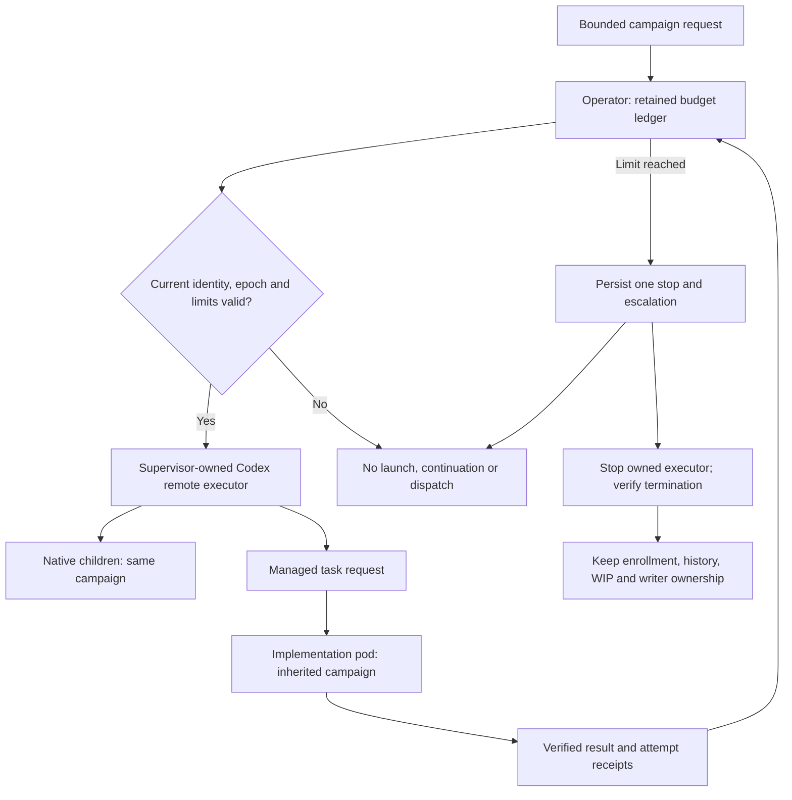

# Task budgets and owned Codex execution

Implementation design under accepted Q-23/D-84. Updated 2026-10-10 UTC.
The budget and owned-executor work are not deployed. This document specifies
the controls and the evidence required to enable them.

The existing synchronous Codex prompt and tool hooks do not cover every model
continuation. Non-user messages and compaction have different paths. The
detached-host supervisor also owns only the short startup command; waiting for
that command does not prove the daemon or its children stopped. Neither path
alone implements the accepted task-budget requirement.

## The first test

The pilot assigns one logical, bounded coordinator campaign to each remote
host. Every conversation and native child on that host consumes that campaign's
budget. Managed implementation tasks also inherit the campaign identity. A
second unrelated campaign requires another host; the pilot must not silently
terminate unrelated work to stop one task.

This is a pilot restriction, not a replacement for eventual independent task
budgets. It lets the supervisor stop the entire owned native executor when the
campaign's authority is latched. The shared project and private host home remain.
The ordinary idle host-upgrade path is separate and continues to wait for idle.



## Retained authority

The operator stores each logical task's ledger in a protected ConfigMap.
The resource has no session/pod owner reference and no automatic deletion path.
Replacing a pod, resuming a conversation or changing executors does not create
a fresh ledger. Kubernetes resource-version compare-and-swap protects concurrent
updates. An uncertain write is read back before another attempt.

The immutable binding identifies the logical task, authority epoch, absolute
deadline, host and exact pod UID. Session and child identity come from the
authenticated caller and recorded parent, not from an arbitrary supplied name.
The native executor checks the same off-pod authority before startup and while
running. Missing, stale or contradictory authority blocks admission.

RBAC cannot restrict dynamic ConfigMap names by prefix. Runtime wiring needs a
protected namespace/Role or a reviewed admission rule enforcing the budget
resource identity and permitted actor. A name prefix in Go code is insufficient.
No host receives Kubernetes permissions to alter its own ledger.

## What counts toward a limit

Each campaign has a success condition, overall wall-time budget, aggregate
worker-effort budget and next checkpoint. The initial test uses explicit finite
values rather than an unlimited campaign. The accepted stall default remains
60 minutes without evidenced progress, or three failed attempts at the same
unresolved blocker, whichever comes first.

Heartbeats and activity do not move the progress timestamp. A progress update
needs evidence bound to the success condition and an independent verifier.
The first implementation must refuse an unsupported evidence kind rather than
accept a caller's `verified: true` claim. A trustworthy timestamp without a
trustworthy result still does not establish progress.

Failure events carry stable attempt and blocker identities. Changing technique,
agent or pod does not turn the same blocker into a new one. Retried delivery of
the same event is idempotent. A resolved blocker retains its failure history.
Child effort is summed, including concurrent children; parent wall time alone
does not account for parallel consumption. Unavailable provider token counts
remain visibly unavailable and do not disable time or attempt limits.

The overall budget and checkpoint prevent frequent intermediate results from
extending work forever. Extensions require a verified owner decision, a reason
and a bounded next result. They advance authority without erasing history.

## A stop must be real

Persist the stop latch before requesting executor cancellation. The latch blocks
new task creation, resume, continuation and child dispatch. Admission failures
must remain terminal until the recorded authority permits another bounded step.

Pinned Codex 0.160.1 supports a foreground managed remote app-server. The proposed
executor owns that long-lived process instead of using detached startup:

```text
codex app-server --remote-control --managed-daemon --listen unix:///PRIVATE/socket
```

Use a dedicated Linux helper with child-subreaper ownership and exact process
identities. A child that changes its process session or double-forks must still
remain in the helper's owned tree. Process-group signals alone are insufficient.
Freeze, terminate and reap the bounded owned tree; retain the actual process
exit/absence evidence. Preserve the native managed snapshot, private enrollment
and conversation state. No Codex fork or invented reload RPC is required.

Launch and stop intent are durable before side effects. A receipt progresses
through `Attempting`, `Confirmed`, `Stopping` and `Stopped`. Unknown identity,
timeouts, interrupted operations and uncertain descendants retain a review
state. A missing pod, stale heartbeat or stopped root PID is not a successful
tree-stop receipt. No automatic restart or writer transfer follows uncertainty.
The default command stays disabled until an authority adapter is wired.

Managed task stop/rescue remains subject to its existing exact-owner guards.
Stopping a coordinator does not by itself prove a separate task pod stopped.
Each writer needs its own verified stop and rescue before another writer enters
that task. Shared project roots are never removed by budget cleanup.

## One owner question

Keep one pending escalation per campaign with the blocker, accumulated effort,
attempts, evidence and recommended bounded alternative. It is an operational
help request, not a privileged-access grant.

The phone adapter must present one native actionable question through the direct
parent and durably bind its answer to this campaign and epoch. Emitting an async
question is not proof of phone delivery. Operator polling, a GitHub record or a
parent model repeatedly waking to check for an answer cannot satisfy this gate.
The adapter must not restart the stopped investigation to deliver the question.

Until verified native delivery and answer provenance exist, owner extensions
remain refused and the stopped campaign stays recoverable. Pairing and an actual
phone question/answer are morning owner acceptance steps. The ledger and process
tests alone do not close this requirement.

## Evidence before enablement

Use fake clocks for stall, checkpoint, overall budget and combined child effort.
Prove three failures across replacement agents produce one sticky escalation.
Prove concurrent updates, duplicate events, uncertain writes and operator restart
preserve history. Reject unverified progress, self-approved extension and stale
task/pod/epoch identities.

Use a finite process fixture with a live executor, a new-session child and an
orphaned child. Prove stop/reaping, PID reuse refusal, timeout handling and private
home preservation. Then test the real pinned foreground runtime with access-only
authentication and retained enrollment. A fake process result does not prove
native resume, refresh adoption or remote transport behavior.

Only after those checks pass may the GitOps pilot enable the owned route. Run a
bounded real managed task, exercise a budget stop and verify WIP, executor and
writer state. Complete the two-host pairing and phone round trip with the owner.
Keep v1, the keeper refresh owner and the existing shelf intact throughout.

No CPU burners, stress tools or wide/repeated test loops on shared nodes.
Use fake clocks, low parallelism under `nice -n 19`, one suite at a time and CPU
limits on every cluster fixture container. Images build and sign in hosted CI.

References: [accepted budget contract](../requirements/2026-10-09-task-budgets.md),
[issue #154](https://github.com/thaynes43/dev-env/issues/154),
[two-host workflow](../../../../docs/codex-coordinator-hosts.md), and
[official Codex app-server protocol](https://learn.chatgpt.com/docs/app-server).
