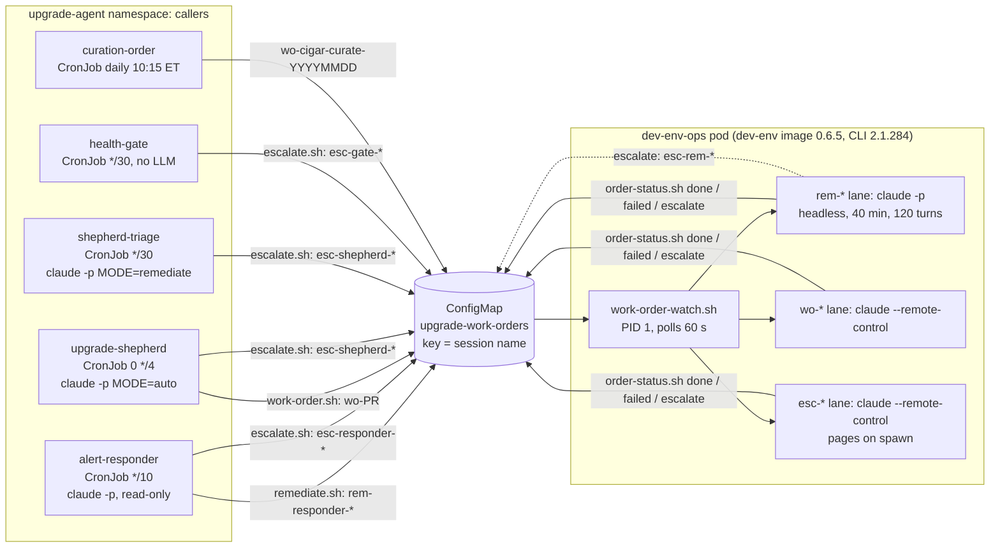

# R-01: Summoned agents, how they work today and what v2 must keep

**Date:** 2026-10-05 (data window 2026-09-05 to 2026-10-05, UTC).
**Scope:** every path where an automated caller in haynes-ops hands work to a Claude
Code session that bills the Max plan instead of the metered API: the upgrade shepherd,
its triage job, the alert responder, the health gate, and the `dev-env-ops` executor
that runs the sessions. Vexa scribe-notes is checked for API spend only.
**Method:** read-only. Loki (`{namespace="upgrade-agent"}`, 30-day limit), Prometheus,
the `upgrade-work-orders` ConfigMap, the executor's PVC (session transcripts and
records, read with `kubectl exec`), GitHub PRs and issues, and the haynes-ops source
under `kubernetes/main/apps/upgrade-agent/`. Queries are in the appendix.
**Limits:** Loki keeps 30 days; executor transcripts go back to 2026-09-03; finished
work orders leave the ConfigMap 14 days after they are digested.

## Verdict

1. The money goal works. Every LLM run in the window was served by the Max plan: 35
   responder diagnoses, 20 shepherd and triage runs, and 56 executor sessions (57 with
   `wo-2757`, started 2026-09-03, just before the window). Metered
   spend on these paths has been $0 since July 2026.
2. The headless lanes are reliable. Remediation (`rem-*`) closed 12 of 12 orders on
   its own in 4 to 15 minutes, and the daily cigar curation closed 33 of 33.
3. The interactive promise is broken. No `wo-*` or `esc-*` session has registered
   with Remote Control since at least 2026-09-03 (45 of 45 rejected), so 11
   escalation pages pointed Tom at sessions that were not on his phone.
4. The executor is fragile around restarts and lanes. It restarted 18 times in 30
   days, lost 2 sessions that way, and lane pinning held work 1 to 3.4 days late
   (and two escalations 11 to 12 hours, unpaged) until fixes on 2026-09-19.
5. The upgrade hand-off it was built for (saga-07 Option B) ran once since
   2026-09-03 and failed: its session never answered. The shepherd filed no other
   work order. The executor's real workload is curation, remediation and
   escalation diagnosis.

## 1. Architecture as it really runs

There are two patterns, and both are live.

- **Option A, in-pod plan auth** (saga dev-env backlog 07, 2026-07-13). The shepherd,
  triage and the responder run `claude -p` inside their own contained CronJob pods.
  They authenticate with `CLAUDE_CODE_OAUTH_TOKEN` and keep `ANTHROPIC_API_KEY`
  stashed as a metered fallback.
- **Option B, the executor** (backlog 13, 2026-08-20). Callers write an order into
  the ConfigMap `upgrade-work-orders`. The `dev-env-ops` Deployment polls it every
  60 seconds and runs each order as a Claude Code session in a tmux window.



### Callers

| Caller | Trigger | Summons | Lane and mode |
|---|---|---|---|
| alert-responder | critical alert, diagnosis `ACTION: urgent` and still firing | `remediate.sh` files `rem-responder-<sig8>` | rem, headless, silent |
| alert-responder | its own diagnosis died (rc not 0, no report) | `escalate.sh` files `esc-responder-<sig8>` | esc, interactive, pages |
| alert-responder `rem_watchdog` | rem order pending 20 min or claimed 120 min | marks it failed and escalates | esc |
| upgrade-shepherd (auto) | a consequential bump: embedded image moves, majors, supporting edits | `work-order.sh <PR> <class>` files `wo-<PR>` | wo, interactive, quiet on success |
| upgrade-shepherd (auto) | terminal BREAK-GLASS, HOLD, rc not 0, or a DEFER streak of 450 min | `escalate.sh` | esc |
| shepherd-triage | remediate run produced no fix | `escalate.sh` keyed on the regression signature | esc |
| health-gate | the same signature re-paged after 6 h | `escalate.sh` | esc |
| curation CronJob | daily | `wo-cigar-curate-YYYYMMDD`, class `curation`, model `opus` alias (owner-approved) | wo |
| a session | remediation cannot fix it | `order-status.sh <key> escalate` files `esc-rem-<sig8>` | esc |

### Transport

The queue is one ConfigMap. Keys are session names, values are single-encoded JSON:
`{class, source, reason, diagnosis?, alert?, sig?, model?, effort?, status, created,
updated, note?, digested?, reaped?}`. Status flows `pending`, `claimed`, then `done`,
`failed` or `escalated`; `working` is a heartbeat. There is no API, no
acknowledgement and no authentication of the writer: the shepherd and responder Roles
may create and patch any ConfigMap in the namespace. The session prompt frames every
order field as data to verify, never as instructions, and that framing is the only
defence against a forged order.

The watcher keeps one session per lane (single-flight), spawns esc first, then wo, then
rem, and enforces the key taxonomy (`wo-`, `esc-`, `rem-`; anything else is failed).

### Credentials per hop

| Hop | Credential |
|---|---|
| Caller pods to the Anthropic API | `CLAUDE_CODE_OAUTH_TOKEN`, a `claude setup-token` from 1Password item `claude-code` (Secret `upgrade-shepherd-plan-secret`). Metered fallback: `ANTHROPIC_API_KEY` (`upgrade-shepherd-llm-secret`). |
| Callers to the queue | their own namespace ServiceAccounts (`configmaps` get, list, create, update, patch; the gate is name-scoped get and update) |
| Executor `rem-*` sessions | the same setup token, from the pod env |
| Executor `wo-*` and `esc-*` sessions | the env token is stripped so the session uses `~/.claude/.credentials.json`. On this pod that file is synthesized from the same setup token by `ops-init.sh` (see F-01). |
| Executor to Kubernetes | ServiceAccount `dev-env-ops`, ClusterRole `dev-env-operator` (v1 OPERATOR tier) plus ConfigMaps in `upgrade-agent` |
| Executor to GitHub | `haynes-ops-bot` App token from a sidecar every 40 min: haynes-ops only, contents, pull requests, issues; no workflows; never the 23-repo dev bot |
| Executor egress | shepherd-class Cilium policy: GitHub, Anthropic and Claude endpoints including `bridge.claudeusercontent.com`, Pushover, cigar-journal, in-cluster Prometheus, Alertmanager and Loki. No open web. |

Sessions run with `--dangerously-skip-permissions` inside that boundary.

### Models (live values)

| Path | Model |
|---|---|
| responder, shepherd, triage | `claude-opus-5-5` (8 of 9 shepherd runs in the last 15 days; the 9th predates the 2026-09-23 bump); metered fallback `claude-sonnet-5-5` |
| rem-* | `OPS_REM_MODEL` = `claude-opus-5-5` |
| wo-* (shepherd orders) | `OPS_SESSION_MODEL` = `claude-opus-5-5` |
| wo-cigar-curate | `opus` alias, by Tom's choice (2026-08-29) |
| esc-* | intended `OPS_ESC_MODEL` = `claude-fable-5-1`; in practice the `fable` alias until haynes-ops#3416 (F-02) |
| any lane, pre-flight refused | `OPS_FALLBACK_MODEL` = `claude-opus-5` |

### Where results go

- The order's terminal status and note, in the ConfigMap.
- One `ops-event:` line per decision on the executor's stdout, so in Loki.
- A daily quiet digest of silent outcomes, Pushover priority -1 (31 flushes in 30
  days). Email was refused on purpose: SMTP credentials in an injectable pod would be
  an exfiltration relay.
- Pages (Pushover priority 0): esc spawn, wo/esc `failed`, `session lost`, and the
  responder's own pages.
- GitHub: PRs on `ops/<key>` branches as `haynes-ops-bot` (9 in the window: 3 merged,
  6 closed, two of them relayed through the dev bot as #2975), and issues as
  `haynes-ops-bot` (for example #2797, #2884, #3085 open; #3182, #3287 fixed).
- Curation reports under `~/.local/state/cigar-curation/` and `publish-report.sh`.

## 2. Reliability, 2026-09-05 to 2026-10-05

| Path | Handed off | Completed | Failed or lost | Metered fallback |
|---|---|---|---|---|
| Responder diagnoses (about 4,320 runs, every 10 min) | 35 | 35 reports: 14 paged, 12 handed to rem, 9 suppressed as needing no action | 0 | 0 |
| Shepherd auto runs that reached the LLM | 12 | 12 | 0 | 0 |
| Triage remediate runs | 8 | 8; 6 ended "not an upgrade regression, no fix", each escalated | 0 | 0 |
| rem-* orders | 12 | 9 `done` (fixes on 3 incidents: multus conf on talosw01, a Ceph crash archived, dev-env PVC space freed twice; 5 "nothing to fix") | 0; 3 `escalate`, all correct (two physical device faults, one drill) | 0 |
| esc-* sessions | 11 | 9 `done`, 1 `failed` with a clear human step (merge #3181) | 1 lost to a pod restart | 0 |
| wo-* shepherd orders | 1 (`wo-2757`, filed and started 2026-09-03, two days before the window; counted because it held the lane into it) | 0 | 1: the session never answered, sat `claimed` 3.4 days, lost at a restart; Tom finished it by hand | 0 |
| wo-* curation | 33 | 33 | 0 | 0 |

Other numbers:

- No Job in `upgrade-agent` failed in 30 days (Prometheus `kube_job_status_failed`).
- Session durations: rem 3.7 to 14.7 min, esc 4 to 25 min, curation 4 to 18 min.
- Latency: from 2026-09-03 to 2026-09-19 every curation order ran 1 to 3.4 days late
  (`20260903` claimed 2026-09-06 23:55Z, `20260918` claimed 2026-09-19 14:38Z). Since
  2026-09-20 each runs at 14:15Z, on time. Cause and fix in F-05.
- Escalations: 11 in 30 days. Four added nothing: a duplicate of an open escalation, a
  6-hour repeat of a known outage, a benign sequencing HOLD (fixed by #3287), and a
  drill.
- Quota: one Fable pre-flight refusal (2026-09-13, fell back to Opus 5) and one
  transient `529 Overloaded`. No session hit the plan wall.
- Executor restarts: 18 watcher starts and 13 ReplicaSets in 30 days.

Plan draw by the executor since 2026-09-03 (output tokens, from transcripts):
curation 4.5 M (Opus), escalations 2.5 M on Fable 5.1 plus 0.1 M on Opus 5,
remediation 0.9 M (Opus). Curation is the largest automated consumer of the plan by
far, and escalations are the largest automated consumer of Fable, the pool Tom keeps
for himself.

## 3. API spend

- **Metered spend on the summon paths: $0 in the window.** The spend ConfigMaps still
  read `{"month":"2026-07","spent_usd":"15.8270"}` (shepherd) and
  `{"month":"2026-07","spent_usd":"12.8085"}` (responder); the guard rewrites the month
  on the first metered run of a month, so none has happened since July. Loki has no
  `FALLBACK` line from the responder, shepherd or triage in 30 days, and every run
  logged `spend: $0 this run (served by the Max plan)`.
- **What the plan absorbed:** the shepherd and triage runs report a notional
  `total_cost_usd` of $23.64 for the window. That is the API tax avoided on those
  paths alone. The responder and the executor do not log a cost.
- **Fallback models and caps:** responder `RESPONDER_FALLBACK_MODEL` =
  `claude-sonnet-5-5`, $2 a run, $15 a month; shepherd `FALLBACK_MODEL` =
  `claude-sonnet-5-5`, $5 a run, $50 a month. Both fall back only on a rate-limit or
  auth failure.
- **The executor has no metered path in practice.** `ANTHROPIC_API_KEY` is in its pod
  env, but `session-launch.sh` unsets it whenever the plan token is present. If the
  plan Secret were missing, `rem-*` sessions would bill the key with no spend guard and
  no record (F-10).
- **Vexa scribe-notes:** 5 summaries in the window, 4 on the plan and 1 metered
  fallback (2026-09-17 01:34Z, `claude-sonnet-5`, after the Fable plan path failed).
  Its default plan model is Fable 5.1.

## 4. Defects and silent failures

| ID | Finding | Status |
|---|---|---|
| F-01 | **Remote Control never registers for wo-*/esc-*.** All 45 interactive transcripts since 2026-09-03 contain `Remote Control disconnected — Claude.ai login was rejected`. None of the 25 session records has a `bridgeSessionId` (every live `--remote-control` session in the v1 dev-env pod has one). The pod's `.credentials.json` is synthesized from the setup token, which lacks the `user:sessions:claude_code` scope a `/login` credential carries. The esc page says "Join: Remote Control 'esc-…'", which has been a dead handle. | Filed haynes-ops#3414 (decision: honest pages now, or a second monthly login, or wait for v2) |
| F-02 | **Escalations ran on the `fable` alias.** `escalate.sh` wrote `model:"fable"` into each order, which overrides the lane default, so the pinned `OPS_ESC_MODEL` never applied (10 of 11 spawns). | Fixed in haynes-ops#3416 |
| F-03 | **Every config merge kills in-flight sessions.** Reloader rolls the pod when its scripts, the shared `upgrade-coordination-lib` ConfigMap or its Secrets change. Lost: `wo-2757` (2026-09-06, #2771) and `esc-shepherd-73c8c97a` (2026-09-13, #2905, 1 h 40 min after Tom was paged). | Filed haynes-ops#3415 |
| F-04 | **A busy esc lane queues escalations without paging.** The page fires on spawn. On 2026-09-13 two escalations waited 11 and 12 hours behind a finished window. #2974 fixed the finished-window case; a session that never reports still pins the lane with no bound. | Filed haynes-ops#3415 |
| F-05 | **The wo lane was pinned for 16 days.** A finished window held its lane for the 24 h reap TTL, and the mute `wo-2757` session held it 3.4 days with no watchdog. Its pre-flight probe failed and its fallback was the same id as its primary (`claude-opus-5` for both until 2026-09-23), so the watcher launched it anyway and it never produced a reply: its transcript holds one synthetic message and nothing else. | Fixed before this audit: #2974 and #2978 (2026-09-19), and a fallback distinct from the primary since 2026-09-23 |
| F-06 | **The executor's login probe is blind to F-01.** It runs `claude -p 'ok'`, which needs only inference; it logged `login probe ok` 40 times in the window. | In haynes-ops#3414 |
| F-07 | **One setup token carries every automated path** (shepherd, triage, responder, all executor lanes, scribe-notes). Nothing records its mint date or warns before its roughly one-year life ends (around 2027-07). When it dies, the shepherd and responder quietly move to the metered key, and the only alarm is the executor's probe, whose page names the wrong file. | Noted in the haynes-ops remediation runbook (#3416); v2 requirement V-12 |
| F-08 | **A re-fired signature reuses its rem key** and overwrites the finished entry (`rem-responder-b7baaf6c` on 09-25 and 09-26; `rem-responder-ff1db1ab` for the 09-12 drill and the 09-23 real crash). An outcome not yet digested is lost from the digest. | Noted |
| F-09 | **Escalation noise.** 4 of 11 escalations added nothing, and 6 of 8 triage remediate runs ended "not an upgrade regression", each becoming an escalation page. #3287 (DEFER verdict) and #3218 (stable signatures) address two causes. | Noted |
| F-10 | **The rem lane would bill the API key silently** if the plan Secret were missing: no spend guard, no cost record. It has not happened. | Noted; v2 requirement V-05 |
| F-11 | **The queue does not authenticate writers.** Any pod with the shepherd or responder Role can file any `wo-`/`esc-`/`rem-` order with any reason and model, and the session runs it with operator verbs. | Noted; v2 requirement V-01 |

The monthly Max login lapse (about 30 days after each `/login`) does not touch these
paths: nothing here uses a `/login` credential. That is also why F-01 happens.

## 5. What v2 must offer these callers

These are requirements for the operator API in DESIGN-001 section 3.4, numbered so
the design can cite them. Each comes from something above.

| ID | Requirement | Why |
|---|---|---|
| V-01 | **Per-caller authorization, not just authentication.** A caller is a ServiceAccount in another namespace (`upgrade-agent`: alert-responder, upgrade-shepherd, upgrade-health-gate, the curation CronJob). GitOps policy says, per caller: which session kinds, which profile, which name prefixes, which models, how many at once. No summoning caller may create a `full`-profile session or touch grants. The operator records the caller as the session's `parent`. | D-05 gives every authenticated caller the same API. Today's callers read attacker-influenced text (release notes, alert annotations), and F-11. |
| V-02 | **Two session kinds.** `task` (headless, a prompt, wall-clock timeout and turn cap per kind, today 40 min and 120 turns for remediation, never on Tom's Remote Control list) and `remote` (interactive, registered under the caller's name, joinable from the phone, quiet on success). | rem vs wo/esc, Tom's rule that only sessions that want him appear on his list. |
| V-03 | **Caller-chosen names with the lane prefix** (`wo-`, `esc-`, `rem-`) as the Remote Control name, plus an **idempotency key** (the signature): a create for a key whose session is not finished returns the existing session. | The taxonomy (Tom's requirement, so the phone list sorts) and the dedup in `escalate.sh`/`remediate.sh`; F-08. |
| V-04 | **A model pin per session, full ids only**, defaulted per caller from GitOps; a pre-flight probe and a fallback that is a different model; the effort level. | F-02, F-05 (`wo-2757`'s fallback was the same id as its primary). |
| V-05 | **Plan credentials only, and fail loudly without them.** Task sessions use the static token (6.1). Remote sessions need the keeper's `/login` credential (6.2). A session must never fall back to a metered key; if no plan credential works, the create fails and the caller pages. | The whole point of this path; F-01, F-10. |
| V-06 | **A verified join handle.** `status.remoteControl.url` is set only after registration succeeds, and the caller's page carries that URL. If registration fails, the session is marked so and the page says how to attach instead. | F-01 and F-06: 11 pages pointed at nothing. |
| V-07 | **An `ops` profile**: the haynes-ops ops bot (one repo, no workflows), the operator verbs the executor has today, the cigar-journal MCP token for curation, and a narrow egress tier with no open web. | Saga-07's containment boundary. D-18 has `full` and `dev`; D-24 gives every profile the web tier, which would hand prompt-injected sessions an exfiltration path. |
| V-08 | **Result reporting.** Status `pending`, `running`, `done`, `failed`, `escalated`, a `working` heartbeat, and a free-text note the session sets, readable with `GET /v1/sessions/{id}`; events to Loki; a quiet daily digest of silent outcomes. **Guaranteed outcome:** if the agent exits, times out or hangs without reporting, the operator closes the session (`failed`, or escalated for remediation) instead of leaving it open. | `order-status.sh`, the lane release (#2974), the rem guaranteed outcome. |
| V-09 | **Lanes.** At most one running session per lane per caller class (one remediation actuator on the cluster at a time; one upgrade at a time), escalations first. A queued escalation is never silent: page if it waits more than 15 minutes. | Single-flight design; F-04. D-21's "no fleet cap" is about capacity; lanes are about actuators and stay. |
| V-10 | **Storm limits enforced by the operator**, per caller: max concurrent, max creates per hour, idempotency (V-03). The responder keeps its own collapse, cooldown and page cap. | The 2026-08-20 storm (16 pages in 2.5 h); defence in depth if a caller's guard regresses. |
| V-11 | **Watchdogs owned by the operator:** no heartbeat for N minutes (180 for upgrades) marks the session failed and frees its lane; a vanished pod is reported (`session lost`); escalations idling on a human are exempt. | F-05, `wo_watchdog`, the orphan sweep, `rem_watchdog`. |
| V-12 | **Credential lifecycle in `GET /v1/auth`**, including the static token's mint date and days left, with pages at 30 and 7 days. | F-07. |
| V-13 | **Upgrades and config changes never end a summoned session** (D-03 and 5.1 already say this for operator upgrades; it must hold for template and profile changes too). | F-03. |
| V-14 | **Priority against Tom's interactive work.** One plan pool serves both. Escalation and remediation go first; scheduled bulk work (curation) waits or is refused when `GET /v1/fleet` shows the 5-hour window near its wall, so it never starves Tom's sessions. On a quota wall the operator falls back to another plan model, never to metered. | 7.3 only reports quota; curation is the largest automated draw (4.5 M output tokens a month). |
| V-15 | **Post-mortem retention:** keep a finished session's transcript and window joinable for a day, a failed or escalated one for 7 days, then rescue and reap. | Today's reap TTLs; Tom joins failures after the fact. |
| V-16 | **A notional cost record per session** (the CLI's `total_cost_usd` for task sessions, token counts for remote ones), so the API tax avoided stays measurable. | Section 3: only the shepherd reports it today. |
| V-17 | **Read `Activity`** (declare-activity) before acting, as the remediation contract requires. | Already in DESIGN-001 6.9; listed so the summon path is not built without it. |

## 6. Points for DESIGN-001 (not edited here)

Folded into DESIGN-001 on 2026-10-06: section 3.7 (D-36) with a table of where each
of V-01 to V-17 lands, the `ops` profile in 6.10, quota priority in 7.3, and plan 10
for the executor's migration.

- D-05: add per-caller authorization (V-01). Today "all authenticated callers get the
  same API".
- D-18 and D-24: add an `ops` profile with a narrow egress tier (V-07).
- 3.4 `POST /v1/sessions`: add `name`, `idempotencyKey`, `timeout`, `maxTurns` and a
  caller-set result `note`; `GET` returns the outcome (V-03, V-02, V-08).
- 6.2, spike S-2: this audit is evidence for S-2. On CLI 2.1.284 a setup token placed
  in `.credentials.json` does not register Remote Control ("login was rejected"),
  matching the 2026-08-29 env-var result. S-1 (an access-token-only `/login` file)
  is still open.
- 7.3: quota is reported but not acted on; summoned work needs V-14.
- Section 12: the executor (`dev-env-ops`) is not in the migration phases except as
  an `Activity` reader. Its lanes, watchdogs and digest need a phase, or an explicit
  decision that `dev-env-ops` stays a v1 pod that calls the v2 API.

## Appendix: queries

```logql
# executor events by kind and lane, 30 days
sum by (event, lane) (count_over_time({namespace="upgrade-agent", pod=~"dev-env-ops.*"}
  |= "ops-event:" | regexp "event=(?P<event>\\S+) key=\\S+ lane=(?P<lane>\\S+)" [30d]))

# responder outcomes (run as two 15-day windows; 30 days at once times out)
sum by (m) (count_over_time({namespace="upgrade-agent", app="alert-responder"}
  |~ "summoning|FALLBACK|spend: |HANDED OFF|paged: |PAGE-SUPPRESSED"
  | regexp "(?P<m>summoning|FALLBACK|spend: .{2}|HANDED OFF|paged: |PAGE-SUPPRESSED)" [15d]))

# shepherd and triage auth path
sum by (container, m) (count_over_time({namespace="upgrade-agent", app="upgrade-shepherd"}
  |~ "MODE=|FALLBACK|spend: " | regexp "(?P<m>MODE=[a-z]+ auth=[a-z]+|FALLBACK|spend: .{2})" [15d]))

# notional cost absorbed by the plan
sum by (app) (sum_over_time({namespace="upgrade-agent", app="upgrade-shepherd"}
  |= "total_cost_usd" | regexp "\"total_cost_usd\":(?P<c>[0-9.]+)" | unwrap c [15d]))
```

```bash
# Remote Control registration in the executor (read-only)
kubectl -n upgrade-agent exec deploy/dev-env-ops -c app -- bash -c \
  'cd ~/.claude/projects/-home-dev && grep -l "Claude.ai login was rejected" *.jsonl | wc -l'
kubectl -n upgrade-agent exec deploy/dev-env-ops -c app -- bash -c \
  'grep -L bridgeSessionId ~/.claude/sessions/*.json | wc -l'
```
