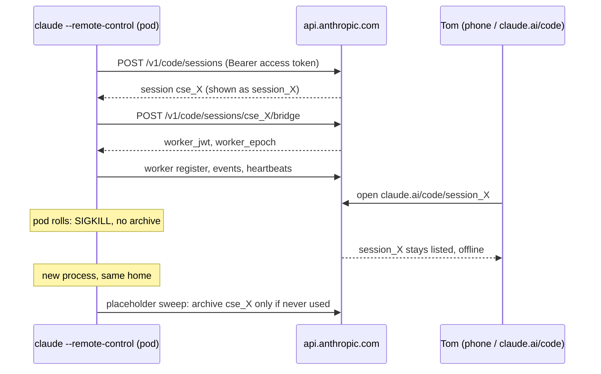
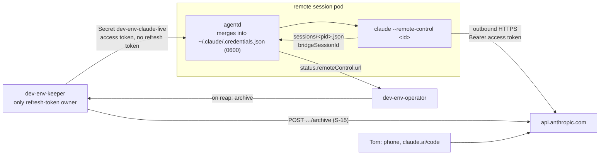

# R-02: Remote Control identity, and what per-session pods change

- **Status:** research, 2026-10-06. Findings for [DESIGN-001](../designs/001-dev-env-v2.md)
  sections [6.2](../designs/001-dev-env-v2.md#62-claude-max-login-and-its-monthly-renewal)
  and [6.7](../designs/001-dev-env-v2.md#67-remote-control-and-phone-sessions), and for
  spikes S-1, S-2 and S-6 in [backlog 00](../backlog/00-spikes.md). Nothing here is a
  decision. Section 8 lists the edits it proposes for the design and the spikes.
- **Evidence from:** the v1 pod (claude-code 2.1.284, codex 0.160.0), read-only. Key
  names only, never values. Docs fetched from code.claude.com on 2026-10-06.

## The question

Tom, 2026-10-05: "We may also be in big trouble for authentication remote control
sessions. I'm presented a link for this pod but it seems to survive restarts so it
may be IP tied and something we just need baked into the front end."

## Short answer

1. **Nothing in Claude Code Remote Control is tied to an IP address or a hostname.** A
   Remote Control session is bound to the claude.ai account and organization of the
   `/login` credential. The pod's hostname only shows up where no name is given, and
   agent-run always gives one.
2. **What survives a restart** is the login (`.credentials.json` on the PVC), the
   CLI's local pointers to its sessions (also on the PVC), and the server-side session
   entries, which belong to the account. The one thing that is named after a pod and
   survives restarts is the **Codex** phone entry `dev-env-574bdc9844-jhvfs`. Its
   enrolment row lives on the PVC.
3. **The Claude link** is a per-session URL, `https://claude.ai/code/session_<id>`.
   Every new session gets a new one. After a pod roll the old link still opens,
   because the transcript is stored server-side, but the session shows as offline.
4. **Many pods can each run Remote Control on the same Max account.** v1 already runs
   14 concurrent `--remote-control` processes on one login. The server does not care
   which machine they run on. The only real constraint is the one the design already
   names: one owner for the rotating refresh token.
5. **Offline entries pile up.** A session that dies without being archived stays in
   Tom's list, labelled offline. The CLI cleans up only entries that were never used,
   and only from the same home directory. v2 needs the operator to archive the entry
   when it reaps a session.
6. **Nothing needs to be baked into a front end for auth.** The front end should show
   each session's link and state and offer an archive button. The monthly `/login`
   ceremony could move to a page behind Authentik, but that is a convenience.

## 1. Which link Tom sees

Four candidates, checked against the v1 pod:

| Candidate | Where it comes from | Survives a pod restart? |
|---|---|---|
| Claude session URL `https://claude.ai/code/session_<id>` | `claude --remote-control <name>` prints it into the pane. post-ready scrapes it from the pane and logs it in `/tmp/post-ready.log` (`SUMMARY … url=…`). The Claude app and claude.ai/code list the session by name. | No. Each session, standby included, gets a new id and URL. An old URL still opens the stored transcript, marked offline. |
| Codex computer `dev-env-574bdc9844-jhvfs` in the ChatGPT app | `~/.codex/state_5.sqlite`, table `remote_control_enrollments` (columns `websocket_url`, `account_id`, `app_server_client_name`, `server_id`, `environment_id`, `server_name`, `updated_at`, `remote_control_enabled`). One row; `server_name` is the hostname at first enrolment. | **Yes.** post-ready reuses the row at every boot, so the phone keeps showing the first pod's name. haynes-ops CLAUDE.md already notes this. |
| code-server `https://dev-env.haynesops.com` | The `dev-env` IngressRoute: LAN-only (`traefik-internal`) behind Authentik forward-auth, routed to Service `dev-env:8443`. Also the homepage "Dev Env" tile. | Yes, through DNS and the Service, not an IP. It has nothing to do with Remote Control: the IngressRoute's own comment says remote interaction is `/remote-control`. |
| A claude.ai "environment" named after a pod | `claude remote-control` (server mode) registers an environment with `machine_name` set to the hostname. v1 used server mode in July (`~/work/*-0720-*.rc.log`, `bridge-pointer.json` files); agent-run has used the in-session `--remote-control` flag since. | The server keeps the July environment records, but nothing in v1 uses them now. |

"A link for this pod that survives restarts" fits the Codex entry best: it is named
after a pod that no longer exists and still works. Only Tom can say which one he
meant. That is the open question in section 9 (Q-11 once asked).

## 2. What a Remote Control registration is bound to

### 2.1 Two registration paths

| | `claude --remote-control <name>` (what agent-run `--interactive` and the standby run) | `claude remote-control` (server mode; v1 used it in July) |
|---|---|---|
| Server calls | `POST /v1/code/sessions` with `title`, `bridge: {}`, `config` (`cwd`, `model`, git `sources`/`outcomes`). Then `POST /v1/code/sessions/{id}/bridge` with an empty body returns `worker_jwt`, `expires_in`, `api_base_url`, `worker_epoch`. Headers: `Authorization`, `anthropic-version`, `anthropic-client-platform`, `User-Agent`, and `X-Trusted-Device-Token` only when enrolled. | `POST /v1/environments/bridge` with `machine_name`, `machine_id`, `directory`, `branch`, `git_repo_url`, `max_sessions`, `metadata.worker_type` and, when reusing, `environment_id`. It returns `environment_id`, `environment_secret`, then polls `/v1/environments/{id}/work/poll`. |
| Auth | The OAuth access token as `Bearer`. The worker JWT is short-lived and re-minted with the OAuth token. | The same, plus the environment secret. |
| Machine identity sent | **None.** No hostname, no IP, no machine id. | `machine_name` = hostname. `machine_id` = `remoteControlMachineId` from `.claude.json`, a random id the CLI creates once per home directory. |
| Name | The name argument. Without one, `<prefix>-<words>`, where the prefix defaults to the hostname (`--remote-control-session-name-prefix`, `CLAUDE_REMOTE_CONTROL_SESSION_NAME_PREFIX`). | `--name`, or the same prefix rule. |

Evidence that today's sessions use the first path: the session keys in
`.claude.json` → `replBridgePlaceholders` are all `cse_…` code-session ids, and each
running session's record carries `bridgeSessionId` = `session_…`. Neither the v1
`.claude.json` nor `.credentials.json` holds a `remoteControlMachineId`. The request
bodies are read from the 2.1.284 binary (`strings`), so S-1 should confirm them with
`--debug-file`.

### 2.2 Eligibility: what the CLI checks before it registers

From the docs ([Remote Control, requirements and troubleshooting](https://code.claude.com/docs/en/remote-control#troubleshooting))
and the matching checks in the binary:

- A claude.ai subscription login (Pro, Max, Team, Enterprise). API keys,
  `ANTHROPIC_AUTH_TOKEN` and gateways are refused.
- **A full-scope token.** The CLI checks that the stored token's `scopes` include
  `user:profile`. Long-lived tokens from `claude setup-token` or
  `CLAUDE_CODE_OAUTH_TOKEN` "are limited to inference-only" and are refused
  (`token_scope_limited`). The v1 login's scopes are `user:file_upload
  user:inference user:mcp_servers user:plugins user:profile user:sessions:claude_code`.
- An organization uuid, read from `.claude.json` → `oauthAccount.organizationUuid`
  (a cached profile, not the credentials file).
- Feature flags and the org policy, fetched from the network. With
  `CLAUDE_CODE_DISABLE_NONESSENTIAL_TRAFFIC` or `DISABLE_GROWTHBOOK` set, Remote
  Control is off. With only `DISABLE_TELEMETRY` or `DO_NOT_TRACK` set, the CLI uses a
  fallback check that also requires a `refreshToken` in the stored credential. v1 sets
  none of these, and v2 must not either (section 7, P-2).
- Trusted Devices, only if Tom turns it on (section 5.3).

### 2.3 Local state, and why it survives a restart

Everything below lives under `CLAUDE_CONFIG_DIR=/home/dev/.claude`, which is on the
v1 PVC:

| File and key | What it is | Effect of the PVC |
|---|---|---|
| `.credentials.json` → `claudeAiOauth` (`accessToken`, `refreshToken`, `expiresAt`, `refreshTokenExpiresAt`, `scopes`, `subscriptionType`, `rateLimitTier`) | The Max login. The access token lasts about 8 hours; the refresh token lapses about 30 days after `/login`. The same file also holds `mcpOAuth` entries for claude.ai connectors, which the CLI writes. | After a restart the pod is still logged in as the same account, so new sessions land in the same list. |
| `.claude.json` → `oauthAccount` (`accountUuid`, `organizationUuid` and profile fields) | The account and org the CLI checks. | Same account after a restart. |
| `.claude.json` → `replBridgePlaceholders` (`cse_…` → `pid`, `procStart`, `createdAt`) | Which local process owns which remote session. At most 20 records. | After a restart the old pids are dead. The next Remote Control start sweeps them (section 4). |
| `.claude.json` → `machineID`, `userID` | Random 32-byte ids, created once per home. Used for telemetry, not for Remote Control. | Stable across restarts, new with a new home. |
| `sessions/<pid>.json` → `bridgeSessionId`, `name`, `status`, `pidDomain` | The local session registry behind ListAgents. `pidDomain` is the pid-namespace id. | 73 records in v1 today, 59 with dead pids, left by restarts. Records from an old pid namespace are foreign to the new pod. |
| The conversation transcript `projects/<cwd-key>/<id>.jsonl`, entries of type `bridge-session` (`bridgeSessionId`, `lastSequenceNum`, `ownerAccountUuid`, `ownerOrganizationUuid`) | The reattach pointer. `claude --resume` reconnects to the session recorded here if the signed-in account and org match. If they do not match, the CLI starts a fresh entry instead. | `--resume` after a restart reattaches the same phone entry. |

So the answer to "why does it survive restarts" is: the account lives on the PVC
and the session entries live at Anthropic, keyed by account. No IP is involved.

### 2.4 What changes if hostname, IP or home differ per pod

| Changes per pod | Effect on `claude --remote-control <name>` | Effect elsewhere |
|---|---|---|
| IP | None. Traffic is outbound HTTPS only. | None. |
| Hostname | None while a name is passed. | Unnamed sessions take the hostname as their name prefix. Server mode sends it as `machine_name`. A trusted-device enrolment is named `Claude Code on <hostname> · linux`. The Codex `server_name` is fixed at enrolment. |
| Home directory | Needs its own credential (the hard part, section 5) and a seeded `.claude.json` (`oauthAccount`, workspace trust). Without them: "requires a claude.ai subscription", or "Unable to determine your organization". | New `machineID`. A new `remoteControlMachineId` if server mode is used. The placeholder sweep no longer covers sessions from other pods. Flag and policy caches start cold, so the first start needs the network. |

## 3. How this compares with Codex

Codex phone control is one daemon per machine (`codex app-server --remote-control`).
Its enrolment is the sqlite row in section 1, keyed by `account_id` and the client
name, with `server_name` frozen at first enrolment. That is why the ChatGPT app shows
a pod that no longer exists. DESIGN-001 keeps the daemon in one long-lived codex hub
whose volume holds the enrolment, so the phone keeps one stable entry. If that volume
is ever lost, the next enrolment is named after the hub pod's hostname, which is why
P-12 gives the hub a fixed hostname.

## 4. Offline entries: how they appear and what removes them

- Every `--remote-control` process creates one server-side session. The docs say each
  interactive process registers its own remote session. The docs give no account-wide
  cap; only server mode has a per-process `--capacity`, which defaults to 32.
- When the process stops, by `/exit` or a pod roll, the session goes **offline**, not
  away. ListAgents and `/list-agents` list the account's Remote Control sessions on
  other machines, labelled `Remote Control`, with `offline` when the connection has
  dropped. That is the stack of "Remote Control · offline" entries the coordinator sees.
- The CLI archives an entry only in these cases:
  - An org policy turns Remote Control off.
  - A reconnect after compaction or `/resume` replaces the entry.
  - The placeholder sweep finds an entry that was **never used** (its `created_at`
    equals its `updated_at`) and whose owning pid is dead. The sweep runs about 15 s
    after a Remote Control start, and only over the `replBridgePlaceholders` of the
    same home.

  Used sessions are only dropped from the local map and stay listed on the server.
- A message sent to an offline session is queued and arrives only if that session
  reconnects (docs, cross-session messaging). Messages to reaped sessions would queue
  forever.
- The CLI archives with `POST /v1/code/sessions/{id}/archive` (Bearer access token;
  200 or 409 counts as done). This endpoint is **undocumented**. The documented way is
  to archive from claude.ai/code or the app. An archived entry can come back: `/remote-control`
  "reopens an archived session", and `claude remote-control --continue` or
  `--session-id` unarchive one (docs, v2.1.228 and later).

## 5. Many pods, one Max account

### 5.1 Verdict

The server side is fine. Remote Control sessions are per account, and nothing ties
them to one machine. v1 runs 14 at once from one pod today. The risk is entirely on
the client side, in the rotating refresh token:

- Each pod needs a valid **full-scope access token** for as long as it serves Remote
  Control, to create the session and re-mint worker JWTs. Access tokens last about
  8 hours, so something has to refresh them.
- Giving each pod a copy of `.credentials.json` with the refresh token repeats the
  2026-08-29 revocation: one pod rotates, another replays the old refresh token, and
  the server revokes the whole family. The CLI's own guard ("another Claude Code
  process is refreshing it", docs [errors](https://code.claude.com/docs/en/errors))
  only works between processes that share one file and one pid namespace.
- **S-2 is settled by the docs:** the static token cannot register Remote Control
  ("Remote Control requires a full-scope login token"). The 2.1.284 binary has the
  same check.

### 5.2 Evidence that bears on S-1 (keeper-owned refresh, access token only in pods)

*S-1 ran on 2026-10-06 (DESIGN-001 6.2). Counts 1 and 2 held. Count 3 did not: the 401
wait polls only for a rotated env or file-descriptor token, so it does nothing for a
credentials file. The previous access token is revoked at each refresh.*

The binary supports the D-11 target on three counts:

1. **It re-reads the credentials file when its mtime changes.** The credential cache
   tracks `lastCredentialsMtimeMs` and emits `credentialsChangedOnDisk`. There is also
   an "auth-revive watcher" that re-enables Remote Control when "a fresh same-account
   credential" appears. So a keeper that rewrites the file should be picked up
   without a restart (S-1 question 2).
2. **Env-token variant, S-1b.** With `CLAUDE_CODE_OAUTH_TOKEN` set, the CLI builds its
   credential as `{accessToken, refreshToken: null, expiresAt: null, scopes}`, with
   `scopes` taken from `CLAUDE_CODE_OAUTH_SCOPES` when that is set, and
   `["user:inference"]` otherwise. Passing the keeper's full-scope access token with
   the login's scopes therefore looks full-scope to the client-side check, and there
   is nothing to rotate. Other checks may also want `CLAUDE_CODE_SUBSCRIPTION_TYPE`
   (the CLI reads it on this path). One catch: an env var cannot change inside a
   running process, so a session would lose Remote Control after about 8 hours unless
   it restarts. That makes S-1b a fallback; the file variant comes first.
3. **`CLAUDE_CODE_OAUTH_401_WAIT_MS`** makes the CLI wait on a 401 before acting. It
   defaults to 0, or 60 s inside Anthropic's own runners. It may cover the gap
   between a keeper rotation and the pod seeing the new file.

Things S-1 must check that the design does not mention yet:

- **Do not mount the Secret as the credentials file.** The CLI writes
  `.credentials.json` itself: `mcpOAuth` connector tokens, atomic temp-file writes
  (`.credentials.json.tmp.*` files exist in v1). A read-only, symlinked Secret mount
  would break those writes. agentd should own a writable 0600 file and merge only
  `claudeAiOauth.{accessToken, expiresAt, scopes, subscriptionType, rateLimitTier}`
  into it from the keeper's Secret.
- **Is the old access token still valid after the keeper refreshes?** If a refresh
  revokes the previous access token, every pod gets 401s until agentd syncs. Measure
  that window, and whether the 401 wait covers it.
- **Cold home.** Run S-1 with an empty config dir, as a v2 pod will have: no cached
  flags, no policy cache, no `oauthAccount`. Check that the CLI fetches what it needs
  through the v2 egress tiers.
- The undocumented `CLAUDE_CODE_HOST_CREDS_FILE` hook does **not** look useful here.
  It supplies env vars (by default `ANTHROPIC_AUTH_TOKEN`) from a host process that
  must be alive in the same pid namespace, and Remote Control refuses that kind of
  auth.

### 5.3 Trusted Devices: keep it off

Trusted Devices is in beta. It is off by default on Max, and Tom would have to turn
it on himself (docs, [Trusted Devices](https://code.claude.com/docs/en/remote-control#trusted-devices)).
It is off today: the credentials file has no `trustedDeviceToken`. If Tom turned it
on, v2 would degrade:

- Each pod enrols itself as a separate device named `Claude Code on <hostname> ·
  linux`, through `POST /api/auth/trusted_devices`. Tom gets an email for every
  enrolment, and the device list grows by one per session.
- The docs tie enrolment to a recent sign-in, and list a re-check once a sign-in is
  more than 18 hours old ("session expired for trusted-device check … run `/login` in
  Claude Code"). A headless pod on a keeper-held login renewed monthly can answer
  neither.
- Projects cannot run a thread on Tom's computers while it is on.

The CLI honours a `CLAUDE_TRUSTED_DEVICE_TOKEN` env var and skips enrolment when it is
set, so a keeper could enrol once and hand the token out. That path is untested and
not needed while the setting stays off.

### 5.4 Self-hosted environments: not available to this account

Anthropic's self-hosted environments run claude.ai cloud sessions on your own
runners. A runner locks to one owner and uses a session-scoped OAuth token, with an
autoscaling orchestrator for Kubernetes. That is close to v2's shape, but it is
"public beta on Team and Enterprise plans" only
([docs](https://code.claude.com/docs/en/self-hosted-environments)). Tom is on Max.
It would also replace Remote Control with cloud sessions. Worth a look only if the
plan ever changes.

## 6. Risks for v2

| Risk | Effect | Mitigation |
|---|---|---|
| A refresh token reaches more than one pod | The 2026-08-29 revocation: every Remote Control session drops mid-task until Tom runs `/login` | D-11, the keeper as sole owner. S-1 proves the access-token-only pod. |
| S-1 fails | Remote Control cannot run in per-session pods | The coordinator host fallback (6.2). Identity does not force it, only the refresh token. |
| Keeper rotation invalidates live access tokens | 401 bursts in every remote pod after each rotation | The S-1 measurement, the 401 wait, and agentd syncing the file within seconds |
| A Secret mounted read-only as the credentials file | Connector OAuth writes fail, and possibly worse | agentd merges into its own writable file (P-2) |
| Offline entries pile up (one per reaped session) | A cluttered phone list, and a ListAgents listing that stops after a bounded number of pages, so newer sessions can fall off | Archive on reap (P-7, S-15) |
| A cold home misses `oauthAccount`, flags or policy | "Unable to determine your organization", or "Couldn't verify your organization's policy" | agentd seeds `.claude.json` (P-3). The egress tiers allow the CLI's flag and policy hosts. |
| Telemetry kill-switch env vars set in the pod image | RC off, or the fallback check that needs a refresh token | Never set them (P-2) |
| Trusted Devices turned on later | A device enrolment and an email per pod, plus an 18-hour re-check | Keep it off (P-9) |
| Server mode used in a pod | One environment per pod (`machine_name` = pod) left on the account | Session pods use only `--remote-control` (P-10) |

## 7. Recommendations for v2

- **P-1. Remote Control stays per session pod.** Each `remote` session pod runs
  `claude --remote-control <session-id>`, as v1's `both` mode does. Remote Control
  identity is the account, so pod IPs and hostnames need not be stable. The
  coordinator host remains only the S-1 fallback.
- **P-2. Credentials (sharpens D-11).** The keeper is the only holder of the refresh
  token and refreshes well inside the 8-hour access-token life. It writes
  `dev-env-claude-live`. agentd, not a direct mount, merges `claudeAiOauth` without
  `refreshToken` into the pod's own `~/.claude/.credentials.json`: 0600, owned by the
  agent user, by atomic rename, keeping the keys the CLI owns (`mcpOAuth`). Remote pods
  unset `CLAUDE_CODE_OAUTH_TOKEN`, as v1 does. No pod sets
  `CLAUDE_CODE_DISABLE_NONESSENTIAL_TRAFFIC`, `DISABLE_GROWTHBOOK`, `DISABLE_TELEMETRY`
  or `DO_NOT_TRACK`.
- **P-3. Seed the home, copy nothing per machine.** agentd writes `.claude.json` with
  `oauthAccount` (from the keeper's profile fetch, account and org uuids only), the
  onboarding flags, and trust for the worktree (as agent-run's `pretrust` does). It
  never copies `machineID`, `replBridgePlaceholders` or `sessions/*.json` between
  pods.
- **P-4. Names.** The Remote Control name stays the session id (6.7). Every pod also
  sets `CLAUDE_REMOTE_CONTROL_SESSION_NAME_PREFIX=dev-env`, so a session that turns on
  `/remote-control` without a name never shows a pod hostname. Tom can rename from the
  phone; the CLI syncs the title back.
- **P-5. The link comes from the CLI's registry, not the pane.** agentd reads
  `~/.claude/sessions/<pid>.json` (`bridgeSessionId`, `name`, `status`) and reports
  `status.remoteControl.{sessionId, url, state}`, with
  `url = https://claude.ai/code/<bridgeSessionId>`. That replaces post-ready's pane
  scraping. The link opens only for Tom's account, but it still stays out of public
  git.
- **P-6. Drain keeps the entry.** On resume, agentd runs `claude --resume
  <conversation-id> --remote-control <session-id>` on the moved volume. The transcript's
  `bridge-session` pointer and the same account bring back the same phone entry (S-6).
  Never archive on a drain.
- **P-7. Reap archives the entry.** After the rescue bundle is verified, the operator
  asks the keeper, which holds the access token, to archive `status.remoteControl.sessionId`
  (spike S-15). The archive is best effort, and the result is recorded in status.
  If S-15 fails, reaped sessions stay offline in the list, Tom archives them from the
  app, and the fleet view counts them.
- **P-8. Standby.** Unchanged from 6.7: one operator-kept standby, with the circuit
  breaker.
- **P-9. Trusted Devices stays off** on Tom's account. If he wants it, it needs its
  own design pass (5.3).
- **P-10. No server mode in session pods.** `claude remote-control` registers a
  per-machine environment. With one home per pod, every pod would leave an environment
  behind.
- **P-11. The front end.** Nothing about Remote Control auth belongs in it: the
  phone and claude.ai/code are already the front end for Remote Control. The operator's
  UI (or `agent-run list`) shows each remote session's link and online/offline state,
  plus an archive action for stale ones. The monthly login ceremony may move from
  chat relay to a keeper page behind Authentik, next to the broker's approval page. The
  OAuth URL and code stay secrets there too: never logged, never stored.
- **P-12. Fixed hostname for the codex hub.** `spec.hostname: codex-hub`. If the hub's
  volume is ever lost, the re-enrolment then shows a readable name instead of a pod
  hash. The enrolment itself stays on the hub's volume.

## 8. Proposed edits to DESIGN-001 and the spikes

For whoever edits the design next (this PR adds only this file):

- **6.2:** add the evidence in 5.2, and the rule that agentd merges into a writable
  file rather than mounting the Secret. Mark S-2 "answered by the docs: fails".
- **6.7:** add P-4, P-5 and P-7. Note that S-6 is documented behaviour: resume
  reconnects to the session recorded in the conversation, and the owner check is the
  account and org, not the machine.
- **Backlog 00, S-1:** add S-1b (the env-token variant), the cold-home run, the 401
  window after a rotation, and confirming the request bodies with `--debug-file`.
- **Backlog 00, S-2:** close it as answered by the docs, or keep it as a
  one-line confirmation.
- **Backlog 00, new S-15: archive on reap.** In the v1 pod, start
  `claude --remote-control spike-s15`, send one message, stop it, then archive that
  session through the CLI's archive endpoint with an access token, in a scratch config
  dir. Pass: the entry leaves the phone's active list, and the documented way back
  still works: `claude --resume` the conversation, then `/remote-control`, which "reopens
  an archived session" (docs). Also record whether `--resume` alone brings it back: the
  binary has a reattach path that unarchives a reaped session ("Unarchived reaped
  session … before reattach"), but no doc says `--resume` does. P-6 does not depend
  on this, because a drain never archives. Decides P-7.
- **Section 14 (risks):** add the offline-entry and Trusted Devices rows from
  section 6.

## 9. Open question for Tom (Q-11 when asked)

**Answered 2026-10-06:** Tom meant the Claude Code auth, the Max `/login` on the PVC.
The ruling is recorded as Q-11 in
[DESIGN-001 section 15](../designs/001-dev-env-v2.md#15-open-questions), and section 8's
edits are folded into DESIGN-001 6.2, 6.7, 3.8 and the spikes. The question as it
was asked:

**Which link did you mean, the one that survives restarts?** Q-01 to Q-10 are taken.
When the coordinator asks this one, it is recorded as **Q-11** in DESIGN-001 section 15,
with Tom's ruling, and this note then points there. The design does not depend on the
answer.

1. **The Codex computer `dev-env-574bdc9844-jhvfs` in the ChatGPT app.** This is the
   most likely: it is named after a pod and survives restarts because its enrolment
   is on the PVC. In v2 the codex hub keeps it the same way. No front-end work.
2. **A claude.ai/code session link.** Each session has its own link, bound to the
   account, not to an IP. In v2 the operator shows every session's link (P-5).
3. **`dev-env.haynesops.com` (code-server).** This one is stable through DNS and the
   Service. In v2 the workbench Deployment keeps one stable host. An IDE for each
   session pod would need routing through the operator's front end, which is a separate
   design item.

## Method

All read-only, in the v1 pod:

- `pgrep -af remote-control`. Command lines only, with the appended system prompt cut.
- `tmux capture-pane` on two Remote Control panes, URLs masked.
- `jq` over key paths of `.credentials.json`, `.claude.json`, `sessions/*.json`,
  and one transcript's `bridge-session` entries. Types, counts and key names only.
- The codex sqlite schema, opened read-only.
- One `strings` pass over the 2.1.284 binary under `nice -n 19 timeout 120`, then
  grep. `claude --help` and `claude remote-control --help`.
- The haynes-ops dev-env manifests (`agent-run.sh`, `post-ready.sh`,
  `ingressroute.yaml`).
- Docs pages: `remote-control`, `errors`, `cross-session-messaging`,
  `self-hosted-environments`, `claude-projects`.

No session was started, stopped or sent input. No login was refreshed. No API was
called with the account's token.
