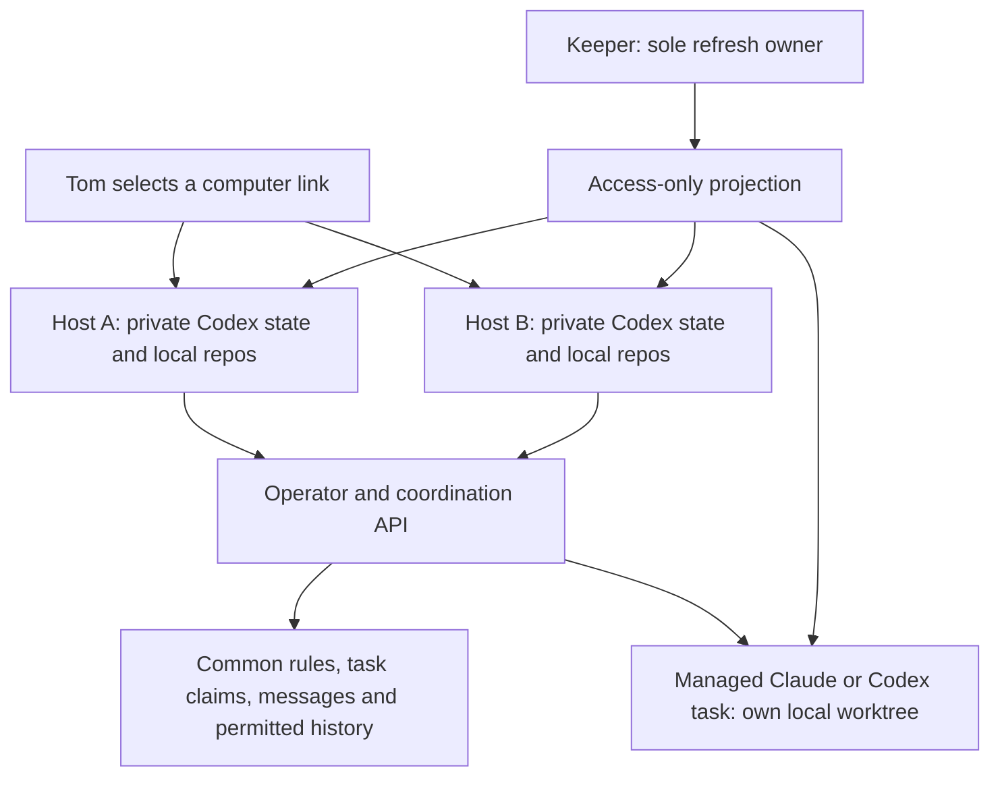
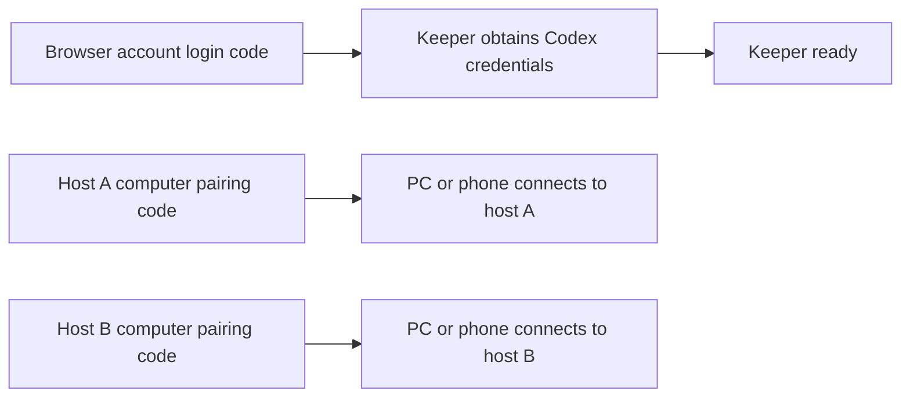

# Two Codex computer links and session coordination

**Scope corrected 2026-10-10; runtime acceptance remains open.**
[ADR-003](../.agents/sagas/distributed-dev-env/adrs/003-session-coordination-private-repositories.md)
keeps distinct hosts, private enrollment and one refresh owner while removing
shared Git. Both links discover common rules, tasks and authorized prior context.
Native chats execute on their selected host; only explicit managed dispatch
creates another worker pod.

## What the first test will establish

Two independent links, real credential adoption, loaded rules, fresh local task
starts, actual execution placement, peer discovery/message and a stopped-session
history read. A budget test is a finite explicit campaign; it does not turn all
unrelated future host conversations into one permanent task. Integrate task/thread
identities and owned stop before claiming complete campaign enforcement.

The last isolated native fixture failed and remains retained. No replacement or
fourth storage attempt is authorized by this scope document. Source tests do not
prove native startup, renewal, interrupted recovery or phone delivery. Publish
actual commands after the supported route passes.

## Open, request and continue work

Open the project on host A or B. The project provides a repository map and rules;
its files are local. The coordinator first discovers existing task claims and
reads authorized context. It may request managed work with a fresh pinned source
and rule snapshot. The API is a lifecycle/coordination service, not a reasoning agent.

Selecting B does not transfer A’s conversation or active task ownership. Use
attributed messages to coordinate, and verify the previous executor stopped before
an explicit handoff. Restore committed/rescued Git work into B’s own worktree.
Reading A’s retained context must work without resuming A; exact native-thread
import is a separate capability. Archive must preserve history before home deletion.

The existing direct-child coordinator mutation policy below remains a restricted
source contract. Add authorized peer metadata/history reads separately; fleet
visibility must not silently confer fleet-wide session control. The initial task
launcher restrictions describe the managed pilot, not a requirement that all native
host implementation use a shared filesystem.

## Persistent host and login

The first test uses two separate GitOps StatefulSets, one replica each, on worker
nodes. `OnDelete` update strategy preserves active conversations when image or
config declarations change. Each host has a retained RWO home, a stable
StatefulSet-derived hostname, private `CODEX_HOME`, installation ID, SQLite state
and control socket. All containers and init containers have CPU and memory
requests and limits. Each host has its own repo cache and task worktrees, with
common rules and authorized context supplied through the platform.

Use pinned Codex 0.160.1's persistent daemon lifecycle. Before startup, preserve
its settings while setting `updater.autoUpdateEnabled=false`; verify CLI and
managed app-server versions before pairing. Display names derive from the stable
hostname. Pairing is a separate authenticated owner action for each host, with
challenge material kept out of logs/events/git. A replacement mounts that same
host's home; it never copies enrollment from its peer or v1.

Account login and computer pairing are separate:

The account login code belongs on the browser verification page. Each computer
pairing code belongs in the controlling client's remote-connections flow. A
successful keeper login does not create a computer link. The fresh keeper login
passed on 2026-10-09 America/New_York; v2 computer pairing remains pending.

The keeper supplies access-only authentication. The intended contract is to
follow new generations without restarting a busy daemon. Pinned native Codex
can cache authentication; writing a new projection alone does not prove live
adoption or immediate revocation. Actual generation adoption remains an
acceptance gate, and an invented reload RPC cannot satisfy it. Missing or expired
access blocks admission where the supervisor can verify it and reports renewal.
First sign-in, immediate one-shot refresh and
two-host propagation follow the
[keeper authentication contract](keeper-codex-auth.md). Native shutdown is a host
operation, not proof that a managed task writer stopped.

Before a planned replacement, inspect the host's actual active turns and wait
for its coordinator conversations to become idle. Do not infer idle from a
process being quiet or a remote link being disconnected. Automatic busy-host
drain and native tool forwarding are not part of this first route.

### Startup that needs review

The supervisor reports `NeedsReview` with the retained lifecycle phase when the
daemon is positively absent but its private receipt is `Attempting`, `Confirmed`
or `Stopping`. These phases mean an earlier start or stop lacks complete evidence.
A live daemon also reports `NeedsReview` unless its receipt is `Confirmed` for
the exact current Pod and process identity. A successful start command followed
by an incomplete readiness probe retains `Attempting`; later observation does
not invent the missing lifecycle proof. A malformed or unreadable receipt reports
`Unknown`. Neither state authorizes another native start, even after a pod
replacement. Positive absence with a missing receipt or verified `Stopped`
receipt is distinct from an interrupted operation.

Review the private `codex-host-start-intent.json` in agentd's state directory and
preserve its original bytes. Match the recorded Pod UID, process boot/start identity,
native version and host workspace to the intended host. Check the live pod and
daemon through the passive status path; a disconnected computer entry, missing PID
or unavailable pod is insufficient stop evidence. Keep its retained provider home
and conversation state intact.

The supported stop path requires the original confirmed daemon in its current
pod, observed idle turns, an explicitly declared shutdown, the matching native
`stopped` acknowledgment and fresh positive absence within the shutdown budget.
Only this path writes `Stopped` and permits a later cold start. Already-absent
history without that receipt has no implemented reset route. It remains stopped
for an explicit recovery design with independently verified fencing; do not delete
the receipt, invent `Stopped`, clear rendezvous files or automatically retry.
Unplanned-loss recovery remains an acceptance gate separate from a clean idle
host replacement.

## Management identity

Each host gets a dedicated ServiceAccount with `automountServiceAccountToken=false`,
no Kubernetes RoleBinding, a pod-bound short-lived `dev-env-operator` audience
projection and the operator's public CA. Do not add hosts to the current trusted
`Clients` allowlist: that class can manage other sessions and global inventory.

A separately configured, default-disabled coordinator class verifies the live
host Pod UID, ServiceAccount and declared host identity. Its creation policy
allows explicit declared projects/repositories, Claude or Codex task mode,
the reviewed `dev` executor profile and S/M sizes. Empty/full/ops profiles,
caller/name/lane overrides, remote/local modes and arbitrary template overlays
are refused. The API derives parent identity from the authenticated host.

List/show/log/message/suspend/resume/reap are limited to direct child sessions
whose parent is that host's namespace/ServiceAccount identity. Mutations and exec
recheck the live child's UID. Because Kubernetes exec addresses a pod by name,
coordinator log/message calls also carry expected Pod and Session UIDs that
agentd checks inside the target before accessing private state. An older agentd
that cannot enforce this check refuses the call. Filtering with `mine=true` is
not authorization.
Global fleet/rescue/restore and grant creation/approval/release are unavailable
to this pilot host class. Existing human, trusted client and session policies
retain their current behavior.

Task pods use the existing accepted OPERATOR ServiceAccount and the explicit
`dev` profile; the profile limits credential mounts, not Kubernetes permissions.
This pilot does not claim that the executor has only Git access or silently
reduce v1 parity. Child sessions keep their existing self-service grant and
owner approval rules. The first acceptance launches at most two task fixtures;
this is a test bound, not a new global fleet cap.

## Provider and phone acceptance

Codex task launch needs native JSONL parsing and durable `thread.started` identity,
access-only admission, provider environment cleanup and native resume arguments.
Do not replay an unconfirmed first prompt to recover a missing ID. Preserve the
task's rule snapshot, worktree/index/Git operation and writer ownership on resume.
Claude retains its own native launcher and repository instruction discovery.

Persist coordinator instructions in its private config because detached daemon
startup does not forward arbitrary root `-c` overrides. Keep project trust and
repository fallbacks; compose supported task-rule injection once. Filesystem and
API guards remain effective even when an app thread supplies different instructions.

The pinned synchronous `request_user_input` route awaits an actual same-thread
answer. For Default mode, enable `features.default_mode_request_user_input=true`
only on these v2 test hosts. Ask one question at a time. An async `accepted`
receipt is emission, not proof of phone delivery. Acceptance needs an actionable
prompt visible on Tom's phone and the corresponding answer in the intended
thread on each independently paired host. Privileged approvals retain Q-16.

Test source freshness, both-provider rule identifiers, status, owner-safe resume,
two distinct computer links, access refresh, one-host replacement and the native
phone round trip before calling the workflow usable. Shared-Git issue #130 is superseded. Add peer metadata/context read scopes
separately from mutation rights; retain history independent of RWX. Actual
commands and link discovery will enter the quick start after these routes pass.

Pinned primary references:
[remote lifecycle](https://github.com/openai/codex/blob/d27764b82f7118f674371e6d6e76271d9d606edb/codex-rs/cli/src/remote_control_cmd.rs),
[native app threads](https://github.com/openai/codex/blob/d27764b82f7118f674371e6d6e76271d9d606edb/codex-rs/app-server/src/request_processors/thread_processor.rs),
[question handler](https://github.com/openai/codex/blob/d27764b82f7118f674371e6d6e76271d9d606edb/codex-rs/core/src/tools/handlers/request_user_input.rs)
and [question protocol tests](https://github.com/openai/codex/blob/d27764b82f7118f674371e6d6e76271d9d606edb/codex-rs/app-server/tests/suite/v2/request_user_input.rs).
