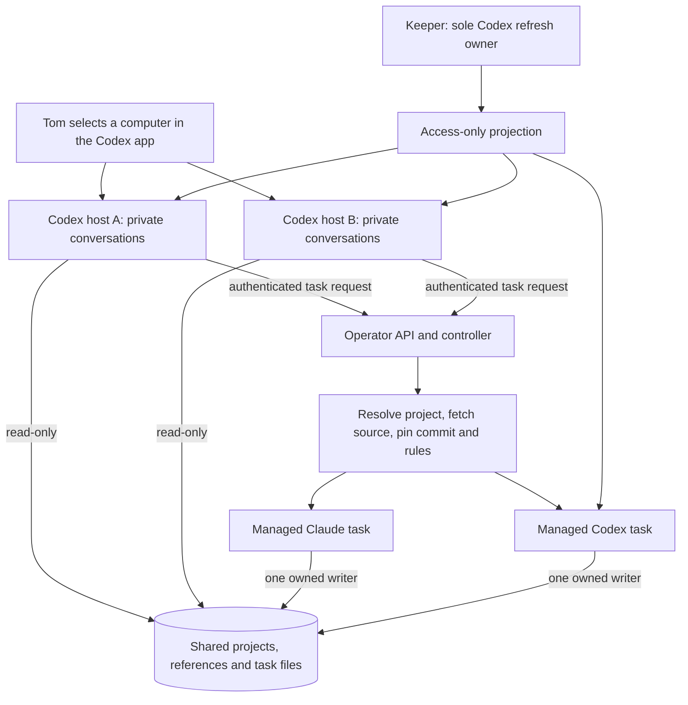

# Two Codex computer links and managed tasks

**Design for the first v2 owner test; source and real-client acceptance are
pending.** Each computer link is a persistent Codex coordinator. Both links see
the same project files. Implementation runs in managed task pods with separate
worktrees and recorded writers. The operator is the API/controller that performs
those operations; it is not another reasoning agent.

## Open, request and continue work

Choose host A or B in the Codex app, then open the declared project root. The
coordinator reads its repository map and rules, discusses the outcome and submits
a managed task request. The API resolves the accepted catalog and records the
fresh source and rule snapshot before the task receives an implementation prompt.
The coordinator follows task status and results through its management client.

Native app threads execute on the chosen host. They do not automatically allocate
an AgentSession or forward tools to a task pod. Read-only workspace mounts make
the boundary enforceable: writable implementation needs the managed launcher.
Each host still has its own writable provider home and resource limit.

Selecting B exposes the same project and task files; it does not transfer A's
conversation or a task's writer. Follow-up work uses the recorded task owner and
native conversation ID. Suspension/resume uses the verified stopped-executor
contract. Explicit cross-session transfer remains a later supported operation;
neither a free lock nor a lost link authorizes takeover.

## Persistent host and login

The first test uses two separate GitOps StatefulSets, one replica each, on worker
nodes. `OnDelete` update strategy preserves active conversations when image or
config declarations change. Each host has a retained RWO home, a stable
StatefulSet-derived hostname, private `CODEX_HOME`, installation ID, SQLite state
and control socket. All containers and init containers have CPU limits. Shared
`repos`, `codex`, `work` and workspace metadata mounts are read-only on hosts.

Use pinned Codex 0.160.1's persistent daemon lifecycle. Before startup, preserve
its settings while setting `updater.autoUpdateEnabled=false`; verify CLI and
managed app-server versions before pairing. Display names derive from the stable
hostname. Pairing is a separate authenticated owner action for each host, with
challenge material kept out of logs/events/git. A replacement mounts that same
host's home; it never copies enrollment from its peer or v1.

The keeper supplies access-only authentication, and host supervision follows
new generations without restarting the daemon. Missing or expired access blocks
new work and reports renewal. First sign-in, immediate one-shot refresh and
two-host propagation follow the
[keeper authentication contract](keeper-codex-auth.md). Native shutdown is a host
operation, not proof that a managed task writer stopped.

Before a planned replacement, inspect the host's actual active turns and wait
for its coordinator conversations to become idle. Do not infer idle from a
process being quiet or a remote link being disconnected. Automatic busy-host
drain and native tool forwarding are not part of this first route.

## Management identity

Each host gets a dedicated ServiceAccount with `automountServiceAccountToken=false`,
no Kubernetes RoleBinding, a pod-bound short-lived `dev-env-operator` audience
projection and the operator's public CA. Do not add hosts to the current trusted
`Clients` allowlist: that class can manage other sessions and global inventory.

A separately configured, default-disabled coordinator class verifies the live
host Pod UID, ServiceAccount and declared host identity. Its creation policy
allows explicit declared projects/repositories, Claude or Codex task mode,
the reviewed `dev` executor profile and S/M sizes. Empty/full/ops profiles,
caller/name/lane overrides, remote/local modes and arbitrary template overlays
are refused. The API derives parent identity from the authenticated host.

List/show/log/message/suspend/resume/reap are limited to direct child sessions
whose parent is that host's namespace/ServiceAccount identity. Mutations and exec
recheck the live child's UID. Filtering with `mine=true` is not authorization.
Global fleet/rescue/restore and grant creation/approval/release are unavailable
to this pilot host class. Existing human, trusted client and session policies
retain their current behavior.

Task pods use the existing accepted OPERATOR ServiceAccount and the explicit
`dev` profile; the profile limits credential mounts, not Kubernetes permissions.
This pilot does not claim that the executor has only Git access or silently
reduce v1 parity. Child sessions keep their existing self-service grant and
owner approval rules. The first acceptance launches at most two task fixtures;
this is a test bound, not a new global fleet cap.

## Provider and phone acceptance

Codex task launch needs native JSONL parsing and durable `thread.started` identity,
access-only admission, provider environment cleanup and native resume arguments.
Do not replay an unconfirmed first prompt to recover a missing ID. Preserve the
task's rule snapshot, worktree/index/Git operation and writer ownership on resume.
Claude retains its own native launcher and repository instruction discovery.

Persist coordinator instructions in its private config because detached daemon
startup does not forward arbitrary root `-c` overrides. Keep project trust and
repository fallbacks; compose supported task-rule injection once. Filesystem and
API guards remain effective even when an app thread supplies different instructions.

The pinned synchronous `request_user_input` route awaits an actual same-thread
answer. For Default mode, enable `features.default_mode_request_user_input=true`
only on these v2 test hosts. Ask one question at a time. An async `accepted`
receipt is emission, not proof of phone delivery. Acceptance needs an actionable
prompt visible on Tom's phone and the corresponding answer in the intended
thread on each independently paired host. Privileged approvals retain Q-16.

Test source freshness, both-provider rule identifiers, status, owner-safe resume,
two distinct computer links, access refresh, one-host replacement and the native
phone round trip before calling the workflow usable. The storage gate in
[#130](https://github.com/thaynes43/dev-env/issues/130) remains open. Actual
commands and link discovery will enter the quick start after these routes pass.

Pinned primary references:
[remote lifecycle](https://github.com/openai/codex/blob/d27764b82f7118f674371e6d6e76271d9d606edb/codex-rs/cli/src/remote_control_cmd.rs),
[native app threads](https://github.com/openai/codex/blob/d27764b82f7118f674371e6d6e76271d9d606edb/codex-rs/app-server/src/request_processors/thread_processor.rs),
[question handler](https://github.com/openai/codex/blob/d27764b82f7118f674371e6d6e76271d9d606edb/codex-rs/core/src/tools/handlers/request_user_input.rs)
and [question protocol tests](https://github.com/openai/codex/blob/d27764b82f7118f674371e6d6e76271d9d606edb/codex-rs/app-server/tests/suite/v2/request_user_input.rs).
