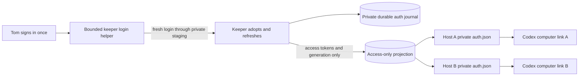

# Keeper-owned Codex authentication

**Status: implementation in progress; disabled until source, deployment and
real-client acceptance pass.** This is the authentication path for the first
v2 owner test with two distinct Codex computer links and shared project files.
It preserves each host's private enrollment and makes the keeper the sole owner
of the rotating refresh token.

## First sign-in

The initial test uses the pinned Codex 0.160.1 native device-login ceremony in a
bounded helper inside the keeper trust boundary. Each attempt has a fresh
private `CODEX_HOME` and a fifteen-minute deadline. The helper shares only a
dedicated temporary staging area with the keeper; it receives no CA, GitHub App
credential, remote-host enrollment or live auth home. It runs no agent or daemon.

Tom receives the sign-in link/code through an authenticated control response and
the native actionable question tool. Challenge and token material never enter
pod logs, Kubernetes events/status, public issues, git or a handoff. If device
login is unavailable, verify that failure before asking Tom for the required
account setting or supported alternate ceremony.

The keeper accepts only the completed attempt bound to the current keeper and
attempt identity, validates it, persists it privately and removes staging. It
never imports v1's auth or copies a live remote host's refresh token. Fresh host
pairing is a later, separate action: each private enrollment gets its own
computer link. This initial CLI ceremony does not replace the recorded target
of authenticated console renewal.

## Rotation and delivery

The keeper privately stores one bounded versioned record in the named
`dev-env-keeper-codex-auth` Secret. It contains the login, ownership generation,
expiry, attempt identity and durable state. Only the keeper may read or patch
that named record; session/host pods receive no permission or mount for it.

Refresh uses the exact pinned upstream native OAuth contract. Before dispatch,
persist a `RefreshIntent` and check uncached own-Lease identity with enough
remaining lifetime for the complete HTTP deadline, durable save and safety
margin. Cancel on leadership loss. There are no redirected requests or automatic
retries after possible dispatch. A successful response must preserve account
identity and supply valid replacement material; CAS-persist the replacement
before publishing access tokens. If publication fails, retry publication only.

A transport, response or persistence ambiguity remains durable and requires a
fresh login. A new leader cannot replay a possibly consumed refresh token.
This worker does not use the generic retrying credential loop. Disabled mode
performs no login, journal read, refresh or publication.

The access-only `dev-env-codex-live` projection contains `id_token`,
`access_token`, `account_id`, `exp`, generation and refresh metadata. It contains
no refresh token. agentd validates one complete projection generation and
atomically writes a mode-0600 private `auth.json`, with ChatGPT auth mode and an
empty refresh token, before launch. It follows newer generations while the
daemon runs; token updates do not restart it or replace enrollment state.

Schedule refresh from the observed expiry with a conservative lead time beyond
projection/reload latency and the client's five-minute refresh window. The
ten-day lifetime observed in S-3 is evidence from that login, not a guaranteed
lifetime for future logins. Expired/stale/unavailable authentication blocks new
launches and is reported as a concrete renewal need.

## What must pass before Tom tests it

- Source tests cover bounded parsing/redaction, fresh attempt adoption, journal
  CAS, durable intent/recovery, Lease budget/loss, replacement-before-publication
  ordering and ambiguous-response refusal.
- Synthetic agentd tests prove access-only generation validation, atomic private
  replacement and update without touching provider state or restarting a daemon.
- Signed images and exact named-secret RBAC are deployed through reviewed GitOps;
  keeper helper mounts and CPU limits are verified at admission.
- Tom completes the fresh keeper-owned sign-in. Actual pinned Codex launches and
  two separately paired hosts work on access-only files. One refresh reaches both
  running hosts without another refresher or daemon restart.
- Host replacement preserves its own enrollment; the other host remains usable.
  Auth history, raw tokens and private account identifiers remain private.

The earlier S-3 unpaired app-server result supports this implementation, but does
not substitute for two paired-host, refresh and replacement acceptance. Shared
storage, project/rule loading, writer ownership and managed task resume remain
independent gates in [plan 11](../.agents/sagas/distributed-dev-env/backlog/11-project-workspaces.md).

The pinned implementation references are
[device login](https://github.com/openai/codex/blob/d27764b82f7118f674371e6d6e76271d9d606edb/codex-rs/login/src/device_code_auth.rs),
[OAuth transport](https://github.com/openai/codex/blob/d27764b82f7118f674371e6d6e76271d9d606edb/codex-rs/login/src/oauth/client.rs)
and [auth manager](https://github.com/openai/codex/blob/d27764b82f7118f674371e6d6e76271d9d606edb/codex-rs/login/src/auth/manager.rs).
