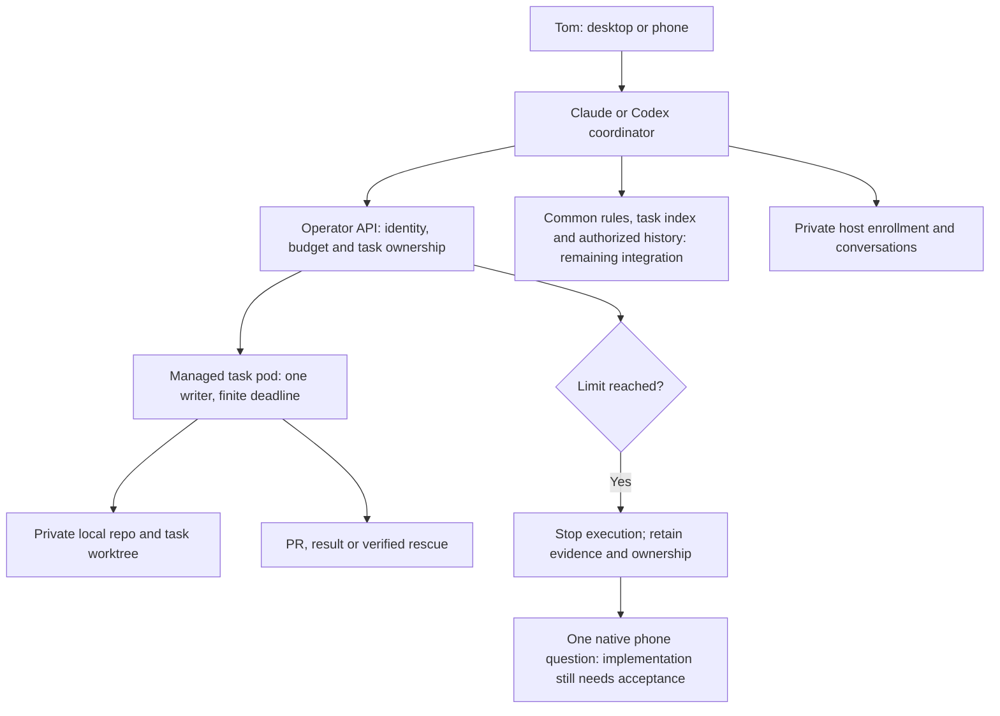

# Morning test guide — 2026-10-10 UTC

The updated goal is independent Claude/Codex environments that share rules,
coordinate tasks and read each other’s authorized live/stopped context. Repos
and worktrees remain local to each pod. [ADR-003](../.agents/sagas/distributed-dev-env/adrs/003-session-coordination-private-repositories.md)
withdraws the shared-Git/storage prerequisite and the old remaining-work estimate.

One real v2 Claude task passed execution and cleanup. The Claude task/terminal
subset can be tested now. Cross-pod coordination, provider history retention and
two Codex computer links still require acceptance. Source 2.11.0 provides
budget/native foundations; it does not establish a working phone or host journey.

## What to open

- [Workflow and quick start](workflow-guide.md): product journeys, feature
  table, commands and diagrams.
- [Two Codex hosts](codex-coordinator-hosts.md): where conversations run, how
  writable tasks are requested, and why account login differs from pairing.
- [HANDOFF](../.agents/HANDOFF.md): latest deployed state and durable evidence.

The operator is an API and controller. It manages lifecycle and policy without
spending model turns. The requester is a CLI or another client. A coordinator
is the agent session that reasons about your request and requests work. The
management console is planned; no new primary management app has been selected.



## Test the working subset

Use the [v2 CLI setup and session commands](workflow-guide.md#3-quick-start-with-the-working-paths).
The command named `agent-run` already installed in the v1 pod is the v1 shell
launcher. A v2 client has already been built and checked in this pod:

```bash
v2run=(/home/dev/work/v2-morning-claude-cli/bin/agent-run)
export DEV_ENV_API_CA_FILE=/home/dev/work/orders/morning-claude-cli-verification-2026-10-10/operator-ca.crt
"${v2run[@]}" version
"${v2run[@]}" fleet
"${v2run[@]}" help run
```

This binary was built from `739872fc`; the ordinary worker template is still
2.9.1. The signed 2.11.0 image was used for the separate native fixture, not
rolled out to every session. The CA file is public trust material. If these
paths no longer exist, use the fresh worktree/build steps in the workflow guide.

Choose one small Claude task or one local terminal session. Check its reported
source commit, owner, status and result. For a local session, test attach,
detach and a message. Suspend it, verify the retained state and rescue result,
then resume. Private reap preserves Git rescue but deletes the provider home;
it does not archive the conversation. Suspension retains the home temporarily, until configured
`archiveAfter` (default 168 hours). Verify required history retention before
that deadline. Reap only disposable tests or after separately verifying required
history retention. The guide contains the exact supported commands.

The overnight read-only Claude smoke finished successfully with two turns
and exit code 0. Its Pod had no init containers and CPU 2 / memory 4 GiB limits; supported
cleanup removed the session, Pod and PVC. Its final sentence was not retained
and its rescue list was empty. Test rescue explicitly before trusting this
path with work that must survive archive or transfer.

A Pending pod is a capacity result. Launching another copy does not fix it.
The v2 phone and coordination journeys are acceptance targets rather than
commands to use against disabled features.

## Overnight results and limits

| Piece | Established | Still required |
|---|---|---|
| Schema and release | Current schema applied; signed agent 2.11.0 published | General feature opt-ins remain disabled |
| Claude task | One real task succeeded; admitted container limits and final cleanup verified | Owner terminal exercise and verified rescue/retention |
| Operator | 2/2 Ready, no injected init or restarts; initial native profile deployed; private-home source fix reviewed | One-shot client failed; native readiness/owned stop remains unverified |
| Task budgets | Retained ledger/API and owned/managed stop implementation released | Whole-campaign stop, native/tool failure classification, verified progress and phone escalation |
| Keeper | Fresh independent account login Ready | Live two-host adoption and refresh propagation; separate computer pairing |
| NFS discovery | Read-only NFS4.2 access as UID 1000; disposable resources retired | Historical result; shared-Git trial no longer required |
| External Ceph | About 109 TiB replica-adjusted free; successful cache publication witnessed | Free capacity is not a directory quota or workload acceptance |
| Storage observer | Three setup/delivery failures preserved; route stopped | Historical route; no retry under current scope |
| Rules/context | Catalog/rule source released | Decouple from RWX; actual rule loading, context retention, claims and messages |

The storage observer stopped after three delivery/setup failures; no complete
baseline passed. The NFS helper also stopped after three related review failures
and no writable trial ran. These are observer/helper failures, not a demonstrated
NFS failure. One fresh external OSD latency warning was recorded; it is not two
consecutive breaches. Thresholds remain unchanged. Read the
[overnight result and timing table](trials/2026-10-10-overnight-results.md).

Missing provider counters are labelled Unknown or estimated. Time, attempts
and checkpoints still apply. Changing the pod, agent or diagnostic method
does not reset the logical task. A local stopped-process receipt does not by
itself prove an entire campaign stopped or that a phone question arrived.

## Finish the shared-project Codex MVP

This heading is retained for older links; its shared-Git interpretation is
superseded. The current [workflow roadmap](workflow-guide.md#8-remaining-work-and-the-cutover-gate)
and [plan 11](../.agents/sagas/distributed-dev-env/backlog/11-project-workspaces.md)
cover local catalog/rules, session history, authorized discovery, task claims,
durable messages and both-provider owner acceptance. Native recovery/budgets,
guarded required access and truthful usage/cost remain explicit work.

The old 7–14 engineering hour estimate included storage work that is no longer
required. Do not use it as a current forecast or retry authorization. Size each
new unit against its concrete acceptance contract with a 30–60 minute checkpoint;
the accepted stall/failure rule continues across pods and agents.

Full v1 retirement still needs required workflow migration and explicit owner
approval. Frontend, safe image drains and local LLMs are separately visible in the
[feature table](workflow-guide.md#2-feature-set-and-delivery-state).
