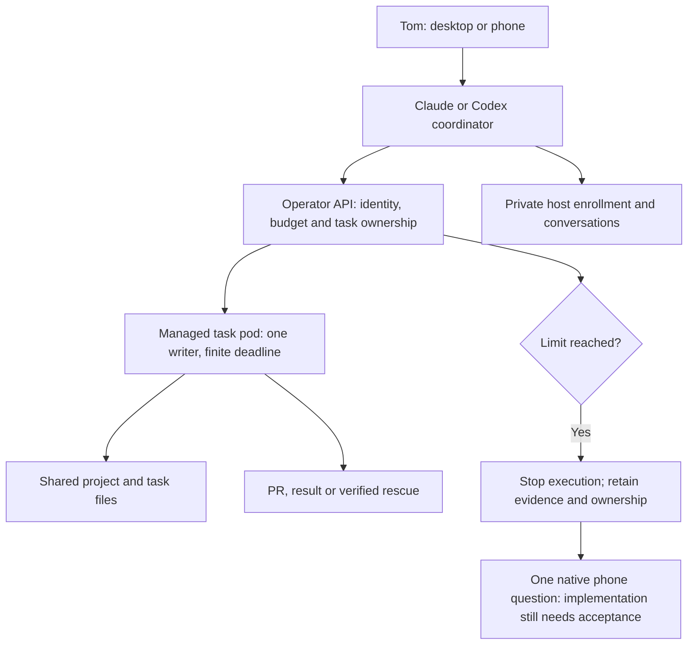

# Morning test guide — 2026-10-10 UTC

The goal is two stable Codex computer links in different pods, sharing project
and task files with Claude Code while keeping each host's login, enrollment
and conversation state private. A task has one writer, fresh pinned source,
a bounded budget and a recoverable result.

One real v2 Claude task has passed execution and cleanup. The existing Claude
task and terminal workflow can be tested now. The full
shared-project Codex MVP still has open acceptance gates. The overnight work
released the budget and native-host foundations as **2.11.0** and staged the
isolated operator profile. It does not yet establish two working Codex links
or an actionable v2 phone question.

## What to open

- [Workflow and quick start](workflow-guide.md): product journeys, feature
  table, commands and diagrams.
- [Two Codex hosts](codex-coordinator-hosts.md): where conversations run, how
  writable tasks are requested, and why account login differs from pairing.
- [HANDOFF](../.agents/HANDOFF.md): latest deployed state and durable evidence.

The operator is an API and controller. It manages lifecycle and policy without
spending model turns. The requester is a CLI or another client. A coordinator
is the agent session that reasons about your request and requests work. The
management console is planned; no new primary management app has been selected.



## Test the working subset

Use the [v2 CLI setup and session commands](workflow-guide.md#3-quick-start-with-the-working-paths).
The command named `agent-run` already installed in the v1 pod is the v1 shell
launcher. A v2 client has already been built and checked in this pod:

```bash
v2run=(/home/dev/work/v2-morning-claude-cli/bin/agent-run)
export DEV_ENV_API_CA_FILE=/home/dev/work/orders/morning-claude-cli-verification-2026-10-10/operator-ca.crt
"${v2run[@]}" version
"${v2run[@]}" fleet
"${v2run[@]}" help run
```

This binary was built from `739872fc`; the ordinary worker template is still
2.9.1. The signed 2.11.0 image was used for the separate native fixture, not
rolled out to every session. The CA file is public trust material. If these
paths no longer exist, use the fresh worktree/build steps in the workflow guide.

Choose one small Claude task or one local terminal session. Check its reported
source commit, owner, status and result. For a local session, test attach,
detach and a message. Suspend it, verify the retained state and rescue result,
then resume. Reap only after the result or rescue is confirmed; follow cleanup
until it completes. The guide contains the exact supported commands.

The overnight read-only Claude smoke finished successfully with two turns
and exit code 0. Its Pod had no init containers and CPU 2 / memory 4 GiB limits; supported
cleanup removed the session, Pod and PVC. Its final sentence was not retained
and its rescue list was empty. Test rescue explicitly before trusting this
path with work that must survive archive or transfer.

A Pending pod is a capacity result. Launching another copy does not fix it.
The v2 phone and shared-project examples are acceptance targets rather than
commands to use against disabled features.

## Overnight results and limits

| Piece | Established | Still required |
|---|---|---|
| Schema and release | Current schema applied; signed agent 2.11.0 published | General feature opt-ins remain disabled |
| Claude task | One real task succeeded; admitted container limits and final cleanup verified | Owner terminal exercise and verified rescue/retention |
| Operator | 2/2 Ready, no injected init or restarts; initial native profile deployed; private-home source fix reviewed | One-shot client failed; native readiness/owned stop remains unverified |
| Task budgets | Retained ledger/API and owned/managed stop implementation released | Whole-campaign stop, native/tool failure classification, verified progress and phone escalation |
| Keeper | Fresh independent account login Ready | Live two-host adoption and refresh propagation; separate computer pairing |
| NFS discovery | Read-only NFS4.2 access as UID 1000; all disposable discovery resources retired | Quiet baseline, bounded writes/Git/locks, remount and recovery |
| External Ceph | About 109 TiB replica-adjusted free; successful cache publication witnessed | Free capacity is not a directory quota or workload acceptance |
| Storage observer | Three setup/delivery failures preserved; route stopped | Recorded next decision and complete fresh window with required coverage and tripwires |
| Shared projects | Catalog, rule and preparation source released | Both-provider rule loading and actual cross-pod workspace ownership |

The storage observer stopped after three delivery/setup failures; no complete
baseline passed. The NFS helper also stopped after three related review failures
and no writable trial ran. These are observer/helper failures, not a demonstrated
NFS failure. One fresh external OSD latency warning was recorded; it is not two
consecutive breaches. Thresholds remain unchanged. Read the
[overnight result and timing table](trials/2026-10-10-overnight-results.md).

Missing provider counters are labelled Unknown or estimated. Time, attempts
and checkpoints still apply. Changing the pod, agent or diagnostic method
does not reset the logical task. A local stopped-process receipt does not by
itself prove an entire campaign stopped or that a phone question arrived.

## Finish the shared-project Codex MVP

These are planning estimates in engineering hours, not provider billing or
an unattended authorization to retry. Each implementation unit needs its own
30–60 minute checkpoint and concrete result. Failed gates stop that route.

| Work remaining | Estimate | Completion evidence |
|---|---:|---|
| Select and qualify shared storage | 1–3 hours after a healthy baseline | Finite NFS/Git/lock test, verified stop, remount and rescue; reviewed backend decision |
| Enable the first two retained Codex hosts | 2–4 hours | Distinct links/private homes, shared read-only project discovery, keeper adoption and refresh |
| Complete task budget and child-decision integration | 3–5 hours | Actual native failures/progress, campaign stop, durable escalation and owned continuation |
| Exercise task ownership and provider rules | 1–2 hours | Claude/Codex composed rules, stale-source refusal, one writer and explicit transfer |
| Owner device acceptance | 20–40 minutes | Pair each computer, resume on the intended host, receive and answer one real phone question |

Allow roughly **7–14 engineering hours plus the owner device check** for this
remaining MVP scope if the storage baseline passes. Some work can overlap.
Storage health failures or provider behavior can change that estimate and
must produce a bounded next decision. Full capability parity, the management
console, image drains and v1 cutover are additional work; they are not included
in this MVP estimate. The detailed [feature table](workflow-guide.md#2-feature-set-and-delivery-state)
keeps that larger scope visible.
