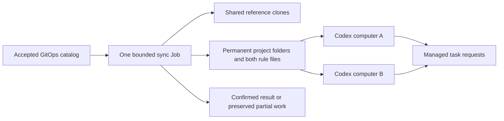

# Materialize the shared project catalog

**Historical shared-workspace source contract, superseded in scope 2026-10-10.**
[ADR-003](../.agents/sagas/distributed-dev-env/adrs/003-session-coordination-private-repositories.md)
requires common rules/context and per-pod repos/worktrees. Reuse relevant source,
but decouple catalog/rules and provider-home retention from RWX. Shared-only gates,
mounts and deployment examples below are not the current rollout instructions.
Current delivery is [plan 11](../.agents/sagas/distributed-dev-env/backlog/11-project-workspaces.md).

The project sync runner turns the accepted GitOps catalog into shared reference
clones and permanent project folders. It is a bounded job that uses no model and
starts no Claude or Codex session. Boot preparation, daily maintenance and an
explicit sync use the same command and safety checks.

This is source support for the v2 workflow. Production Jobs, scheduling and the
owner-facing sync command still need deployment and live acceptance. The storage
gate in [#130](https://github.com/thaynes43/dev-env/issues/130) remains open.
Use the [workflow guide](workflow-guide.md) for the user journeys and
[project catalog contract](shared-project-catalog.md) for declaration and rules.



## Declare, sync and open

Merge the project declaration through its normal GitOps review. Wait for the
accepted catalog revision, then run the bounded sync operation. A successful
result records the exact accepted revision and each repository's result. The
project folder is permanent and outside the task sweeper's scope. Both providers
receive rule files generated from the same declaration.

Repository aliases keep their declared mapping to the actual GitHub repository.
Only repositories belonging to the configured clone owner are accepted. Dirty
anchors, local work, unsafe references and undeclared project roots remain intact
and are reported. A matching client-supplied digest does not authorize a sync.

The two coordinator hosts mount these shared files read-only. They can open a
project and request implementation in a separately owned task worktree. A task's
fresh-source and private rule-snapshot checks remain required even after sync
succeeds.

## Deploy the fixed runner

The deployment supplies a dedicated `dev-env-project-sync` ServiceAccount and
retained `dev-env-project-sync-home` claim in the runner's namespace. Its RBAC
permits GET for Pods and Jobs in that namespace and the named accepted catalog
ConfigMap. The runner issues only named reads of its own Pod, owning Job and
catalog; it performs no list, watch or API write. It receives an explicitly projected API token and public CA,
and the keeper's read-only GitHub access token. It gets no provider home or
credential, native enrollment, session token, App key or CA private key.

Use this explicit command, with trusted deployment values for the namespace and
workspace identity:

```sh
/usr/local/bin/tini -- /usr/local/bin/agentd project-sync --enabled \
  --namespace=dev-agents \
  --accepted-catalog=dev-env-system/dev-env-project-catalog \
  --workspace-id=dev-env-projects-v2 \
  --project-clone-owner=thaynes43 \
  --github-token-file=/creds/gh_token \
  --kube-token-file=/var/run/secrets/project-sync/token \
  --kube-ca-file=/var/run/secrets/project-sync/ca.crt
```

This is a Job container command, not a command to paste into a coordinator or v1
terminal. The runner verifies the actual live Pod UID, its Job controller UID,
command, arguments, dedicated identity and mount topology before any shared write.
Downward API fields carry the Pod name, namespace and UID; they are checked
against uncached API reads. Shared `metadata`, `repos`, `codex` and `work` use four
literal writable subpaths of the same retained workspace claim. Its private home
is a separate writable claim. All containers require CPU and memory limits.

The explicit API token projection leaves `audience` omitted so Kubernetes selects
its API audience. Its expiry is bounded to one hour. Default token automount is
disabled. Coordinator hosts keep their separate operator-audience projection and
have no Kubernetes RoleBinding.

The Job has one container, no init or ephemeral containers, `restartPolicy: Never`,
`backoffLimit: 0`, one completion and parallelism one. Its original deadline is at
most ten minutes. The runner does not renew that deadline after queueing, restart
the operation after an uncertain response or launch a model.

## Initialize a new workspace once

Only the trusted initial Job adds `--initialize-new-workspace`. It may create the
workspace marker exclusively when all four unmarked shared subpaths are empty
and their actual mounts are verified. It saves and confirms the exact marker
durably. An existing matching marker is validated; it is never replaced.

A wrong marker, symlink, nonempty unmarked workspace, uncertain write or v1
layout refuses initialization and preserves the files. Tasks and coordinator
hosts never initialize or repair a marker. Every later sync uses the normal
command without the initialization flag.

## Read a result and handle interruption

Before shared writes, the runner durably records a private operation receipt
bound to the actual Job UID, Pod UID, original deadline and accepted catalog
identity. It checks the live actor again under each existing Git administration
lock and before each Git command. Before publishing rules, it confirms the exact
catalog bytes, UID and resource version under the primary repository lock.

An uninterrupted operation confirms a terminal receipt with its result or
preserved partial work. Interruption, refused setup, deadline expiry or an
unconfirmed write can instead leave a started or unknown receipt.
Repeating the same confirmed terminal operation returns that saved result without
running sync again. A started or unconfirmed operation refuses replay. A new Job
is a new operation and needs the normal review of preserved state; absence of an
old Pod or an expired deadline does not establish that the earlier work finished.

The runner writes only its private Git configuration. It reads the keeper access
projection when Git needs it and does not refresh credentials or rewrite native
provider state. A catalog change observed by the required uncached read prevents
rule publication; prepared references and anchors remain available for inspection.
That confirmation is not atomic with a later GitOps update, so the materialized
revision remains explicit.

## Acceptance before the owner test

Verify the signed artifact and actual Job admission, then use approved shared
storage to initialize an empty workspace, materialize the initial catalog and
repeat a normal sync. Confirm alias mapping, both rule files, safe reference
repair, dirty-state preservation and original-deadline behavior. Verify that
both retained hosts see the same project roots and that real Claude and Codex
tasks load both the project and repository rules. Source fixtures alone do not
establish those runtime checks.
