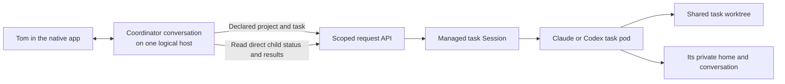
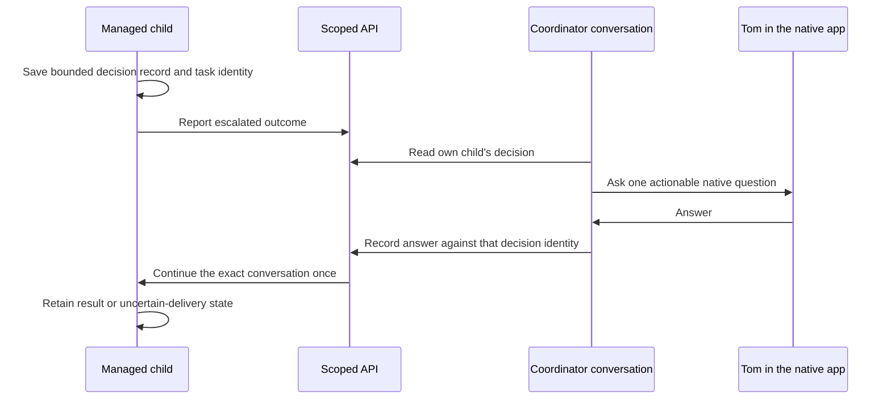

# From a Codex conversation to a managed task

**Historical shared-workspace source contract, superseded in scope 2026-10-10.**
[ADR-003](../.agents/sagas/distributed-dev-env/adrs/003-session-coordination-private-repositories.md)
requires common rules/context and per-pod repos/worktrees. Reuse relevant source,
but decouple catalog/rules and provider-home retention from RWX. Shared-only gates,
mounts and deployment examples below are not the current rollout instructions.
Current delivery is [plan 11](../.agents/sagas/distributed-dev-env/backlog/11-project-workspaces.md).

This is the delivery contract for the first testable v2 workflow. Source support,
deployed support and a successful owner test are separate checkpoints. See the
[workflow guide](workflow-guide.md) for the whole feature set and
[coordinator host design](codex-coordinator-hosts.md) for the two computer links.

## Who does what

The request service is an API. Kubernetes controllers place and manage task pods.
Neither service is a model agent. The coordinator is the Claude or Codex
conversation Tom is driving. It explains the work, creates tasks through the API,
checks their results and brings decisions back to Tom.

The two Codex computer links belong to the Codex remote app. Each link reaches its
own host and keeps its own enrollment and native thread history. Both can see the
same project and task files. Sharing files does not merge their conversations or
move an open native thread between computers.

## Start a task

The coordinator selects a declared project, a repository in that project, a task,
Claude or Codex, the `dev` profile and size S or M. For a project with one repository,
the server can select it. A project with several repositories needs a selection.
The server supplies the accepted repository mapping, default branch and project
rules. A request cannot replace those with its own paths, rules or revision.

The task gets a separate pod, a shared task worktree and a private home. The
platform fetches and verifies its source before a new launch. It saves the project
snapshot privately so a resume uses the same instructions. A later catalog update
does not silently rewrite that conversation's rules.

Each coordinator can list, inspect, read logs, message, suspend, resume and reap
its own direct children. That boundary comes from its verified host identity.
Choosing a list filter does not grant access. Global fleet management, rescue
restore and privileged approval operations belong to their existing operator
interfaces.

## Pause and continue

Suspension first proves the old writer stopped, then preserves the task's work.
Resume uses the saved worktree, private home and confirmed native conversation.
Codex resumes its exact recorded thread; the initial task prompt is not submitted
again. An uncertain thread identity or delivery remains refused until it can be
resolved.

When another pod takes over the same task, it must wait for the previous writer's
stop proof and the platform's ownership transfer. A timeout, free file lock or
missing pod alone does not authorize takeover. Reaping a completed shared task
retains its private home after verified rescue. Retention has no automatic deletion
deadline and does not itself provide a backup or authorize enrollment reuse.

## Bring a decision back to Tom

The native `codex exec` task interface does not provide the parent's phone question
route. A managed task therefore needs an explicit decision record. The remaining
decision-delivery unit uses this flow:

The record binds the question to the Session, native thread and task ownership
generation. An answer must match that record. The platform records a dispatch
fence before sending it; an ambiguous acknowledgement never permits automatic
replay. This explicit parent/child workflow does not automatically forward native
app threads across hosts.

## The owner test

The milestone is complete when Tom can open two distinct Codex computer links,
see the same declared projects, start a managed task with the correct rules,
inspect its state, answer a real question and continue the exact conversation.
The same task must survive a verified suspend/resume and a controlled writer
transfer, with rescue and retained-home evidence available afterward.

Live acceptance also requires fresh keeper-owned Codex authentication and refresh
propagation, the approved shared-storage gates, source freshness, and unchanged
v1 availability. Passing source tests alone is not a reason to invite the owner
to try the full workflow. No management web app is needed to validate this native
app and CLI milestone; that product choice remains a separate discussion.
