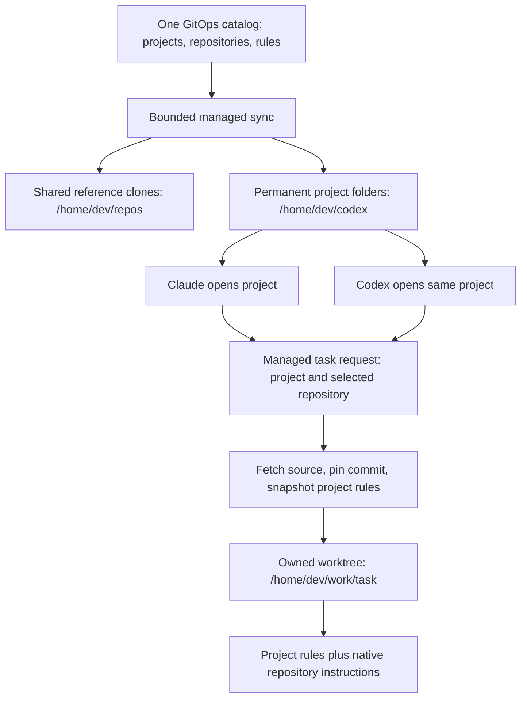

# Shared projects and task rules

**Historical shared-workspace source contract, superseded in scope 2026-10-10.**
[ADR-003](../.agents/sagas/distributed-dev-env/adrs/003-session-coordination-private-repositories.md)
requires common rules/context and per-pod repos/worktrees. Reuse relevant source,
but decouple catalog/rules and provider-home retention from RWX. Shared-only gates,
mounts and deployment examples below are not the current rollout instructions.
Current delivery is [plan 11](../.agents/sagas/distributed-dev-env/backlog/11-project-workspaces.md).

**Source contract for the first v2 test; live acceptance is pending.** A project
is a permanent folder that both Claude Code and Codex can
open. A task is a separately owned worktree created from freshly fetched source.
The management API/controller performs lifecycle operations; a coordinator agent
can request those operations. This does not select a new management app.

Catalog/sync/snapshot primitives merged in [#145](https://github.com/thaynes43/dev-env/pull/145),
trusted catalog and CLI integration in [#150](https://github.com/thaynes43/dev-env/pull/150),
and scoped managed tasks in [#152](https://github.com/thaynes43/dev-env/pull/152).
The model-free [project preparation Job](project-sync-runner.md) connects the
sync primitive to explicit runtime identity and named API reads. All new routes
remain disabled by default; live acceptance is pending.



## Declare and open a project

The catalog is one bounded versioned JSON document in GitOps. It declares
repository names and GitHub identities, optional default branches, and each
project's repository map and Markdown rules. Names must be valid single path
components; declarations cannot contain credential-bearing URLs or filesystem
paths. Unknown fields, duplicate identities, invalid branches and oversized
documents are refused. The catalog revision is the digest of the exact accepted
document; the rule revision is the digest of that project's exact rules.

Version 1 has a `repositories` map keyed by repository name. Each entry contains
`github` as `owner/name` and an optional `defaultBranch`. Its `projects` map has
named entries containing a `repositories` list of repository names and optional
branch overrides, plus `rules` as Markdown. Reject duplicate JSON keys as well
as unknown fields. Limits are 256KiB per document, 64 projects, 128 repositories,
16 repositories per project and 16KiB of rules per project. Names are single DNS
components of at most 63 characters; Git branches cannot contain revision
expressions. HTTPS clone URLs are derived from the validated GitHub identity.
An omitted `defaultBranch` means `main`. The add workflow verifies the repository's
actual GitHub default and records it explicitly when it differs; it cannot turn
a failed fetch of `main` into authority to use a cached branch.

The initial catalog includes `dev-env` and the multi-repository `sigo-alumni`
project. Its three repository names are `sigo-alumni`, `sigoalumni-org` and
`sigmaphiomicron-com`. Their GitHub default branches were verified as `main` on
2026-10-09. Every project uses a plain permanent folder with one detached anchor
per repository, plus generated `AGENTS.md` and `CLAUDE.md` from the same rules
and repository map. A one-repository project uses the same layout.

This is v2's new-workspace layout. V1's existing one-repo anchor at the root
remains historical baseline; no in-place migration is performed. Sync detects
and preserves an existing root that is itself a Git worktree rather than writing
generated rules into its repository. A later conversion needs a supported
lossless migration and cannot silently rename/prune live registrations.

Catalog updates arrive through a directory mount and reconcile in place.
Starting or syncing a project creates missing references and anchors. It reports
undeclared roots, dirty anchors and unsafe reference state while preserving them.
It never removes a project because it disappeared from the declaration.

The v2 launcher has a task-only `--project` request field. The standalone server
resolves it through its explicitly enabled accepted-catalog binding and shared
workspace template; missing configuration refuses creation. A project request
cannot silently create an ordinary private task. A project with
one repository can omit `--repo`; a project with several must select one. An
omitted `--base` uses the server's accepted default branch. An explicit base must
match that default. Clients supply no rule text or catalog revision.

The first v2 test must provide a verified v2 executable or alias without replacing
v1's existing `agent-run` on PATH. The task command after runtime acceptance is:

```sh
/path/to/v2-agent-run --project dev-env -p 'Describe the task' \
  --agent claude --model claude-opus-5-5 --effort xhigh \
  --profile dev --size S --wait 0 -o json
```

This example describes the source implementation. Pending runtime deployment
and acceptance mean it is not yet an owner quick-start command. Explicit project
sync uses the bounded model-free Job described in the linked runner guide.

`project add <name> <repo>...` is one operation: stage the declaration on an
isolated branch, open a PR, complete its checks/review, merge through the normal
GitOps path, wait for the accepted catalog revision, then materialize the root.
If review or deployment is pending, return that concrete state and PR rather
than presenting an unmerged local root as authoritative. Repeat invocations use
the existing operation instead of creating competing declarations.

## Start and resume a task

The API resolves the project from its accepted catalog; client-supplied rules or
revision claims do not select authority. A new task snapshots the project name,
catalog and rule revisions, exact rules and repository map. It fetches its chosen
repository, resolves the declared base to an immutable commit, and records the
commit, fetch time and writer identity before sending the implementation prompt.
Failed fetch admits no new implementation. Opening an old anchor cannot select
stale source for a new task.

For the first API route, the operator reads the explicitly configured
`dev-env-system/dev-env-project-catalog` ConfigMap's `catalog.json` through an
uncached read. Missing or invalid accepted data refuses creation. The API records
a reserved server-authored snapshot annotation of at most 128KiB; clients cannot
supply that authority. This bounded platform metadata transports the public
GitOps rules and map to private task state. It is not a repository instruction
file or a place for secrets. The controller validates the selected identity/base
against the task, and resume retains the original snapshot.

Task worktrees remain flat under `/home/dev/work`. Their project snapshot is
private platform state, not an added or overwritten repository file. For Claude,
inject the snapshot with `--append-system-prompt-file` and retain the platform
guard in `--append-system-prompt`. For Codex, compose the snapshot and guard into
one `developer_instructions` value. Repository-owned `CLAUDE.md`, `AGENTS.md` and
the declared fallback remain native inputs. Preserve the implementation prompt
as its separate task input. A real-client test must prove both project and repo
rule identifiers are loaded; checking generated files is insufficient.

Declared projects generate Codex trust. Claude receives the complete intended
repository scope. Additional directory access alone is not proof of instruction
loading. Scope grants do not permit editing reference clones or anchors, and a
second repository change needs its own managed worktree/owner operation.

Resume uses the saved task snapshot, exact worktree, index, Git operation and
conversation. It does not silently replace the rules or reset work to a newer
remote commit. A changed catalog is reported; starting a new task takes the new
revision. Transfer still requires verified previous-writer stop and an explicit
supported operation. A second computer link cannot claim the first one's task.

## Keep references healthy

Boot, daily maintenance and explicit sync share the common-Git administrative
lock protocol. Clone, fetch, anchor refresh and worktree registration are
serialized and bounded per repository. Each holder retains the two-minute
administrative budget and 130-second queue bound. A project sync reports partial
repository results; publishing its plain-root rules requires a fresh storage and
accepted-catalog check under the primary repository's same lock. Shared Git
operations disable automatic maintenance and pruning so they cannot discard a
peer's references. Task cleanup stays under `/home/dev/work`; global Git
pruning cannot discard a temporarily unavailable project or peer worktree.

The sync primitive requires a trusted reader for the configured accepted
ConfigMap. Before Git writes, it captures the resource namespace, name, UID,
resourceVersion and exact catalog bytes and confirms that the parsed catalog
matches. Immediately before publishing a project's rules and receipt, it reads
that same resource again under the primary repository lock. Changed identity,
revision or bytes, or an unavailable read, preserves prepared work and refuses
publication. A caller's matching hash is not a replacement for this authority.
The fixed project Job supplies that reader for boot, daily and explicit runs;
deployment and scheduling remain pending storage acceptance.
This check records the accepted revision at confirmation; it is not a transaction
with a concurrent GitOps ConfigMap update. Materialized revisions remain explicit,
and the management integration must handle later catalog changes.

Health checks report wrong branch, detached HEAD, dirty index/files and behind
state. Automatic repair needs a fresh fetched target, verified repository
identity, no in-progress Git operation, no untracked files including ignored
files, files matching the index, and an index matching a commit in fetched
remote history. Preserve local-only commits and peer branches, recheck while
locked, and retain a repair receipt. Unsafe or uncertain states remain intact.

Shared-storage acceptance, real provider loading, managed lifecycle recovery and
two distinct Codex links remain independent gates. See [plan 11](../.agents/sagas/distributed-dev-env/backlog/11-project-workspaces.md),
[ADR-002](../.agents/sagas/distributed-dev-env/adrs/002-shared-project-workspaces.md)
and the [workflow guide](workflow-guide.md).

Provider seams are grounded in the pinned Codex 0.160.1
[configuration](https://github.com/openai/codex/blob/d27764b82f7118f674371e6d6e76271d9d606edb/codex-rs/core/src/config/mod.rs)
and [repository instruction discovery](https://github.com/openai/codex/blob/d27764b82f7118f674371e6d6e76271d9d606edb/codex-rs/core/src/agents_md.rs),
and Claude's [system prompt flags](https://code.claude.com/docs/en/cli-reference#system-prompt-flags)
and [additional-directory memory](https://code.claude.com/docs/en/memory#load-from-additional-directories).
