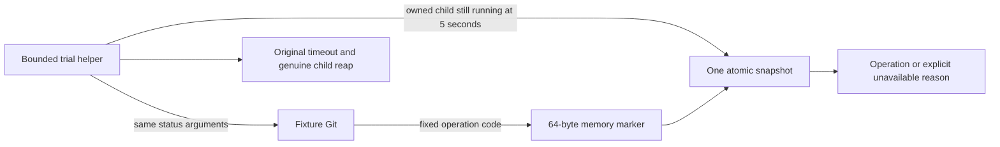

# Identify the active Git operation during the shared-storage timeout

**Source preparation; no new storage trial has run.** The
[third storage result](2026-10-09-cephfs-cost-result.md) remains incomplete.
The [owned-child observation](2026-10-09-cephfs-wait-diagnostics.md) could not
read the required syscall under the node's existing Yama policy. This source
adds an in-process alternative for [issue #130](https://github.com/thaynes43/dev-env/issues/130),
without changing pod privileges or extending the original command deadline.

The marker distinguishes a file metadata check, the content-open wrapper and a
small-file content read inside Git's index-refresh scope. It identifies an active
Git operation, not a kernel syscall or an ultimate Ceph failure. An idle marker,
uncovered code path, overlapping writer, changing snapshot or unsupported ABI
remains unavailable evidence.

## Keep the diagnostic separate from normal agents

The fixture retains the exact existing agent-image base and its original system
Git. A separate executable at `/opt/dev-env/trials/git-wait` is selected explicitly
for the two fixture status calls; their arguments still begin with `git` and keep
the original porcelain/untracked flags. Reconnect and all other commands keep
the system executable. The fixture's default entrypoint refuses to run an agent.
No v1 image, PATH, repository configuration or existing release tag is replaced.

Reconstruct the installed Debian `1:2.39.5-0+deb12u3` source from pinned primary
artifacts, preserving its complete seven-patch series. Verify the upstream tag,
commit, archive and reviewed call sites. Build an uninstrumented control and an
instrumented binary from that same source and the same Debian compile options;
record the compiler, effective stat macros and binary/reader checksums. This
does not claim the historical distro binary used the same compiler or timing.
Apply the declared post-link strip operation identically to both paired binaries;
the image-file caps do not change the shared-storage fixture's byte budget.

Compilation runs only in hosted CI under `nice -n 19` and `make -j2`. One finite,
offline container fixture compares control, instrumented and distro status
output, exit status, WIP, references and index bytes. Separate small ABI/process
fixtures check errno preservation, coherent/unavailable samples, ownership,
timeout, cancellation and cleanup. There is no stress loop or broad upstream
test run. Package the corresponding source and build recipe with the artifact.
Hosted CI also invokes the actual helper's image/ABI preflight, binding its source
commit and helper checksum to the external checkout rather than image metadata.
Artifact, source or option mismatches refuse publication.

## One observation, within the existing budget

The parent creates one sealed 64-byte memory file. Native Git and the parent's
reader use the same fixed, aligned, lock-free C11 atomic ABI. Python treats the
mapping as opaque. The marker contains fixed operation and coherence fields;
it contains no paths, arguments, process identifiers, register values or tokens.
Native wrappers preserve Git's return values, errno and control flow. Nested or
concurrent writers invalidate evidence instead of overwriting another operation.

At the existing five-second checkpoint, the sole parent first proves the exact
child is owned and unreaped. It then makes one coherent atomic read, with no
retry or polling. Native Trace2 uses a separate descriptor. After completion or
timeout, the actual child is reaped before mappings and descriptors are closed.
All original command, helper, Job, CPU, entry, byte and disposable-claim caps
remain. The feature defaults off.

## Before any later execution

Review current-head CI and advisory findings, then explicitly publish from
reviewed main and verify the signed immutable diagnostic digest. Existing
unsigned or uncertain tags cannot acquire provenance through a retry. Publication
does not launch a trial.

A later execution review still requires the exact helper/image, decoded Jobs,
fresh accepted telemetry baseline, required series, fixed household sampling
slots, original stop rules and UID-safe cleanup with the full post-stop window.
The previous monitoring gaps and cadence deviation remain recorded. A useful
operation sample alone does not establish a remedy, shared-storage feasibility,
retained-state/remount safety or owner-test readiness.
