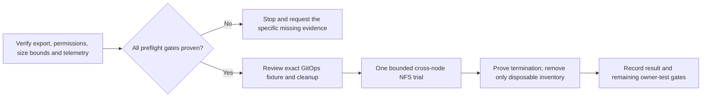

# External storage comparison for shared workspaces

Updated 2026-10-09, America/New_York. This is a read-only inventory and bounded
next-trial proposal. No external workspace, directory, mount, driver or fixture
was created. [Issue #130](https://github.com/thaynes43/dev-env/issues/130) remains
open. A backend must pass the shared Git/workspace gates before normal rollout.

The Proxmox Ceph cluster provides useful alternatives to the in-cluster Rook
cluster. **Existing NFS is the smallest next comparison:** Kubernetes already
mounts it through native NFS volumes. Installing another CSI driver is not
necessary to test it. Direct external CephFS remains a candidate after its
Kubernetes connection, permissions and monitoring are verified.

## What the investigation established

| Path | Verified | What remains | Intended role |
|---|---|---|---|
| In-cluster Rook CephFS | RWX class and running clients; three incomplete synthetic Git trials | Peer status exceeded the original 15-second bound; exact blocking filesystem call and full impact acceptance remain unresolved | Preserve results; avoid another diagnostic attempt by habit |
| External NFS | Existing writable native Kubernetes mounts and running clients | Fresh gateway backing/export configuration, NFS version/options, directory permissions, size bounds, Git/locking/recovery and complete telemetry | First proposed external RWX comparison |
| Direct external CephFS | Active server-side filesystems, including a separate Kubernetes-oriented filesystem | No exposed external CephFS Kubernetes class; connection/driver configuration and client permissions are unverified | Possible direct RWX alternative; audit existing CSI operator before adding a driver |
| External RBD | Installed CSI driver, running provisioners and node plugins | RWO block storage does not provide literal shared cross-pod task files | Private homes/caches, subject to their own acceptance |
| External S3 | Owner reports capability | Endpoint, authentication, retention and restore are untested | Candidate for immutable rescue bundles, artifacts and backup copies |

Current inventory supports CephFS-backed NFS, consistent with historical gateway
evidence, but it is not fresh proof of the gateway's current export backing.
Existing clients establish availability, not suitability for shared Git.

The external Ceph snapshot had a health warning for a recent daemon crash and
one down OSD. Placement groups were active and clean. These are recorded
pre-existing conditions, not a quiet baseline or performance pass. Directory
isolation still shares the gateway, MDS and disks with other clients.

The observer cannot read the installed CSI operator's connection/profile objects.
That path stopped after three denied reads; an empty filtered response is not
evidence that no connection exists. Guest filesystem inspection through the PVE
read token also lacked the required permission; the existing intended operator
read path returned the same denial. An unresolved access gate must be resolved
explicitly, without repeated attempts or a privilege bypass.

Current Prometheus proves a fresh successful NFS TCP reachability probe. Source
describes the intended NFS 4.2 hard-mount path and CephFS backing, but does not
prove current server/export settings. The matched Ceph health/MDS/OSD series
belong to Rook, and no matching external NFS gateway performance series were
found. A successful port probe cannot replace the missing external health and
latency observations. Access and monitoring are concrete preflight blockers.

The external manager advertises a Prometheus service. The initial bounded read
timed out while the dev-env policy lacked its exact target/port allowance.
[Reviewed egress change #3693](https://github.com/thaynes43/haynes-ops/pull/3693)
merged and its unique TCP/9283 rule was observed in the live policy. One subsequent
bounded read returned HTTP 200 in 21 ms. It exposed external Ceph health, OSD and
MDS metrics: health was WARN, 31 of 32 OSDs were up/in, and observed OSD latency
gauges were 0–4 ms. This establishes current read reachability, without proving
the cause of the earlier timeout or storage performance acceptance.

No NFS metric families, explicit sample timestamps or freshness metrics were
exposed. Continuous scraping, sample freshness and gateway observations remain
preflight gates. The change installs no scrape or gateway telemetry, grants no
gateway shell access and changes no pod configuration.

## Proposed first comparison

1. Freeze exact source/image, export identity and mount options. Use one unique
   disposable directory and a static NFS PV/PVC, with verified owner/permissions
   and no access to real repositories, private homes or the existing shelf.
   Nominal PVC capacity does **not** enforce a server-side NFS quota. Establish
   the actual size bound and cleanup method before deployment.
2. Freeze a 30-minute baseline with at least 95% required-series coverage.
   Include equivalent external Ceph/MDS/OSD and gateway observations while keeping
   the protected in-cluster services. Missing external monitoring is a preflight
   failure. Record the existing warning/OSD state; stop on worsening health,
   lost OSDs, slow replies, protected-service restarts or missing fresh data.
3. Reuse the original finite synthetic Git checks on two distinct worker nodes:
   cross-node flock/mkdir and Git ref-lock exclusion, serialized worktrees,
   local/peer status, staged WIP/index/HEAD/common-path preservation, and bounded
   copy/fsync/rename/archive. Keep at most two simultaneous fixture pods, main
   CPU 250m/memory 256Mi and init CPU 100m/memory 128Mi. Inspect admission before
   interpreting results. Data stays within 2,048 entries and 16MiB.
4. Keep ordinary commands at 15 seconds, the helper at 145 seconds, initial Jobs
   at 180 seconds and a later remount Job at 60 seconds. Preserve the existing
   special Git-hook bounds. No automatic retries, increased budgets, burners or
   load loops. Monitor fresh telemetry every 60 seconds and for five minutes
   after cleanup, retaining the stricter original quiet-baseline tripwires from
   the [CephFS trial contract](2026-10-09-cephfs-feasibility.md).
5. Permit a remount only after admitted containers actually terminate, original
   pods are absent, workers are healthy and no gate has breached. Graceful
   remount proves persistence across a clean detach; it does not prove node-loss
   fencing or authorize takeover after a lease expires.
6. Declare scoped activity, then deploy and remove only reviewed disposable
   inventory through GitOps. Capture specs, UIDs and receipts before cleanup.
   Stop Jobs normally before removing their directory/PV/PVC. Preserve v1,
   controllers and shelf, and end the declaration.

A successful comparison need not resolve the original Rook blocking call first.
It also does not select a permanent backend automatically. Normal use still
needs ownership/fencing, failures and recovery, real builds, retention/prune
protection, permissions, monitoring and backup review. Provider/rules, two remote
hosts, phone questions and the accepted task-budget guards remain separate gates.

## Keep the investigation bounded

The original [cost result](2026-10-09-cephfs-cost-result.md) is preserved. Three
incomplete attempts are evidence to change approach, not permission for unlimited
Rook diagnosis. The owner's default is 60 minutes without progress or three
failed attempts at the same blocker, across agents and pods. Any blocked
preflight must name the missing evidence and a bounded next step; it must not
silently launch another fixture or relax acceptance to obtain a pass.
