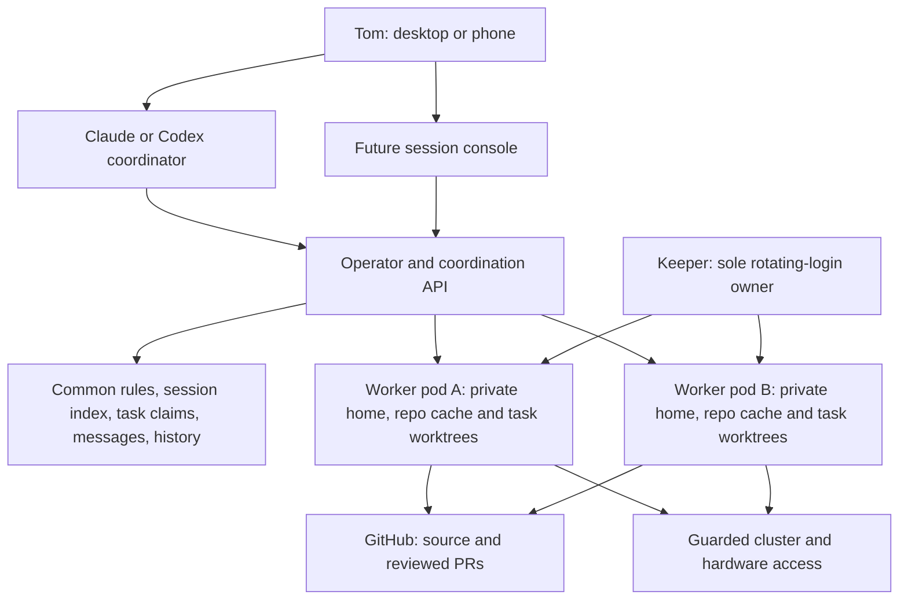
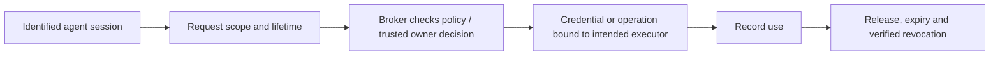

# Dev-env v2: workflow, quick start and feature set

**Scope corrected 2026-10-10, America/New_York.** V2 solves five problems with
v1: upgrades kill sessions, work concentrates on one node, agents have broad
access, session management is difficult, and model usage/cost is unclear.
Agents share rules and authorized context and coordinate tasks. Each pod keeps
its own repositories and ordinary task worktrees.

The controlling decision is [ADR-003](../.agents/sagas/distributed-dev-env/adrs/003-session-coordination-private-repositories.md).
It supersedes the shared-Git/RWX prerequisite. The original ADRs and storage
trial records remain historical evidence. No storage retry or runtime cutover
is part of this documentation change.

## Start here: how you would use it

1. Open a Claude or Codex session and select the project. The project supplies
   common rules and repository identities; its local folders can differ by pod.
2. See existing tasks and live or stopped sessions. Read relevant transcripts,
   memory and handoffs before claiming work already being done elsewhere.
3. Claim a task. The chosen pod fetches the selected repo, records the base
   commit and creates its own worktree. A missing repo is cloned first.
4. Work within the session’s resource, access and attempt budget. Message peers
   or delegate a bounded unit; results carry task, model and source identities.
5. Review and ship the change. Suspend preserves local conversation state.
   Archive must preserve discoverable history before removing the provider home.
6. Continue on another pod by reading the predecessor’s context and restoring
   committed/rescued work into a new local worktree. Verify the previous executor
   stopped before transferring ownership.

These are the target journeys. The feature table identifies gaps; section 3
contains commands for the Claude subset that works today.

## 1. What we are building

The **operator is an API and controller**, not a reasoning agent. It manages
session lifecycle and platform records. The **requester** is `agent-run` or
another client. A **coordinator** is the Claude/Codex agent discussing your
request and assigning work. A future frontend uses the same API.



A Codex computer link identifies a persistent host. Native chats and children
run on that host unless a supported dispatch route creates another worker pod.
Multiple links remain distinct; shared context does not merge enrollment or
move a chat automatically. Keep actual thread, host, executor and node visible.

Provider homes contain credentials and native state and remain private. The
coordination service exposes authorized context; peers do not mount each
other’s writable authentication directories. Common context needs reliable
storage, but it does not require shared Git directories or NFS Git benchmarks.

## 2. Feature set and delivery state

This table reflects source and recorded runtime evidence as of 2026-10-10.
A released feature is not automatically enabled or accepted on live sessions.

| Goal or capability | Available evidence | Remaining work |
|---|---|---|
| Upgrade without killing sessions | Operator lifecycle leaves running session Pods intact; operator restart preservation tested | Safe agent-image replacement and busy-host drains; interrupted native recovery |
| Distribute load | Bounded task Pods scheduled on workers; real Claude task ran with CPU/memory limits | Prove placement across nodes; native Codex threads still share their host’s resources |
| Claude task and terminal workflows | Task, attach/detach, TUI messages, suspend/resume and Git rescue exercised | Owner pilot and history-preserving archive |
| Codex sessions across pods | Keeper login, scoped-host/task and owned-native source foundations released | Two live distinct links, refresh adoption, native execution/recovery and device acceptance |
| Common rules and projects | Catalog parser, private declared-project admission/preparation and provider rule composition source | Bootstrap/refresh local repo catalogs; permanent project roots; prove actual rules loaded by both providers |
| See live and stopped work | Managed Session list/show and fleet placement exist | Durable registry after reap; native host/thread indexing and accurate activity |
| Communicate and avoid duplicates | Attributed live TUI message route; same-parent request idempotency | Durable inbox and acknowledgements; explicit task claims across independent parents |
| Read prior context | Provider artifacts exist; running task log tails available | Authorized transcript/memory/handoff reads without the source Pod; retain history before reap |
| Guard powerful access | Scoped broker/grant foundations; keeper-only CA and node trust prepared | Usable guarded Headlamp/hardware replacements, approved policies and use/revocation acceptance |
| Stop wasted attempts | Accepted 60-minute stall/three-failure policy; retained ledger and stop foundations released | Whole-task accounting, real progress/failure signals, verified stop and phone escalation |
| Model usage and cost | Exact model identity; provider-specific token/cost parsers | Provenance, Unknown values, fleet aggregation and no parent/child double counting |
| Frontend | Existing management API and CLI | Console for sessions, nodes, tasks, messages, retained history, renewal and cost |
| Local LLMs and GPUs | Design/backlog exists | GPU availability, household-safe allocation and a provider backend under the same contracts |

The ordinary worker template was still 2.9.1 at the overnight checkpoint;
2.11.0 was signed and used for a separate native fixture. That fixture failed
without a valid acceptance result. A later reviewed source fix does not count
as a new runtime pass. See [HANDOFF](../.agents/HANDOFF.md) and
[overnight evidence](trials/2026-10-10-overnight-results.md).

## 3. Quick start with the working paths

### Pick the launcher first

In the current v1 pod, the command named `agent-run` is **v1's shell launcher**.
V2 is a different Go binary. Do not overwrite the v1 command or assume identical
verbs mean identical behavior. The examples below use `v2run` as a shell array
holding the explicitly selected v2 binary.

For ordinary work today, continue using v1 or ask an agent to start the session:

```bash
# V1: Claude terminal plus phone session.
agent-run --repo dev-env --agent claude --interactive \
  --model claude-opus-5-5 --effort xhigh

# V1: separate Codex terminal session; phone access belongs to the daemon.
agent-run --repo dev-env --agent codex --local \
  --model gpt-6-astra --effort max

# V1: check whether the daemon supervisor session exists.
tmux has-session -t codex-remote
```

Keep `-p` separate from `--local` and `--interactive`. A headless task has its
prompt at creation; an interactive session gets its first prompt after its
banner is checked. No laptop kubeconfig ceremony is required for Tom's current
workflow.

### Prepare a v2 CLI from a fresh task worktree

Use a unique task name. These commands assume the existing canonical clone is
`/home/dev/repos/dev-env`. Run each step only if the previous one succeeds.
The single shell script stops on errors; it never implements in the canonical
clone.

```bash
set -e
guide_task="dev-env-cli-$(date -u +%Y%m%d-%H%M%S)"
guide_checkout="/home/dev/work/$guide_task"

git -C /home/dev/repos/dev-env fetch --prune origin
guide_base=$(git -C /home/dev/repos/dev-env rev-parse 'origin/main^{commit}')
git -C /home/dev/repos/dev-env worktree add \
  "$guide_checkout" -b "agent/$guide_task" "$guide_base"
cd "$guide_checkout"
PATH="/home/dev/.local/go/bin:$PATH" make build
v2run=("$guide_checkout/bin/agent-run")
"${v2run[@]}" version
```

The current pod's Go installation is `/home/dev/.local/go/bin`; the command
above makes it available even in a shell that did not load the interactive
profile. `make build` uses the repository's bounded Go settings. Build once; reuse that
binary for the steps below. On this shared pod, do not run CPU burners or wide
test/build loops. Images build in CI.

The v2 client also needs the public operator CA. In v1, write it from the
existing ConfigMap; the CLI reads this file and mints its own short-lived caller
token using the pod's identity:

```bash
guide_ca="/tmp/$guide_task-operator-ca.crt"
kubectl -n dev-agents get configmap dev-env-api-ca \
  -o jsonpath='{.data.ca\.crt}' > "$guide_ca"
test -s "$guide_ca"
export DEV_ENV_API_CA_FILE="$guide_ca"
"${v2run[@]}" fleet
"${v2run[@]}" help run
```

The CA is public trust material, not a token. Do not print or save a minted
credential to use these instructions. External clients have a separate optional
path in the [external CLI handoff](../.agents/handoffs/2026-10-08-laptop-access.md).

### Start and follow a v2 session

These examples start **Claude**, the currently supported v2 agent. Run a task
or start a local session according to the work you actually need; each command
creates a separate pod.

```bash
# A bounded headless task. The prompt runs once.
"${v2run[@]}" --repo dev-env --agent claude \
  --model claude-opus-5-5 --effort xhigh --size S \
  --timeout 30m --max-turns 20 -p "Read HANDOFF and report the current plan status."

# An interactive terminal session.
"${v2run[@]}" --repo dev-env --local --agent claude \
  --model claude-opus-5-5 --effort xhigh --size S

"${v2run[@]}" list --repo dev-env
"${v2run[@]}" show SESSION
"${v2run[@]}" log SESSION --tail 40
"${v2run[@]}" attach SESSION
```

Replace `SESSION` with the returned name. Attach is for the owner/client identity,
including the trusted v1 client; session agents use the message API. Detach with
`Ctrl-b d` and the session keeps running. A Pending session is waiting for
capacity, not a reason to launch duplicates.

```bash
# Local TUI only; headless tasks do not accept messages.
"${v2run[@]}" msg SESSION "The coordinator is reviewing the deployment evidence for this project."

# Rescue, stop the pod, keep its home and conversation.
"${v2run[@]}" suspend SESSION
"${v2run[@]}" show SESSION
"${v2run[@]}" resume SESSION

# Finish only after required history is separately retained: Git rescue then reap.
"${v2run[@]}" reap SESSION
"${v2run[@]}" rescue list --session SESSION

# If a complete bundle exists, create a new session from it.
"${v2run[@]}" rescue restore OLD_SESSION/STAMP --local
```

Follow transitions with `show`/`list`; `reap` returning does not mean cleanup has
already finished. An archived session is restored into a new session, not resumed.
Rescue preserves Git work. **The ordinary private reap path deletes the home;
it does not retain the provider transcript or memory.** Suspend preserves the home temporarily, but private sessions auto-archive
after their configured `archiveAfter` (default 168 hours). Verify required
history retention before that deadline; suspend is not an indefinite backup.
Archive/history retention is a remaining feature. Rescue does not back up ignored files or every home file; snapshots
stay private and are never pushed.

V2 `--interactive`, automatic image drains and the complete grant/login CLI
remain unfinished. The first #173 source slice admits declared project tasks
into private worktrees and supplies project rules without RWX. New budget-bound
private dispatch remains refused pending separate integration. GitOps delivery
and actual-provider acceptance are recorded separately on
[#173](https://github.com/thaynes43/dev-env/issues/173). The new private-project
admission flag stays disabled for that promotion; existing fixture/coordinator
flags remain unchanged. The two-host and both-provider coordination
workflow is unaccepted. Use the selected binary’s help and current deployment
evidence. [DESIGN-005](../.agents/sagas/distributed-dev-env/designs/005-private-project-tasks.md)
defines the bounded contract.

## 4. The everyday workflow

```mermaid
sequenceDiagram
    participant O as Owner / coordinator
    participant API as Coordination API
    participant A as Agent A on pod A
    participant B as Agent B on pod B
    O->>API: Find project, prior work and current task owner
    API-->>O: Session states, context and rule revisions
    O->>API: Claim explicit task
    API->>A: Start bounded work with fresh local source
    B->>API: Discover task before starting duplicate work
    API-->>B: Existing owner and authorized context
    B->>API: Send attributed message / offer assistance
    API-->>A: Deliver or retain message
    A->>API: Publish result and retained history
    O->>API: Stop and verify old executor before handoff
    API->>B: Transfer task; restore work into B’s local worktree
```

The claims, offline inbox and stopped-history portions are delivery targets.
Current messages go to a live TUI; the log endpoint needs a Ready source Pod.
A same-parent idempotency key does not prevent two unrelated coordinators from
starting the same objective. Use explicit task/issue identity for atomic claims;
the platform cannot reliably infer all duplicates from free-form prompts.

A task may use multiple sessions or pods. Its budget, prior failures and context
follow the task. Peer messages are attributed data, not new owner authority.
The management client should show uncertainty and the observation time when
status is stale, rather than calling a missing heartbeat a confirmed stop.

## 5. One project for both agents, across pods

A project is a common repository map and rule set. It is not a shared checkout.
Both providers load the same accepted global/project rules plus repository
instructions. Task records retain the effective rule revision for later review.

| Shared through the platform | Private to each pod or logical host |
|---|---|
| Accepted global/project rules and repository identities | Local reference clones and task worktrees |
| Task claims, session metadata and attributed messages | Provider credentials, refresh/enrollment state and sockets |
| Authorized transcripts, published memory, handoffs and results | Writable native provider databases and live home |
| Usage, budget and source/rule provenance | Build caches and local execution processes |

Repository history and provider conversation history have different retention
needs. Git rescue does not preserve the transcript or all memory. Keep readable
context and a discoverable session record after stop/archive; exact native
conversation restoration is a separate capability. A receiving agent can start
a new conversation after reading the predecessor’s context.

Two Codex links may expose similarly named project folders backed by different
local clones. Each link has private enrollment and a stable host identity.
Choosing the other link must still show who is doing the work and provide
context reads; it must not silently launch another copy or steal an active task.
See [session coordination](session-coordination.md) for the source audit and
[two Codex hosts](codex-coordinator-hosts.md) for the host lifecycle boundary.

## 6. Protection from stale repositories

At pod/host startup, bootstrap missing declared repositories and fetch the
catalog. Update clean reference views safely and report failures. Dirty state,
local-only commits, other worktrees and unfinished Git operations are preserved.
A startup fetch cannot guarantee freshness hours later.

Before each new task:

1. Fetch the selected repository. If that fails, block fresh implementation;
   use an explicitly verified rescue/offline recovery path when appropriate.
2. Resolve and record the exact base commit, origin and requested branch.
3. Create a task worktree and branch from that commit, outside the reference clone.
4. Load project/repository rules and record the revision actually supplied.
5. Publish source/rule identities with the task so peers can assess its context.

Private clone/worktree task-start fetch and pinning already exist. Full catalog
bootstrap at startup and all supported client entry points still need integration.
Resume preserves existing WIP; it does not reset the worktree to the latest main.
No broad reset, clean or deletion of ambiguous local state is a freshness policy.

## 7. Access, credentials and approval

The goal is useful access with recorded scope and bounded lifetime. V1 currently
has a reachable Headlamp admin path and hardware credentials with powerful
access. Existing Omni is Reader; wider Omni permissions are a separate guarded
scope. GitOps self-merge is also an authority path and must appear in the design.



Replace the standing admin bypass with a usable guarded path for required
operations. Prove authorized use and unauthorized refusal, expiration and
cleanup. The docs reset grants no new access and removes no running v1 caller.
Routine access policies and elevated owner approval remain distinct.

Questions should arrive as actionable prompts in the controlling app, one at
a time when a decision is needed. A delivered question is not by itself a
trusted privileged approval protocol. The existing ruling favors approval in
the Claude app; no new approval app has been selected. Phone delivery and the
broker’s trusted decision path need acceptance.

The keeper owns rotating login refresh; session pods receive access-only
projections. Account login is different from computer pairing. Fresh v2 login
must not create a second refresher for v1’s credential.

### Proxmox activation checkpoint

Q-19's CA storage step is complete by owner confirmation in existing
`HaynesKube/dev-env`. Keeper-only projection shipped through haynes-ops #3642:
ESO is SecretSynced and the keeper is Ready with a read-only CA mount. Minting
stays disabled. Q-22's delegated trust installation is complete on all five PVE
nodes, with original key bytes and existing v1 access preserved. Do not generate
another CA or item. One offline in-keeper validation now confirms its saved
private/public pair is valid, after the keeper-only #3669 rollout. Existing
v1/controller/broker/shelf pod identities and restart counts were preserved.
Remaining activation order:

1. Supply private targets, pinned host keys, keeper TCP22 access and accepted
   policies. Keep actual trust material and private addresses out of public docs.
2. Enable keeper and broker together only after prerequisites pass. Declare
   activity; test real mint/install/use/release/expiry/recovery and cleanup.
3. Remove fixtures and compare v1/existing session UIDs and restart counts.

[Node-trust guide](keeper-node-trust.md) records the restricted CA installation
and guarded rollback. Temporary delivery cleanup is merged and deployed.
Certificate/provider acceptance remains separate from the successful local pair
check. The validator neither connects to nodes nor mints a credential.

General hw-ssh certificates are a separate unfinished feature. Certificate
expiry alone does not terminate an existing SSH connection; P-19 needs its
connection/revocation contract before acceptance.

## 8. Remaining work and the cutover gate

The first useful pilot demonstrates two independent agent environments that
load common rules, start fresh worktrees, discover each other, exchange messages
and read a stopped session’s context. It also reports actual placement and
preserves running work through an operator upgrade.

| Delivery unit | Concrete completion evidence |
|---|---|
| Decouple project/rule preparation from shared Git | Independent local clones; selected-task fetch; both providers load the expected rules |
| Retain and index session context | Live/stopped/archived records; authorized history read with source Pod absent |
| Coordinate tasks and messages | Conflicting explicit claim refused; attributed message survives recipient stop; acknowledgement visible |
| Finish native lifecycle and budgets | Owned stop/recovery, retained WIP, shared task attempt history and real owner escalation |
| Guard required access | Supported task succeeds through scoped policy; bypass/unauthorized action refused; expiry/revocation verified |
| Correct usage/cost reporting | Exact model/task attribution; missing amounts Unknown; billing versus estimates labelled; no duplicate totals |
| Add console and local provider | UI uses the same API; local models follow resource, rules, context and access contracts |

Plan [11](../.agents/sagas/distributed-dev-env/backlog/11-project-workspaces.md)
and the [coordination audit](session-coordination.md) define the first units.
The prior 7–14 hour estimate included superseded storage work and is withdrawn.
Size new implementation units after their acceptance contract is concrete;
each unit needs a bounded checkpoint before spending more time.

**Pilot acceptance is distinct from v1 retirement.** The historical capability
inventory remains useful for migration planning. Required owner workflows need
usable replacements before cutover, and Tom must explicitly approve retirement.
It is not necessary to finish every inventory row, the full frontend or local
models before testing a smaller coherent workflow.

## 9. How we keep the project on track

Each unit states the owner problem, acceptance evidence, current task owner,
source/rule revision and time/attempt budget. Reports distinguish built, deployed
and accepted; a passing source test does not prove a phone or native-host journey.

The default is **60 minutes without progress or three failed attempts at the
same blocker**. Stop further attempts, preserve work and evidence, and ask one
actionable owner question with a concrete bounded next option. Counters carry
across agents, pods, methods and resumes. Observed progress must describe a
useful result; restarting a tool is not progress by itself.

The stopped NFS helper and observer remain historical. They demonstrated
problems in our test tooling, not a NAS failure. Shared-Git trials no longer gate
this scope, and the old routes will be closed without another attempt. Gasha01
remains an available storage option when an actual home/context workload needs
it. Avoid replacing a real product outcome with an infrastructure benchmark.

Keep decisions in the ADR, tasks in durable issues and actual workflow evidence
in delivery records. The guide is the owner’s product map; update it whenever a
scope decision changes the experience.
