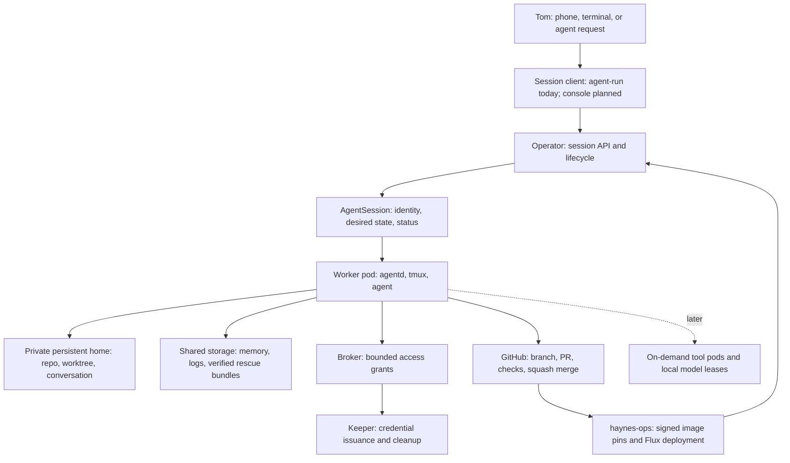
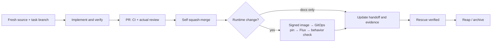
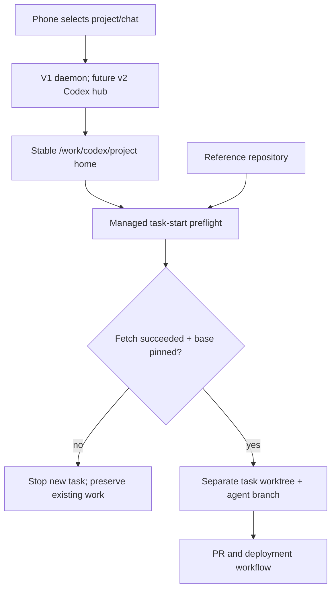
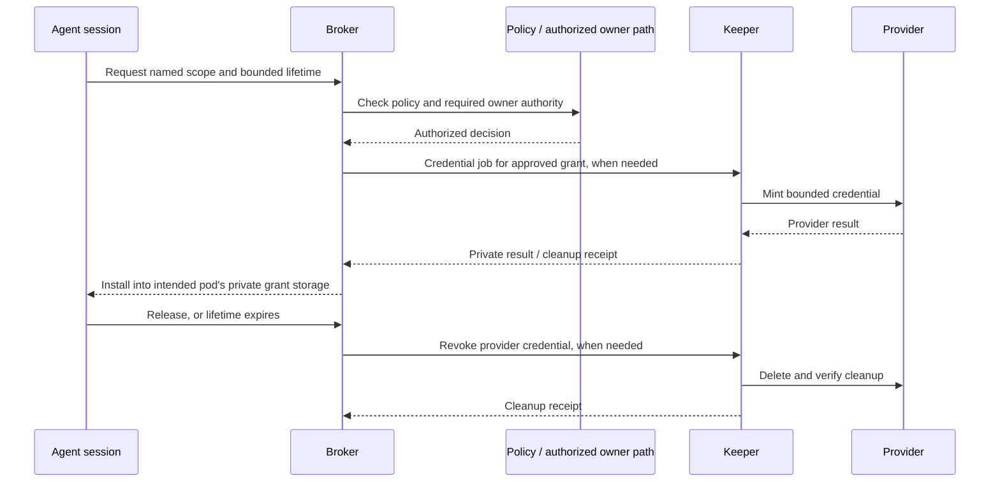
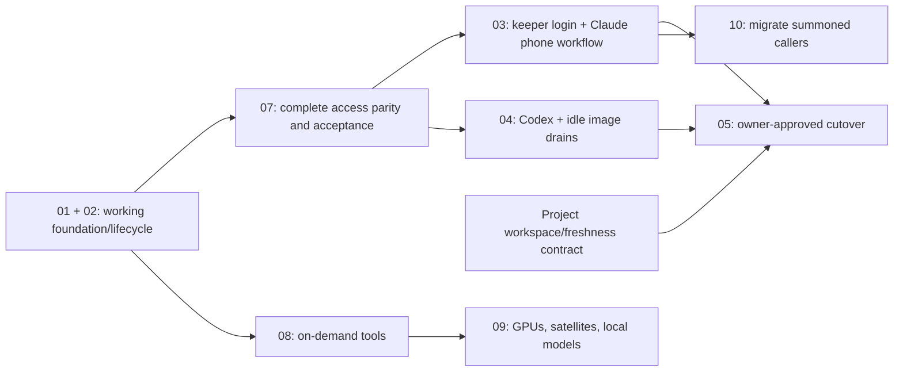

# dev-env workflow and quick start

Updated 2026-10-09, America/New_York. This guide describes the product, the
working paths, and the evidence still required before v2 replaces v1.

**The goal:** give each agent task its own workspace and resource limits, keep
project conversations easy to find from a phone, preserve today's maintenance
capabilities, and recover unfinished work before removing a session.

**Today:** v1 still runs normal work. V2's foundation and Claude task/terminal
lifecycle are working. Temporary Kubernetes and network grants are built, but
no standing grant policies are live. Proxmox credential minting is built and
disabled. V2 phone sessions, the Codex hub, automatic image drains, and the
management console are unfinished. All twenty capability parity checks remain
open. This is a quick start for the working subset, not cutover approval.

Read [HANDOFF](../.agents/HANDOFF.md) for current deployment evidence and
[CLAUDE.md](../CLAUDE.md) for operating rules. The
[design](../.agents/sagas/distributed-dev-env/designs/001-dev-env-v2.md) and
[plan index](../.agents/sagas/distributed-dev-env/README.md#plan-backlog) remain
the sources for decisions and acceptance criteria.

## 1. What we are building

V1 puts sessions, repositories, authentication, and tools in one long-running
pod. V2 separates the control services from agent work. A task gets a session
pod on a worker, its own persistent home, and a branch/worktree. The scheduler
places it using its resource requests. If there is no room, it stays Pending
with a visible reason.



The diagram shows the target. It does not imply every connection is enabled.
The keeper issues GitHub tokens today; keeper-owned Claude and Codex login
refresh are still planned. PVE issuance remains off.

| Part | Responsibility | What must survive a restart |
|---|---|---|
| Operator | Create sessions, report placement and lifecycle, rescue before removal | Session state in Kubernetes resources |
| agentd | Prepare the workspace, supervise the agent, report status, rescue work | Home volume, conversation identity, branch and files |
| Broker | Decide and revoke scoped access grants | Grant status and expiry; an independent egress expiry backstop exists |
| Keeper | Own credential issuance and provider cleanup | Durable credential state and cleanup journal; one owner per rotating login |
| Codex hub, planned | Keep one phone computer entry and route Codex work | Its enrollment and state on its own volume |
| Shelf | List, verify, restore and prune rescue bundles | Shared storage, separate from session-home storage |
| Workbench/console, planned | Give people a place to manage sessions | Stable access paths; no agent work required by default |

The code, CLI, images, and design live in **dev-env**. Deployment manifests and
pod configuration live in **haynes-ops**. Changes deploy through PRs and Flux.

## 2. Feature set and delivery state

“Working” means the relevant acceptance was run. “Built” means implementation
exists; it can still need wiring or provider acceptance. “Planned” means the
guide is describing the target.

| Feature | State | What the user gets / what remains |
|---|---|---|
| One worker pod and home volume per session | Working, plan 01 | Independent CPU/memory limits and workspace; Pending reports capacity |
| Claude headless tasks | Working, plan 01 | Run one prompt once, report outcome, preserve work |
| Claude local terminal sessions | Working, plan 02 | Attach/detach, message, log, suspend, resume |
| Idle suspension and archival | Working, plan 02 | Keep the volume during suspension; archive through the rescue path |
| Rescue and restore | Working, plans 01/02 | Verified Git bundles on the shelf; restore into a new session |
| Operator upgrades leave running sessions alone | Working | Existing pod UIDs are preserved; older sessions can report Outdated |
| Optional external CLI | Built, plan 02 | Token and loopback forwarding path; real external-machine use is unverified and optional |
| GitHub installation tokens | Working | Keeper issuance; App private key stays out of session pods |
| Kubernetes and egress grant core | Built and smoke-tested | Temporary identities, private installation, release/expiry; complete standing policies and parity still missing |
| Proxmox credential backend | Built, disabled | Keeper SSH minting and recovery, typed PVE files/helper; CA delivery, node trust, network/policy wiring and real provider acceptance remain |
| General hw-ssh grants | Unbuilt | Must retain existing targets, command classes, PTY/stdin behavior, and owner rules |
| V2 Claude phone sessions and Max refresh owner | Planned, plan 03 | Keeper-owned login, Remote Control registration/resume, renewal and archive |
| V2 Codex hub and per-session Codex | Planned, plan 04 | Stable phone enrollment, sole refresh owner, isolated task/local pods |
| Phone Codex execution in separate session pods | Conditional, plan 04 | Requires S-4 to prove the exec-server path on the pinned CLI |
| Automatic drain onto new images/config | Planned, plan 04 | Wait for idle, preserve conversation, resume on a new revision |
| Management console | Planned, plan 03 | Sessions, links, archive and login renewal; a separate web approval flow is not selected |
| Guarded replacement for Headlamp | Required, unfinished | Preserve accepted task scope and owner directives; prove replacement and migrate callers before removal |
| On-demand Blender/audio/image/video tools | Planned, plan 08 | Tool sessions and idle shutdown; existing v1 authoring services remain usable |
| GPU budget, local models and satellites | Planned, plan 09 | Household reservations first; agents use remaining capacity; satellites only while awake and available |
| Summoned automation sessions | Planned v2 migration, plan 10 | Preserve existing lanes, links, watchdogs, outcomes and usage tracking; v1 executor continues until migrated |

Session sizes are presets, not a fleet cap:

| Size | CPU / memory request | CPU / memory limit | Typical use |
|---|---|---|---|
| S | 100m / 1Gi | 2 / 4Gi | Coordinator, light task |
| M, default | 250m / 2Gi | 4 / 8Gi | Ordinary coding |
| L | 1 / 6Gi | 8 / 24Gi | Larger build |

The three profiles are `full`, `dev`, and `ops`. They select credential
references, network baseline and permitted standing scopes. They do not prove
capability parity by themselves. See
[R-04](../.agents/sagas/distributed-dev-env/research/R-04-v1-capability-parity.md).

## 3. Quick start with the working paths

### Pick the launcher first

In the current v1 pod, the command named `agent-run` is **v1's shell launcher**.
V2 is a different Go binary. Do not overwrite the v1 command or assume identical
verbs mean identical behavior. The examples below use `v2run` as a shell array
holding the explicitly selected v2 binary.

For ordinary work today, continue using v1 or ask an agent to start the session:

```bash
# V1: Claude terminal plus phone session.
agent-run --repo dev-env --agent claude --interactive \
  --model claude-opus-5-5 --effort xhigh

# V1: separate Codex terminal session; phone access belongs to the daemon.
agent-run --repo dev-env --agent codex --local \
  --model gpt-6-astra --effort max

# V1: check whether the daemon supervisor session exists.
tmux has-session -t codex-remote
```

Keep `-p` separate from `--local` and `--interactive`. A headless task has its
prompt at creation; an interactive session gets its first prompt after its
banner is checked. No laptop kubeconfig ceremony is required for Tom's current
workflow.

### Prepare a v2 CLI from a fresh task worktree

Use a unique task name. These commands assume the existing canonical clone is
`/home/dev/repos/dev-env`. Run each step only if the previous one succeeds.
The single shell script stops on errors; it never implements in the canonical
clone.

```bash
set -e
guide_task="dev-env-cli-$(date -u +%Y%m%d-%H%M%S)"
guide_checkout="/home/dev/work/$guide_task"

git -C /home/dev/repos/dev-env fetch --prune origin
guide_base=$(git -C /home/dev/repos/dev-env rev-parse 'origin/main^{commit}')
git -C /home/dev/repos/dev-env worktree add \
  "$guide_checkout" -b "agent/$guide_task" "$guide_base"
cd "$guide_checkout"
PATH="/home/dev/.local/go/bin:$PATH" make build
v2run=("$guide_checkout/bin/agent-run")
"${v2run[@]}" version
```

The current pod's Go installation is `/home/dev/.local/go/bin`; the command
above makes it available even in a shell that did not load the interactive
profile. `make build` uses the repository's bounded Go settings. Build once; reuse that
binary for the steps below. On this shared pod, do not run CPU burners or wide
test/build loops. Images build in CI.

The v2 client also needs the public operator CA. In v1, write it from the
existing ConfigMap; the CLI reads this file and mints its own short-lived caller
token using the pod's identity:

```bash
guide_ca="/tmp/$guide_task-operator-ca.crt"
kubectl -n dev-agents get configmap dev-env-api-ca \
  -o jsonpath='{.data.ca\.crt}' > "$guide_ca"
test -s "$guide_ca"
export DEV_ENV_API_CA_FILE="$guide_ca"
"${v2run[@]}" fleet
"${v2run[@]}" help run
```

The CA is public trust material, not a token. Do not print or save a minted
credential to use these instructions. External clients have a separate optional
path in the [external CLI handoff](../.agents/handoffs/2026-10-08-laptop-access.md).

### Start and follow a v2 session

These examples start **Claude**, the currently supported v2 agent. Run a task
or start a local session according to the work you actually need; each command
creates a separate pod.

```bash
# A bounded headless task. The prompt runs once.
"${v2run[@]}" --repo dev-env --agent claude \
  --model claude-opus-5-5 --effort xhigh --size S \
  --timeout 30m --max-turns 20 -p "Read HANDOFF and report the current plan status."

# An interactive terminal session.
"${v2run[@]}" --repo dev-env --local --agent claude \
  --model claude-opus-5-5 --effort xhigh --size S

"${v2run[@]}" list --repo dev-env
"${v2run[@]}" show SESSION
"${v2run[@]}" log SESSION --tail 40
"${v2run[@]}" attach SESSION
```

Replace `SESSION` with the returned name. Attach is for the owner/client identity,
including the trusted v1 client; session agents use the message API. Detach with
`Ctrl-b d` and the session keeps running. A Pending session is waiting for
capacity, not a reason to launch duplicates.

```bash
# Local TUI only; headless tasks do not accept messages.
"${v2run[@]}" msg SESSION "The coordinator is reviewing the deployment evidence for this project."

# Rescue, stop the pod, keep its home and conversation.
"${v2run[@]}" suspend SESSION
"${v2run[@]}" show SESSION
"${v2run[@]}" resume SESSION

# Finish: rescue, remove the pod and archive its home.
"${v2run[@]}" reap SESSION
"${v2run[@]}" rescue list --session SESSION

# If a complete bundle exists, create a new session from it.
"${v2run[@]}" rescue restore OLD_SESSION/STAMP --local
```

Follow transitions with `show`/`list`; `reap` returning does not mean cleanup has
already finished. An archived session is restored into a new session, not resumed.
Rescue preserves Git work. It is not a backup of ignored files, build caches or
every file in the home. Rescue snapshots stay private and are never pushed.

V2 `--interactive`, Codex creation, `restart`, grant CLI and login commands are
unfinished. Use `help` on the selected binary rather than the target design's
future command list.

## 4. The everyday workflow

1. **Choose the project and outcome.** Keep one coordinator chat for the project
   and give each implementation task its own workspace and owner. Read current
   HANDOFF and rules from the verified repository revision.
2. **Start from current source.** Fetch the reference repository successfully,
   resolve the selected base to a commit, and create a new task branch. A folder
   surviving on a volume does not prove its code is current.
3. **Do the work in the task workspace.** Use exact model IDs. Delegate eligible
   Codex work to native `gpt-6.1-sol` agents at `xhigh`; the coordinator keeps
   design decisions, owner questions, user-facing writing and final review.
4. **Request access when needed.** The target is automatic, short-lived standing
   grants for accepted routine work, with explicit authority for owner-directed
   workflows. Today's empty standing-policy set is a delivery gap.
5. **Ship through a PR.** Run relevant bounded checks, read actual Claude review
   findings, fix or answer them, and squash-merge once required CI is green.
6. **Follow deployment.** If behavior runs in a container, verify the signed
   image, haynes-ops pin, Flux readiness and actual behavior. Merged code alone
   does not close a runtime task.
7. **Record and close.** Update HANDOFF and the plan evidence. Reap only after
   work is shipped or safely recorded. The platform verifies rescue before
   removing the session's storage.



A controller upgrade preserves running session pods. The future agent-image
drain waits for idle and resumes the same conversation on the same home.
“Outdated image,” “branch behind main,” and “old chat context” are separate
conditions; fixing one does not fix the others.

## 5. Codex sessions and `/work/codex`

### The objects we need to keep separate

| Object | Purpose | Owner / lifetime |
|---|---|---|
| Connected computer / hub | Reach the environment from the phone | One enrollment per hub; persists on its volume |
| Project folder | Give a project a stable entry point | Project lifetime; implementation goes into task worktrees |
| Chat | Preserve the conversation, intent and decisions | May outlive a task; does not update source files |
| Task worktree | Hold one implementation branch and its files | One task owner; kept until merge or verified rescue |
| Reference repository | Fetch objects and refs for new worktrees | Managed shared reference in v1; private clone per v2 session |
| AgentSession | Let v2 own a pod, home, lifecycle and status | Platform resource; does not yet map phone Codex chats into pods |

Codex CLI uses its working directory as the project context. A saved conversation
has its own transcript and recorded directory, while reads use the current files.
Local folder projects differ from ChatGPT projects containing uploaded sources.
See [official Projects and chats documentation](https://learn.chatgpt.com/docs/projects).

Codex-managed worktrees start from the selected branch's local HEAD and normally
use detached HEAD. Their creation alone does not guarantee a recent fetch. For
our workflow, select a freshly verified base and create an `agent/<task>` branch
before publishing. See [official worktree documentation](https://learn.chatgpt.com/docs/environments/git-worktrees).

### Recommended v1 folder contract — proposed, not deployed

Tom requested `/work/codex` as the project entry point. The audit found that
neither `/work` nor `/work/codex` currently exists. The existing launcher uses
`/home/dev/repos` and `/home/dev/work`. Preserve those reference/task locations
while adding stable project homes on persistent storage:

```text
/work/codex/
  dev-env/                 managed Git project/coordinator home
  haynes-ops/              managed Git project/coordinator home
  another-project/         one stable entry per project

/home/dev/repos/
  dev-env/                 reference clone; Git administration only
  haynes-ops/               reference clone; Git administration only

/home/dev/work/
  dev-env-task-a/           branch agent/task-a; one implementation owner
  dev-env-task-b/           branch agent/task-b; another implementation owner
```

The project home should be a managed Git-backed checkout so clients that expect
a repository can discover it. It is the coordinator's entry, with source
revision visible. New task worktrees must come from a newly fetched, pinned
reference commit, independently of that project's cached HEAD. Refresh a project
home only when its local users are at a safe boundary and it is clean; never
reset a chat's active implementation worktree to make a sidebar project look fresh.

The implementation must make `/work/codex` resolve to persistent storage and
teach the relevant launcher/client how to register and use it. A symlink alone
does not supply a freshness check. Existing chats keep their current directories
until explicitly migrated; their histories and authentication are not copied.
Q-20 records the clarification about which app registers these folders.



### How Codex differs from Claude Code here

| Concern | Claude Code | Codex |
|---|---|---|
| Phone control in v1 | A Remote Control entry per opted-in session | One machine daemon hosting multiple chats |
| Project context | Session launched into its task workspace | Chat's project/cwd must point to the intended workspace |
| New task from phone | Existing launcher creates the worktree | A phone chat can bypass that launcher; it needs equivalent preflight |
| Delegation | Provider-native subagents | Native collaboration children; separate CLI sessions use `agent-run` |
| V2 identity target | Keeper-owned Max login; access tokens to pods | Stable hub enrollment; keeper-owned Codex refresh; access tokens to pods |
| Distribution status | Task and local supported; phone path unbuilt | V2 creation rejected today; hub and isolated execution unbuilt |

The pod's pinned CLI and GitOps scripts establish its current daemon behavior.
General OpenAI documentation also describes desktop/SSH remote projects; that
does not establish acceptance of our Linux-pod hub or cross-pod executor. See
[official remote connections documentation](https://learn.chatgpt.com/docs/remote-connections).

### Session management recommendations

- Keep a named coordinator chat per project for decisions and progress. Give
  each concrete implementation outcome a separate task workspace; do not let two
  independent agents edit the same branch/worktree.
- Resume an existing chat when continuing the same task. Use its exact chat ID
  and worktree identity for managed CLI resume; a global “last chat” can select
  the wrong project. Resume checks repository, branch and local work first.
- Start a new chat for a new outcome or a reset handoff. Read the durable handoff
  from current source and the old task's explicit branch/PR evidence.
- Keep enrollment, transcripts and workspace lifetimes distinct. Archiving a
  chat is not Git rescue or platform reap; reaping a pod is not deleting the
  phone's computer entry.
- In v2, implement the accepted hub and keeper ownership first. Prove the S-4
  execution path before claiming that a phone chat runs in its own worker pod.

## 6. Protection from stale repositories

### What exists and what the launch contract must add

V1's `agent-run` fetches the canonical repository and stops on failure before
adding a worktree. Phone-started Codex chats bypass that path. V2 privately clones
each session, which avoids sharing a mutable clone between session pods, but
its old reused-clone path warned and continued even before a new branch existed.
This change closes that new-branch failure path and pins its base commit.
Existing branch/worktree recovery remains allowed with a warning after fetch
failure; preserving unfinished work is different from selecting fresh source.
A verified rescue restore can intentionally start from its imported historical
branch offline. A saved conversation with both its worktree and branch missing
must be restored rather than silently paired with a new branch from today's code.
Existing-workspace branch changes or detached HEAD also warn rather than block
resume; deliberate checkouts and in-progress rebase/bisect state remain intact.
A foreign clone/path or broken HEAD still fails. See D-73 for the boundary.

Folder layout is only discovery. The remaining managed v1/Codex launch contract
needs these checks:

| Moment | Required behavior | If the check fails |
|---|---|---|
| New task | Verify repository identity; successfully fetch; resolve the selected remote base to a full commit SHA; create the worktree from that SHA | Stop before sending an implementation prompt |
| Shared reference mutation | Hold one per-repository lock across fetch, base resolution and worktree registration | Wait with a bounded error; do not race another launcher |
| Project-home use | Show the cached revision; read current rules/handoff from verified source; refresh the clean home at a safe boundary | Report stale source; route new work through preflight |
| Resume | Match chat/worktree/repo/branch; inspect local modifications; fetch and report divergence when possible | Preserve WIP; never auto-reset, auto-rebase or silently substitute another checkout |
| Long-running task | Fetch before integration and report commits behind/ahead of the chosen remote base | Review and merge/rebase deliberately, then rerun affected checks |
| PR publication/merge | Refresh target branch, inspect actual diff, resolve conflicts and review findings; require CI on the current PR head | Block merge until relevant validation is current |

Resolve once and use the SHA, rather than a moving `origin/main`, for creation.
Record repository, selected base ref, full start SHA, successful fetch time,
branch/worktree, and owner/session identity in the managed task record. A daily
background fetch can help, but it cannot replace the per-task check. The full
record and shared lock are **remaining work**, not existing v2 status fields.

A fetch updates remote refs; it does not update a checked-out branch or an old
conversation. A branch deliberately based on an older feature branch can be
valid: record that explicit choice rather than treating every difference from
main as corruption. Failed refresh during resume must be visible and must not
be represented as fresh evidence for deployment or integration.

These controls prevent accidental stale starts. On v1's shared filesystem they
are not an isolation boundary against an agent bypassing the launcher. V2's
private session homes provide stronger separation. The
[session workspace plan](../.agents/sagas/distributed-dev-env/backlog/11-project-workspaces.md)
tracks the missing launch paths and acceptance tests.

## 7. Access, credentials and approval

The target is to preserve the work agents can do today while limiting the
lifetime and exposure of credentials. Routine accepted scopes use standing
policies in Git. The broker validates the requester and target; the keeper
performs provider credential operations; private installation is fenced to the
intended pod UID. Release/expiry removes access and records the outcome.



This is the credential-grant target; Kubernetes and egress grants have their
own provider operations. The PVE backend is disabled, and the human path is
not selected. Its presence in the diagram is not an enabled approval adapter.

Effective parity includes accepted Headlamp cluster-admin tasks and GitOps
self-merge, with the existing live owner directive for Headlamp task/access
scope. It does not authorize blanket standing cluster-admin access. Replace
Headlamp with a guarded path that supports those tasks, test the controls,
migrate callers, then retire it through GitOps.

Approval UX for the workflows that require it belongs inside the Claude Code
app under Q-16. Pushover plus a separate approval website was rejected. A future
management console for session links and renewal does not change that ruling.
R-03 contains candidates, not an enabled or owner-selected implementation.

The keeper must be the sole refresher of each rotating Claude/Codex login.
Session pods receive access tokens, not refresh tokens. Moving to v2 uses fresh
logins; copying v1's live authentication would create competing refresh owners.

### Proxmox activation checkpoint

Q-19's CA storage step is complete by owner confirmation in existing
`HaynesKube/dev-env`. Do not generate another CA or item. Remaining order:

1. Project those fields into a **keeper-only** Secret/mount with minting off;
   validate format and key match without exposing values.
2. Prepare exact node trust and restricted minter-principal instructions using
   the existing account. Tom performs that owner step unless he delegates it.
3. Supply private targets, pinned host keys, keeper TCP22 access and accepted
   policies. Keep actual trust material and private addresses out of public docs.
4. Enable keeper and broker together only after prerequisites pass. Declare
   activity; test real mint/install/use/release/expiry/recovery and cleanup.
5. Remove fixtures and compare v1/existing session UIDs and restart counts.

General hw-ssh certificates are a separate unfinished feature. Certificate
expiry alone does not terminate an existing SSH connection; P-19 needs its
connection/revocation contract before acceptance.

## 8. Remaining work and the cutover gate

The detailed closure tests are in
[backlog 07](../.agents/sagas/distributed-dev-env/backlog/07-access-broker.md).
All twenty rows remain open; an installed tool or a successful denial check
does not close a capability test.

| Parity rows | Work still to prove |
|---|---|
| P-01 to P-03 | Standing policies, ops scope and guarded equivalent access for accepted Headlamp/exec tasks |
| P-04 to P-07 | Platform maintenance, existing Job classes, observability storage operations and remediation work-order writes |
| P-08 to P-09 | Internal browser ingress and ops observability/external network paths |
| P-10 | Grant CLI/MCP, unattended request/use/release and re-request after expiry |
| P-11 to P-13 | Restored reader/ADC baseline, live service checks and hardware network paths |
| P-14 to P-15 | Real PVE provider acceptance and helper behavior through credential installation/expiry |
| P-16 to P-17 | Complete hw-ssh behavior, targets, principals, standing scopes and existing owner permission rules |
| P-18 to P-19 | CA delivery/trust/egress/cleanup and SSH connection/revocation contract |
| P-20 | Read-only transport checks through every relevant configured MCP service |



The arrows are delivery checkpoints, not a new scheduling decision. Plan 08
can run alongside 03/04 and plan 10 can start once its prerequisites pass.
The current work order still favors one plan at a time. The workspace contract
supports the Codex work and must be tested on the launch paths it introduces.

**Before cutover:**

- Close every parity row with successful accepted operations and relevant
  expiry/recovery/cleanup evidence, under existing owner rules.
- Prove phone session registration, continuation and archive, plus keeper
  credential refresh and failure recovery without competing refresh owners.
- Prove Codex hub enrollment survives a drain and the promised execution
  isolation works on the pinned CLI. State any stage that still runs in the hub.
- Prove image/config drains wait for idle and resume conversations without
  cutting busy work. Ordinary controller upgrades still leave sessions alone.
- Exercise new-task freshness, offline WIP resume, concurrent project tasks,
  and rescue/restore on the selected project/client paths.
- Migrate Headlamp callers only after its replacement passes. Preserve v1
  fallback until then. Obtain Tom's explicit written cutover approval.

At cutover, preserve v1 work and rescue branches, retire its logins with their
owners, and retain its PVC for the planned 30 days. One week without needing
v1 is acceptance evidence. Summoned lanes continue on `dev-env-ops` until plan
10 migrates them; they do not disappear because ordinary sessions moved.

## 9. How we keep the project on track

Use this guide for orientation, DESIGN for decisions, backlog plans for closure
tests, and HANDOFF for verified current state. When they disagree, inspect the
code and runtime, then correct all affected current instructions. Historical
records remain dated history.

Every work order should name the outcome, current base revision, workspace,
owner, bounded checks, acceptance evidence and deploy path. For tests, include
the shared-node CPU rule: no burners or wide/looped tests, low parallelism under
`nice -n 19`, one suite at a time, and a CPU limit on cluster Jobs.

Questions go to Tom one at a time with their verified premise and concrete
tradeoffs. Record the question and dated answer in DESIGN. An unanswered
question blocks only the work that depends on it.

Keep four protections visible in every release: current source, preserved
unfinished work, one owner per rotating credential, and capability parity.
Ordinary green PRs are self-merged. The exception is v1 configuration under
haynes-ops `dev-env/app/resources/**`: merging restarts this pod, so those changes
remain held drafts for Tom to merge at a natural break. No v1 restart or
automatic restart of active sessions is part of this guide's rollout.
