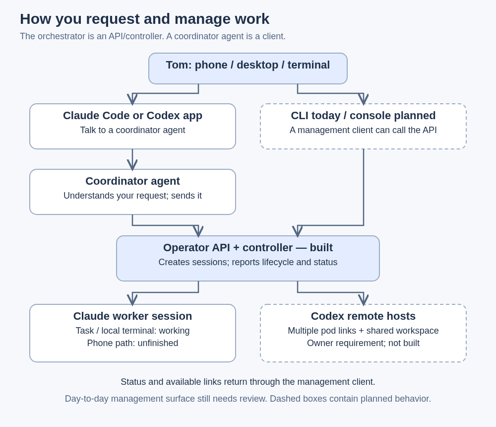
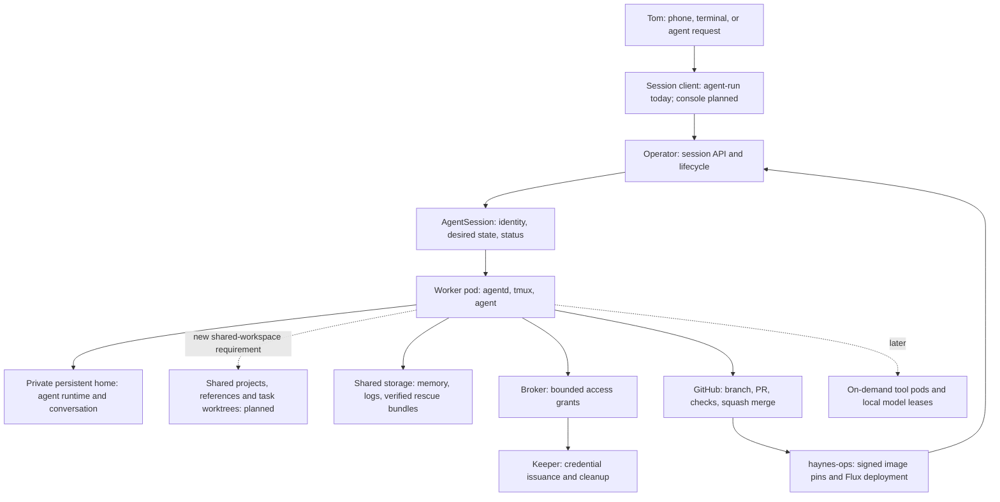
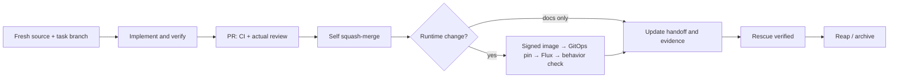
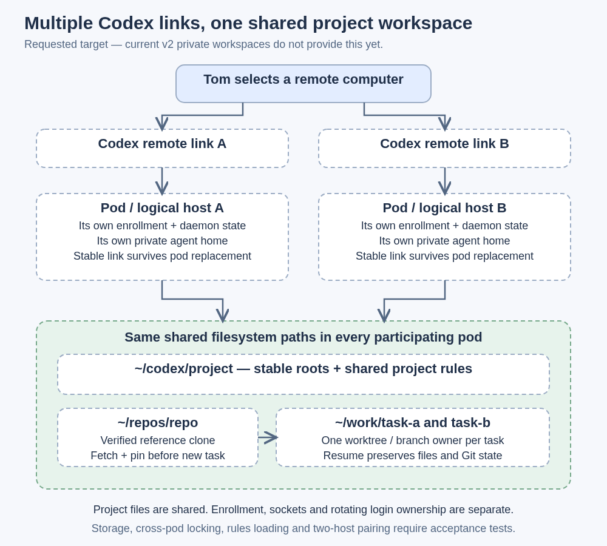
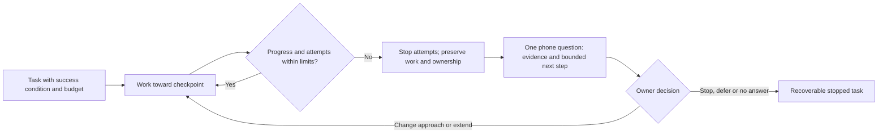
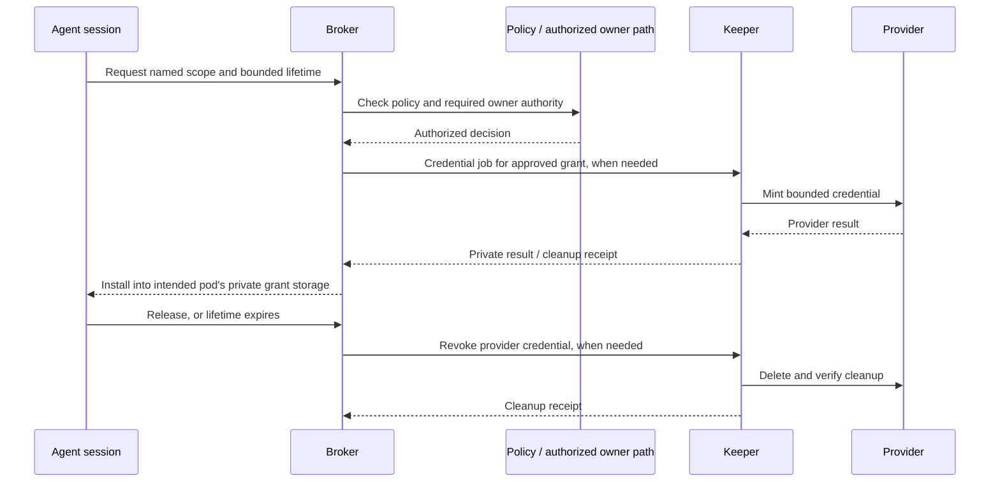
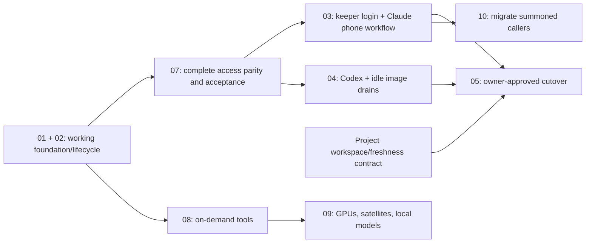

# dev-env workflow and quick start

Updated 2026-10-10 UTC. This guide describes the product, the
working paths, and the evidence still required before v2 replaces v1.

**The goal:** one project concept for Claude Code and Codex, with shared rules
and repositories, stable project roots, separate task worktrees, and multiple
Codex remote links across pods that can reach the same workspace. Keep resource
limits, today's maintenance capabilities, and recovery before session removal.

**Today:** v1 still runs normal work. V2's foundation and Claude task/terminal
lifecycle are working. Temporary Kubernetes and network grants are built, but
no standing grant policies are live. Proxmox credential minting is built and
disabled. V2 phone sessions, multiple Codex remote hosts, shared task workspaces, automatic
image drains, and the management console are unfinished. All twenty capability parity checks remain
open. This is a quick start for the working subset, not cutover approval.

Read [HANDOFF](../.agents/HANDOFF.md) for current deployment evidence and
[CLAUDE.md](../CLAUDE.md) for operating rules. The
[design](../.agents/sagas/distributed-dev-env/designs/001-dev-env-v2.md) and
[plan index](../.agents/sagas/distributed-dev-env/README.md#plan-backlog) remain
the sources for decisions and acceptance criteria.

## Start here: how you would use it

The following drawings describe the requested workflow. Solid boxes show the
working services or existing agent roles; dashed boxes include unfinished
behavior. A drawing is not acceptance evidence or a selected management tool.



**The orchestrator is the operator API and Kubernetes controller.** It creates
and manages sessions; it does not reason about a task. The requester is a client:
`agent-run`, a future management UI, an automation, or a coordinator agent using
those interfaces. There is no separate built requester-agent service. A
coordinator is a Claude/Codex session role that understands your request, starts
work, reads results, asks questions, and ships the result.

| Your action | Proposed visible workflow | What is built today |
|---|---|---|
| Open a project | Choose the same stable project root in Claude or Codex; see its repos and common rules | Catalog/rule source and model-free project preparation are merged; shared runtime and actual-client loading remain pending |
| Ask for work | Tell a coordinator what outcome you want, or use a management client; it requests the agent, project, size and mode | V1 launcher; v2 CLI/API requests Claude tasks or local sessions by repo |
| Open another Codex pod | Choose a distinct remote computer link; the pod sees the same project/workspace files | V1 has one daemon; multi-pod enrollment and shared workspaces are required new work |
| Begin a task | Managed preflight fetches, pins source, creates a separate worktree, loads project plus repo rules, and records its owner | V1 fetches; v2 agent 2.9.1 fetch-gates and pins new branches; disabled shared/project task source is merged but not deployed |
| Continue a task | Open its owning session/link and exact worktree; preserve files, index, branch and conversation | V2 Claude resume works; cross-host task ownership/transfer is unbuilt |
| Answer a decision question | One native question prompt arrives in the phone app; answer there; record the ruling and continue | Required workflow; phone delivery must be verified for each supported agent path |
| See progress | Status, outcome, task identity and the appropriate phone/terminal link are visible through the client | CLI/fleet lifecycle works; management console and v2 phone links are unbuilt |
| Finish or suspend | Review and deploy the PR; suspend retains work; archive verifies rescue before removing task storage | Working v2 Claude subset; shared-project cleanup needs cross-pod ownership checks |

The earlier design includes a **planned console** for session links/status,
archiving and login renewal (D-37). It is not built. Your normal management
surface still needs review; this guide does not choose a new website as the
primary workflow. Q-16 removed approvals from that console: privileged approvals
remain a separate Claude Code app design requirement. Ordinary design questions
must also reach the phone; a paragraph in a status stream is not a delivered ask.

[Accepted ADR-002](../.agents/sagas/distributed-dev-env/adrs/002-shared-project-workspaces.md)
now makes the workspace choice reviewable: shared project/reference/task files,
private agent homes, two remote hosts and explicit task transfer. It compares
available storage. Tom accepted it and the bounded CephFS trial through Q-21;
normal rollout still needs acceptance. A
new PVC does not isolate workspace IO from the household's storage services.
The [trial record](trials/2026-10-09-cephfs-feasibility.md) and
[cost result](trials/2026-10-09-cephfs-cost-result.md) preserve three incomplete
attempts and cleanup. Peer Git status exceeded the original limit; the exact
blocking filesystem call remains unresolved. The
[external storage comparison](trials/2026-10-09-external-storage-comparison.md)
proposes existing NFS as the next bounded comparison, with direct external
CephFS also available server-side. [Issue #130](https://github.com/thaynes43/dev-env/issues/130)
holds the workspace gate. Shared-workspace feasibility and workload/device gates
remain open; no permanent backend has been selected by these results.

### The three main journeys

**Open and start:** open project X in either agent → see the same repository map
and rules → request task Y → successfully fetch and pin its source → make a task
worktree → run the chosen agent in the requested pod → show the task status/link.
No task edits the project anchor or canonical clone.

**Resume from another pod:** select that pod's Codex remote link → discover the
same project/task files → check the task's existing owner → resume in its owning
session, or perform an explicit fenced handoff before another session edits it.
Shared files do not automatically transfer chat history or allow two writers.
The exact cross-host conversation/handoff behavior remains to be designed/tested.

The [first two-host route](codex-coordinator-hosts.md) uses persistent Codex
coordinators with read-only shared project/task mounts. Native app conversations
run on the computer you selected. A coordinator starts writable Claude/Codex
tasks through the management API and follows their recorded owners. Native app
threads do not automatically become task pods. Independent private enrollment
and conversation state stay with each host; actual link, resume and phone
acceptance remain pending.

Keeper account login and computer pairing use different codes. The browser
account login succeeded; it lets the keeper manage Codex credentials. Each v2
computer still needs its own remote pairing flow before your PC or phone can
connect to it. See the [login and pairing diagram](codex-coordinator-hosts.md#persistent-host-and-login).

**Finish and maintain:** review/merge/deploy → record durable results → rescue
unfinished work before task cleanup. Project roots persist independently of task
sweeping. Boot/daily sync refreshes clean anchors, checks canonical health, and
reports dirty or unsafe states. Removing a project from the catalog reports it;
it never automatically deletes its files.

## 1. What we are building

V1 puts sessions, repositories, authentication, and tools in one long-running
pod. V2 separates the control services from agent work. The current working implementation gives a task a session
pod on a worker, its own persistent home, and a branch/worktree. The new shared
project/workspace requirement changes where repository/task files must live;
private agent runtime homes remain distinct. Storage and remote-host topology
are revised by Accepted ADR-002, superseding ADR-001's Storage/C-09 decisions.
The bounded trial is authorized; the new workspace is not implemented yet. The scheduler
places it using its resource requests. If there is no room, it stays Pending
with a visible reason.



The diagram shows the target. It does not imply every connection is enabled.
The keeper issues GitHub tokens today. Fresh keeper-owned Codex login passed;
live two-host refresh adoption remains untested. Keeper-owned Claude login
refresh is still planned. PVE issuance remains off.

| Part | Responsibility | What must survive a restart |
|---|---|---|
| Operator | Create sessions, report placement and lifecycle, rescue before removal | Session state in Kubernetes resources |
| agentd | Prepare the workspace, supervise the agent, report status, rescue work | Home volume, conversation identity, branch and files |
| Broker | Decide and revoke scoped access grants | Grant status and expiry; an independent egress expiry backstop exists |
| Keeper | Own credential issuance and provider cleanup | Durable credential state and cleanup journal; one owner per rotating login |
| Codex remote hosts, required | Expose multiple stable pod links reaching the same project workspace | Each host's private enrollment/state; shared files separate |
| Shelf | List, verify, restore and prune rescue bundles | Shared storage, separate from session-home storage |
| Workbench/console, planned | Give people a place to manage sessions | Stable access paths; no agent work required by default |

The code, CLI, images, and design live in **dev-env**. Deployment manifests and
pod configuration live in **haynes-ops**. Changes deploy through PRs and Flux.

## 2. Feature set and delivery state

“Working” means the relevant acceptance was run. “Built” means implementation
exists; it can still need wiring or provider acceptance. “Planned” means the
guide is describing the target.

| Feature | State | What the user gets / what remains |
|---|---|---|
| One worker pod and home volume per session | Working, plan 01 | Independent CPU/memory limits and workspace; Pending reports capacity |
| Claude headless tasks | Working, plan 01 | Run one prompt once, report outcome, preserve work |
| Claude local terminal sessions | Working, plan 02 | Attach/detach, message, log, suspend, resume |
| Idle suspension and archival | Working, plan 02 | Keep the volume during suspension; archive through the rescue path |
| Rescue and restore | Working, plans 01/02 | Verified Git bundles on the shelf; restore into a new session |
| Operator upgrades leave running sessions alone | Working | Existing pod UIDs are preserved; older sessions can report Outdated |
| Optional external CLI | Built, plan 02 | Token and loopback forwarding path; real external-machine use is unverified and optional |
| GitHub installation tokens | Working | Keeper issuance; App private key stays out of session pods |
| Kubernetes and egress grant core | Built and smoke-tested | Temporary identities, private installation, release/expiry; complete standing policies and parity still missing |
| Proxmox credential backend | Built, disabled | Keeper CA pair validated and five-node trust delivered; typed PVE files/helper built; network/policy wiring and real certificate/provider acceptance remain |
| General hw-ssh grants | Unbuilt | Must retain existing targets, command classes, PTY/stdin behavior, and owner rules |
| V2 Claude phone sessions and Max refresh owner | Planned, plan 03 | Keeper-owned login, Remote Control registration/resume, renewal and archive |
| V2 Codex remote hosts and shared projects | Required, plans 04/11 | Multiple stable pod links, joint Claude/Codex projects, sole refresh owner, shared files with distinct task ownership |
| Shared writer, stop/rescue and private-home retention | Source merged #135/#140/#147; runtime off | Bounded common Git administration, verified old-writer stop and retained private homes; live acceptance remains |
| Joint project catalog and rules | Source merged #145/#150/#153; runtime pending | Accepted catalog, CLI/API preparation and model-free Job; actual shared mounts and both-provider rule loading remain |
| Keeper-owned Codex authentication | Deployed #148; fresh login passed | Keeper reports Ready, generation 1; actual live-host adoption, one-shot refresh and two-host propagation remain |
| Managed Codex and scoped coordinator requests | Source merged #152; runtime off | Recorded native thread identity and direct-child management; real-provider and lifecycle acceptance remain |
| Child decisions | Source merged #155; schema applied [haynes-ops#3722](https://github.com/thaynes43/haynes-ops/pull/3722); runtime off | One durable child question, parent routing and owned continuation; native phone round trip remains unverified |
| Task budgets and stalled-work escalation | Accepted requirement #154; implementation in progress, runtime off | Retained ledger and owned-executor stop need integrated runtime and phone acceptance; the default remains 60 minutes without progress or three failures |
| Codex phone execution across pods | Unverified, [first coordinator route](codex-coordinator-hosts.md) | Two independently enrolled hosts request scoped managed tasks; real renewal/shared workspace/phone acceptance remain, and S-4 forwarding is later work |
| Automatic drain onto new images/config | Planned, plan 04 | Wait for idle, preserve conversation, resume on a new revision |
| Management console | Planned, plan 03 | Sessions, links, archive and login renewal; a separate web approval flow is not selected |
| Guarded replacement for Headlamp | Required, unfinished | Preserve accepted task scope and owner directives; prove replacement and migrate callers before removal |
| On-demand Blender/audio/image/video tools | Planned, plan 08 | Tool sessions and idle shutdown; existing v1 authoring services remain usable |
| GPU budget, local models and satellites | Planned, plan 09 | Household reservations first; agents use remaining capacity; satellites only while awake and available |
| Summoned automation sessions | Planned v2 migration, plan 10 | Preserve existing lanes, links, watchdogs, outcomes and usage tracking; v1 executor continues until migrated |

Session sizes are presets, not a fleet cap:

| Size | CPU / memory request | CPU / memory limit | Typical use |
|---|---|---|---|
| S | 100m / 1Gi | 2 / 4Gi | Coordinator, light task |
| M, default | 250m / 2Gi | 4 / 8Gi | Ordinary coding |
| L | 1 / 6Gi | 8 / 24Gi | Larger build |

The three profiles are `full`, `dev`, and `ops`. They select credential
references, network baseline and permitted standing scopes. They do not prove
capability parity by themselves. See
[R-04](../.agents/sagas/distributed-dev-env/research/R-04-v1-capability-parity.md).

## 3. Quick start with the working paths

### Pick the launcher first

In the current v1 pod, the command named `agent-run` is **v1's shell launcher**.
V2 is a different Go binary. Do not overwrite the v1 command or assume identical
verbs mean identical behavior. The examples below use `v2run` as a shell array
holding the explicitly selected v2 binary.

For ordinary work today, continue using v1 or ask an agent to start the session:

```bash
# V1: Claude terminal plus phone session.
agent-run --repo dev-env --agent claude --interactive \
  --model claude-opus-5-5 --effort xhigh

# V1: separate Codex terminal session; phone access belongs to the daemon.
agent-run --repo dev-env --agent codex --local \
  --model gpt-6-astra --effort max

# V1: check whether the daemon supervisor session exists.
tmux has-session -t codex-remote
```

Keep `-p` separate from `--local` and `--interactive`. A headless task has its
prompt at creation; an interactive session gets its first prompt after its
banner is checked. No laptop kubeconfig ceremony is required for Tom's current
workflow.

### Prepare a v2 CLI from a fresh task worktree

Use a unique task name. These commands assume the existing canonical clone is
`/home/dev/repos/dev-env`. Run each step only if the previous one succeeds.
The single shell script stops on errors; it never implements in the canonical
clone.

```bash
set -e
guide_task="dev-env-cli-$(date -u +%Y%m%d-%H%M%S)"
guide_checkout="/home/dev/work/$guide_task"

git -C /home/dev/repos/dev-env fetch --prune origin
guide_base=$(git -C /home/dev/repos/dev-env rev-parse 'origin/main^{commit}')
git -C /home/dev/repos/dev-env worktree add \
  "$guide_checkout" -b "agent/$guide_task" "$guide_base"
cd "$guide_checkout"
PATH="/home/dev/.local/go/bin:$PATH" make build
v2run=("$guide_checkout/bin/agent-run")
"${v2run[@]}" version
```

The current pod's Go installation is `/home/dev/.local/go/bin`; the command
above makes it available even in a shell that did not load the interactive
profile. `make build` uses the repository's bounded Go settings. Build once; reuse that
binary for the steps below. On this shared pod, do not run CPU burners or wide
test/build loops. Images build in CI.

The v2 client also needs the public operator CA. In v1, write it from the
existing ConfigMap; the CLI reads this file and mints its own short-lived caller
token using the pod's identity:

```bash
guide_ca="/tmp/$guide_task-operator-ca.crt"
kubectl -n dev-agents get configmap dev-env-api-ca \
  -o jsonpath='{.data.ca\.crt}' > "$guide_ca"
test -s "$guide_ca"
export DEV_ENV_API_CA_FILE="$guide_ca"
"${v2run[@]}" fleet
"${v2run[@]}" help run
```

The CA is public trust material, not a token. Do not print or save a minted
credential to use these instructions. External clients have a separate optional
path in the [external CLI handoff](../.agents/handoffs/2026-10-08-laptop-access.md).

### Start and follow a v2 session

These examples start **Claude**, the currently supported v2 agent. Run a task
or start a local session according to the work you actually need; each command
creates a separate pod.

```bash
# A bounded headless task. The prompt runs once.
"${v2run[@]}" --repo dev-env --agent claude \
  --model claude-opus-5-5 --effort xhigh --size S \
  --timeout 30m --max-turns 20 -p "Read HANDOFF and report the current plan status."

# An interactive terminal session.
"${v2run[@]}" --repo dev-env --local --agent claude \
  --model claude-opus-5-5 --effort xhigh --size S

"${v2run[@]}" list --repo dev-env
"${v2run[@]}" show SESSION
"${v2run[@]}" log SESSION --tail 40
"${v2run[@]}" attach SESSION
```

Replace `SESSION` with the returned name. Attach is for the owner/client identity,
including the trusted v1 client; session agents use the message API. Detach with
`Ctrl-b d` and the session keeps running. A Pending session is waiting for
capacity, not a reason to launch duplicates.

```bash
# Local TUI only; headless tasks do not accept messages.
"${v2run[@]}" msg SESSION "The coordinator is reviewing the deployment evidence for this project."

# Rescue, stop the pod, keep its home and conversation.
"${v2run[@]}" suspend SESSION
"${v2run[@]}" show SESSION
"${v2run[@]}" resume SESSION

# Finish: rescue, remove the pod and archive its home.
"${v2run[@]}" reap SESSION
"${v2run[@]}" rescue list --session SESSION

# If a complete bundle exists, create a new session from it.
"${v2run[@]}" rescue restore OLD_SESSION/STAMP --local
```

Follow transitions with `show`/`list`; `reap` returning does not mean cleanup has
already finished. An archived session is restored into a new session, not resumed.
Rescue preserves Git work. It is not a backup of ignored files, build caches or
every file in the home. Rescue snapshots stay private and are never pushed.

V2 `--interactive`, automatic image drains, grant CLI and login commands remain
unfinished. Codex and declared-project task requests exist in released 2.10.0,
but their shared-workspace runtime opt-ins are still off. Use `help` on the
selected binary and current deployment evidence before choosing a route.

## 4. The everyday workflow

1. **Choose the project and outcome.** Keep one coordinator chat for the project
   and give each implementation task its own workspace and owner. Read current
   HANDOFF and rules from the verified repository revision.
2. **Start from current source.** Fetch the reference repository successfully,
   resolve the selected base to a commit, and create a new task branch. A folder
   surviving on a volume does not prove its code is current.
3. **Do the work in the task workspace.** Use exact model IDs. Delegate eligible
   Codex work to native `gpt-6.1-sol` agents at `xhigh`; the coordinator keeps
   design decisions, owner questions, user-facing writing and final review.
4. **Request access when needed.** The target is automatic, short-lived standing
   grants for accepted routine work, with explicit authority for owner-directed
   workflows. Today's empty standing-policy set is a delivery gap.
5. **Ship through a PR.** Run relevant bounded checks, read actual Claude review
   findings, fix or answer them, and squash-merge once required CI is green.
6. **Follow deployment.** If behavior runs in a container, verify the signed
   image, haynes-ops pin, Flux readiness and actual behavior. Merged code alone
   does not close a runtime task.
7. **Record and close.** Update HANDOFF and the plan evidence. Reap only after
   work is shipped or safely recorded. The platform verifies rescue before
   removing the session's storage.



A controller upgrade preserves running session pods. The future agent-image
drain waits for idle and resumes the same conversation on the same home.
“Outdated image,” “branch behind main,” and “old chat context” are separate
conditions; fixing one does not fix the others.

## 5. One project for both agents, across pods

The [owner requirements](../.agents/sagas/distributed-dev-env/requirements/2026-10-09-project-roots.md)
settle the earlier app question: **both Claude Code and Codex use the same project
concept**. R1–R6 define project creation, shared rules, freshness and cleanup;
R7 adds multiple Codex remote links spanning pods with shared workspace files.
Q-20's app-choice premise is superseded. The initial `/work/codex` shorthand is
replaced here by the supplied v1 layout, `~/codex` (`/home/dev/codex`).



### What a project contains

A project is a stable entry point plus a repository map and common rules. It can
contain one repo or several. It is not a disposable task worktree, an agent
process, or a remote computer enrollment.

```text
/home/dev/codex/                 permanent project roots; never swept
  dev-env/                      one-repo project root
    AGENTS.md                   shared project rules rendered for Codex
    CLAUDE.md                   same generated rules
    dev-env/                    detached repo anchor
  sigo-alumni/                  multi-repo project root
    AGENTS.md                   shared project rules rendered for Codex
    CLAUDE.md                   same rules / import for Claude
    sigo-alumni/                detached repo anchor
    sigoalumni-org/             detached repo anchor
    sigmaphiomicron-com/        detached repo anchor

/home/dev/repos/                canonical references; no implementation edits
  dev-env/
  sigo-alumni/
  sigoalumni-org/
  sigmaphiomicron-com/

/home/dev/work/                 task worktrees; eligible for safe rescue/sweep
  sigo-task-a/                  branch agent/task-a; one owner
  sigo-task-b/                  branch agent/task-b; another owner
```

R1 declares project names, repos, default branches and rules once in GitOps.
The model-free project preparation implementation materializes missing
repos/roots and reports undeclared roots without deletion; its runtime Job is
not deployed yet. The requested `project sync` and `project add` user commands
remain unfinished. `project add` must declare and materialize through GitOps
without restarting active hosts to reload a catalog.

D-79 uses a plain project folder with generated rules and one child anchor per
repository, even for one-repository projects. V2 starts in its new shared
workspace; it does not convert v1's existing anchor-at-root layout. Sync reports
and preserves an existing root that is itself a Git worktree. Any conversion
needs a separately supported lossless migration; it cannot overwrite repository
instructions, rename live worktrees or prune their registrations automatically.

R2 binds that project to both providers. Codex trust entries are generated from
the catalog; Claude gets all project repos in scope. Released v2 supports
`agent-run --project sigo-alumni [--repo REPO] -p "TASK"` for a declared task;
the operator catalog, shared mounts and opt-ins still need deployment and
acceptance. V1 does not support `--project`. Repo-based quick starts in section 3
remain the verified working path.

R3 renders both providers' project instructions from one source. R4 carries
those rules into each task alongside that repo's own rules. Keep tasks under
`~/work` to satisfy R5's explicit sweep boundary; use a verified project pointer
or launch-time instruction composition/injection. Placing a linked Git worktree
under a project directory alone does not prove rule inheritance. Test the actual
instructions received by both agents at project and task roots, including
multi-repo children. Never replace repo rules with project rules.

### Current v1 baseline

Manual detached anchors exist for hass-sandbox, haynesnetwork and the three-repo
sigo-alumni project. They are on v1's ext4 **RWO** home volume, and their linked
Git administration directories are under `~/repos`. The multi-repo root has an
`AGENTS.md`, but no common Claude project-rule binding. No generated Codex trust
entries for these roots, project catalog, sync/add commands or task-rule
propagation were found.

[haynes-ops PR #3633](https://github.com/thaynes43/haynes-ops/pull/3633) was still
open/unmerged at the audit. Its instructions do not implement reconciliation.
The attachment's staged-index problem was historical; the two named clones were
clean at this audit. Other canonical/anchor snapshots lagged their cached refs;
one fetched canonical was far behind. Cached comparisons are not successful
fresh-fetch evidence. No clones or anchors were repaired for this documentation.

### Shared files and private remote hosts

The target has at least two independently addressable Codex remote hosts/pods.
Both mount the same project roots, canonical Git directories and task workspace
files at consistent absolute paths. A project can be opened from either link;
a task has one active writer and a recorded session/host owner. Git linked
worktrees require their common directory as well as checkout files to be visible.
Sharing just an anchor checkout is insufficient.

Each logical remote host retains its own enrollment, socket/PID state, agent
runtime home and conversation ownership. Its persistent identity must survive
pod replacement. Keep rotating refresh-token ownership in one keeper; do not
share a writable `~/.codex` or `~/.claude` directory between pods. Shared files
are not shared chat transcripts. Session history transfer requires an explicit
supported workflow rather than copying live auth/runtime state.

The earlier single-hub plan and private per-session Git workspace choices
(D-12/D-15/D-22) need revision under D-74. The current RWO homes plus small shared
memory/rescue volume do not satisfy this topology. Choose and test a genuine
cross-node shared workspace backend, keeping household-service load bounded;
ADR-001 remains immutable; Accepted ADR-002 supersedes its affected storage/cloning
decisions and authorizes a bounded existing-CephFS trial before normal use. No migration is selected
by this guide.

Official documentation describes multiple paired hosts, but does not establish
our simultaneous access-token-only Linux-pod enrollment. Prove two pod links,
keeper refresh/reload, one-host drain, shared Git metadata, cross-pod locks and
live-peer cleanup protection on the pinned CLI before advertising this workflow.
[Official remote connections](https://learn.chatgpt.com/docs/remote-connections),
[advanced configuration](https://learn.chatgpt.com/docs/config-file/config-advanced).

### Session management

| Concern | Claude Code | Codex |
|---|---|---|
| Phone control today | Remote Control entry per opted-in session | One v1 computer daemon hosting many chats |
| Requested project concept | Same stable root/repo map/rules | Same stable root/repo map/rules |
| Requested v2 remote topology | Session links across pods | Multiple remote computer links across pods, shared project/workspace files |
| Task start | Managed fresh-source worktree plus project and repo rules | Equivalent preflight for app, remote and CLI paths |
| Resume | Exact session/worktree identity; preserve local state | Exact chat/host/worktree identity; shared files alone do not migrate the chat |
| Credential target | Keeper owns Max refresh | Keeper owns Codex refresh; hosts get short-lived results |
| Today in v2 | Task/local supported; phone unfinished | Session creation rejected; remote/shared topology unbuilt |

Keep coordinator chats for project decisions and progress. Give each concrete
implementation outcome its own task worktree. Resume the same session for the
same task; use an explicit ownership handoff to move work. Archiving a chat,
reaping a task pod, removing a project declaration and deleting a remote computer
entry are distinct actions with distinct lifetimes. A quiet project survives
all normal task cleanup.

If a remote chat is visible but its project is missing from a desktop sidebar,
check the Projects view and add the same existing folder through the connected
host. An owner device check found that Windows-created projects appeared on all
three clients, while Mac-created projects were missing from Windows. Registering
the existing folder on Windows is the current workaround; the pod's remote
connection continued working.

### When a task stops making progress

The accepted default is **60 minutes without progress or three failed attempts
at the same blocker**, whichever comes first. It applies to the logical task
across agents, pods and resumes. The task also has an overall work budget and
checkpoints; another diagnostic script or a heartbeat cannot justify unlimited
investigation.



The coordinator records the answer before continuing. No answer leaves the task
stopped without repeated model calls. This flow is a required owner-test feature
tracked in [#154](https://github.com/thaynes43/dev-env/issues/154); runtime enforcement and
verified phone delivery remain open. See the [budget contract](../.agents/sagas/distributed-dev-env/requirements/2026-10-09-task-budgets.md) and [execution design](../.agents/sagas/distributed-dev-env/designs/002-task-budget-execution.md).

## 6. Protection from stale repositories

### What exists and what the launch contract must add

V1's `agent-run` fetches the canonical repository and stops on failure before
adding a worktree. Phone-started Codex chats bypass that path. Current v2 privately clones
each session, which avoids sharing a mutable clone between session pods, but
its old reused-clone path warned and continued even before a new branch existed.
Agent 2.9.1 closes that new-branch failure path and pins its base commit.
Existing branch/worktree recovery remains allowed with a warning after fetch
failure; preserving unfinished work is different from selecting fresh source.
A verified rescue restore can intentionally start from its imported historical
branch offline. A saved conversation with both its worktree and branch missing
must be restored rather than silently paired with a new branch from today's code.
Existing-workspace branch changes or detached HEAD also warn rather than block
resume; deliberate checkouts and in-progress rebase/bisect state remain intact.
A foreign clone/path or broken HEAD still fails. See D-73 for the boundary.

The remaining joint-project and cross-pod contract needs these checks:

| Moment | Required behavior | If the check fails |
|---|---|---|
| New task | Verify repo identity; successfully fetch; pin selected base SHA; create separate worktree; compose current project/repo rules | Stop before an implementation prompt; preserve existing work |
| Shared Git mutation | Serialize sync, fetch, ref resolution, worktree creation and prune by common Git directory across all pods | Bounded wait/error; local PID files are insufficient |
| Project refresh | Boot/daily refresh clean anchors to the declared remote default; respect ownership and in-progress Git operations | Report dirty/busy/unsafe state; never reset task files |
| Resume or host transfer | Match chat, host, repo and worktree; preserve index/WIP and acquire the task's writer ownership | Never silently create unrelated source or permit two writers |
| Long-running integration | Fetch chosen target; show ahead/behind and actual diff; resolve deliberately; validate current PR head | Block publication/merge on unresolved source or review failures |
| Task sweep | Scan `~/work` only; protect live owners on every pod; rescue before eligible deletion | Do not use this pod's `/proc` to declare a peer dead |
| Git registration prune | Protect managed anchors and paths absent during mount failures | Directory exclusion alone must not allow `git worktree prune` to forget an anchor |

Record repo identity, selected ref, immutable start SHA, successful fetch time,
project/rules revision, branch/worktree and session/host owner. Background daily
fetches help project discovery; every new task still needs its own verified
source transaction. Shared ownership/lock and catalog/snapshot primitives are
merged source. API/provider integration and actual cross-pod acceptance remain
pending; their runtime opt-ins are off.

### Canonical health and lossless repair (R6)

At boot/daily maintenance, report a canonical checkout that is on the wrong
branch, detached, staged/unstaged dirty, or behind the freshly fetched default.
Fetch failure is a reported failure, not a claim that cached refs are current.
An old index can make hundreds of apparent staged reverts; do not pass that
state into an agent task or mistake it for a clean new checkout.

Auto-repair only a proven lossless case, under the same cross-pod administrative
lock and after rechecking ownership/state. Pin the fetched target. Verify the
index tree matches a commit in that fetched remote history, working files match
the index, and there are **no untracked files, including ignored files**.
Even unrelated untracked files block automatic repair under R6. Preserve local-only HEAD/branch commits; index equality alone does not
prove those safe. Refuse conflicts, pending Git operations, unexplained index
flags, foreign repository identity or a branch in use by another worktree.
Retain a repair receipt and enough pre-repair refs/state to recover the action.

A clean, behind default branch can fast-forward; the proven stale-index/detached
case can be restored to the fetched default under R6. Any unsafe or ambiguous
case is reported and preserved. No broad `reset --hard`, `clean -fd`, ref deletion
or worktree deletion is part of project sync.

These are accidental-staleness protections. Agents with shared filesystem
access can bypass a wrapper; the contract is not a security boundary. The
[project/workspace plan](../.agents/sagas/distributed-dev-env/backlog/11-project-workspaces.md)
tracks entry-point integration and acceptance. Every supported app/remote/CLI
start must use the preflight, or be explicitly coordinator-only and request
implementation through the managed path.

## 7. Access, credentials and approval

The target is to preserve the work agents can do today while limiting the
lifetime and exposure of credentials. Routine accepted scopes use standing
policies in Git. The broker validates the requester and target; the keeper
performs provider credential operations; private installation is fenced to the
intended pod UID. Release/expiry removes access and records the outcome.



This is the credential-grant target; Kubernetes and egress grants have their
own provider operations. The PVE backend is disabled, and the human path is
not selected. Its presence in the diagram is not an enabled approval adapter.

Effective parity includes accepted Headlamp cluster-admin tasks and GitOps
self-merge, with the existing live owner directive for Headlamp task/access
scope. It does not authorize blanket standing cluster-admin access. Replace
Headlamp with a guarded path that supports those tasks, test the controls,
migrate callers, then retire it through GitOps.

Approval UX for the workflows that require it belongs inside the Claude Code
app under Q-16. Pushover plus a separate approval website was rejected. A future
management console for session links and renewal does not change that ruling.
R-03 contains candidates, not an enabled or owner-selected implementation.

The keeper must be the sole refresher of each rotating Claude/Codex login.
Session pods receive access tokens, not refresh tokens. Moving to v2 uses fresh
logins; copying v1's live authentication would create competing refresh owners.

### Proxmox activation checkpoint

Q-19's CA storage step is complete by owner confirmation in existing
`HaynesKube/dev-env`. Keeper-only projection shipped through haynes-ops #3642:
ESO is SecretSynced and the keeper is Ready with a read-only CA mount. Minting
stays disabled. Q-22's delegated trust installation is complete on all five PVE
nodes, with original key bytes and existing v1 access preserved. Do not generate
another CA or item. One offline in-keeper validation now confirms its saved
private/public pair is valid, after the keeper-only #3669 rollout. Existing
v1/controller/broker/shelf pod identities and restart counts were preserved.
Remaining activation order:

1. Supply private targets, pinned host keys, keeper TCP22 access and accepted
   policies. Keep actual trust material and private addresses out of public docs.
2. Enable keeper and broker together only after prerequisites pass. Declare
   activity; test real mint/install/use/release/expiry/recovery and cleanup.
3. Remove fixtures and compare v1/existing session UIDs and restart counts.

[Node-trust guide](keeper-node-trust.md) records the restricted CA installation
and guarded rollback. Temporary delivery cleanup is merged and deployed.
Certificate/provider acceptance remains separate from the successful local pair
check. The validator neither connects to nodes nor mints a credential.

General hw-ssh certificates are a separate unfinished feature. Certificate
expiry alone does not terminate an existing SSH connection; P-19 needs its
connection/revocation contract before acceptance.

## 8. Remaining work and the cutover gate

The detailed closure tests are in
[backlog 07](../.agents/sagas/distributed-dev-env/backlog/07-access-broker.md).
All twenty rows remain open; an installed tool or a successful denial check
does not close a capability test.

| Parity rows | Work still to prove |
|---|---|
| P-01 to P-03 | Standing policies, ops scope and guarded equivalent access for accepted Headlamp/exec tasks |
| P-04 to P-07 | Platform maintenance, existing Job classes, observability storage operations and remediation work-order writes |
| P-08 to P-09 | Internal browser ingress and ops observability/external network paths |
| P-10 | Grant CLI/MCP, unattended request/use/release and re-request after expiry |
| P-11 to P-13 | Restored reader/ADC baseline, live service checks and hardware network paths |
| P-14 to P-15 | Real PVE provider acceptance and helper behavior through credential installation/expiry |
| P-16 to P-17 | Complete hw-ssh behavior, targets, principals, standing scopes and existing owner permission rules |
| P-18 to P-19 | CA delivery/trust/egress/cleanup and SSH connection/revocation contract |
| P-20 | Read-only transport checks through every relevant configured MCP service |



The arrows are delivery checkpoints, not a new scheduling decision. Plan 08
can run alongside 03/04 and plan 10 can start once its prerequisites pass.
The current work order still favors one plan at a time. The workspace contract
supports the Codex work and must be tested on the launch paths it introduces.

**Before cutover:**

- Close every parity row with successful accepted operations and relevant
  expiry/recovery/cleanup evidence, under existing owner rules.
- Prove phone session registration, continuation and archive, plus keeper
  credential refresh and failure recovery without competing refresh owners.
- Prove multiple Codex remote pod links survive renewal and replacement, reach
  the same shared workspace, and respect task/daemon ownership on the pinned CLI.
- Prove R1–R6: catalog boot/sync, joint project/rule loading in both agents,
  permanent root retention, cross-pod cleanup and lossless canonical repair.
- Prove image/config drains wait for idle and resume conversations without
  cutting busy work. Ordinary controller upgrades still leave sessions alone.
- Exercise new-task freshness, offline WIP resume, concurrent project tasks,
  and rescue/restore on the selected project/client paths.
- Migrate Headlamp callers only after its replacement passes. Preserve v1
  fallback until then. Obtain Tom's explicit written cutover approval.

At cutover, preserve v1 work and rescue branches, retire its logins with their
owners, and retain its PVC for the planned 30 days. One week without needing
v1 is acceptance evidence. Summoned lanes continue on `dev-env-ops` until plan
10 migrates them; they do not disappear because ordinary sessions moved.

## 9. How we keep the project on track

Use this guide for orientation, DESIGN for decisions, backlog plans for closure
tests, and HANDOFF for verified current state. When they disagree, inspect the
code and runtime, then correct all affected current instructions. Historical
records remain dated history.

Every work order should name the outcome, current base revision, workspace,
owner, bounded checks, acceptance evidence and deploy path. For tests, include
the shared-node CPU rule: no burners or wide/looped tests, low parallelism under
`nice -n 19`, one suite at a time, and a CPU limit on cluster Jobs.

Questions go to Tom one at a time through a verified native phone prompt, with
their checked premise and concrete tradeoffs. A question buried in commentary
is not a delivered ask. Record the question and dated answer in DESIGN. An unanswered
question blocks only the work that depends on it.

Keep four protections visible in every release: current source, preserved
unfinished work, one owner per rotating credential, and capability parity.
Ordinary green PRs are self-merged. The exception is v1 configuration under
haynes-ops `dev-env/app/resources/**`: merging restarts this pod, so those changes
remain held drafts for Tom to merge at a natural break. No v1 restart or
automatic restart of active sessions is part of this guide's rollout.
